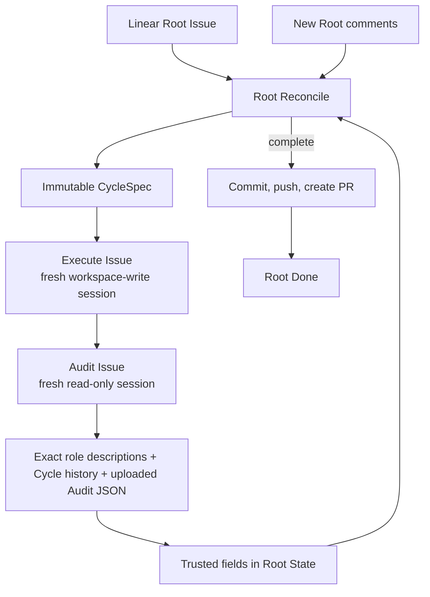

# Symphony Target Architecture

| Status | Owns | Does not claim |
|---|---|---|
| target proposal | Linear Root / immutable Cycle workflow and ownership | current implementation parity or an implicit migration sequence |

## Product goal

Symphony uses one long-lived Linear Root Issue as its control plane and advances
it through immutable, single-step Cycles.

Each Cycle contains exactly one Execute and one Audit Issue. Audit runs after
every Execute attempt, including process failures. Only a Succeeded Cycle can
update the trusted fields in Root State.

## Reading order

1. Read [Workflow Model](workflow-model.md). Its tables own cross-role state,
   routing, failure, input consumption, and persistence.
2. Read only the named-concern owner relevant to the change.
3. Treat the architecture as the target, not as a description of current code.

| Concern | Owner | Content |
|---|---|---|
| workflow | [Workflow Model](workflow-model.md) | topology, canonical Linear statuses, lifecycle, outcomes, routing, failure, persistence |
| Root semantics | [Root Reconciliation](root-reconciliation.md) | trusted Root State fields, Inbox, next-Cycle choice |
| Linear documents | [Root Issue Model](root-issue.md) | Issue hierarchy, managed descriptions, comments |
| runtime | [Conductor](conductor.md) | CLI, serial loop, Cycle lifecycle, shutdown |
| process boundary | [Performer](performer.md) | mechanical Agent CLI launch and process capture |
| provider boundary | [Task Management](task-management.md) | injectable Linear Gateway and projection |
| workspace and delivery | [Root Workspace and Pull Request](workspace.md) | Root workspace, role access, PR-first delivery with pushed-branch fallback |
| public types | [Contracts](contracts.md) | closed inputs, outputs, and terminal outcomes |
| implementation order | [Roadmap](roadmap.md) | incremental delivery and black-box gates |

## Ownership

| Owner | Owns | Must not own |
|---|---|---|
| Root Reconciler | choose one small `CycleSpec` from Root-owned inputs and promoted Audit fields in Root State | workspace access, Linear calls, or active-Cycle changes |
| Cycle | immutable objective, acceptance, boundaries, and consumed Root comment IDs | long-lived Root state or later input |
| Cycle Runner | Execute/Audit order, exact role Markdown capture, Audit JSON result, and mechanical Cycle file-link projection | next-step invention or Root State mutation |
| Performer | mechanically start one configured Agent CLI process and capture its process output | prompts, semantic interpretation, routing, Linear, or trust decisions |
| Linear Gateway | normalized GraphQL reads/writes, canonical status resolution, and Issue projection behind an injectable protocol | workflow reasoning, Markdown policy, or hidden state |
| Root State | persist the minimal checkpoint and promote trusted fields only from Succeeded Cycles | original requirement, child history, or a Trusted State service |
| Conductor | deterministic serial orchestration, visible status projection, startup cancellation, and fixed terminal delivery function | semantic next-step, audit judgment, or recovery protocol |

## V1 boundaries

| Included | Excluded |
|---|---|
| one Root and at most one active Cycle | concurrent Cycles or multiple Roots per process |
| exactly one Execute and one Audit per Cycle | planning stage, DAG, parallel work, or subagents |
| one terminal report appended to each Execute/Audit description, plus append-only Cycle history/result comments | changing a Cycle title or description after creation |
| one exact Harness-managed checkpoint suffix on Root description | treating generated state as Root requirement or introducing a second checkpoint |
| five canonical Linear statuses shared by Root and descendants | inferred mappings or editing/deleting user-defined state definitions |
| new Root comments become next-Reconcile input | old-comment replay or descendant comments as instructions |
| Root State locates the existing workspace after restart | Agent-session resume, state reconstruction from children, or replacement workspace |
| startup cancels all unfinished descendants before fresh Reconcile | continuing, auditing, or interpreting old active children |
| caller supplies one Root workspace and one external run directory | Root claiming, workspace allocation, Dashboard, or local-task mode |
| one terminal commit/push/PR function before Root Done | delivery subsystem, retry/finalizer/convergence, automatic merge |
| one public Root-run command | one-shot role commands or any second Linear mutation path |

The harness never modifies a created Cycle title or description and does not
detect unrelated manual edits. It owns only the exact Root snapshot block and
one terminal append to each Execute/Audit description. Root Reconcile receives
the Root requirement after the snapshot block is stripped, Root State (including
the parsed `latest_audit` fields), and new Root comments, with no workspace
access. Each Execute and Audit prompt requires its role to finish with one
Markdown result at the prescribed local `cycle-NNN-*-result.md` path. Conductor
appends the exact Executor Markdown to the Execute description and exact Audit
Markdown to the Audit description, each with one local RFC3339 `Updated at` line;
neither role report is copied to the Cycle.
There is no second summarization or format-repair Agent call.

Executor Markdown is untrusted process output and remains display-only. Audit
Markdown is the sole semantic result. Conductor parses its validated fields,
serializes them to `cycle-NNN-audit-result.json`, reads that file back and
validates it, writes the re-read value to `RootState.latest_audit`, and uploads
only that JSON file as `application/json`. Cycle comments contain append-only
lifecycle, decision, terminal, and upload facts plus a link to the uploaded file
or the current upload error. Upload failure is visible but
does not change the Audit verdict. Reconcile never reads the Cycle DAG, Execute
or Audit descriptions, comments, reports, or transcripts.

The caller-provided external run directory is also the private diagnostic plane.
Bounded raw Agent JSONL/stderr and causal error context may be retained there
with local permissions, with a mechanical `thread_id` index and opaque local
references. This evidence is never supplied to Audit or Root Reconcile, never
uploaded to Linear, and never treated as workflow authority. The caller owns
retention; golden E2E failures archive evidence before cleaning their owned
temporary resources and report only `diagnostic_ref`.
