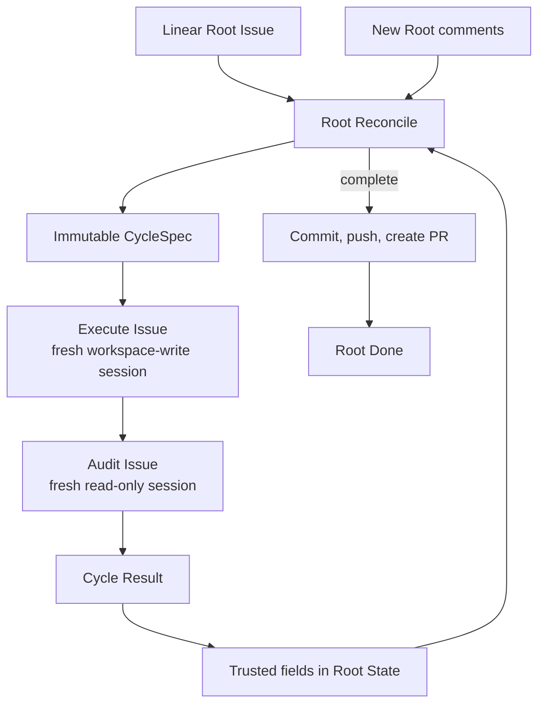

# Symphony Target Architecture

| Status | Owns | Does not claim |
|---|---|---|
| target proposal | Linear Root / immutable Cycle workflow and ownership | current implementation parity or an implicit migration sequence |

## Product goal

Symphony uses one long-lived Linear Root Issue as its control plane and advances
it through immutable, single-step Cycles.

Each Cycle contains exactly one Execute and one Audit Issue. Audit runs after
every Execute attempt, including process failures. Only a Succeeded Cycle can
update the trusted fields in Root State.

## Reading order

1. Read [Workflow Model](workflow-model.md). Its tables own cross-role state,
   routing, failure, input consumption, and persistence.
2. Read only the named-concern owner relevant to the change.
3. Treat the architecture as the target, not as a description of current code.

| Concern | Owner | Content |
|---|---|---|
| workflow | [Workflow Model](workflow-model.md) | topology, lifecycle, outcomes, routing, failure, persistence |
| Root semantics | [Root Reconciliation](root-reconciliation.md) | trusted Root State fields, Inbox, next-Cycle choice |
| Linear documents | [Root Issue Model](root-issue.md) | Issue hierarchy, frozen descriptions, comments |
| runtime | [Conductor](conductor.md) | CLI, serial loop, Cycle lifecycle, shutdown |
| process boundary | [Performer](performer.md) | mechanical Agent CLI launch and process capture |
| provider boundary | [Task Management](task-management.md) | injectable Linear Gateway and projection |
| workspace and PR | [Root Workspace and Pull Request](workspace.md) | Root workspace, role access, terminal PR function |
| public types | [Contracts](contracts.md) | closed inputs, outputs, and terminal outcomes |
| implementation order | [Roadmap](roadmap.md) | incremental delivery and black-box gates |

## Ownership

| Owner | Owns | Must not own |
|---|---|---|
| Root Reconciler | choose one small `CycleSpec` from Root-owned prompt inputs | workspace access, Linear calls, or active-Cycle changes |
| Cycle | immutable objective, acceptance, boundaries, and consumed Root comment IDs | long-lived Root state or later input |
| Cycle Runner | Execute/Audit order, Execute process facts, Audit result, and mechanical Cycle summary | next-step invention or Root State mutation |
| Performer | mechanically start one configured Agent CLI process and capture its process output | prompts, semantic interpretation, routing, Linear, or trust decisions |
| Linear Gateway | normalized GraphQL reads and writes behind an injectable protocol | workflow reasoning, Markdown policy, or hidden state |
| Root State | persist the minimal checkpoint and promote trusted fields only from Succeeded Cycles | original requirement, child history, or a Trusted State service |
| Conductor | deterministic serial orchestration, startup cancellation, and fixed terminal PR function | semantic next-step, audit judgment, or recovery protocol |

## V1 boundaries

| Included | Excluded |
|---|---|
| one Root and at most one active Cycle | concurrent Cycles or multiple Roots per process |
| exactly one Execute and one Audit per Cycle | planning stage, DAG, parallel work, or subagents |
| append-only role and Cycle result comments | changing a Cycle title or description after creation |
| one mutable Harness status comment on Root | workflow database or full trajectories in Linear |
| new Root comments become next-Reconcile input | old-comment replay or descendant comments as instructions |
| Root State locates the existing workspace after restart | Agent-session resume, state reconstruction from children, or replacement workspace |
| startup cancels all unfinished descendants before fresh Reconcile | continuing, auditing, or interpreting old active children |
| caller supplies one Root workspace and one external run directory | Root claiming, workspace allocation, Dashboard, or local-task mode |
| one terminal commit/push/PR function before Root Done | delivery subsystem, retry/finalizer/convergence, automatic merge |
| one public Root-run command | one-shot role commands or any second Linear mutation path |

The harness does not modify a created Cycle, Execute, or Audit description and
does not detect manual edits. Root Reconcile uses Root description, Root State,
and new Root comments, with no workspace access and never the complete Root tree.
Execute model output is discarded without semantic parsing; only the fresh
read-only Audit judges the workspace. Cycle Result remains a mechanical summary
projection for operators and is never input to Root Reconcile.
