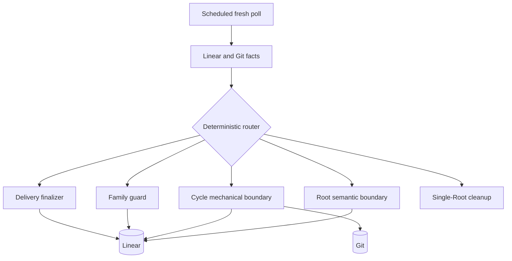

# Symphony Phase 1 架构

| Status | Owns | Does not claim |
|---|---|---|
| target proposal | architecture entry、Phase 1 scope | current implementation parity、migration、compatibility |

## 产品目标

| Trigger | Outcome | Non-goal |
|---|---|---|
| user delegates one Linear Root Issue to the configured agent actor | one reviewable exact-revision PR | general project-management platform |

```mermaid
%% source-rules: WF-AUTH-001 WF-AUTH-002 WF-AUTH-004 WF-AUTH-005
%% source-rules: WF-TOPO-001 WF-TOPO-002 WF-TOPO-003 WF-TOPO-004
%% source-rules: WF-PERSIST-002 WF-PERSIST-003 WF-PERSIST-004 WF-PERSIST-005 WF-PERSIST-006
flowchart LR
  Root[Linear Root] --> Define[Root Define and ADR]
  Define --> Cycle[Reviewed Cycle Draft]
  Cycle --> Seal[Approval record and seal]
  Seal --> Plan[Isolated Plan]
  Plan --> Manifest[Persisted exact manifest]
  Manifest --> Work[Ordered Work turns]
  Work --> Commit[Exact commit]
  Commit --> Verify[Fresh Verify]
  Verify --> Accept[Root acceptance]
  Accept --> Delivery[Unique PR and delivery record]
```

| Workflow authority | This diagram |
|---|---|
| [Workflow Model](workflow-model.md) `WF-*` tables | navigation projection only |

## 架构读法

1. 先读[Workflow Model](workflow-model.md)：所有跨角色状态和failure必须在唯一表格行中闭合。
2. 再读对应named-concern owner：owner只定义本边界的mechanics、types、provider限制或rationale。
3. Mermaid图必须声明`source-rules`，只能投影已定义规则。
4. roadmap只把实现阶段映射到rule ID，不重复设计。

| 要表达的内容 | 形式 | 上限 |
|---|---|---|
| flow、state、ownership | Mermaid projection | 必须绑定`source-rules` |
| decision、mapping、failure | short table | 单段100字符，cell总长160字符 |
| closed payload | focused `text` contract | 每块80行 |
| rationale | prose or list | 每项160字符 |

| Concern | 唯一owner | 内容 |
|---|---|---|
| workflow model | [Workflow Model](workflow-model.md) | graph、state、routing、failure、restart、persistence |
| observation and Task Manager | [Task Management](task-management.md) | polling、snapshot、command capability、Linear限制 |
| Issue documents and seals | [Root Issue](root-issue.md) | Markdown、identity、approval anchors、manifest |
| mechanical runtime | [Conductor](conductor.md) | single-Root event loop、Cycle reducer、restart fence、cleanup |
| semantic boundary | [Root Reconciliation](root-reconciliation.md) | Define、Draft review、acceptance、successor |
| role isolation | [Performer](performer.md) | Plan/Work/Verify input、thread、permission、ephemeral continuation |
| Git and PR | [Git Worktree Delivery](git-worktree-delivery.md) | worktree、commit proof、Verify revision、delivery convergence |
| public contracts | [Contracts](contracts.md) | typed interfaces、closed variants、Markdown schema |
| implementation order | [Roadmap](roadmap.md) | hard-cut sequence与black-box gates |

## Boundary map

| Boundary | Owns | Must not own | Rules |
|---|---|---|---|
| Root semantic boundary | requirement、ADR、Cycle Draft review/seal、semantic acceptance、successor design | Stage execution、sealed DAG mutation、user-code writes | `WF-AUTH-005`, `WF-ROUTE-001`, `WF-ROUTE-002`, `WF-ROUTE-005`, `WF-ROUTE-007`, `WF-ROUTE-008` |
| Cycle mechanical boundary | exact manifest materialization、Stage status/record、Work turns、commit、Verify、mechanical failure | requirement interpretation、Work regrouping、acceptance | `WF-AUTH-003`, `WF-ROUTE-004`, `WF-ROUTE-006` |
| Task Manager boundary | fresh provider-neutral reads/writes与capability enforcement | semantic routing decision、SDK exposure to Codex | `WF-AUTH-001`, `WF-AUTH-004` |
| Delivery finalizer | accepted tuple的lease、unique PR、convergence record/invalidation | semantic acceptance、automatic retry/merge | `WF-ROUTE-010`, `WF-FAIL-011` |
| Performer | closed role request到typed candidate | Linear write、workflow transition、sibling injection | `WF-PERSIST-002`, `WF-PERSIST-003`, `WF-PERSIST-004`, `WF-PERSIST-007` |

## Phase 1 scope

| Area | Included | Excluded |
|---|---|---|
| authority | Linear Task facts and Git exact facts; fresh-fact reconstruction | workflow database、memory mirror、durable transcript、event replay |
| scheduling | one Conductor process launched for one exact Root identity and terminated after its cleanup | sequential second-Root adoption、multi-Root orchestration、concurrent Roots、preemption、fairness |
| Cycle | immutable approved attempt with one Plan, sealed Work groups, one Verify | mutable active Cycle、Plan regrouping、parallel Work、Work subagents、fork |
| contexts | isolated Plan; one live multi-turn Work thread; fresh Verify | Plan/Verify thread reuse、sibling Issue/Result injection、cross-Cycle reuse |
| delivery | exact revision、expected-old lease、provider-unique PR、persisted convergence proof | cross-provider atomic snapshot claim、force push、automatic merge、PR review handling |
| providers | Linear polling as the only Task provider implementation | webhook intake、provider plugins、fallback、compatibility or migration paths |
| destructive operations | archive/trash/detach with fail-closed handling | managed Issue permanent delete、managed comment hard delete before cleanup |

| Change request | Scope result |
|---|---|
| uses only `WF-AUTH-001` through `WF-AUTH-008` and existing rows | may proceed through roadmap gates |
| needs a new state、durable fact、owner、permission、provider、retry policy or external effect | out of scope until architecture approval |
