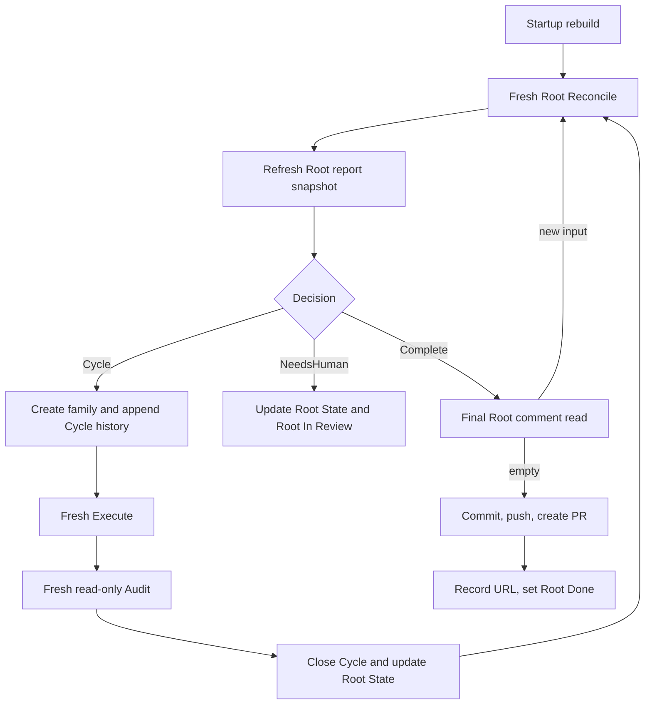

# Conductor

| Status | Owns | Does not own |
|---|---|---|
| target proposal | one-Root serial loop, startup abandonment, role dispatch, Root State, and delivery | semantic next-step choice, Podium scheduling, app-server, generic capabilities, or recovery state machine |

The top-level `manager` remains a small composition point. It wires
`RootReconciler`, `CycleRunner`, `Performer`, `LinearGateway`, and fixed
workspace/PR command functions without implementing their semantics. Trusted
promotion is a small Root State update rule, not a service or subsystem.

## CLI

```bash
export LINEAR_API_KEY="..."

lh-harness run \
  --linear-root ENG-123 \
  --workspace "/workspaces/ENG-123" \
  --dir "/runs/ENG-123" \
  --reconcile-agent codex \
  --reconcile-model "<reconcile-model>" \
  --reconcile-reasoning-effort "<reconcile-effort>" \
  --execute-agent codex \
  --execute-model "<execute-model>" \
  --execute-reasoning-effort "<execute-effort>" \
  --audit-agent codex \
  --audit-model "<audit-model>" \
  --audit-reasoning-effort "<audit-effort>" \
  --max-cycles 30
```

| Input | Behavior |
|---|---|
| `--linear-root` identifier or UUID | resolve one exact existing Root |
| Root input | Root title and immutable requirement section are the only task; the managed snapshot is stripped and no separate task input is accepted |
| `--workspace` | existing isolated Git workspace already allocated to this Root |
| `--dir` | existing writable run directory outside the workspace |
| resolved Root | resolve the Root team and five canonical workflow statuses by exact name and expected type |
| `--reconcile-agent codex` | closed Reconcile role adapter; omission defaults to `codex` |
| `--execute-agent codex` | closed Execute role adapter; omission defaults to `codex` |
| `--audit-agent codex` | closed Audit role adapter; omission defaults to `codex` |
| role configuration | Reconcile, Execute, and Audit model/reasoning values are optional and independent |
| `--max-cycles` | in-memory maximum Cycles for this process; it is not durable Root State |

Startup needs no caller-provided Linear team, project, or workflow-state IDs, and
no harness config file. Missing Linear, Git, workspace, run-directory, or PR
prerequisites fail before an Agent starts. Conductor does not claim Roots or
allocate, replace, clean, or delete workspace/run directories; Podium Desktop
performs that local allocation before invoking this CLI.

Reconcile, Execute, and Audit API keys and base URLs are startup-only
environment values resolved independently by the backend from role-specific
variables. They are never fields in `HarnessRunRequest`, `ProjectBinding`, or
public Linear data. When a role-specific value is omitted, Performer injects no
key or base URL and the fresh Codex process keeps the user's local `~/.codex`
configuration and authentication; Conductor does not inject a replacement
default.

Root mode is the only public execution entry. V1 deliberately has no one-shot
role CLI: such an entry would create a second mutation path that can advance an
Execute or Audit Issue without the serial loop owning the complete Cycle. Tests
and diagnostics call the internal Cycle Runner, Gateway, prompt, and Performer
boundaries directly without exposing another production command.

## Podium launch boundary

Podium Desktop launches this CLI once per bound Root. The invocation always
contains one `--linear-root`, one `--workspace`, and one `--dir`; it never asks a
Conductor to discover a Project, select another Root, or manage a fleet.

| Rule | Required behavior | Forbidden behavior |
|---|---|---|
| `CO-PODIUM-001` | accept one already-bound Root, workspace, and run directory for the process lifetime | discover, claim, or adopt another Root or path |
| `CO-PODIUM-002` | accept independent Reconcile, Execute, and Audit role launch values | inherit Reconcile settings from Execute or share role credentials |
| `CO-PODIUM-003` | let Podium stop and replace the process tree only at the external process boundary | implement priority, queue, preemption, or PID persistence inside Conductor |
| `CO-PODIUM-004` | retain V1 `NeedsHuman` terminal behavior inside Root workflow | add Podium scheduling, UI, or E2E behavior for `NeedsHuman` this round |

## Startup rebuild

Conductor rebuilds from three Root-owned inputs, not the Root tree:

```text
Root Issue
+ Root description managed snapshot
+ Root comments after saved cursor
```

Startup performs this fixed sequence:

```text
resolve Root
-> resolve or create the five canonical Linear statuses by exact name and type
-> Root Done? exit without Root-owned mutation
  -> resolve Root State
  -> validate/project the exact Root managed snapshot block with a local RFC3339 timestamp
-> publishing without PR URL or delivery branch? set NeedsHuman, project Root In Review, and stop
-> validate supplied workspace and run directory against Root State
-> list unfinished descendant Issue IDs and statuses
-> change every unfinished descendant to canonical Canceled
-> update Root State phase to idle and add Harness feedback that the retained
   workspace may contain unaudited partial modifications
-> normalize a nonterminal Root to canonical Todo before fresh Reconcile
-> run fresh Root Reconcile
```

The `Done` guard matches only the exact canonical `Done` status ID after the
team workflow-contract check. A same-named state with another type is a
resolver conflict, not a terminal Root, and cannot bypass startup validation.

| Rule | Required behavior | Forbidden behavior |
|---|---|---|
| `CO-START-001` | if Root State is absent, validate the supplied workspace/run directory and create the initial managed Root snapshot | claim a Root or allocate directories |
| `CO-START-002` | if Root State exists, require its workspace, run directory, and branch to match the supplied paths | adopt or create replacement directories |
| `CO-START-003` | list only unfinished descendant identity/status for cancellation | parse or model old child descriptions, comments, or results |
| `CO-START-004` | set every unfinished Cycle, Execute, and Audit to canonical `Canceled` before Reconcile | resume, complete, audit, or synthesize results for them |
| `CO-START-005` | if saved workspace/run directory is missing or invalid, set `NeedsHuman`, project Root `In Review`, and stop | reconstruct from Git hashes, patches, children, or logs |
| `CO-START-006` | if phase is `publishing` without a PR URL or delivery branch, set `NeedsHuman`, project Root `In Review`, and stop before other startup actions | retry, inspect provider state, or adopt a branch/PR |
| `CO-START-007` | after the team workflow-contract check, if Root is `Done`, exit before workspace, descendant, or Root State mutation | reopen Root or alter terminal descendants |

This is abandonment followed by fresh reasoning, not execution recovery. The
complete Root tree never enters an Agent prompt.

## Serial loop



| Runtime behavior | Constraint |
|---|---|
| bind one Root and Root workspace for process lifetime | never adopt another Root or workspace |
| allow one active Cycle and one in-flight Agent process | no parallel roles, Cycles, or subagents |
| route from current in-memory run state plus Root State checkpoint | never parse the historical child tree for decisions |
| checkpoint Root State after every durable transition | keep restart input and human view current |
| collect a typed whole-worktree summary before each Reconcile | expose paths and line deltas only; never substitute it for Audit authority |
| project one validated report after every Reconcile | refresh the latest Root report with local RFC3339 time; for `create_cycle`, copy it once to Cycle history; replace completion file/line/token sections; no summarizer call |
| accumulate Reconcile, Execute, and Audit usage | persist exact safe counters in Root State; one missing invocation makes the displayed total `Unknown` |
| project status transitions at each lifecycle boundary | leave Linear statuses stale until a comment or local checkpoint changes |
| retain comments arriving during an active Cycle as new Root input | never add them to active Execute or Audit |
| Root `Done` | perform no Linear, workspace, or PR mutation; exit |

When Root is `Done`, perform no Linear or workspace mutation and exit.

## Cycle family transaction

| Step | Required behavior |
|---|---|
| freeze candidate | validate one minimal `CycleSpec` with selected comment IDs |
| project family | create Cycle, Execute, and Audit in `Todo`, with role-prefixed objective titles, in exact order through Gateway |
| record family | persist `CycleSpec`, three provider IDs, and local evidence paths |
| commit input | only now advance Root State `comment_cursor` and dispatch Execute |
| earlier failure | leave cursor unchanged, start no Agent, show partial provider state, stop |

Linear has no multi-call transaction. Conductor does not attempt to repair a
partial family. A later process will mechanically cancel any unfinished pieces
before fresh Reconcile.

## Cycle execution

| Step | Required behavior | Next step |
|---|---|---|
| activate | after the family record is durable, set Cycle and Root `In Progress` | then start Execute |
| Execute | fresh workspace-write process with final `cycle-NNN-executor-result.md` | append report plus local RFC3339 `Updated at` to Execute description; expose current error first 50 chars; finish, then Audit |
| Audit | fresh read-only process with final `cycle-NNN-audit-result.md` | parse once; append report plus local RFC3339 `Updated at` to Audit description; expose current error first 50 chars; finish, then persist JSON |
| result | apply `WF-RESULT-*` mechanically | append Cycle history/result comments (timestamps come from Linear `createdAt`), upload only `cycle-NNN-audit-result.json` as `application/json`, then set Cycle `Done` |
| Root State | write parsed Audit fields to `latest_audit`; update trusted fields only for Succeeded; clear a workspace warning only after clean full-diff Audit | checkpoint Root `In Review`, then Reconcile |

Execute process failure never bypasses Audit and never decides the Cycle result.
Audit inspects the actual shared Root workspace and receives no Execute Markdown,
transcript, or trajectory. Bounded Execute process facts may explain that work
was interrupted, but they are not correctness evidence. Raw Agent JSONL and
stderr, when diagnostic paths are supplied, remain private local evidence only.

Cycle Runner renders both role prompts from the same frozen inputs captured at
family creation: Root title and immutable requirement section, task state, optional pending finding,
Harness feedback, and the Cycle contract. Execute receives no Reconcile
transcript. Audit receives those same frozen inputs plus bounded mechanical
Execute process facts, but no Execute response or transcript. It always checks
the complete workspace diff for boundary violations as well as the Cycle
acceptance criteria; its real inspection is the sole semantic authority.

For each role launch, Conductor supplies private
`diagnostic_jsonl_path`/`diagnostic_stderr_path` values under the external run
directory. Performer returns only local diagnostic refs and a mechanically
indexed `thread_id`; neither is included in the role prompt or any Linear
projection.

Role separation is intentional: Execute and Audit can use different providers
or capabilities while retaining fixed per-run configuration. There is no
dynamic per-Cycle routing, plugin discovery, compatibility alias, or shared
cross-role transcript.

Role responses are Markdown files with fixed human-facing report sections. The
Executor report is `## Summary`, `## File Changes` with
`### Created`/`### Updated`/`### Deleted` path and +/- line-count entries, and
`## Verification`; it is appended exactly once to Execute's description with
one mechanical local RFC3339 `Updated at: <YYYY-MM-DDTHH:mm:ss.sss+/-HH:MM>` line.
The Audit report starts with
`verdict: accepted | incomplete | blocked | violation | process_error`, then
uses `## Scope Audited`, `## Implementation Review`, `## Checks`, `## Evidence`,
`## Findings`, and `## Task State` in that order; it is appended exactly once to
Audit's description with one mechanical local RFC3339 `Updated at:
<YYYY-MM-DDTHH:mm:ss.sss+/-HH:MM>` line.
Neither report repeats the Cycle description. There is one Execute and one
Audit Agent call per Cycle. A missing or invalid final file becomes a process
error; Conductor never starts a second summarization or format-repair call.

Root status is a mechanical projection around the semantic decision: startup
gates normalize a nonterminal Root to `Todo` before the first fresh Reconcile;
a durable Cycle family sets Root to `In Progress`; a complete Audit result is
written to `RootState.latest_audit` and sets Root to `In Review` for the next
Reconcile; and a later `complete`, `needs_human`, or escaped runtime failure
remains `In Review`. A recorded PR or pushed branch delivery sets it to `Done`.
Root
Reconcile never calls Linear or chooses a status ID. A status mutation failure is
a provider failure and stops the run; Conductor never silently falls back to a
comment or local phase.

### Execute prompt

```text
fixed Executor instructions
+ Root title and immutable requirement section
+ task_state_markdown and optional pending_finding at family creation
+ frozen CycleSpec
+ write the final Markdown response to `cycle-NNN-executor-result.md` as the last response
```

The instructions say to perform only the frozen objective, respect boundaries,
and run relevant checks. The final report must focus on actual created/updated/
deleted files, line deltas, and validation evidence. Execute has no semantic
response schema or success authority; its final Markdown is appended exactly
once to the Execute description, then ignored for parsing, Audit input, Root State, and
Cycle semantics. It receives no old Cycle tree, Reconcile transcript, pending
comments, or Audit history.

### Audit prompt

```text
fixed Auditor instructions
+ the same frozen Root/task-state/finding background
+ frozen CycleSpec
+ bounded Execute process facts
+ read-only access to the real Root workspace
+ write the final Markdown response to `cycle-NNN-audit-result.md` as the last response
```

Audit independently checks acceptance and the complete workspace diff. Its
final response is the exact Markdown file appended once to the Audit description
only. It
must explain the audit scope, implementation logic, validation evidence, and
findings for a human reader rather than restate the Cycle description:

```text
verdict: accepted | incomplete | blocked | violation | process_error

## Scope Audited
...
## Implementation Review
...
## Checks
...
## Evidence
...
## Findings
...
## Task State
...
```

The parser rejects a missing or invalid field/file. It never infers control
values from prose and never starts another Agent call to repair formatting.
Cycle Runner serializes the parsed Audit value to
`cycle-NNN-audit-result.json`, re-reads and validates that file, and maps that
re-read value mechanically to the Cycle Result and `RootState.latest_audit`.
Only the JSON file is uploaded to Cycle as `application/json`; the Cycle Result
contains `[cycle-NNN-audit-result.json](https://linear.example/asset)` or the current upload
error's first 50 characters. Cycle history comments are append-only and use
Linear `createdAt` as their timestamp without a duplicate body timestamp. Root
Reconcile later reads only `latest_audit`, not the Cycle comments, role
descriptions, or Cycle DAG.

## Terminal delivery function

The PR path is an ordinary Conductor function, not a delivery component or
state machine:

```text
publishPullRequest(root, rootState)
  -> require empty final Inbox and no active Cycle
  -> require workspace changes
  -> set Root State phase to publishing
  -> git add --all
  -> git commit
  -> git push --set-upstream
  -> attempt pull request through installed `gh`
  -> return URL; if unavailable, return the already-pushed delivery branch
```

No commit hash enters a contract. This is one ordered publication attempt, not
an exactly-once protocol. Commit or push failure leaves Root open. After a
successful push, unavailable `gh`, missing `gh` authentication, or PR creation
failure records `delivery_branch` and completes Root without an HTTP/API-token
fallback. If a process later starts with phase `publishing` but neither a PR URL
nor delivery branch, it sets `NeedsHuman` and stops without another publication
attempt. It does not retry, read back, adopt an existing PR, roll back, or repair.

## Stop behavior

| Observation | Action |
|---|---|
| signal or deadline | cancel live process, record bounded state where possible, stop |
| this process reaches its maximum Cycle count, or a human question is required | set Root State `NeedsHuman`, project Root `In Review`, and stop |
| Linear failure | preserve run-directory evidence and stop |
| missing saved workspace or run directory | set `NeedsHuman`, project Root `In Review`, and stop; do not rebuild it |
| commit or push failure | record failed step, leave Root `In Review` and workspace intact, stop |
| PR unavailable after push | record delivered branch, set Root `Done`, stop successfully |
| escaped runtime failure | show the current error message's first 50 characters, set Root `In Review`, preserve private diagnostics, fail process |

## Observability

Structured events include run ID, Root/Issue IDs, Cycle number, role, process
outcome, semantic result, duration, PR step, the current message's first 50 characters, and at most an
opaque local `diagnostic_ref`. They exclude prompts, raw model output, file
contents, diffs, credentials, authorization headers, Git hashes, raw JSONL,
stderr, and error context. The external run directory stores transaction
records, the exact `cycle-NNN-*-result.md` files needed by role descriptions, the
re-read `cycle-NNN-audit-result.json` used for progression, PR command evidence,
and private diagnostic artifacts. Role Markdown is appended only to its owned
descriptions; only the typed Audit JSON is uploaded as a Cycle file. Diagnostic
artifacts retain bounded raw Agent JSONL/stderr and causal context with private
permissions and are never supplied to Audit or Root Reconcile, uploaded to
Linear, or used as workflow authority.

Unknown failures are handled without an exhaustive reason-code taxonomy.
Public operators receive the current boundary's original message limited to 50
characters, without cause traversal or added prefixes, and an optional local
`diagnostic_ref`. Full causal evidence remains private.
Unhandled Conductor failures also write
`run_directory/diagnostics/<run_id>/error.json` with a private directory/file
mode (0700/0600) before the bounded process event is emitted.
