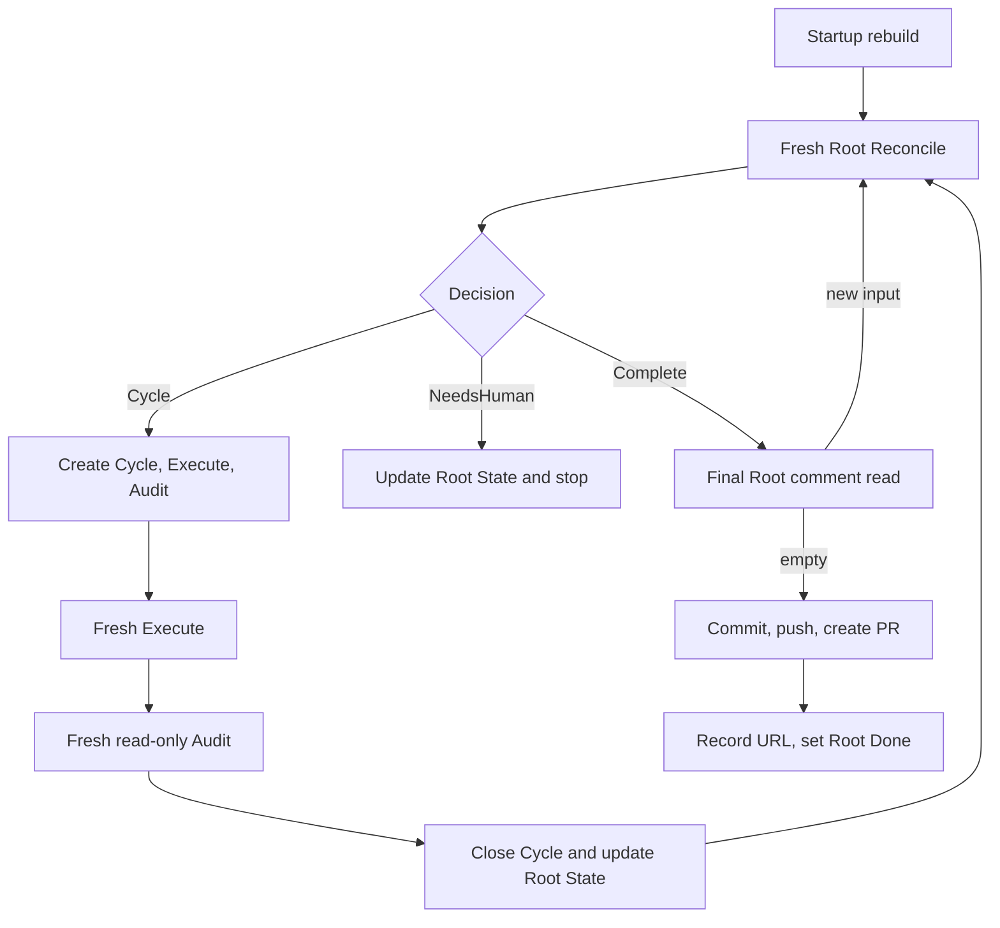

# Conductor

| Status | Owns | Does not own |
|---|---|---|
| target proposal | one-Root serial loop, startup abandonment, role dispatch, Root State checkpointing, and terminal PR function | semantic next-step choice, app-server, generic task capabilities, or recovery state machine |

The top-level `manager` remains a small composition point. It wires
`RootReconciler`, `CycleRunner`, `Performer`, `LinearGateway`, and fixed
workspace/PR command functions without implementing their semantics. Trusted
promotion is a small Root State update rule, not a service or subsystem.

## CLI

```bash
export LINEAR_API_KEY="..."

lh-harness run \
  --linear-root ENG-123 \
  --agent codex \
  --workspace "/workspaces/ENG-123" \
  --dir "/runs/ENG-123" \
  --model gpt-5.6-luna \
  --reasoning-effort max \
  --max-cycles 30
```

| Input | Behavior |
|---|---|
| `--linear-root` identifier or UUID | resolve one exact existing Root |
| Root input | Root title/description are the only task; no separate task input is accepted |
| `--workspace` | existing isolated Git workspace already allocated to this Root |
| `--dir` | existing writable run directory outside the workspace |
| resolved Root | derive team and four semantic workflow states from Linear |
| `--agent codex` | required closed selection; v1 implements only the Codex CLI adapter |
| model configuration | one model/reasoning configuration; role isolation comes from fresh sessions and permissions |
| `--max-cycles` | in-memory maximum Cycles for this process; it is not durable Root State |

Startup needs no caller-provided Linear team, project, status, label, template,
or config file. Missing Linear, Git, workspace, run-directory, or PR
prerequisites fail before an Agent starts. V1 does not claim Roots or allocate,
replace, clean, or delete workspace/run directories.

Root mode is the only public execution entry. V1 deliberately has no one-shot
role CLI: such an entry would create a second mutation path that can advance an
Execute or Audit Issue without the serial loop owning the complete Cycle. Tests
and diagnostics call the internal Cycle Runner, Gateway, prompt, and Performer
boundaries directly without exposing another production command.

## Startup rebuild

Conductor rebuilds from three Root-owned inputs, not the Root tree:

```text
Root Issue
+ Root State comment
+ Root comments after saved cursor
```

Startup performs this fixed sequence:

```text
resolve Root and Root State
-> Root Done? exit without mutation
-> publishing without PR URL? set NeedsHuman and stop
-> validate supplied workspace and run directory against Root State
-> list unfinished descendant Issue IDs and statuses
-> change every unfinished descendant to canceled
-> update Root State phase to idle and add Harness feedback that the retained
   workspace may contain unaudited partial modifications
-> run fresh Root Reconcile
```

| Rule | Required behavior | Forbidden behavior |
|---|---|---|
| `CO-START-001` | if Root State is absent, validate the supplied workspace/run directory and create the initial State comment | claim a Root or allocate directories |
| `CO-START-002` | if Root State exists, require its workspace, run directory, and branch to match the supplied paths | adopt or create replacement directories |
| `CO-START-003` | list only unfinished descendant identity/status for cancellation | parse or model old child descriptions, comments, or results |
| `CO-START-004` | cancel every unfinished Cycle, Execute, and Audit before Reconcile | resume, complete, audit, or synthesize results for them |
| `CO-START-005` | if saved workspace/run directory is missing or invalid, set `NeedsHuman` and stop | reconstruct from Git hashes, patches, children, or logs |
| `CO-START-006` | if phase is `publishing` without a PR URL, set `NeedsHuman` and stop before other startup actions | retry, inspect provider state, or adopt a branch/PR |
| `CO-START-007` | if Root is `Done`, exit before workspace, descendant, or Root State mutation | reopen Root or alter terminal descendants |

This is abandonment followed by fresh reasoning, not execution recovery. The
complete Root tree never enters an Agent prompt.

## Serial loop



| Runtime behavior | Constraint |
|---|---|
| bind one Root and Root workspace for process lifetime | never adopt another Root or workspace |
| allow one active Cycle and one in-flight Agent process | no parallel roles, Cycles, or subagents |
| route from current in-memory run state plus Root State checkpoint | never parse the historical child tree for decisions |
| checkpoint Root State after every durable transition | keep restart input and human view current |
| retain comments arriving during an active Cycle as new Root input | never add them to active Execute or Audit |
| Root `Done` | perform no Linear, workspace, or PR mutation; exit |

When Root is `Done`, perform no Linear or workspace mutation and exit.

## Cycle family transaction

| Step | Required behavior |
|---|---|
| freeze candidate | validate one minimal `CycleSpec` with selected comment IDs |
| project family | create Cycle, Execute, and Audit in exact order through Gateway |
| record family | persist `CycleSpec`, three provider IDs, and local evidence paths |
| commit input | only now advance Root State comment cursor and dispatch Execute |
| earlier failure | leave cursor unchanged, start no Agent, show partial provider state, stop |

Linear has no multi-call transaction. Conductor does not attempt to repair a
partial family. A later process will mechanically cancel any unfinished pieces
before fresh Reconcile.

## Cycle execution

| Step | Required behavior | Next step |
|---|---|---|
| Execute | Cycle Runner builds frozen prompt and asks Performer for a fresh workspace-write process | persist process facts, discard model output, then Audit |
| Audit | build independent prompt and ask Performer for a distinct fresh read-only process | persist report, then calculate result |
| result | apply `WF-RESULT-*` mechanically | append Cycle Result and terminal statuses |
| Root State | update trusted fields only for Succeeded; clear a workspace warning only after clean full-diff Audit | checkpoint, then Reconcile |

Execute process failure never bypasses Audit and never decides the Cycle result.
Audit inspects the actual shared Root workspace and receives no Execute model
output, transcript, or trajectory. Execute process facts may explain that work
was interrupted, but they are not correctness evidence.

Cycle Runner renders both role prompts from the same frozen inputs captured at
family creation: Root title/description, task state, optional pending finding,
Harness feedback, and the Cycle contract. Execute receives no Reconcile
transcript. Audit receives those same frozen inputs plus bounded mechanical
Execute process facts, but no Execute response or transcript. It always checks
the complete workspace diff for boundary violations as well as the Cycle
acceptance criteria; its real inspection is the sole semantic authority.

Role responses use small validated control headers. Audit must emit exactly one
`verdict: accepted | incomplete | blocked | violation | process_error`; prose
alone never determines Cycle outcome.

### Execute prompt

```text
fixed Executor instructions
+ Root title and description
+ task_state_markdown and optional pending_finding at family creation
+ frozen CycleSpec
```

The instructions say to perform only the frozen objective, respect boundaries,
and run relevant checks. Execute has no response schema or success authority;
its final model output is discarded rather than parsed, persisted, projected,
or supplied to Audit. It receives no old Cycle tree, Reconcile transcript,
pending comments, or Audit history.

### Audit prompt

```text
fixed Auditor instructions
+ the same frozen Root/task-state/finding background
+ frozen CycleSpec
+ bounded Execute process facts
+ read-only access to the real Root workspace
```

Audit independently checks acceptance and the complete workspace diff. Its
response starts with this validated header, followed by bounded Markdown fields
for summary, checks, evidence, findings, and the proposed full task state:

```text
verdict: accepted | incomplete | blocked | violation | process_error

## Summary
...
## Task State
...
```

The parser rejects a missing or invalid header. It never infers control values
from prose and never starts another Agent call to repair formatting. Cycle
Runner maps this verdict mechanically to the Cycle Result; Root Reconcile later
reads only the promoted Root State, not the Cycle Result or Audit report.

## Terminal PR function

The PR path is an ordinary Conductor function, not a delivery component or
state machine:

```text
publishPullRequest(root, rootState)
  -> require empty final Inbox and no active Cycle
  -> require workspace changes
  -> set Root State phase to publishing
  -> git add --all
  -> git commit
  -> git push --set-upstream
  -> create pull request
  -> return URL or failed step
```

No commit hash enters a contract. This is one ordered publication attempt, not
an exactly-once protocol. On ordinary failure, Conductor records the failed
step in Root State, leaves Root open and workspace intact, and exits. If a
process later starts with phase `publishing` but no recorded PR URL, it sets
`NeedsHuman` and stops without another publication attempt. It does not retry,
read back, adopt an existing PR, roll back, or repair.

## Stop behavior

| Observation | Action |
|---|---|
| signal or deadline | cancel live process, record bounded state where possible, stop |
| this process reaches its maximum Cycle count, or a human question is required | set Root State `NeedsHuman`, stop |
| Linear failure | preserve run-directory evidence and stop |
| missing saved workspace or run directory | set `NeedsHuman`, stop; do not rebuild it |
| commit/push/PR failure | record failed step, leave Root open and workspace intact, stop |

## Observability

Structured events include run ID, Root/Issue IDs, Cycle number, role, process
outcome, semantic result, duration, PR step, and sanitized reason. They exclude
prompts, raw model output, file contents, diffs, credentials, authorization
headers, and Git hashes. The run directory stores only transaction records,
bounded final responses needed by Manager/Audit parsers, Audit material, and PR
command evidence. Complete trajectories are optional adapter diagnostics, not
required architecture artifacts or public contract values.
