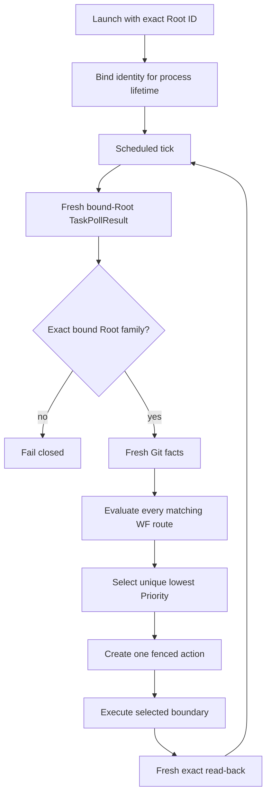
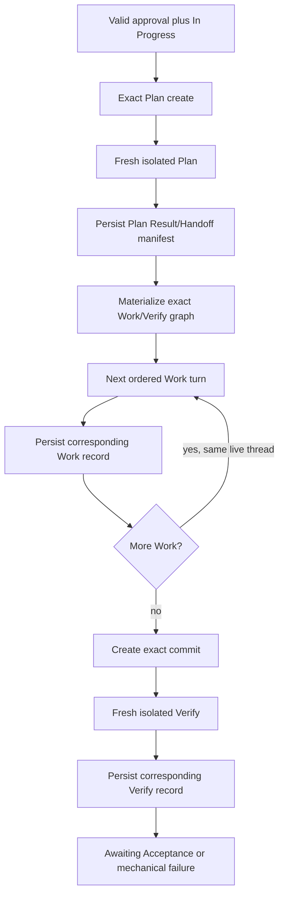
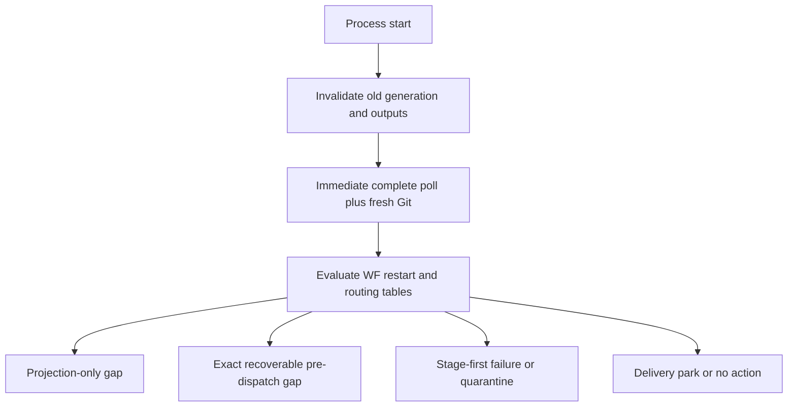

# Conductor

| Status | Owns | Does not own |
|---|---|---|
| Phase 1 target | single-Root serial runtime、mechanical execution、runtime fences | workflow state、routing、failure policy |

## Runtime loop

## Loop authority table

| Rule | Runtime fact | Required behavior | Forbidden behavior |
|---|---|---|---|
| `CO-LOOP-001` | exact launch Root ID | bind that Root for the whole process lifetime and hold at most one in-flight action | discover/adopt a second Root、reuse a freed slot、multi-Root orchestration |
| `CO-LOOP-002` | every scheduled tick | run fresh actionability scan even without changed notification | use changed-only event as action queue |
| `CO-LOOP-003` | selected action | fresh-read Linear/Git before effect and exact-read after effect | continue from cached accepted snapshot |
| `CO-LOOP-004` | internal Cycle writeback | return to scheduled poll; select one fresh no-model route | directly or recursively wake Root |
| `CO-LOOP-005` | external Root semantic edit during active Cycle | allow `WF-ROUTE-005`; sealed Cycle remains unchanged | inject newer Root facts into current DAG |
| `CO-LOOP-006` | no actionable fact | park without durable cursor | write consumed-event state |
| `CO-LOOP-007` | multiple rows match one fresh snapshot | select the unique lowest numeric `Priority`; closure/mechanical rows outrank `WF-ROUTE-005` | first-match order、notification order、repeat Root turn starving Cycle |

## Mechanical Cycle flow

## Execution authority table

| Rule | Action | Fresh precondition | Durable output | Next selection |
|---|---|---|---|---|
| `CO-EXEC-001` | create Plan | exact approval record, matching seal/status, Plan absent | exact Plan Issue read-back | isolated Plan dispatch |
| `CO-EXEC-002` | validate Plan | sealed groups/directives and closed Plan result | completed: non-empty order and exact manifest failed/canceled: phase record only | materialize or close Plan/Cycle |
| `CO-EXEC-003` | materialize graph | Plan completion record already read-back | exact Issues/relations plus service-actor evidence and complete graph read-back | first ordered Work |
| `CO-EXEC-004` | dispatch Stage | Stage `Todo`, dependencies complete, expected Instruction digest | `In Progress` projection read-back | one role call |
| `CO-EXEC-005` | complete Stage | typed candidate plus fresh Issue/Git/worktree facts | corresponding exact Result/Handoff read-back, then terminal projection | next `WF-TR-*` row |
| `CO-EXEC-006` | create commit | all Work records complete; final Work parent/diff matches fresh worktree | carrying commit object with non-self-referential proof | Verify dispatch |
| `CO-EXEC-007` | Verify | exact commit proof and Verify `Todo` | fresh Verify context, exact-revision record and projection | `WF-TR-007` or `WF-TR-008` |

## Work continuity table

| Rule | State | Allowed continuity | Persistence | Loss behavior |
|---|---|---|---|---|
| `CO-WORK-001` | one approved Cycle | one Work performer instance and one live thread across ordered Work turns | no transcript or thread ID persisted | `WF-RESTART-004` |
| `CO-WORK-002` | current Work turn | explicit input contains sealed Cycle and current Work Instruction only | completion candidate normalized under `WF-PERSIST-003` | role failure closes current Stage |
| `CO-WORK-003` | next Work `Todo` | prior assistant turn may remain naturally in same live thread | ephemeral only under `WF-PERSIST-007` | never reconstruct from Linear/Git/logs |
| `CO-WORK-004` | Plan or Verify | always separate process/thread context from Work and each other | none | fresh dispatch only where `WF-RESTART-*` permits |

## Failure dispatch

This table is the exhaustive Conductor projection of `WF-FAIL-*`; it defines no recovery policy.

| Rule | Failure rules consumed | Mechanical responsibility |
|---|---|---|
| `CO-FAIL-001` | `WF-FAIL-002`, `WF-FAIL-003`, `WF-FAIL-004`, `WF-FAIL-018` | Stage/Work-thread lost-context、slot and external-terminal closure |
| `CO-FAIL-002` | `WF-FAIL-005`, `WF-FAIL-006` | close dispatched Stage before Cycle invalidation; derive last valid phase |
| `CO-FAIL-003` | `WF-FAIL-007`, `WF-FAIL-008`, `WF-FAIL-009` | stop materialization/execution and preserve permanent quarantine |
| `CO-FAIL-004` | `WF-FAIL-015` | bind observed violation and never repair sealed content |
| `CO-FAIL-005` | `WF-FAIL-016` | close any dispatched Stage before phase-owned cancellation; never invoke Root |

| Stage when Cycle terminalizes | Required fact | Later behavior |
|---|---|---|
| `In Progress` | matching completion/invalidation and terminal projection first | closed Stage |
| terminal | matching authoritative terminal record | preserved |
| never-dispatched `Todo` | terminal Cycle record proves it was not run | frozen、never dispatched、not an open Stage |

## Runtime fence table

| Rule | Runtime-only value | Allowed purpose | Must never decide |
|---|---|---|---|
| `CO-FENCE-001` | Root ID and runtime generation | late-output rejection and exact Home ownership | workflow phase or successor |
| `CO-FENCE-002` | in-flight correlation | match one live call/result | accepted completion or retry |
| `CO-FENCE-003` | process/thread handles | cancellation and lifecycle management | durable context recovery |
| `CO-FENCE-004` | polling notification baseline | emit changed-only notification | actionability or transition |

| Runtime state boundary | Allowed | Forbidden |
|---|---|---|
| `<program-data>/root-reconcills/<root-id>/symphony/state.json` | values in `CO-FENCE-*` only | workflow/content fields thread identity、next action、prompt Performer or acceptance evidence |

## Restart mechanics

| Rule | Restart step | Authority | Result |
|---|---|---|---|
| `CO-RESTART-001` | validate launch Root ID/Home owner, increment generation, fence every old output | runtime fence only | same Root binding; no workflow state restored from disk |
| `CO-RESTART-002` | immediate complete Linear poll plus fresh Git/provider reads | `WF-AUTH-001`, `WF-AUTH-002` | one fresh routing/restart match |
| `CO-RESTART-003` | execute exactly one matching `WF-RESTART-*` row | persisted facts | projection、resume、failure、quarantine or park |
| `CO-RESTART-004` | no unique complete observation | no fallback authority | visible fail-closed error; no model guess |

## Cleanup table

| Rule | Cleanup fact | Required closure | Allowed deletion | Forbidden deletion |
|---|---|---|---|---|
| `CO-CLEAN-001` | external Root `Done` | `WF-ROUTE-013` only after no non-terminal Cycle、no dispatched open Stage and no delivery gap terminal-Cycle `Todo` descendants are frozen | matching Root runtime/process/thread/Home, then terminate this Conductor | user code、Performer Home、another Root Home、Linear Issues、second Root adoption |
| `CO-CLEAN-002` | terminal Cycle worktree | terminal record/status read-back and no live action | exact disposable Cycle worktree | reset/clean/cherry-pick into successor |
| `CO-CLEAN-003` | cleanup error | workflow facts remain closed | emit bounded correlated error | reopen workflow or delete broader path |

## Audit evidence

| Rule | Evidence | Proves | Does not prove |
|---|---|---|---|
| `CO-AUDIT-001` | structured process event with Root/Cycle/Stage/role/generation/correlation and sanitized digest | positive boundary invocation | a call never happened |
| `CO-AUDIT-002` | complete controlled-provider request audit | negative Root-silence and context-input assertions | workflow authority or raw value retention |
| `CO-AUDIT-003` | Linear/Git/provider public facts | persisted records、identity、revision and outcome | hidden transcript contents |
| `CO-AUDIT-004` | audit payload allowlist | identity、correlation、role and sanitized digests only | prompts、assistant text、tool payloads、diffs、credentials、E7 continuity value、routing input |
