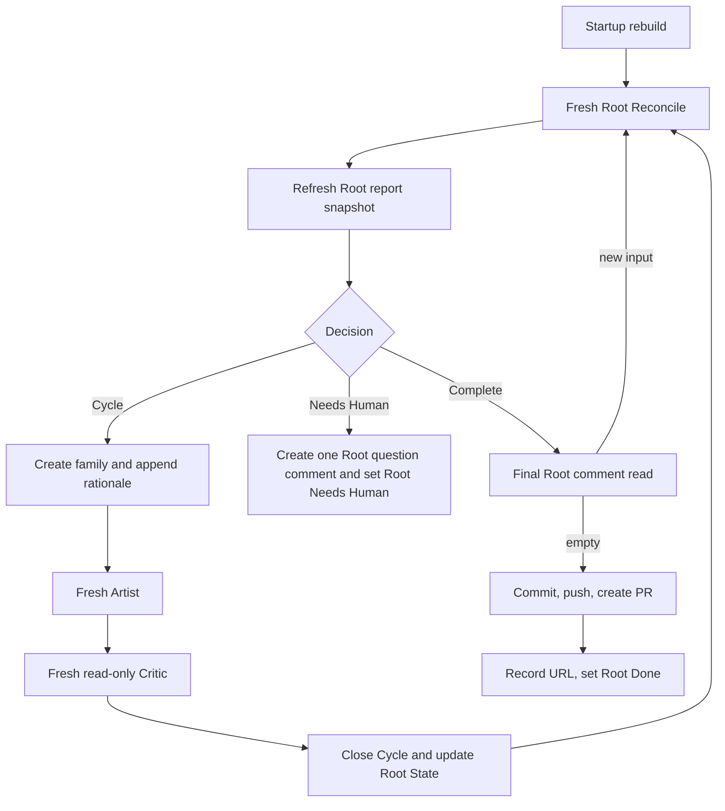

# Conductor

| Status | Owns | Does not own |
|---|---|---|
| target proposal | one-Root serial loop, startup abandonment, role dispatch, Root State, and delivery | semantic next-step choice, Podium scheduling, app-server, generic capabilities, or recovery state machine |

The top-level `manager` remains a small composition point. It wires
`RootReconciler`, `CycleRunner`, `Performer`, `LinearGateway`, and fixed
workspace/PR command functions without implementing their semantics. Trusted
promotion is a small Root State update rule, not a service or subsystem.

## CLI

```bash
export LINEAR_API_KEY="..."

lh-harness run \
  --linear-root ENG-123 \
  --workspace "/workspaces/ENG-123" \
  --dir "/runs/ENG-123" \
  --reconcile-agent codex \
  --reconcile-model "<reconcile-model>" \
  --reconcile-reasoning-effort "<reconcile-effort>" \
  --artist-agent codex \
  --artist-model "<artist-model>" \
  --artist-reasoning-effort "<artist-effort>" \
  --critic-agent codex \
  --critic-model "<critic-model>" \
  --critic-reasoning-effort "<critic-effort>" \
  --max-cycles 30
```

| Input | Behavior |
|---|---|
| `--linear-root` identifier or UUID | resolve one exact existing Root |
| Root input | Root title and immutable requirement section are the only task; the managed snapshot is stripped and no separate task input is accepted |
| `--workspace` | optional preferred path; deterministic Root Reconcile Prepare creates/adopts it |
| `--dir` | existing writable run directory outside the workspace |
| resolved Root | resolve the Root team's six canonical Root statuses by exact name and expected type |
| `--reconcile-agent codex` | closed Reconcile role adapter; omission defaults to `codex` |
| `--artist-agent codex` | closed Artist role adapter; omission defaults to `codex` |
| `--critic-agent codex` | closed Critic role adapter; omission defaults to `codex` |
| role configuration | Reconcile, Artist, and Critic model/reasoning values are optional and independent |
| `--max-cycles` | in-memory maximum Cycles for this process; it is not durable Root State |

Startup needs no caller-provided Linear team, project, or workflow-state IDs, and
no harness config file. `LINEAR_API_KEY` carries the current app-actor access
token for the built-in application: a Podium-launched process receives
Desktop's current token in its environment, and a manual launch supplies a
token for the same application. Missing Linear, Git, workspace, run-directory,
or PR prerequisites fail before an Agent starts. Conductor does not claim Roots
or execute Git/worktree/cleanup commands. Podium derives preferred paths and
creates the external run directory; deterministic Root Reconcile Prepare owns
workspace creation or adoption.

Reconcile, Artist, and Critic API keys and base URLs are startup-only
environment values resolved independently by the backend from role-specific
variables. They are never fields in `HarnessRunRequest`, `ProjectBinding`, or
public Linear data. When a role-specific value is omitted, Performer injects no
key or base URL and the fresh Codex process keeps the user's local `~/.codex`
configuration and authentication; Conductor does not inject a replacement
default.

Root mode is the only public execution entry. V1 deliberately has no one-shot
role CLI: such an entry would create a second mutation path that can advance an
Artist or Critic Issue without the serial loop owning the complete Cycle. Tests
and diagnostics call the internal Cycle Runner, Gateway, prompt, and Performer
boundaries directly without exposing another production command.

## Podium launch boundary

Podium Desktop launches this CLI once per bound Root. The invocation contains
one `--linear-root`, one preferred `--workspace`, and one `--dir`; manual CLI
launch may omit `--workspace` to adopt the current checkout. It never asks a
Conductor to discover a Project, select another Root, or manage a fleet.

| Rule | Required behavior | Forbidden behavior |
|---|---|---|
| `CO-PODIUM-001` | accept one bound Root, optional preferred workspace, and run directory; bind Prepare's result for the process lifetime | discover, claim, or adopt another Root after Prepare |
| `CO-PODIUM-002` | accept independent Reconcile, Artist, and Critic role launch values | inherit Reconcile settings from Artist or share role credentials |
| `CO-PODIUM-003` | let an explicit Podium stop command terminate the process tree only at the external process boundary | implement priority, queue, automatic preemption, or PID persistence inside Conductor |
| `CO-PODIUM-004` | release a `Needs Human` run; let an unprocessed Human Action thread reply make it an ordinary candidate | add Resume commands, special priority, labels, or question rendering to Podium |

## Startup rebuild

Conductor rebuilds from three Root-owned inputs, not the Root tree:

```text
Root Issue
+ Root description managed snapshot
+ Root comments after saved cursor
```

Startup performs this fixed sequence:

```text
resolve Root
-> resolve or create the six canonical Linear statuses by exact name and type
-> Root Done? exit without Root-owned mutation
  -> resolve Root State
  -> validate/project the exact Root managed snapshot block with a local RFC3339 timestamp
-> Root State absent? run deterministic Prepare with the optional preferred path and persist its binding
-> delivering without structured Delivery? expose failure, project Root In Review, and stop
-> otherwise validate the saved binding and supplied run directory
-> list unfinished descendant Issue IDs and statuses
-> change every unfinished descendant to canonical Canceled
-> update Root State phase to idle and add Harness feedback that the retained
   workspace may contain unreviewed partial modifications
-> run fresh Root Reconcile
```

The `Done` guard matches only the exact canonical `Done` status ID after the
team workflow-contract check. A same-named state with another type is a
resolver conflict, not a terminal Root, and cannot bypass startup validation.

| Rule | Required behavior | Forbidden behavior |
|---|---|---|
| `CO-START-001` | if Root State is absent, invoke deterministic Prepare with the optional preferred workspace and supplied run directory, then create the initial managed Root snapshot | start a Prepare Agent or let Conductor execute Git |
| `CO-START-002` | if Root State exists, require its workspace, run directory, and branch to match the invocation inputs when supplied | adopt or create replacement directories |
| `CO-START-003` | list only unfinished descendant identity/status for cancellation | parse or model old child descriptions, comments, or results |
| `CO-START-004` | set every unfinished Cycle, Artist, and Critic to canonical `Canceled` before Reconcile | resume, complete, review, or synthesize results for them |
| `CO-START-005` | if saved workspace/run directory is missing or invalid, expose a runtime failure with Root `In Review` | invent a human question, reconstruct from Git hashes, patches, children, or logs |
| `CO-START-006` | if phase is `delivering` without structured Delivery, expose a runtime failure with Root `In Review` before other startup actions | invent a human question, retry, inspect provider state, or adopt a branch/PR |
| `CO-START-007` | after the team workflow-contract check, if Root is `Done`, exit before workspace, descendant, or Root State mutation | reopen Root or alter terminal descendants |

This is abandonment followed by fresh reasoning, not execution recovery. The
complete Root tree never enters an Agent prompt.

## Serial loop



| Runtime behavior | Constraint |
|---|---|
| bind one Root and Root workspace for process lifetime | never adopt another Root or workspace |
| allow one active Cycle and one in-flight Agent process | no parallel roles, Cycles, or subagents |
| route from current in-memory run state plus Root State checkpoint | never parse the historical child tree for decisions |
| checkpoint Root State after every durable transition | keep restart input and human view current |
| collect a typed whole-worktree summary before each Reconcile | expose paths and line deltas only; never substitute it for Critic authority |
| project one validated report after every Reconcile | refresh the Root report with local time; copy `create_cycle` reports to the Cycle creation comment; replace completion metrics; no summarizer |
| accumulate Reconcile, Artist, and Critic usage | persist exact safe counters in Root State; one missing invocation makes the displayed total `Unknown` |
| project status transitions at each lifecycle boundary | leave Linear statuses stale until a comment or local checkpoint changes |
| retain comments arriving during an active Cycle as new Root input | never add them to active Artist or Critic |
| Root `Done` | perform no Linear, workspace, or PR mutation; exit |

When Root is `Done`, perform no Linear or workspace mutation and exit.

## Cycle family transaction

| Step | Required behavior |
|---|---|
| freeze candidate | validate one minimal `CycleSpec` with selected comment IDs |
| project family | create Cycle, Artist, and Critic in `Todo`, with role-prefixed objective titles, in exact order through Gateway |
| record family | persist `CycleSpec`, three provider IDs, and local evidence paths |
| commit input | only now advance Root State `comment_cursor` and dispatch Artist |
| earlier failure | leave cursor unchanged, start no Agent, show partial provider state, stop |

Linear has no multi-call transaction. Conductor does not attempt to repair a
partial family. A later process will mechanically cancel any unfinished pieces
before fresh Reconcile.

## Cycle execution

| Step | Required behavior | Next step |
|---|---|---|
| activate | after the family record is durable, set Cycle and Root `In Progress` | then start Artist |
| Artist | fresh workspace-write process with final `cycle-NNN-artist-result.md` | append report plus human-readable local `Updated at` to Artist description; expose current error first 50 chars; finish, then Critic |
| Critic | fresh read-only process with final `cycle-NNN-critic-result.md` | parse once; append report plus human-readable local `Updated at` to Critic description; expose current error first 50 chars; finish, then persist JSON |
| result | apply `WF-RESULT-*` mechanically | append the sole terminal Cycle comment, upload only `cycle-NNN-critique-result.json` as `application/json`, then set Cycle `Done` |
| Root State | write the compact Critic checkpoint to `latest_critique`; update trusted fields only for Succeeded; clear a workspace warning only after clean full-diff Critic | checkpoint Root `In Review`, then Reconcile |

Artist process failure never bypasses Critic and never decides the Cycle result.
Critic inspects the actual shared Root workspace and receives no Artist Markdown,
transcript, or trajectory. Bounded Artist process facts may explain that work
was interrupted, but they are not correctness evidence. Raw Agent JSONL and
stderr, when diagnostic paths are supplied, remain private local evidence only.

Cycle Runner delegates Prompt construction to separate Artist and Critic Prompt
modules. They share the frozen Cycle contract and prior trusted task state, but
not role instructions. Artist additionally receives the optional pending
finding. Critic receives bounded mechanical Artist process facts instead; it
receives no Artist response or transcript. Neither role receives the Root
title/description, Root comments, Harness feedback, Reconcile transcript, or
child history. Critic always checks the complete workspace diff for boundary
violations as well as the Cycle acceptance criteria; its real inspection is the
sole semantic authority.

Each role Prompt places identity, permissions, and authority rules before named,
escaped runtime-data blocks, and places its exact response contract last. A
runtime block cannot redefine the role or forge its own matching end marker.
The two role modules may reuse only the mechanical block renderer; they do not
share semantic Prompt text.

For each role launch, Conductor supplies private
`diagnostic_jsonl_path`/`diagnostic_stderr_path` values under the external run
directory. Performer returns only local diagnostic refs and a mechanically
indexed `thread_id`; neither is included in the role prompt or any Linear
projection.

Role separation is intentional: Artist and Critic can use different Codex
connection/model/reasoning settings while retaining fixed per-run configuration. There is no
dynamic per-Cycle routing, plugin discovery, compatibility alias, or shared
cross-role transcript.

Role responses are Markdown files. The Artist report is a human-readable
summary of actual file changes and verification without a machine-parsed
heading schema; it is appended exactly once to Artist's description with
one mechanical human-readable local `Updated at: <YYYY-MM-DD HH:mm:ss GMT+/-HH:MM>` line.
The Critic report starts with a compact JSON envelope containing verdict, task
state, and optional pending finding, then provides a free human-readable audit
of scope, implementation logic, checks, evidence, and findings. It is appended exactly once to
Critic's description with one mechanical human-readable local `Updated at:
<YYYY-MM-DD HH:mm:ss GMT+/-HH:MM>` line.
Neither report repeats the Cycle description. There is one Artist and one
Critic Agent call per Cycle. A missing or invalid final file becomes a process
error; Conductor never starts a second summarization or format-repair call.

Root status is a mechanical projection around the semantic decision. A new Root
begins in `Todo`; startup does not normalize a resumed Root. A durable Cycle
family sets Root to `In Progress`; a complete Critique sets Root to `In Review`;
a structured `needs_human` sets it to `Needs Human`; and an escaped runtime
failure remains `In Review`. A recorded Delivery sets it to `Done`.
Root
Reconcile never calls Linear or chooses a status ID. A status mutation failure is
a provider failure and stops the run; Conductor never silently falls back to a
comment or local phase.

### Artist prompt

```text
fixed Artist instructions
+ task_state_markdown and optional pending_finding at family creation
+ frozen CycleSpec
+ write the final Markdown response to `cycle-NNN-artist-result.md` as the last response
```

The instructions say to perform only the frozen objective, respect boundaries,
and run relevant checks. The final report must focus on actual created/updated/
deleted files, line deltas, and validation evidence. Artist has no semantic
response schema or success authority; its final Markdown is appended exactly
once to the Artist description, then ignored for parsing, Critic input, Root State, and
Cycle semantics. It receives no old Cycle tree, Reconcile transcript, pending
comments, or Critic history.

### Critic prompt

```text
fixed Critic instructions
+ prior task_state_markdown
+ frozen CycleSpec
+ bounded Artist process facts
+ read-only access to the real Root workspace
+ write the final Markdown response to `cycle-NNN-critic-result.md` as the last response
```

Critic independently checks acceptance and the complete workspace diff. Its
final response is the exact Markdown file appended once to the Critic description
only. It
must explain the review scope, implementation logic, validation evidence, and
findings for a human reader rather than restate the Cycle description:

````text
```json
{"verdict":"accepted | incomplete | blocked | violation | process_error","task_state_markdown":"...","pending_finding":null}
```

<human-readable audit Markdown>
````

The parser rejects a missing or invalid field/file. It never infers control
values from prose and never starts another Agent call to repair formatting.
Cycle Runner creates the full Critique artifact in memory and serializes it once
to `cycle-NNN-critique-result.json`. It writes and uploads the same bytes, then
maps the already validated compact envelope to the Cycle Result and
`RootState.latest_critique`.
Only the JSON file is uploaded to Cycle as `application/json`; the Cycle Result
contains `[cycle-NNN-critique-result.json](https://linear.example/asset)` or the current upload
error's first 50 characters. The Cycle has only its creation rationale and this
terminal comment; Linear statuses show intermediate progress. Root
Reconcile later reads only `latest_critique`, not the Cycle comments, role
descriptions, or Cycle DAG.

## Terminal delivery function

Delivery is the final Root Reconcile Agent phase, not a Conductor function or
delivery subsystem:

```text
RootReconcileDelivery(root, rootState)
  -> require empty final Inbox and no active Cycle
  -> require workspace changes
  -> set Root State phase to publishing
  -> attempt commit/push and PR through git/gh
  -> return validated PR, branch, or files Delivery
```

No commit hash enters a contract. Root Reconcile attempts PR, branch, then files
in that order and returns exactly one valid Delivery. Conductor only validates,
persists, and projects it before Root `Done`; it never retries or repeats Git.

## Stop behavior

| Observation | Action |
|---|---|
| signal or deadline | cancel live process, record bounded state where possible, stop |
| Root Reconcile returns concrete human questions | create one Root question comment, set Root State and Root `Needs Human`, and stop |
| this process reaches its maximum Cycle count | expose a runtime failure with Root `In Review`; do not invent a human question |
| Linear failure | preserve run-directory evidence and stop |
| missing saved workspace or run directory | expose a runtime failure with Root `In Review`; do not rebuild it |
| commit or push failure | record failed step, leave Root `In Review` and workspace intact, stop |
| PR unavailable after push | record delivered branch, set Root `Done`, stop successfully |
| escaped runtime failure | show the current error message's first 50 characters, set Root `In Review`, preserve private diagnostics, fail process |

## Observability

Structured events include run ID, Root/Issue IDs, Cycle number, role, process
outcome, semantic result, duration, PR step, the current message's first 50 characters, and at most an
opaque local `diagnostic_ref`. They exclude prompts, raw model output, file
contents, diffs, credentials, authorization headers, Git hashes, raw JSONL,
stderr, and error context. The external run directory stores transaction
records, the exact `cycle-NNN-*-result.md` files needed by role descriptions, the
once-serialized `cycle-NNN-critique-result.json`, PR command evidence,
and private diagnostic artifacts. Role Markdown is appended only to its owned
descriptions; only the typed Critique JSON is uploaded as a Cycle file. Diagnostic
artifacts retain bounded raw Agent JSONL/stderr and causal context with private
permissions and are never supplied to Critic or Root Reconcile, uploaded to
Linear, or used as workflow authority.

Unknown failures are handled without an exhaustive reason-code taxonomy.
Public operators receive the current boundary's original message limited to 50
characters, without cause traversal or added prefixes, and an optional local
`diagnostic_ref`. Full causal evidence remains private.
Unhandled Conductor failures also write
`run_directory/diagnostics/<run_id>/error.json` with a private directory/file
mode (0700/0600) before the bounded process event is emitted.
