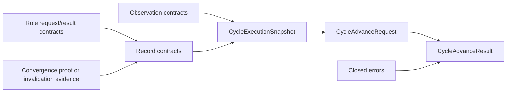
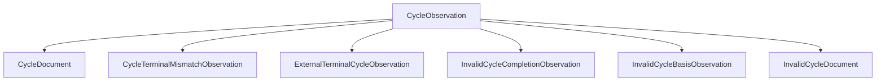
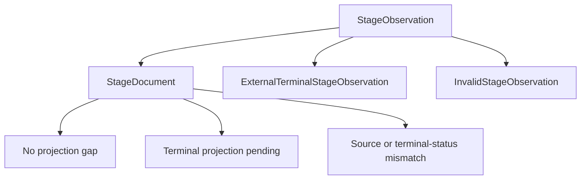

# Contracts and Interfaces

| Status | Owns | Does not own |
|---|---|---|
| Phase 1 target | stable public types、closed variants、boundary invariants | provider SDK、transport、process implementation、workflow meaning |

## Public interfaces

| Rule | Interface | 唯一职责 |
|---|---|---|
| `CT-IF-001` | `TaskManageObserverInterface` | bounded tick返回完整`TaskSnapshotObservation`，变化另发changed-only notification |
| `CT-IF-002` | `TaskManageCommandInterface` | capability-scoped provider-neutral Issue/relation query/mutation与fresh read-back |
| `CT-IF-003` | `RootReconcillFactoryInterface` | 为一个Root和Root Home创建identity-bound、code-read-only Root Reconcill |
| `CT-IF-004` | `RootReconcillInterface` | 只运行`WF-ROUTE-*`选择的Root semantic boundary |
| `CT-IF-005` | `CycleMachineInterface` | 从fresh bound-Root/Cycle facts执行一个selected mechanical transition或closure |
| `CT-IF-006` | `StagePerformerInterface` | closed Plan/Work/Verify role family；每实例只执行自己的role |
| `CT-IF-007` | `GitWorkspaceInterface` | per-Cycle worktree、status、diff和exact commit operations |
| `CT-IF-008` | `DeliveryInterface` | accepted exact revision的remote-ref和PR operations |
| `CT-IF-009` | `ConductorActionInterface` | selected FamilyGuard、DeliveryFinalizer或Cleanup request到closed result |

| Public boundary | Ownership | Excluded values |
|---|---|---|
| interfaces below | caller-owned | SDK object、Codex thread/event、MCP session、process/filesystem handle、credential |

## Markdown contract

| Rule | Value | Validation | Explicit exclusion | Owner reference |
|---|---|---|---|---|
| `CT-MD-001` | branded `MarkdownText` | valid UTF-8、non-empty、bounded、`text/markdown` | hidden JSON、credential、provider metadata、runtime control | `RI-DOC-005` |
| `CT-MD-002` | Root/Cycle/Stage documents | standard Markdown AST plus closed named-section schema | substring parsing、natural-language transition inference | `RI-DOC-001`, `RI-DOC-002`, `RI-DOC-003` |
| `CT-MD-003` | approval/completion/invalidation record | deterministic Markdown projection of a closed typed value | raw Performer result、receipt、local key | `RI-DOC-004`, `RI-REC-001` through `RI-REC-006` |
| `CT-MD-004` | repository/Task Markdown input | treated as untrusted content, never capability | prompt-based permission expansion | `RR-PERM-001` through `RR-PERM-006`, `PF-PERM-001` through `PF-PERM-004` |

## Closed contract families

Phase 1 只需要以下 contract families：

```text
TaskPollResult | TaskObservationEvent
RootSemanticSnapshot
TaskWorkflowStateMap | TaskIssueHistoryEntry | TaskResourceCreationEvidence |
TaskIssueRecord | TaskSnapshot
RootRoutingDisposition
GitCommitProof | GitSnapshot | RemoteRefSnapshot
TaskMcpCall | TaskMcpResult
RootDefinition | CycleObservation | CycleSpecification | CycleCompletion
StageObservation | StageCompletion | PlanGraphManifest |
LinearExecutionSnapshot | CycleExecutionSnapshot
CycleAdvanceRequest | CycleAdvanceResult | CycleContextObservation
ConductorActionRequest | ConductorActionResult
PlanRequest | WorkRequest | VerifyRequest
PlanResult | WorkTurnResult | WorkResult | VerifyResult
GitToolCall | GitToolResult
DeliveryToolCall | DeliveryToolResult
RootTurnOutcome | RuntimeFenceState
```

The authority table below is exhaustive for public-envelope fields, exclusions and fail-closed behavior.

## Contract authority table

| Rule | Contract family | Invariant | Workflow reference |
|---|---|---|---|
| `CT-CLOSED-001` | every public envelope | `schema_version: 1`, target identity and correlation; runtime envelopes also carry generation | `WF-AUTH-003` |
| `CT-CLOSED-002` | every union | unknown/missing variant fails closed; no compatibility negotiation | Phase 1 hard cut |
| `CT-CLOSED-003` | every public boundary | SDK/provider/Codex/process/filesystem objects are excluded<br>no credentials、arbitrary metadata or durable next action | `TM-CMD-001` through `TM-CMD-004` |
| `CT-CLOSED-004` | normalized completion values | Stage/Cycle completion is a validated Linear projection, never a raw model/provider response | `WF-PERSIST-002` through `WF-PERSIST-006` |
| `CT-OBS-001` | observation | valid `TaskSnapshot` or sanitized `InvalidTaskSnapshot`, never partial-valid | `TM-OBS-002`, `TM-OBS-004` |
| `CT-REC-001` | record observation | valid closed record or sanitized missing/malformed/updated/archived variant | `TM-OBS-005` |
| `CT-REC-002` | transition record | exact identity、actor、provider times、basis revision/status/document digest | `WF-AUTH-007` |
| `CT-REC-003` | Cycle terminal record | record variant fixes `successor_policy`<br>typed unions below are exhaustive | `WF-TR-006`, `WF-TR-008` through `WF-TR-010`, `WF-FAIL-005` |
| `CT-STATE-001` | Cycle/Stage discriminated unions | only states and record relationships listed by `WF-TR-*` | `WF-TR-001` through `WF-TR-013` |
| `CT-STATE-002` | `TaskWorkflowStateMap` | each semantic status binds one Linear state ID<br>every ID is present、active、distinct | `TM-SNAP-006`, `TM-PROVIDER-007` |
| `CT-CONVERGE-001` | `AcceptanceConvergenceProof | DeliveryConvergenceProof` | scope-discriminated provider rounds<br>fixed order and stable decision basis | `GD-CONVERGE-001` through `GD-CONVERGE-004` |
| `CT-CONVERGE-002` | `DeliveryInvalidationEvidence` | reason-discriminated mismatch/conflict/early-Done observations; never a fabricated convergence proof | `WF-FAIL-011`, `WF-FAIL-012`, `GD-DELIVERY-005` |
| `CT-PERF-001` | role requests/results | explicit role input and closed candidate; only Work turn has ephemeral continuation | `PF-CTX-001` through `PF-RESULT-004` |
| `CT-PERF-002` | `ephemeral_continuation_markdown` | same live Work provider thread only<br>provider thread transport is allowed<br>Symphony storage、re-injection and workflow use are forbidden | `WF-PERSIST-007`, `PF-THREAD-001` through `PF-THREAD-003` |
| `CT-ERROR-001` | public errors | closed code、identity、correlation and sanitized reason | corresponding `WF-FAIL-*` row |



## Observation contracts

### Runtime observation and Root turn

```text
TaskObservationEvent {
  schema_version: 1, root_id, correlation_id, observed_at,
  from_task_digest: digest | null, to_task_digest,
  task: TaskSnapshot, task_changes: ConcreteTaskChange[]
}

TaskPollResult {
  schema_version: 1, root_id, observed_at,
  task: TaskSnapshotObservation, notification: TaskObservationEvent | null
}

RootSemanticSnapshot {
  schema_version: 1, root_id, runtime_generation, correlation_id,
  observed_at, task: TaskSnapshot, git: GitSnapshot,
  routing: RootRoutingDisposition & { disposition: root_boundary },
  notification: TaskObservationEvent | null
}

RuntimeFenceState {
  schema_version: 1, root_id, runtime_generation,
  in_flight_correlation | null
}

RootTurnOutcomeCommon {
  schema_version: 1, root_id, runtime_generation, correlation_id,
  input_task_digest
}
RootTurnOutcome = RootTurnOutcomeCommon & (
  { outcome: quiescent,
    selected_route: WF-ROUTE-001 | WF-ROUTE-002 | WF-ROUTE-007 | WF-ROUTE-008,
    observed_effect: none | confirmed,
    post_effect_task_digest } |
  { outcome: quiescent, selected_route: WF-ROUTE-005,
    observed_effect: none, post_effect_task_digest } |
  { outcome: draft_closed, selected_route: WF-ROUTE-002,
    trigger: stopped | timed_out | canceled,
    closure_status: Failed | Canceled, post_effect_task_digest } |
  { outcome: acceptance_closed, selected_route: WF-ROUTE-007,
    trigger: stopped | timed_out | canceled,
    closure_status: Rejected | Canceled, post_effect_task_digest } |
  { outcome: no_effect,
    selected_route: WF-ROUTE-001 | WF-ROUTE-002 | WF-ROUTE-005 |
                    WF-ROUTE-007 | WF-ROUTE-008,
    effect_may_have_occurred: false, sanitized_reason } |
  { outcome: effect_unknown,
    selected_route: WF-ROUTE-001 | WF-ROUTE-002 | WF-ROUTE-007 | WF-ROUTE-008,
    effect_may_have_occurred: true, sanitized_reason }
)
```

### Conductor action envelope

```text

ConductorActionRequestCommon {
  schema_version: 1, root_id, runtime_generation, correlation_id,
  input_task_digest
}
ConductorActionRequest = ConductorActionRequestCommon & (
  { action: family_guard, selected_route: WF-ROUTE-009,
    task: TaskSnapshot,
    routing: RootRoutingDisposition & { disposition: family_guard } } |
  { action: delivery_finalizer, selected_route: WF-ROUTE-010,
    task: TaskSnapshot, git: GitSnapshot, remote_ref: RemoteRefSnapshot,
    routing: RootRoutingDisposition & {
      disposition: delivery_finalizer, selected_route: WF-ROUTE-010 } } |
  { action: delivery_finalizer, selected_route: WF-ROUTE-012,
    task: TaskSnapshot, git: GitSnapshot, remote_ref: RemoteRefSnapshot,
    routing: RootRoutingDisposition & {
      disposition: delivery_finalizer, selected_route: WF-ROUTE-012 } } |
  { action: cleanup, selected_route: WF-ROUTE-013,
    task: TaskSnapshot, runtime_fence: RuntimeFenceState,
    routing: RootRoutingDisposition & { disposition: cleanup } }
)

ConductorActionResultCommon {
  schema_version: 1, root_id, runtime_generation, correlation_id,
  input_task_digest
}
ConductorActionNoEffect<Action, Route> {
  action: Action, selected_route: Route,
  outcome: stale_before_effect | no_action,
  effect_may_have_occurred: false, sanitized_reason
}
ConductorActionEffectUnknown<Action, Route> {
  action: Action, selected_route: Route,
  outcome: effect_unknown,
  effect_may_have_occurred: true, sanitized_reason
}
ConductorActionResult = ConductorActionResultCommon & (
  { action: family_guard, selected_route: WF-ROUTE-009,
    outcome: family_invalidated, post_effect_task_digest } |
  { action: delivery_finalizer, selected_route: WF-ROUTE-010,
    outcome: delivery_completed | delivery_invalidated | root_projected,
    post_effect_task_digest } |
  { action: delivery_finalizer, selected_route: WF-ROUTE-012,
    outcome: delivery_invalidated, post_effect_task_digest } |
  { action: cleanup, selected_route: WF-ROUTE-013,
    outcome: cleaned, conductor_exit: required, post_effect_task_digest } |
  ConductorActionNoEffect<family_guard, WF-ROUTE-009> |
  ConductorActionNoEffect<delivery_finalizer, WF-ROUTE-010 | WF-ROUTE-012> |
  ConductorActionNoEffect<cleanup, WF-ROUTE-013> |
  ConductorActionEffectUnknown<family_guard, WF-ROUTE-009> |
  ConductorActionEffectUnknown<delivery_finalizer, WF-ROUTE-010 | WF-ROUTE-012> |
  ConductorActionEffectUnknown<cleanup, WF-ROUTE-013>
)
```

### Git observation facts

```text

GitCommitProof {
  root_id, cycle_id, specification_seal_digest, graph_seal_digest,
  work_completion_set_digest, parent_revision, diff_digest
}

GitSnapshot {
  repository_id, root_id, branch, workspace_state,
  head_revision | null, diff_digest | null,
  head_commit_proof: GitCommitProof | null
}
RemoteRefSnapshot {
  repository_id, ref_name, revision | null, provider_observed_at
}
```

### Linear resource facts

```text

TaskIssueHistoryEntry {
  history_id, issue_id, provider_created_at, provider_updated_at,
  actor_id | null, change_origin: symphony | external | unknown,
  changed_fields: (status | title | description | parent | labels | delegate |
                   priority | archived | trashed | relation)[],
  from_status | null, to_status | null,
  from_parent_issue_id, to_parent_issue_id,
  added_label_ids[], removed_label_ids[],
  archived | null, trashed | null,
  relation_changes: [{ type, related_issue_identifier }]
}

TaskWorkflowStateMap {
  team_id, revision,
  todo_state_id, draft_state_id, in_progress_state_id,
  awaiting_acceptance_state_id, in_review_state_id, done_state_id,
  succeeded_state_id, rejected_state_id, failed_state_id, canceled_state_id
}

TaskIssueSnapshot {
  issue_id, revision, provider_created_at, provider_updated_at,
  creation_actor_id,
  kind: root | cycle | plan | work | verify,
  status_id, status: Todo | Draft | In Progress | Awaiting Acceptance |
                     In Review | Done | Succeeded | Rejected | Failed | Canceled,
  title, description_markdown, parent_issue_id | null,
  label_ids[], delegate_id | null, priority, archived, trashed
}

InvalidTaskSnapshot = {
  root_id, observed_at,
  failure_kind: provider_proven_known_issue_permanently_missing,
  known_issue_id, expected_owner_issue_id | null,
  surviving_family_digest,
  sanitized_reason_code: unsupported_external_destruction
} | {
  root_id, observed_at,
  failure_kind: incomplete_known_identity_evidence,
  known_issue_id, expected_owner_issue_id | null,
  surviving_family_digest,
  sanitized_reason_code: incomplete_known_identity_evidence
}
TaskSnapshotObservation = TaskSnapshot | InvalidTaskSnapshot

TaskRelationSnapshot {
  relation_id, revision, provider_created_at, provider_updated_at,
  creation_actor_id, creation_evidence_id,
  type, source_issue_id, target_issue_id
}

TaskResourceCreationEvidence {
  evidence_id, resource_kind: issue | relation, resource_id,
  creation_actor_id, provider_created_at,
  evidence_source: current_resource | provider_audit,
  canonical_evidence_digest
}
```

### Attached workflow records

```text

TaskIssueRecordCommon {
  record_id, revision, issue_id, cycle_id, actor_id,
  created_at, updated_at, archived_at | null,
  basis_issue_revision, basis_status, basis_document_digest
}
RootFamilyInvalidationRecord {
  record_id, revision, issue_id, root_id, actor_id,
  created_at, updated_at, archived_at | null,
  record_kind: root_family_invalidation,
  identity_derivation_version,
  basis_issue_revision, basis_status, basis_document_digest,
  invalidation_kind: multiple_non_terminal_cycles,
  observed_task_snapshot_digest, observed_at,
  non_terminal_cycle_ids[], overlap_evidence_digests[],
  resolution_policy: permanently_quarantined,
  reason_code, reason_markdown
}
CycleApprovalRecord = TaskIssueRecordCommon & {
  record_kind: cycle_approval,
  identity_derivation_version,
  predecessor_cycle_issue_id | null,
  predecessor_terminal_record_id | first_cycle,
  plan_issue_id, plan_completion_record_id, plan_invalidation_record_id,
  cycle_completion_record_id, cycle_invalidation_record_id,
  delivery_completion_record_id, delivery_invalidation_record_id,
  specification_seal_digest, workspace_base_revision
}
StageCompletionRecord = TaskIssueRecordCommon & {
  record_kind: stage_completion,
  stage_id, completion: StageCompletion
}
StageInvalidationRecordCommon = TaskIssueRecordCommon & {
  record_kind: stage_invalidation,
  stage_id,
  observed_status,
  observed_instruction_digest,
  observed_completion_record_digest | null, observed_history_digest,
  reason_code, reason_markdown
}
StageInvalidationRecord = StageInvalidationRecordCommon & ({
  invalidation_kind: invalid_terminal,
  terminal_status: Done | Failed | Canceled
} | {
  invalidation_kind: invalid_record_basis | unresolvable_record_slot |
                     authoritative_record_lost | sealed_fact_mutated |
                     invalid_status_transition,
  terminal_status: Failed
})
AcceptedCycleCompletionRecord = TaskIssueRecordCommon & {
  record_kind: cycle_completion,
  successor_policy: not_applicable,
  completion: AcceptedCycleCompletion
}
RetryableCycleCompletionRecord = TaskIssueRecordCommon & {
  record_kind: cycle_completion,
  successor_policy: allowed,
  completion: RejectedCycleCompletion | FailedCycleCompletion | CanceledCycleCompletion
}
CycleCompletionRecord = AcceptedCycleCompletionRecord | RetryableCycleCompletionRecord
```

### Cycle invalidation evidence

```text
CycleInvalidationResourceEvidence = {
  evidence_kind: present_digest_mismatch,
  resource_kind: cycle | stage | record,
  resource_id, expected_digest, observed_digest, observed_revision,
  creation_evidence_digest | null
} | {
  evidence_kind: present_relation_mismatch,
  resource_kind: relation, resource_id,
  expected_relation_digest, observed_relation_digest, observed_revision,
  creation_evidence_digest
} | {
  evidence_kind: unexpected_resource,
  resource_kind: stage | relation | record,
  resource_id, observed_digest, observed_revision,
  creation_evidence_digest | null
} | {
  evidence_kind: missing_manifest_resource,
  resource_kind: stage | relation | record,
  resource_id, expected_manifest_entry_digest,
  last_known_revision | null, creation_evidence_digest | null
} | {
  evidence_kind: authoritative_body_lost,
  resource_kind: approval_record | plan_completion_record |
                 stage_record | cycle_record,
  resource_id, observed_record_observation_digest
}
CycleInvalidationRecordCommon = TaskIssueRecordCommon & {
  record_kind: cycle_invalidation,
  last_valid_phase, expected_status, observed_status,
  observed_cycle_document_digest,
  observed_execution_graph_digest,
  offending_resources: [CycleInvalidationResourceEvidence,
                         ...CycleInvalidationResourceEvidence[]],
  observed_history_digest, observed_record_set_digest,
  reason_code, reason_markdown
}
InvalidTerminalSuccessorEvidence {
  closed_stage_record_digests[], known_graph_digest,
  identity_history_closure_digest
}
CycleInvalidationRecord = CycleInvalidationRecordCommon & ({
  invalidation_kind: invalid_terminal,
  terminal_status: Succeeded | Rejected | Failed | Canceled,
  successor_policy: allowed,
  successor_evidence: InvalidTerminalSuccessorEvidence
} | {
  invalidation_kind: invalid_terminal,
  terminal_status: Succeeded | Rejected | Failed | Canceled,
  successor_policy: permanently_quarantined,
  successor_evidence: null
} | {
  invalidation_kind: invalid_status_transition | invalid_record_basis |
                     unresolvable_record_slot | partial_graph_materialization |
                     authoritative_record_lost | sealed_fact_mutated,
  terminal_status: Failed,
  successor_policy: permanently_quarantined,
  successor_evidence: null
})
```

### Convergence records

```text
AcceptanceObservationRound {
  linear_snapshot_digest, linear_observed_at,
  git_exact_revision, git_observed_at,
  root_revision
}
AcceptanceConvergenceProof {
  proof_scope: acceptance,
  first_round: AcceptanceObservationRound,
  second_round: AcceptanceObservationRound,
  observation_order: linear -> git -> linear -> git,
  stable_decision_basis_digest
}
DeliveryObservationRound {
  linear_snapshot_digest, linear_observed_at, root_revision,
  git_exact_revision, git_observed_at, remote_ref_revision,
  pull_request_identity, pull_request_revision,
  pull_request_head, pull_request_state, delivery_provider_observed_at
}
DeliveryConvergenceProof {
  proof_scope: delivery,
  first_round: DeliveryObservationRound,
  second_round: DeliveryObservationRound,
  observation_order: linear -> git -> delivery -> linear -> git -> delivery,
  stable_decision_basis_digest
}
DeliveryInvalidationEvidence = {
  kind: convergence_mismatch,
  first_round: DeliveryObservationRound,
  second_round: DeliveryObservationRound,
  observation_order: linear -> git -> delivery -> linear -> git -> delivery,
  mismatched_fields[], first_basis_digest, second_basis_digest
} | {
  kind: completion_slot_conflict,
  invalid_record_observation_digest
} | {
  kind: delivery_effect_conflict,
  effect_may_have_occurred,
  observed_delivery_facts_digest
} | {
  kind: root_done_before_completion,
  observed_root_revision, observed_delivery_facts_digest
}
DeliveryCompletionRecord = TaskIssueRecordCommon & {
  record_kind: delivery_completion,
  root_id, accepted_cycle_id, exact_revision,
  accepted_record_digest, acceptance_basis_digest,
  observed_root_status: In Review,
  observed_remote_revision, observed_pull_request_identity,
  observed_pull_request_head,
  convergence_proof: DeliveryConvergenceProof
}
DeliveryInvalidationRecord = TaskIssueRecordCommon & {
  record_kind: delivery_invalidation,
  root_id, accepted_cycle_id, exact_revision,
  accepted_record_digest, acceptance_basis_digest,
  observed_root_status, observed_remote_revision | null,
  observed_pull_request_identity | null, observed_pull_request_head | null,
  invalidation_evidence: DeliveryInvalidationEvidence,
  resolution_policy: permanently_quarantined,
  reason_code, reason_markdown
}
TaskIssueRecord = RootFamilyInvalidationRecord | CycleApprovalRecord |
                  StageCompletionRecord |
                  StageInvalidationRecord | CycleCompletionRecord |
                  CycleInvalidationRecord | DeliveryCompletionRecord |
                  DeliveryInvalidationRecord
InvalidTaskIssueRecord {
  record_id, issue_id, expected_record_kind,
  observation_kind: missing | malformed | updated | archived,
  provider_created_at | null, provider_updated_at | null, archived_at | null,
  observed_body_digest | null, parse_error_code
}
TaskIssueRecordObservation = TaskIssueRecord | InvalidTaskIssueRecord
```

### Snapshot and routing

```text

TaskSnapshot {
  root_id,
  workflow_state_map: TaskWorkflowStateMap,
  issues: TaskIssueSnapshot[], relations: TaskRelationSnapshot[],
  resource_creation_evidence: TaskResourceCreationEvidence[],
  issue_history: TaskIssueHistoryEntry[],
  issue_record_observations: TaskIssueRecordObservation[]
}

RootRoutingDisposition = {
  disposition: root_boundary,
  selected_route: WF-ROUTE-001,
  active_cycle_id: null
} | {
  disposition: root_boundary,
  selected_route: WF-ROUTE-002 | WF-ROUTE-005 | WF-ROUTE-007,
  active_cycle_id: CycleIssueId
} | {
  disposition: root_boundary,
  selected_route: WF-ROUTE-008,
  active_cycle_id: null,
  predecessor_cycle_id: CycleIssueId
} | {
  disposition: cycle_machine,
  selected_route: WF-ROUTE-003 | WF-ROUTE-004 | WF-ROUTE-006 | WF-ROUTE-011 |
                  WF-ROUTE-015 | WF-ROUTE-017 | WF-ROUTE-018,
  active_cycle_id: CycleIssueId
} | {
  disposition: family_guard, selected_route: WF-ROUTE-009,
  active_cycle_id: null,
  reason_code: multiple_non_terminal_cycles,
  invalidation_record_id: RootFamilyInvalidationRecordId
} | {
  disposition: delivery_finalizer, selected_route: WF-ROUTE-010 | WF-ROUTE-012,
  active_cycle_id: CycleIssueId
} | {
  disposition: cleanup, selected_route: WF-ROUTE-013,
  active_cycle_id: null
} | {
  disposition: park, selected_route: WF-ROUTE-014,
  active_cycle_id: null
} | {
  disposition: park,
  selected_route: WF-ROUTE-016,
  selected_failure: WF-FAIL-004 | WF-FAIL-005 | WF-FAIL-006,
  active_cycle_id: CycleIssueId,
  reason_code: selected_invalidation_conflict
} | {
  disposition: park,
  selected_route: WF-ROUTE-016,
  selected_failure: WF-FAIL-009,
  active_cycle_id: null,
  reason_code: invalid_invalidation_record
} | {
  disposition: park,
  selected_route: WF-ROUTE-016,
  selected_failure: WF-FAIL-010,
  active_cycle_id: null,
  reason_code: multiple_non_terminal_cycles
} | {
  disposition: park,
  selected_route: WF-ROUTE-016,
  selected_failure: WF-FAIL-013,
  active_cycle_id: null,
  reason_code: unsupported_external_destruction
} | {
  disposition: park,
  selected_route: WF-ROUTE-016,
  selected_failure: WF-FAIL-017,
  active_cycle_id: null,
  reason_code: incomplete_known_identity_evidence
}
```

### Snapshot normalization

| Contract value | Required binding | Forbidden substitute | Owner |
|---|---|---|---|
| `TaskWorkflowStateMap` | every semantic status maps to one present, active, distinct Linear state ID | name inference、shared ID、default state | `TM-SNAP-006`, `TM-PROVIDER-007` |
| `TaskIssueSnapshot.revision` | versioned canonical digest of every normalized field and provider time | Linear revision claim、`updatedAt` alias、partial hash | `TM-SNAP-001`, `TM-SNAP-005` |
| `TaskIssueHistoryEntry[]` | complete bounded grouped history for every known Root/Cycle/Stage | polling diff、per-mutation order、immutable before-bytes | `TM-SNAP-003` |
| `TaskResourceCreationEvidence[]` | exact resource identity、creator and provider time from fresh provider evidence | caller timestamp、mutation receipt、relation change without exact relation ID | `TM-SNAP-001`, `TM-SNAP-002`, `TM-PROVIDER-001`, `TM-PROVIDER-002` |

### Invalid observations

| Fresh fact | Contract output | Workflow resolution |
|---|---|---|
| expected record slot absent | `InvalidTaskIssueRecord.missing` | `WF-FAIL-001` through `WF-FAIL-003` according to current phase |
| approval/manifest record malformed、updated or archived | sanitized `InvalidTaskIssueRecord`; no raw body | `WF-FAIL-008` |
| sole invalidation slot malformed、updated or archived | sanitized `InvalidTaskIssueRecord`; no raw body | `WF-FAIL-009` |
| sealed Stage/Cycle record malformed、updated or archived | sanitized `InvalidTaskIssueRecord`; no raw body | `WF-FAIL-015` |
| Stage terminal without a matching terminal record | external observation with missing/invalid/mismatched record evidence | `WF-ROUTE-004` -> `WF-FAIL-004` |
| Cycle terminal without a matching terminal record | external observation with missing/invalid/mismatched record evidence | `WF-ROUTE-018` -> `WF-FAIL-005` |
| delivery record malformed、updated、archived or slot-conflicted | sanitized `InvalidTaskIssueRecord`; no raw body | `WF-FAIL-011` |
| provider proves a known Issue was permanently destroyed | `InvalidTaskSnapshot.provider_proven_known_issue_permanently_missing` | `WF-ROUTE-016` -> `WF-FAIL-013` |
| known identity、creator or required evidence is incomplete | `InvalidTaskSnapshot.incomplete_known_identity_evidence` | `WF-ROUTE-016` -> `WF-FAIL-017` |
| sole invalidation slot is invalid | preserve current status; never fabricate another record | `WF-FAIL-009` permanent quarantine |

### Discovery and provider limits

| Case | Contract boundary | Owner |
|---|---|---|
| persisted Plan/manifest identity exists | read exact graph resources and records<br>include history/creation evidence regardless ancestry/archive | `TM-DISC-002` through `TM-DISC-004` |
| unknown Issue was created then detached before entering the manifest | no existence/non-existence claim; never execute it or let it affect workflow | `TM-DISC-005` |
| managed Issue permanent delete or managed comment hard delete | unsupported deployment capability; missing comment alone is not deletion proof | `TM-PROVIDER-005` |
| ordinary archive、trash、detach or comment mutation | retain a routable valid/invalid observation and fail closed | `TM-OBS-002`, `TM-OBS-004`, `TM-OBS-005` |

### Derived values

| Value | Exact meaning | Must not become | Owner |
|---|---|---|---|
| `GitCommitProof` | commit trailers bind Root/Cycle/seal/Work-set/parent/diff<br>carrying object ID supplies revision | self-referential SHA trailer、Task workflow mirror | `GD-COMMIT-001` through `GD-COMMIT-003` |
| `TaskPollResult` | one fresh complete launch-bound Root observation on every scheduled tick | action queue、accepted baseline | `TM-OBS-001` through `TM-OBS-006` |
| `TaskObservationEvent` | optional changed-only notification; first event has null source digest and full snapshot | workflow action、replay cursor | `TM-OBS-003`, `WF-AUTH-004` |
| `LinearExecutionSnapshot.linear_snapshot_digest` | canonical digest of nested Linear facts only | Git or delivery-provider digest | `WF-AUTH-001`, `GD-CONVERGE-001` |
| `CycleExecutionSnapshot.execution_snapshot_digest` | canonical composition of one Linear snapshot plus one separate fresh Git snapshot | provider-atomic snapshot claim | `WF-AUTH-002`, `WF-AUTH-003` |
| `CycleInvalidationRecord.observed_execution_graph_digest` | canonical digest includes present、missing and invalid observation markers | unknown original body、reconstructed expected bytes | `WF-FAIL-003` through `WF-FAIL-009`, `WF-FAIL-015` |
| `RootRoutingDisposition` | fresh selected `WF-ROUTE-*` row structurally bound to its consumer | persisted next action、memory authority | `WF-AUTH-008` |
| `ConcreteTaskChange` | exact changed resource/field and before/after digests; origin is wake-routing evidence only | transition advice、workflow decision、empty diff for a changed Task digest | `TM-OBS-003`, `WF-AUTH-004` |

## Root and Cycle contracts



### Sealed design and relation types

```text
RootDefinition {
  root_id, root_revision,
  requirement_markdown, root_adr_markdown,
  acceptance_markdown
}

ExecutionDirective {
  directive_id, instruction_markdown,
  depends_on_directive_ids[], acceptance_criterion_ids[]
}

ApprovedWorkGroup {
  work_group_id,
  directive_ids: [DirectiveId, ...DirectiveId[]],
  depends_on_work_group_ids[]
}

WorkNodeFor<GroupId, Works> = unique member of Works
  whose approved_work_group_id equals GroupId
ManifestDependencyRelation<Works, VerifyId> = {
  relation_id, relation_role: work_dependency, type: blocks,
  prerequisite_work_group_id, dependent_work_group_id,
  source_issue_id: typeof WorkNodeFor<prerequisite_work_group_id, Works>.issue_id,
  target_issue_id: typeof WorkNodeFor<dependent_work_group_id, Works>.issue_id
} | {
  relation_id, relation_role: verify_barrier, type: blocks,
  prerequisite_work_group_id,
  source_issue_id: typeof WorkNodeFor<prerequisite_work_group_id, Works>.issue_id,
  target_issue_id: VerifyId
}
ExactManifestRelations<Works, VerifyId> = branded
  ManifestDependencyRelation<Works, VerifyId>[]
  with one relation per sealed dependency, one Verify barrier per Work, no others

VerificationDirective {
  directive_id, instruction_markdown, acceptance_criterion_ids[]
}

CycleSpecification {
  cycle_id, root_id,
  predecessor_cycle_issue_id | null,
  predecessor_terminal_record_id | first_cycle,
  approval_record_id, plan_issue_id,
  plan_completion_record_id, plan_invalidation_record_id,
  cycle_completion_record_id, cycle_invalidation_record_id,
  delivery_completion_record_id, delivery_invalidation_record_id,
  identity_derivation_version, workspace_base_revision,
  root_definition_revision,
  cycle_specification_markdown, root_adr_markdown,
  execution_directives: [ExecutionDirective, ...ExecutionDirective[]],
  approved_work_groups: [ApprovedWorkGroup, ...ApprovedWorkGroup[]],
  verify_directives: [VerificationDirective, ...VerificationDirective[]],
  specification_seal_digest: digest | null
}
```

### Cycle terminal selection

```text
InvalidCycleDocument {
  cycle_id, root_id, revision,
  status: Draft | In Progress | Awaiting Acceptance |
          Succeeded | Rejected | Failed | Canceled,
  observed_cycle_document_digest, parse_error_code
}

TerminalRecordStatusMismatch<SourceStatus, TerminalStatus> {
  observation_kind: valid_record_status_mismatch,
  record_id, record_kind: stage_completion | stage_invalidation |
                          cycle_completion | cycle_invalidation,
  record_digest,
  expected_source_status: SourceStatus,
  record_terminal_status: TerminalStatus,
  observed_status: Todo | Draft | In Progress | Awaiting Acceptance |
                   Done | Succeeded | Rejected | Failed | Canceled
}
CycleTerminalRecordStatusMismatch = TerminalRecordStatusMismatch<
  Draft | In Progress | Awaiting Acceptance,
  Succeeded | Rejected | Failed | Canceled
>
StageTerminalRecordStatusMismatch = TerminalRecordStatusMismatch<
  Todo | In Progress, Done | Failed | Canceled
>
InvalidCompletionRecordObservation = InvalidTaskIssueRecord & {
  expected_record_kind: stage_completion | cycle_completion
}

NoTerminalRecordSelection {
  selection: none,
  completion_record: null,
  invalidation_record: null,
  terminal_record: null
}
TerminalRecordSelection<SelectedCompletion, SupersededCompletion, Invalidation> = {
  selection: completion,
  completion_record: SelectedCompletion,
  invalidation_record: null,
  terminal_record: SelectedCompletion
} | {
  selection: invalidation,
  completion_record:
    SupersededCompletion | InvalidCompletionRecordObservation | null,
  invalidation_record: Invalidation,
  terminal_record: Invalidation
}
SelectedTerminalRecordMismatch<Selection, Mismatch> = Mismatch & {
  record_id: typeof Selection.terminal_record.record_id,
  record_kind: typeof Selection.terminal_record.record_kind,
  record_digest: canonical digest of Selection.terminal_record,
  expected_source_status: typeof Selection.terminal_record.basis_status,
  record_terminal_status: terminal status derived from Selection.terminal_record
}
ExternalTerminalRecordSetObservation<CompletionObservation> {
  terminal_selection: NoTerminalRecordSelection,
  completion_record_observation: CompletionObservation | null,
  invalidation_record_observation: null
}
```

### Cycle approval basis

```text
UnapprovedCycleBasis {
  specification: CycleSpecification,
  approval_record: null
}
SealedCycleBasis {
  specification: CycleSpecification & { specification_seal_digest: digest },
  approval_record: CycleApprovalRecord & {
    record_id: typeof specification.approval_record_id,
    issue_id: typeof specification.cycle_id,
    cycle_id: typeof specification.cycle_id,
    identity_derivation_version: typeof specification.identity_derivation_version,
    predecessor_cycle_issue_id: typeof specification.predecessor_cycle_issue_id,
    predecessor_terminal_record_id: typeof specification.predecessor_terminal_record_id,
    plan_issue_id: typeof specification.plan_issue_id,
    plan_completion_record_id: typeof specification.plan_completion_record_id,
    plan_invalidation_record_id: typeof specification.plan_invalidation_record_id,
    cycle_completion_record_id: typeof specification.cycle_completion_record_id,
    cycle_invalidation_record_id: typeof specification.cycle_invalidation_record_id,
    delivery_completion_record_id: typeof specification.delivery_completion_record_id,
    delivery_invalidation_record_id: typeof specification.delivery_invalidation_record_id,
    specification_seal_digest: typeof specification.specification_seal_digest,
    workspace_base_revision: typeof specification.workspace_base_revision
  }
}
CycleAnchorField =
  record_id | issue_id | cycle_id | identity_derivation_version |
  predecessor_cycle_issue_id | predecessor_terminal_record_id |
  plan_issue_id | plan_completion_record_id | plan_invalidation_record_id |
  cycle_completion_record_id | cycle_invalidation_record_id |
  delivery_completion_record_id | delivery_invalidation_record_id |
  specification_seal_digest | workspace_base_revision
CycleTypedCompletionRecord<Basis, Record> = Record & {
  record_id: typeof Basis.specification.cycle_completion_record_id,
  issue_id: typeof Basis.specification.cycle_id,
  cycle_id: typeof Basis.specification.cycle_id
}
CycleTypedInvalidationRecord<Basis, Record> = Record & {
  record_id: typeof Basis.specification.cycle_invalidation_record_id,
  issue_id: typeof Basis.specification.cycle_id,
  cycle_id: typeof Basis.specification.cycle_id
}
CycleAnyCompletionRecord<Basis> =
  CycleTypedCompletionRecord<Basis, CycleCompletionRecord>
CycleAnyInvalidationRecord<Basis> =
  CycleTypedInvalidationRecord<Basis, CycleInvalidationRecord>
CycleTerminalSelection<Basis, SelectedCompletion, Invalidation> =
  TerminalRecordSelection<
    CycleTypedCompletionRecord<Basis, SelectedCompletion>,
    CycleAnyCompletionRecord<Basis>,
    CycleTypedInvalidationRecord<Basis, Invalidation>
  >
CycleAnyTerminalSelection<Basis> = TerminalRecordSelection<
  CycleAnyCompletionRecord<Basis>, CycleAnyCompletionRecord<Basis>,
  CycleAnyInvalidationRecord<Basis>
>
CycleApprovalBasisMismatch {
  observation_kind: cycle_approval_basis_mismatch,
  approval_record_id, specification_digest, approval_record_digest,
  mismatched_anchor_fields: [CycleAnchorField, ...CycleAnchorField[]]
}
InvalidCycleBasisObservation {
  specification: CycleSpecification,
  revision, observed_cycle_document_digest,
  status: Draft | In Progress | Awaiting Acceptance |
          Succeeded | Rejected | Failed | Canceled,
  projection_state: invalid_cycle_basis,
  last_valid_phase: draft | in_progress | awaiting_acceptance,
  basis_failure: invalid_approval_record | approval_basis_mismatch |
                 sealed_specification_mismatch,
  approval_record_observation:
    InvalidTaskIssueRecord | CycleApprovalBasisMismatch
}
```

### Cycle exceptional observations

```text
ExternalTerminalCycleCase<Basis, Phase> =
  ExternalTerminalRecordSetObservation<
    InvalidCompletionRecordObservation & {
      record_id: typeof Basis.specification.cycle_completion_record_id,
      issue_id: typeof Basis.specification.cycle_id,
      expected_record_kind: cycle_completion
    }
  > & {
  status: Succeeded | Rejected | Failed | Canceled,
  projection_state: external_terminal_unrecorded,
  last_valid_phase: Phase
}
ExternalTerminalCycleObservation =
  (UnapprovedCycleBasis &
    ExternalTerminalCycleCase<UnapprovedCycleBasis, draft>) |
  (SealedCycleBasis & ExternalTerminalCycleCase<
    SealedCycleBasis, draft | in_progress | awaiting_acceptance
  >)
CycleTerminalProjectionCase<Source, Target, Selection> {
  status: Source, projection_state: terminal_projection_pending,
  target_status: Target, terminal_selection: Selection
} branded with terminal_selection.terminal_record.basis_status == Source
CycleTerminalSourceMismatchCase<Basis, Status> {
  status: Status,
  projection_state: terminal_source_mismatch,
  terminal_selection: CycleAnyTerminalSelection<Basis>,
  terminal_record_observation: SelectedTerminalRecordMismatch<
    terminal_selection, CycleTerminalRecordStatusMismatch
  >
} branded with status != terminal_record_observation.expected_source_status
CycleTerminalStatusMismatchCase<Basis, Status> {
  status: Status,
  projection_state: terminal_status_mismatch,
  terminal_selection: CycleAnyTerminalSelection<Basis>,
  terminal_record_observation: SelectedTerminalRecordMismatch<
    terminal_selection, CycleTerminalRecordStatusMismatch
  >
} branded with status != terminal_record_observation.record_terminal_status
CycleTerminalMismatchObservation =
  (UnapprovedCycleBasis & (
    CycleTerminalSourceMismatchCase<UnapprovedCycleBasis, Draft> |
    CycleTerminalStatusMismatchCase<UnapprovedCycleBasis,
      Succeeded | Rejected | Failed | Canceled>
  )) |
  (SealedCycleBasis & (
    CycleTerminalSourceMismatchCase<SealedCycleBasis,
      Draft | In Progress | Awaiting Acceptance> |
    CycleTerminalStatusMismatchCase<SealedCycleBasis,
      Succeeded | Rejected | Failed | Canceled>
  ))
InvalidCycleCompletionCase<Phase> {
  status: Draft | In Progress | Awaiting Acceptance,
  projection_state: invalid_completion_record,
  last_valid_phase: Phase,
  terminal_selection: NoTerminalRecordSelection,
  completion_record_observation: InvalidCompletionRecordObservation & {
    expected_record_kind: cycle_completion
  },
  invalidation_record_observation: null
}
InvalidCycleCompletionObservation =
  (UnapprovedCycleBasis & InvalidCycleCompletionCase<draft>) |
  (SealedCycleBasis & InvalidCycleCompletionCase<
    draft | in_progress | awaiting_acceptance
  >)
```

### Pending Cycle projections

```text
CycleTerminalProjectionPending =
  UnapprovedCycleBasis & (
    CycleTerminalProjectionCase<Draft, Failed,
      CycleTerminalSelection<UnapprovedCycleBasis,
        RetryableCycleCompletionRecord & { completion: DraftFailedCycleCompletion },
        CycleInvalidationRecord & { last_valid_phase: draft, terminal_status: Failed }
      >> |
    CycleTerminalProjectionCase<Draft, Canceled,
      CycleTerminalSelection<UnapprovedCycleBasis,
        RetryableCycleCompletionRecord & { completion: DraftCanceledCycleCompletion },
        never
      >>
  ) |
  SealedCycleBasis & (
    CycleTerminalProjectionCase<Draft, Failed,
      CycleTerminalSelection<SealedCycleBasis, never, CycleInvalidationRecord & {
        last_valid_phase: draft, terminal_status: Failed
      }>> |
    CycleTerminalProjectionCase<Draft, Canceled,
      CycleTerminalSelection<SealedCycleBasis,
        RetryableCycleCompletionRecord & { completion: DraftCanceledCycleCompletion },
        never
      >> |
    CycleTerminalProjectionCase<In Progress, Failed,
      CycleTerminalSelection<SealedCycleBasis,
        RetryableCycleCompletionRecord & {
          completion: InProgressFailedCycleCompletion
        },
        CycleInvalidationRecord & {
          last_valid_phase: in_progress, terminal_status: Failed
        }
      >> |
    CycleTerminalProjectionCase<In Progress, Canceled,
      CycleTerminalSelection<SealedCycleBasis,
        RetryableCycleCompletionRecord & {
          completion: InProgressCanceledCycleCompletion
        },
        never
      >> |
    CycleTerminalProjectionCase<Awaiting Acceptance, Succeeded,
      CycleTerminalSelection<SealedCycleBasis,
        AcceptedCycleCompletionRecord, never>> |
    CycleTerminalProjectionCase<Awaiting Acceptance, Rejected,
      CycleTerminalSelection<SealedCycleBasis,
        RetryableCycleCompletionRecord & { completion: RejectedCycleCompletion },
        never
      >> |
    CycleTerminalProjectionCase<Awaiting Acceptance, Failed,
      CycleTerminalSelection<SealedCycleBasis, never, CycleInvalidationRecord & {
        last_valid_phase: awaiting_acceptance, terminal_status: Failed
      }>> |
    CycleTerminalProjectionCase<Awaiting Acceptance, Canceled,
      CycleTerminalSelection<SealedCycleBasis,
        RetryableCycleCompletionRecord & {
          completion: AwaitingAcceptanceCanceledCycleCompletion
        },
        never
      >>
  )
```

### Materialized Cycle document

```text
CycleDocument =
  UnapprovedCycleBasis & ({
    status: Draft, projection_state: none,
    terminal_selection: NoTerminalRecordSelection
  } | {
    status: Succeeded, projection_state: none,
    terminal_selection: CycleTerminalSelection<
      UnapprovedCycleBasis, never, CycleInvalidationRecord & {
      last_valid_phase: draft, terminal_status: Succeeded
    }>
  } | {
    status: Rejected, projection_state: none,
    terminal_selection: CycleTerminalSelection<
      UnapprovedCycleBasis, never, CycleInvalidationRecord & {
      last_valid_phase: draft, terminal_status: Rejected
    }>
  } | {
    status: Failed, projection_state: none,
    terminal_selection: CycleTerminalSelection<UnapprovedCycleBasis,
      RetryableCycleCompletionRecord & { completion: DraftFailedCycleCompletion },
      CycleInvalidationRecord & { last_valid_phase: draft, terminal_status: Failed }
    >
  } | {
    status: Canceled, projection_state: none,
    terminal_selection: CycleTerminalSelection<UnapprovedCycleBasis,
      RetryableCycleCompletionRecord & { completion: DraftCanceledCycleCompletion },
      CycleInvalidationRecord & { last_valid_phase: draft, terminal_status: Canceled }
    >
  }) |
  CycleTerminalProjectionPending |
  SealedCycleBasis & ({
    status: Draft, projection_state: approval_projection_pending,
    terminal_selection: NoTerminalRecordSelection
  } | {
    status: In Progress | Awaiting Acceptance,
    projection_state: none,
    terminal_selection: NoTerminalRecordSelection
  } | {
    status: Succeeded, projection_state: none,
    terminal_selection: CycleTerminalSelection<SealedCycleBasis,
      AcceptedCycleCompletionRecord,
      CycleInvalidationRecord & { terminal_status: Succeeded }
    >
  } | {
    status: Rejected, projection_state: none,
    terminal_selection: CycleTerminalSelection<SealedCycleBasis,
      RetryableCycleCompletionRecord & { completion: RejectedCycleCompletion },
      CycleInvalidationRecord & { terminal_status: Rejected }
    >
  } | {
    status: Failed, projection_state: none,
    terminal_selection: CycleTerminalSelection<SealedCycleBasis,
      RetryableCycleCompletionRecord & { completion: InProgressFailedCycleCompletion },
      CycleInvalidationRecord & { terminal_status: Failed }
    >
  } | {
    status: Canceled, projection_state: none,
    terminal_selection: CycleTerminalSelection<SealedCycleBasis,
      RetryableCycleCompletionRecord & {
        completion: DraftCanceledCycleCompletion | InProgressCanceledCycleCompletion |
                    AwaitingAcceptanceCanceledCycleCompletion
      },
      CycleInvalidationRecord & { terminal_status: Canceled }
    >
  })
CycleObservation = CycleDocument | CycleTerminalMismatchObservation |
                   ExternalTerminalCycleObservation |
                   InvalidCycleCompletionObservation |
                   InvalidCycleBasisObservation | InvalidCycleDocument
```

### Stage observation and projection



```text
StageDocumentCommon {
  issue_id, revision, provider_created_at, parent_issue_id,
  completion_record_id, invalidation_record_id,
  title, instruction_markdown, instruction_digest
}
ExternalTerminalStageObservation = StageDocumentCommon & {
  kind: plan | work | verify,
  status: Done | Failed | Canceled,
  last_valid_basis_status: Todo | In Progress,
  projection_state: external_terminal_unrecorded,
  terminal_selection: NoTerminalRecordSelection,
  completion_record_observation:
    (InvalidCompletionRecordObservation & {
      record_id: typeof completion_record_id,
      issue_id: typeof issue_id,
      expected_record_kind: stage_completion
    }) | null,
  invalidation_record_observation: null
}
StageTypedCompletionRecord<CycleId, StageId, RecordId, C> =
  StageCompletionRecord & {
    record_id: RecordId, issue_id: StageId, cycle_id: CycleId,
    stage_id: StageId, basis_status: In Progress, completion: C
  }
StageTypedInvalidationRecord<CycleId, StageId, RecordId, SourceStatus, I> =
  StageInvalidationRecord & I & {
    record_id: RecordId, issue_id: StageId, cycle_id: CycleId,
    stage_id: StageId, basis_status: SourceStatus
  }
StageAnyCompletionRecord<CycleId, StageId, RecordId,
                         DoneCompletion, FailedCompletion, CanceledCompletion> =
  StageTypedCompletionRecord<CycleId, StageId, RecordId,
    DoneCompletion | FailedCompletion | CanceledCompletion>
StageAnyInvalidationRecord<CycleId, StageId, RecordId> =
  StageTypedInvalidationRecord<
    CycleId, StageId, RecordId, Todo | In Progress, StageInvalidationRecord
  >
StageAnyTerminalSelection<CycleId, StageId, InvalidationRecordId,
                          AnyCompletion> = TerminalRecordSelection<
  AnyCompletion, AnyCompletion,
  StageAnyInvalidationRecord<CycleId, StageId, InvalidationRecordId>
>
```

For `external_terminal_unrecorded`, `last_valid_basis_status` is required
fresh evidence for the `StageInvalidationRecord.basis_status`.

The Task Manager derives it from fresh snapshot/history; it exists only when
one `Todo | In Progress` basis is validated.

An absent or ambiguous basis invalidates the observation; never guess. Grouped
history is evidence, not strict mutation order.

### Stage projection mismatches

```text
StageTerminalSourceMismatch<CycleId, StageId, CompletionRecordId,
                            InvalidationRecordId, AnyCompletion> = {
  status: Todo | In Progress,
  projection_state: terminal_source_mismatch,
  terminal_selection: StageAnyTerminalSelection<
    CycleId, StageId, InvalidationRecordId, AnyCompletion
  >,
  terminal_record_observation: SelectedTerminalRecordMismatch<
    terminal_selection, StageTerminalRecordStatusMismatch
  >
} branded with status != terminal_record_observation.expected_source_status
StageTerminalStatusMismatch<CycleId, StageId, CompletionRecordId,
                            InvalidationRecordId, AnyCompletion> = {
  status: Done | Failed | Canceled,
  projection_state: terminal_status_mismatch,
  terminal_selection: StageAnyTerminalSelection<
    CycleId, StageId, InvalidationRecordId, AnyCompletion
  >,
  terminal_record_observation: SelectedTerminalRecordMismatch<
    terminal_selection, StageTerminalRecordStatusMismatch
  >
} branded with status != terminal_record_observation.record_terminal_status
```

### Stage pending projections

```text
StageCompletionProjectionPending<CycleId, StageId, CompletionRecordId,
                                 DoneCompletion, FailedCompletion,
                                 CanceledCompletion> {
  status: In Progress,
  projection_state: terminal_projection_pending,
  terminal_selection: TerminalRecordSelection<
    StageTypedCompletionRecord<CycleId, StageId, CompletionRecordId,
      DoneCompletion | FailedCompletion | CanceledCompletion>,
    StageAnyCompletionRecord<CycleId, StageId, CompletionRecordId,
      DoneCompletion, FailedCompletion, CanceledCompletion>,
    never
  >
}
StageInvalidationProjectionPending<SourceStatus, CycleId, StageId,
                                   CompletionRecordId, InvalidationRecordId,
                                   DoneCompletion, FailedCompletion,
                                   CanceledCompletion> {
  status: SourceStatus,
  projection_state: terminal_projection_pending,
  terminal_selection: TerminalRecordSelection<
    never,
    StageAnyCompletionRecord<CycleId, StageId, CompletionRecordId,
      DoneCompletion, FailedCompletion, CanceledCompletion>,
    StageTypedInvalidationRecord<
      CycleId, StageId, InvalidationRecordId, SourceStatus, {
        invalidation_kind: invalid_record_basis | unresolvable_record_slot |
                           authoritative_record_lost | sealed_fact_mutated |
                           invalid_status_transition,
        terminal_status: Failed
      }
    >
  >
}
```

### Stage projection states

```text
StageProjection<CycleId, StageId, CompletionRecordId, InvalidationRecordId,
                DoneCompletion, FailedCompletion, CanceledCompletion> = {
  status: Todo | In Progress,
  projection_state: none,
  terminal_selection: NoTerminalRecordSelection
} | StageCompletionProjectionPending<
  CycleId, StageId, CompletionRecordId,
  DoneCompletion, FailedCompletion, CanceledCompletion
>
| StageInvalidationProjectionPending<
  Todo, CycleId, StageId, CompletionRecordId, InvalidationRecordId,
  DoneCompletion, FailedCompletion, CanceledCompletion
>
| StageInvalidationProjectionPending<
  In Progress, CycleId, StageId, CompletionRecordId, InvalidationRecordId,
  DoneCompletion, FailedCompletion, CanceledCompletion
>
| StageTerminalSourceMismatch<
  CycleId, StageId, CompletionRecordId, InvalidationRecordId,
  StageAnyCompletionRecord<CycleId, StageId, CompletionRecordId,
    DoneCompletion, FailedCompletion, CanceledCompletion>
>
| StageTerminalStatusMismatch<
  CycleId, StageId, CompletionRecordId, InvalidationRecordId,
  StageAnyCompletionRecord<CycleId, StageId, CompletionRecordId,
    DoneCompletion, FailedCompletion, CanceledCompletion>
>
| {
  status: Done,
  projection_state: none,
  terminal_selection: TerminalRecordSelection<
    StageTypedCompletionRecord<CycleId, StageId, CompletionRecordId, DoneCompletion>,
    StageAnyCompletionRecord<CycleId, StageId, CompletionRecordId,
      DoneCompletion, FailedCompletion, CanceledCompletion>,
    StageTypedInvalidationRecord<CycleId, StageId, InvalidationRecordId,
      Todo | In Progress, {
      invalidation_kind: invalid_terminal, terminal_status: Done
    }>
  >
} | {
  status: Failed,
  projection_state: none,
  terminal_selection: TerminalRecordSelection<
    StageTypedCompletionRecord<CycleId, StageId, CompletionRecordId, FailedCompletion>,
    StageAnyCompletionRecord<CycleId, StageId, CompletionRecordId,
      DoneCompletion, FailedCompletion, CanceledCompletion>,
    StageTypedInvalidationRecord<CycleId, StageId, InvalidationRecordId,
      Todo | In Progress, {
      terminal_status: Failed
    }>
  >
} | {
  status: Canceled,
  projection_state: none,
  terminal_selection: TerminalRecordSelection<
    StageTypedCompletionRecord<CycleId, StageId, CompletionRecordId,
      CanceledCompletion>,
    StageAnyCompletionRecord<CycleId, StageId, CompletionRecordId,
      DoneCompletion, FailedCompletion, CanceledCompletion>,
    StageTypedInvalidationRecord<CycleId, StageId, InvalidationRecordId,
      Todo | In Progress, {
      invalidation_kind: invalid_terminal, terminal_status: Canceled
    }>
  >
}
```

### Stage invalid observations

```text
StageExpectedIdentity {
  cycle_id, issue_id, parent_issue_id: typeof cycle_id,
  kind: plan | work | verify,
  completion_record_id, invalidation_record_id, instruction_digest
}
InvalidStageFactObservation {
  expected: StageExpectedIdentity,
  revision, provider_created_at,
  observed_parent_issue_id | null,
  observed_kind: plan | work | verify | unknown,
  observed_status: Todo | In Progress | Done | Failed | Canceled,
  observed_instruction_digest | null,
  projection_state: invalid_stage_fact,
  failure_kind: invalid_document | invalid_record | identity_mismatch,
  observed_document_digest, parse_error_code | null,
  terminal_record_observation: InvalidTaskIssueRecord | null
}
InvalidStageCompletionObservation {
  expected: StageExpectedIdentity,
  revision, provider_created_at,
  observed_parent_issue_id: typeof expected.parent_issue_id,
  observed_kind: typeof expected.kind,
  observed_status: In Progress,
  observed_instruction_digest: typeof expected.instruction_digest,
  projection_state: invalid_completion_record,
  terminal_selection: NoTerminalRecordSelection,
  completion_record_observation: InvalidCompletionRecordObservation & {
    record_id: typeof expected.completion_record_id,
    issue_id: typeof expected.issue_id,
    expected_record_kind: stage_completion
  },
  invalidation_record_observation: null
}
InvalidStageObservation = InvalidStageFactObservation |
                          InvalidStageCompletionObservation
PlanStageDocument<Basis: SealedCycleBasis> = StageDocumentCommon & {
  kind: plan,
  issue_id: typeof Basis.specification.plan_issue_id,
  parent_issue_id: typeof Basis.specification.cycle_id,
  completion_record_id: typeof Basis.specification.plan_completion_record_id,
  invalidation_record_id: typeof Basis.specification.plan_invalidation_record_id
} & StageProjection<
  typeof parent_issue_id, typeof issue_id,
  typeof completion_record_id, typeof invalidation_record_id,
  CompletedPlanCompletion<Basis>, FailedPlanCompletion, CanceledPlanCompletion
>
WorkStageDocument = StageDocumentCommon & { kind: work } & StageProjection<
  typeof parent_issue_id, typeof issue_id,
  typeof completion_record_id, typeof invalidation_record_id,
  CompletedWorkCompletion, FailedWorkCompletion, CanceledWorkCompletion
>
VerifyStageDocument = StageDocumentCommon & { kind: verify } & StageProjection<
  typeof parent_issue_id, typeof issue_id,
  typeof completion_record_id, typeof invalidation_record_id,
  PassedVerifyCompletion, FailedVerifyCompletion, CanceledVerifyCompletion
>
StageDocument = PlanStageDocument<SealedCycleBasis> |
                WorkStageDocument | VerifyStageDocument
StageObservation = StageDocument | ExternalTerminalStageObservation |
                   InvalidStageObservation
```

### Persisted manifest

```text

ManifestPlanNode<CycleId, PlanId, CompletionRecordId, InvalidationRecordId> {
  kind: plan, issue_id: PlanId, parent_issue_id: CycleId,
  completion_record_id: CompletionRecordId,
  invalidation_record_id: InvalidationRecordId,
  title, instruction_digest
}
ManifestWorkNode<CycleId> {
  kind: work, issue_id: WorkIssueId, parent_issue_id: CycleId,
  completion_record_id, invalidation_record_id, title, instruction_digest,
  approved_work_group_id: WorkGroupId,
  directive_ids: [DirectiveId, ...DirectiveId[]]
}
ManifestVerifyNode<CycleId> {
  kind: verify, issue_id: VerifyIssueId, parent_issue_id: CycleId,
  completion_record_id, invalidation_record_id, title, instruction_digest,
  directive_ids: [VerificationDirectiveId, ...VerificationDirectiveId[]]
}
OrderedManifestWorkNodes<CycleId> = branded
  [ManifestWorkNode<CycleId>, ...ManifestWorkNode<CycleId>[]]
  with distinct issue_id and approved_work_group_id
IssueIdsOf<Works> = exact ordered projection of every Works[].issue_id
PlanGraphManifest<Basis: SealedCycleBasis> {
  cycle_id: typeof Basis.specification.cycle_id,
  approval_record_id: typeof Basis.approval_record.record_id,
  specification_seal_digest: typeof Basis.specification.specification_seal_digest,
  plan_issue_id: typeof Basis.specification.plan_issue_id,
  plan: ManifestPlanNode<
    typeof cycle_id, typeof plan_issue_id,
    typeof Basis.specification.plan_completion_record_id,
    typeof Basis.specification.plan_invalidation_record_id
  >,
  ordered_work_nodes: OrderedManifestWorkNodes<typeof cycle_id>,
  ordered_work_issue_ids: IssueIdsOf<ordered_work_nodes>,
  verify_node: ManifestVerifyNode<typeof cycle_id>,
  verify_issue_id: typeof verify_node.issue_id,
  relations: ExactManifestRelations<ordered_work_nodes, typeof verify_issue_id>
}

CompletedPlanCompletion<Basis: SealedCycleBasis> {
  outcome: completed, instruction_digest, manifest: PlanGraphManifest<Basis>,
  graph_seal_digest, traceability_by_issue_id_markdown
}
FailedPlanCompletion { outcome: failed, instruction_digest, reason_markdown }
CanceledPlanCompletion { outcome: canceled, instruction_digest, reason_markdown }
PlanCompletion = CompletedPlanCompletion<SealedCycleBasis> |
                 FailedPlanCompletion | CanceledPlanCompletion
```

### Work and Verify completion payloads

```text
WorkCompletionEvidence {
  instruction_digest,
  workspace_parent_revision, workspace_diff_digest,
  checks_markdown, normalized_handoff_markdown
}
CompletedWorkCompletion = WorkCompletionEvidence & { outcome: completed }
FailedWorkCompletion = WorkCompletionEvidence & {
  outcome: failed,
  reason_code, reason_markdown
}
CanceledWorkCompletion = WorkCompletionEvidence & {
  outcome: canceled,
  reason_code, reason_markdown
}
WorkCompletion = CompletedWorkCompletion | FailedWorkCompletion | CanceledWorkCompletion
VerifyCompletionEvidence {
  instruction_digest, exact_revision, checks_markdown, evidence_markdown
}
PassedVerifyCompletion = VerifyCompletionEvidence & { conclusion: passed }
FailedVerifyCompletion = VerifyCompletionEvidence & (
  { conclusion: failed, reason_markdown } | {
  conclusion: inconclusive,
  reason_code, reason_markdown
})
CanceledVerifyCompletion = VerifyCompletionEvidence & {
  conclusion: canceled, reason_code, reason_markdown
}
VerifyCompletion = PassedVerifyCompletion | FailedVerifyCompletion | CanceledVerifyCompletion
```

These rules persist `lost_execution_context` in required sanitized
`reason_markdown` for failed Plan/Verify; no typed reason code is added.

Markdown explains only. Routing uses typed outcome, phase, and fresh live
context; it never parses text for failure or next action.

### Cycle completion payloads

```text
AcceptedCycleCompletion {
  outcome: accepted, specification_seal_digest, graph_seal_digest,
  acceptance_basis_digest,
  stage_revisions: [{ issue_id, revision, terminal_record_digest }],
  stage_completion_digests: [{ issue_id, digest }],
  exact_revision,
  acceptance_convergence_proof: AcceptanceConvergenceProof,
  acceptance_markdown
}
RejectedCycleCompletion {
  outcome: rejected, specification_seal_digest, graph_seal_digest,
  acceptance_basis_digest,
  stage_revisions: [{ issue_id, revision, terminal_record_digest }],
  stage_completion_digests: [{ issue_id, digest }],
  exact_revision,
  acceptance_convergence_proof: AcceptanceConvergenceProof,
  reason_markdown
}
DraftTerminalCycleEvidence {
  failure_phase: draft,
  draft_specification_digest, observed_cycle_document_digest,
  reason_code, reason_markdown
}
DraftFailedCycleCompletion = DraftTerminalCycleEvidence & { outcome: failed }
DraftCanceledCycleCompletion = DraftTerminalCycleEvidence & { outcome: canceled }
InProgressTerminalCycleEvidence {
  failure_phase: in_progress,
  specification_seal_digest,
  graph_seal_digest | null, observed_execution_graph_digest,
  observed_cycle_document_digest, failed_stage_id | null,
  reason_code, reason_markdown
}
InProgressFailedCycleCompletion = InProgressTerminalCycleEvidence & { outcome: failed }
InProgressCanceledCycleCompletion = InProgressTerminalCycleEvidence & { outcome: canceled }
AwaitingAcceptanceCanceledCycleCompletion {
  outcome: canceled, failure_phase: awaiting_acceptance,
  specification_seal_digest, graph_seal_digest,
  acceptance_basis_digest,
  stage_revisions: [{ issue_id, revision, terminal_record_digest }],
  stage_completion_digests: [{ issue_id, digest }], exact_revision,
  acceptance_convergence_proof: AcceptanceConvergenceProof,
  reason_code, reason_markdown
}
FailedCycleCompletion = DraftFailedCycleCompletion | InProgressFailedCycleCompletion
CanceledCycleCompletion = DraftCanceledCycleCompletion |
                           InProgressCanceledCycleCompletion |
                           AwaitingAcceptanceCanceledCycleCompletion
StageCompletion = PlanCompletion | WorkCompletion | VerifyCompletion
CycleCompletion = AcceptedCycleCompletion | RejectedCycleCompletion |
                  FailedCycleCompletion | CanceledCycleCompletion
```

### Mechanical execution snapshot

```text

LinearExecutionSnapshot {
  linear_snapshot_digest,
  root_issue: TaskIssueSnapshot,
  cycle_issue: TaskIssueSnapshot,
  cycle_document: CycleObservation,
  plan: StageObservation | null,
  works: StageObservation[], verify: StageObservation | null,
  relations: TaskRelationSnapshot[], issue_history: TaskIssueHistoryEntry[],
  resource_creation_evidence: TaskResourceCreationEvidence[],
  issue_record_observations: TaskIssueRecordObservation[]
}
CycleExecutionSnapshot {
  execution_snapshot_digest,
  linear: LinearExecutionSnapshot,
  git: GitSnapshot
}
CycleContextObservation = {
  observation_digest,
  state: not_required,
  cycle_id, runtime_generation
} | {
  observation_digest,
  state: live,
  context_kind: active_stage,
  cycle_id, runtime_generation,
  stage_issue_id, stage_kind: plan | work | verify
} | {
  observation_digest,
  state: live,
  context_kind: work_continuation,
  cycle_id, runtime_generation,
  prior_work_issue_id, next_todo_work_issue_id
} | {
  observation_digest,
  state: lost_during_active_stage,
  cycle_id, runtime_generation,
  stage_issue_id, stage_kind: plan | work | verify
} | {
  observation_digest,
  state: lost_after_completed_work,
  cycle_id, runtime_generation,
  prior_work_issue_id, next_todo_work_issue_id
}
```

### Mechanical action envelope

```text
CycleAdvanceRequest {
  schema_version: 1, root_id, cycle_id, correlation_id, runtime_generation,
  selected_route: WF-ROUTE-003 | WF-ROUTE-004 | WF-ROUTE-006 | WF-ROUTE-011 |
                  WF-ROUTE-015 | WF-ROUTE-017 | WF-ROUTE-018,
  execution_snapshot: CycleExecutionSnapshot,
  context_observation: CycleContextObservation
}
CycleAdvanceResultCommon {
  schema_version: 1, root_id, cycle_id, correlation_id, runtime_generation,
  input_execution_snapshot_digest,
  input_context_observation_digest
}
CycleAdvanceResult = CycleAdvanceResultCommon & (
  { selected_route: WF-ROUTE-003,
    outcome: advanced, projected_status: In Progress,
    post_effect_task_digest } |
  { selected_route: WF-ROUTE-003,
    outcome: terminalized,
    terminal_status: Succeeded | Rejected | Failed | Canceled,
    post_effect_task_digest } |
  { selected_route: WF-ROUTE-004,
    outcome: advanced | awaiting_acceptance,
    post_effect_task_digest } |
  { selected_route: WF-ROUTE-004,
    outcome: terminalized, terminal_status: Failed,
    post_effect_task_digest } |
  { selected_route: WF-ROUTE-011,
    outcome: terminalized, terminal_status: Canceled,
    post_effect_task_digest } |
  { selected_route: WF-ROUTE-006 | WF-ROUTE-017,
    outcome: terminalized, terminal_status: Failed,
    post_effect_task_digest } |
  { selected_route: WF-ROUTE-015,
    outcome: terminalized, terminal_status: Canceled,
    post_effect_task_digest } |
  { selected_route: WF-ROUTE-018,
    outcome: terminal_recorded,
    preserved_terminal_status: Succeeded | Rejected | Failed | Canceled,
    post_effect_task_digest } |
  { selected_route: WF-ROUTE-003 | WF-ROUTE-004 | WF-ROUTE-006 |
                    WF-ROUTE-011 | WF-ROUTE-015 | WF-ROUTE-017 | WF-ROUTE-018,
    outcome: stale_before_effect | no_action,
    effect_may_have_occurred: false, sanitized_reason } |
  { selected_route: WF-ROUTE-003 | WF-ROUTE-004 | WF-ROUTE-006 |
                    WF-ROUTE-011 | WF-ROUTE-015 | WF-ROUTE-017 | WF-ROUTE-018,
    outcome: conflict_observed,
    effect_may_have_occurred: true, sanitized_reason }
)
```

| Rule | Type family | Structural guarantee | Behavior owner |
|---|---|---|---|
| `CT-ROOT-001` | `RootDefinition` | closed Root Markdown values are separate branded fields from one parsed document | `RI-DOC-001`, `RR-DEFINE-003` |
| `CT-CYCLE-001` | `CycleSpecification` | explicit predecessor and anchors<br>non-empty sealed Work/Verify inputs<br>nullable seal | `RI-ID-001`, `RI-ID-002`, `RI-SEAL-001`, `RI-MANIFEST-001` |
| `CT-CYCLE-002` | Cycle observation | valid document variants are disjoint<br>external terminal carries missing/invalid/mismatched record evidence | `WF-TR-005` through `WF-TR-015`, `WF-ROUTE-018` |
| `CT-STAGE-001` | Stage observation | valid role completion variants are disjoint<br>external terminal pre-effect variant is explicit | `WF-TR-011` through `WF-TR-013`, `WF-FAIL-004` |
| `CT-MANIFEST-001` | `PlanGraphManifest` | one Plan node<br>distinct non-empty ordered Work nodes<br>one identity-bound Verify node | `RI-MANIFEST-001` through `RI-MANIFEST-008` |
| `CT-RECORD-001` | approval/completion/invalidation unions | common exact basis<br>outcome-bound successor policy<br>typed delivery invalidation evidence | `RI-REC-001` through `RI-REC-006`, `CT-REC-003`, `CT-CONVERGE-002` |
| `CT-RECORD-002` | `InvalidTaskIssueRecord` | missing/malformed/updated/archived remains a routable sanitized observation | `WF-FAIL-001` through `WF-FAIL-003`, `WF-FAIL-008`, `WF-FAIL-009`, `WF-FAIL-011`, `WF-FAIL-015` |
| `CT-INVALID-001` | Stage/Cycle invalidations | reason、observed graph/offending resources、projection and successor policy are explicit | `WF-FAIL-003` through `WF-FAIL-009`, `WF-FAIL-015` |
| `CT-EXEC-001` | `LinearExecutionSnapshot | CycleExecutionSnapshot` | Linear value contains complete Task facts only<br>fresh Git is a separate composed sibling | `WF-AUTH-001` through `WF-AUTH-003`, `GD-CONVERGE-001` |
| `CT-EXEC-002` | `CycleAdvanceRequest | CycleAdvanceResult` | request binds route、fresh snapshot and typed Cycle context observation<br>result binds both input digests | `CO-LOOP-003`; no semantic advice or cached next action |
| `CT-EXEC-003` | `ConductorActionRequest | ConductorActionResult` | action and route select FamilyGuard、DeliveryFinalizer or Cleanup input/result variant | `WF-ROUTE-009` through `WF-ROUTE-013`; no model turn or generic effect bag |

## Task Manager contracts

### Mutation bases

```text
TaskCursor { after: Cursor | null, limit }
TaskResourceBasis<ResourceId> {
  resource_id: ResourceId, revision
}
TaskMutationBasis<IssueId> = TaskResourceBasis<IssueId> & {
  status, document_digest, history_digest
}
TaskAbsentResourceBasis<Kind, ResourceId> {
  resource_kind: Kind, resource_id: ResourceId,
  observed_absent_at, absence_observation_digest
}
TaskIssueCreateBasis<IssueId, ParentId> {
  target: TaskAbsentResourceBasis<issue, IssueId>,
  parent: TaskMutationBasis<ParentId>, workflow_state_map_revision
}
TaskCommentCreateBasis<CommentId, IssueId> {
  target: TaskAbsentResourceBasis<comment, CommentId>,
  owner: TaskMutationBasis<IssueId>
}
TaskRelationCreateBasis<RelationId, SourceId, TargetId> {
  target: TaskAbsentResourceBasis<relation, RelationId>,
  source: TaskMutationBasis<SourceId>,
  destination: TaskMutationBasis<TargetId>
}
TaskIssuePatch =
  { field: status_id, value: WorkflowStateId } |
  { field: title, value: MarkdownText } |
  { field: description_markdown, value: MarkdownText } |
  { field: parent_issue_id, value: IssueId | null } |
  { field: label_ids, value: LabelId[] } |
  { field: delegate_id, value: ActorId | null } |
  { field: priority, value: Priority }
TaskLabelSnapshot { label_id, name, archived }
```

### Task Manager calls

```text
TaskMcpCallCommon {
  schema_version: 1, root_id, correlation_id,
  capability_scope: root | cycle | family_guard | delivery | cleanup
}
TaskMcpCall = TaskMcpCallCommon & (
  { operation: get_issue, issue_id } |
  { operation: list_issues, team_id, cursor: TaskCursor } |
  { operation: list_children, parent_issue_id, cursor: TaskCursor } |
  { operation: list_issue_history, issue_id, cursor: TaskCursor } |
  { operation: list_issue_comments, issue_id, cursor: TaskCursor } |
  { operation: list_relations, issue_id, cursor: TaskCursor } |
  { operation: list_states | list_labels, team_id, cursor: TaskCursor } |
  { operation: create_issue,
    basis: TaskIssueCreateBasis<typeof issue_id, typeof parent_issue_id>,
    issue_id, kind: cycle | plan | work | verify,
    parent_issue_id, title, description_markdown,
    status_id, label_ids[], delegate_id | null, priority } |
  { operation: update_issue, issue_id,
    basis: TaskMutationBasis<typeof issue_id>,
    patch: TaskIssuePatch } |
  { operation: create_issue_comment,
    basis: TaskCommentCreateBasis<typeof comment_id, typeof issue_id>,
    issue_id, comment_id, body_markdown } |
  { operation: archive_issue, issue_id,
    basis: TaskMutationBasis<typeof issue_id> } |
  { operation: create_relation, relation_id, type,
    source_issue_id, target_issue_id,
    basis: TaskRelationCreateBasis<
      typeof relation_id, typeof source_issue_id, typeof target_issue_id
    > } |
  { operation: delete_relation, relation_id,
    basis: TaskResourceBasis<typeof relation_id> }
)
```

### Task Manager results

```text
TaskQueryPage<Value> { values: Value[], next_cursor: Cursor | null }
TaskMcpQueryResult =
  { operation: get_issue, outcome: succeeded, value: TaskIssueSnapshot } |
  { operation: list_issues | list_children, outcome: succeeded,
    page: TaskQueryPage<TaskIssueSnapshot> } |
  { operation: list_issue_history, outcome: succeeded,
    page: TaskQueryPage<TaskIssueHistoryEntry> } |
  { operation: list_issue_comments, outcome: succeeded,
    page: TaskQueryPage<TaskIssueRecordObservation> } |
  { operation: list_relations, outcome: succeeded,
    page: TaskQueryPage<TaskRelationSnapshot> } |
  { operation: list_states, outcome: succeeded,
    value: TaskWorkflowStateMap } |
  { operation: list_labels, outcome: succeeded,
    page: TaskQueryPage<TaskLabelSnapshot> }
TaskMcpMutationResult = TaskMutationResult & {
  operation: create_issue | update_issue | create_issue_comment | archive_issue |
             create_relation | delete_relation
}
TaskMcpResultCommon { schema_version: 1, root_id, correlation_id }
TaskMcpResult = TaskMcpResultCommon &
                (TaskMcpQueryResult | TaskMcpMutationResult)

TaskMutationResult {
  outcome: applied | not_applied | stale_before_effect | conflict_observed |
           acceptance_unknown | readback_mismatch,
  effect_may_have_occurred,
  correlation_id, target_identity, fresh_resource?, concrete_diff?, sanitized_reason?
}
```

| Rule | Contract surface | Structural constraint | Behavioral owner |
|---|---|---|---|
| `CT-TM-001` | generic query/list input | exact typed identity and cursor pagination; no workflow-specific command | `TM-CMD-001` |
| `CT-TM-002` | generic mutation input | existing targets bind identity/revision<br>create binds exact absence plus parent or both endpoints | `TM-CMD-002`, `TM-CMD-003` |
| `CT-TM-003` | Issue status/document mutation | one field per `update_issue` call | `TM-CONFLICT-001` through `TM-CONFLICT-003` |
| `CT-TM-004` | approval/completion/invalidation creation | deterministic exact-ID `create_issue_comment`; public input excludes caller timestamp | `RI-ID-002`, `RI-ID-003`, `TM-PROVIDER-003` |
| `CT-TM-005` | `TaskMutationResult` | closed outcome plus effect ambiguity、correlation、target and optional fresh fact/diff/reason | `TM-CONFLICT-001` through `TM-CONFLICT-003` |
| `CT-TM-006` | Root/Cycle/family/delivery/cleanup capability | callable target、field、record and phase are structurally scoped | `TM-CAP-001` through `TM-CAP-005` |
| `CT-TM-007` | Performer capability | empty set | `TM-CMD-004` |
| `CT-TM-008` | service actor and no-CAS boundary | caller cannot encode CAS or credential exclusivity in the contract | `TM-PROVIDER-004`, `TM-PROVIDER-006` |
| `CT-TM-009` | convergence/delivery records | completion carries typed proof<br>invalidation carries typed divergence and exact revision<br>memory receipt is forbidden | `GD-CONVERGE-001` through `GD-CONVERGE-004`, `GD-DELIVERY-004`, `GD-DELIVERY-005` |
| `CT-TM-010` | terminal record slot selection | valid invalidation dominates completion<br>completion remains superseded evidence<br>invalid invalidation quarantines | `WF-AUTH-007`, `WF-FAIL-009` |

## Git and Delivery tool contracts

```text
GitToolCallCommon {
  schema_version: 1, root_id, cycle_id, correlation_id
}
GitToolResultCommon {
  schema_version: 1, root_id, cycle_id, correlation_id
}
GitToolCall = GitToolCallCommon & (
  { operation: get_status | get_diff | get_head, worktree_id } |
  { operation: get_commit_proof, revision } |
  { operation: prepare_worktree, base_revision } |
  { operation: create_commit, worktree_id, expected_parent_revision,
    expected_diff_digest, proof: GitCommitProof } |
  { operation: get_remote_ref, repository_id, ref_name } |
  { operation: push_revision, repository_id, ref_name,
    revision, expected_old_revision }
)
GitToolResult = GitToolResultCommon & (
  { operation: get_status | get_diff | get_head | get_commit_proof,
    outcome: succeeded, git: GitSnapshot } |
  { operation: get_remote_ref, outcome: succeeded,
    remote_ref: RemoteRefSnapshot } |
  { operation: prepare_worktree, outcome: applied,
    worktree_id, git: GitSnapshot } |
  { operation: create_commit, outcome: applied,
    exact_revision, proof: GitCommitProof, git: GitSnapshot } |
  { operation: push_revision,
    outcome: applied | stale_before_effect | conflict_observed,
    effect_may_have_occurred, remote_ref: RemoteRefSnapshot | null,
    sanitized_reason? }
)

PullRequestSnapshot {
  provider, pull_request_id, revision, repository_id,
  base_branch, head_branch, head_revision, state, provider_updated_at
}
DeliveryToolCallCommon {
  schema_version: 1, root_id, cycle_id, correlation_id,
  repository_id, base_branch, head_branch, head_revision
}
DeliveryToolResultCommon {
  schema_version: 1, root_id, cycle_id, correlation_id
}
DeliveryToolCall = DeliveryToolCallCommon & (
  { operation: get_pull_request, pull_request_id } |
  { operation: get_or_create_pull_request,
    uniqueness_capability_digest, title_markdown, body_markdown }
)
DeliveryToolResult = DeliveryToolResultCommon & (
  { operation: get_pull_request, outcome: succeeded,
    pull_request: PullRequestSnapshot } |
  { operation: get_or_create_pull_request,
    outcome: applied | stale_before_effect | conflict_observed,
    effect_may_have_occurred,
    pull_request: PullRequestSnapshot | null, sanitized_reason? }
)
```

| Rule | Contract | Closed behavior | Owner reference |
|---|---|---|---|
| `CT-GIT-001` | `GitToolCall | GitToolResult` | exact operation target、expected basis、normalized Git fact and effect ambiguity | `GD-TOOL-001` through `GD-TOOL-004` |
| `CT-DELIVERY-001` | `DeliveryToolCall | DeliveryToolResult` | exact PR identity、provider uniqueness capability、normalized PR fact and effect ambiguity | `GD-TOOL-005`, `GD-PR-001` through `GD-PR-005` |

## Performer requests and results

```text
RoleRequestCommon {
  schema_version: 1, root_id, cycle_id, runtime_generation, correlation_id
}
RoleResultCommon {
  schema_version: 1, root_id, cycle_id, runtime_generation, correlation_id,
  input_request_digest
}
PlanRequest = RoleRequestCommon & {
  cycle_revision, plan_issue_id, plan_issue_revision,
  cycle_specification_markdown, root_adr_markdown,
  plan_instruction_markdown
}

PlanResult = RoleResultCommon & { plan_issue_id } & (
  { outcome: completed,
    ordered_work_group_ids: [WorkGroupId, ...WorkGroupId[]] } |
  { outcome: failed | canceled, reason_markdown }
)

WorkRequest = RoleRequestCommon & {
  cycle_revision, work_issue_id, work_issue_revision,
  cycle_specification_markdown, work_instruction_markdown
}

WorkResultEvidence { work_issue_id, workspace_changed, checks }
WorkResultCandidate = WorkResultEvidence & (
  { outcome: completed } |
  { outcome: failed | canceled, reason_markdown }
)
WorkResult = RoleResultCommon & WorkResultCandidate

WorkTurnResult = RoleResultCommon & {
  completion_candidate: WorkResultCandidate,
  ephemeral_continuation_markdown: EphemeralContinuationText | null
}

VerifyRequest = RoleRequestCommon & {
  cycle_revision, verify_issue_id, verify_issue_revision,
  cycle_specification_markdown, verify_instruction_markdown,
  revision
}

VerifyResultEvidence {
  verify_issue_id, revision, checks, sanitized_summary_markdown
}
VerifyResult = RoleResultCommon & VerifyResultEvidence & (
  { conclusion: passed } |
  { conclusion: failed, reason_markdown } |
  { conclusion: inconclusive, reason_code, reason_markdown } |
  { conclusion: canceled, reason_markdown }
)
```

| Rule | Contract | Required shape | Owner reference |
|---|---|---|---|
| `CT-ROLE-001` | `PlanRequest` | sealed Cycle/ADR/Plan Instruction and exact identities only; no code capability | `PF-CTX-001`, `PF-PERM-001` |
| `CT-ROLE-002` | `PlanResult` | completed: non-empty legal order over every sealed Work group<br>failed/canceled: reason only<br>no Verify-selection or manifest field | `RI-MANIFEST-001`, `RI-MANIFEST-002`, `PF-RESULT-001` |
| `CT-ROLE-003` | `WorkRequest` | sealed Cycle and current Work Instruction only | `PF-CTX-002`, `CO-WORK-002` |
| `CT-ROLE-004` | `WorkTurnResult` | persistable closed candidate and separately typed optional ephemeral continuation | `PF-RESULT-002`, `WF-PERSIST-003`, `WF-PERSIST-007` |
| `CT-ROLE-005` | `VerifyRequest/VerifyResult` | one exact revision、fresh role input and closed evidence/conclusion | `PF-CTX-003`, `PF-RESULT-003`, `GD-VERIFY-001`, `GD-VERIFY-002` |
| `CT-ROLE-006` | every role result | no Task mutation、status projection、provider receipt or raw assistant stream | `PF-RESULT-004`, `TM-CMD-004` |
| `CT-ROLE-007` | persisted Work handoff | Conductor-generated normalized outcome/check/workspace facts only | `RI-REC-002`, `WF-PERSIST-003` |
| `CT-ROLE-008` | Work continuation | completed non-final Work only<br>same live provider thread transport only<br>no Symphony storage、re-injection or workflow use | `PF-THREAD-001` through `PF-THREAD-003`, `CO-WORK-001` through `CO-WORK-003` |
| `CT-ROLE-009` | acceptance view | complete `CycleExecutionSnapshot`、exact Git revision and `AcceptanceConvergenceProof` | `RI-SEAL-004`, `RR-ACCEPT-001` through `RR-ACCEPT-004`, `GD-CONVERGE-001` |

## Turn outcomes and errors

Public boundary error 是 closed union：

```text
invalid_contract | stale_generation | capability_denied | timed_out |
canceled | boundary_unavailable | acceptance_unknown | readback_mismatch |
sealed_spec_changed | execution_graph_invalid | partial_graph_materialization |
multiple_non_terminal_cycles | unsupported_external_destruction |
invalid_invalidation_record | lost_execution_context | lost_work_thread_context
```

| Rule | Contract | Meaning | Owner reference |
|---|---|---|---|
| `CT-TURN-001` | `RootTurnOutcome` | semantic turn lifecycle only; never a Cycle Stage transition | `RR-OUT-001` through `RR-OUT-004` |
| `CT-TURN-002` | `CycleAdvanceResult` | one closed mechanical outcome over fresh facts | `CO-LOOP-003`, `CT-EXEC-002` |
| `CT-TURN-003` | `RuntimeFenceState` | late-output/correlation lifecycle only | `CO-FENCE-001` through `CO-FENCE-003` |
| `CT-TURN-004` | `CycleContextObservation` | active Stage loss and between-Work loss are distinct runtime-only facts | `WF-RESTART-003`, `WF-RESTART-004` |
| `CT-ERROR-002` | public error payload | exact identity、correlation、closed code and sanitized Markdown reason | `CT-ERROR-001` |
| `CT-ERROR-003` | public error exclusion | raw payload、credential、command line and secret-bearing stack are forbidden | `CT-CLOSED-003` |

## Fresh read-back rule

| Rule | Effect boundary | Mandatory read-back | Allowed interpretation | Owner reference |
|---|---|---|---|---|
| `CT-READ-001` | Task mutation | same exact current identity、attached record set and complete grouped history | only observed matching delta advances | `TM-CMD-002`, `TM-CONFLICT-001` through `TM-CONFLICT-003` |
| `CT-READ-002` | Git or delivery mutation | same exact object/ref/PR identity | fresh fact resolves success/unknown/conflict | `GD-TOOL-003` through `GD-TOOL-005` |
| `CT-READ-003` | Stage/Cycle transition | matching record、document/status projection、basis and history evidence | grouped history is evidence, never strict mutation order | `WF-AUTH-007`, `TM-SNAP-003` |
| `CT-READ-004` | observer baseline | advance only after a complete successful poll | notification state cannot affect workflow outcome | `TM-OBS-003`, `TM-OBS-006` |
| `CT-READ-005` | Root boundary conflict | typed conflict returns to Root routing | no retry from memory | `RR-OUT-003`, `RR-OUT-004` |
| `CT-READ-006` | Cycle conflict or non-unique sealed fact | persist the unique matching failure/invalidation or quarantine | never select replacement design/target | `WF-FAIL-007` through `WF-FAIL-009`, `WF-FAIL-015` |
