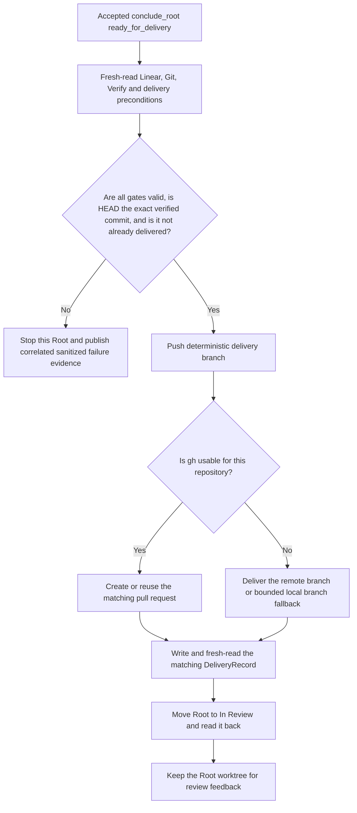

# Git Worktree与Root交付

状态：目标架构提案。Symphony只接受Git repository；一个Root对应一个deterministic branch和worktree。

## 1. 固定模型

```text
Linear Root
  -> symphony/runs/<root-identifier-lower> branch
  -> <conductor-data-root>/worktrees/<root-issue-id> worktree
  -> all Cycle Work Nodes edit the same worktree
  -> latest Cycle Verify Node
  -> PR when gh is usable, otherwise branch delivery
```

不存在非Git目录模式、per-Leaf branch/worktree或把修改复制回普通目录。

## 2. Repository Context

Conductor Binding保存用户选择的local Git repository和base branch。Conductor启动时验证repository
identity、Git binary、base branch、deterministic run branch和worktree identity。原工作目录中的
未提交修改不进入Root worktree，也不被Conductor清理或覆盖。

Branch和worktree名称只从稳定Root identity推导，不使用Issue title、Comment或Agent输出：

```text
branch:   symphony/runs/<root-identifier-lower>
worktree: <conductor-data-root>/worktrees/<root-issue-id>
```

## 3. Agent integration边界

Work turn对workspace的权限、Work Result提交、Verify和delivery eligibility只由
[Performer Stage Contracts](stage-orchestration.md)定义。

本文只补充Git所有权：Conductor拥有branch/worktree lifecycle、checks、commit、push、PR和delivery；
Performer不能commit、修改Git topology、push、调用`gh`或执行delivery。

## 4. 创建与恢复

首次claim Root时，Conductor验证repository/base branch并创建或验证deterministic branch/worktree。branch identity由
Root identity和固定命名规则重新计算并向Git read-back，不写入第二份Linear branch状态。Crash/restart复用matching
worktree，保留未提交修改；identity冲突使matching Root fail closed并写Linear timeline，不得reset/clean猜测恢复。

## 5. In Review之后

Root In Review表示代码已经以PR或branch交付。只有用户或外部SCM/Linear automation把Root置为Done。

Root/Work内容没有变化时不继续修改branch。外部review changes、新工作或verified HEAD失效作为下一份Root delta；
Root Reconciler决定保持状态、回到In Progress、创建Cycle、重新Plan或请求Human Action。若directive继续执行，仍
复用同一branch/worktree，并在matching Cycle中完成Plan、审批、Work和Verify后重新delivery。

Done/Canceled Root不能由Conductor自动重开；保持terminal、重开或修复必须来自Root Reconciler directive。

### 5.1 REVIEW后的自动SHIP

Root Reconciler在terminal Cycle的`CycleOutcome` read-back后执行Root REVIEW。全部Root acceptance和delivery
eligibility都有fresh evidence，且用户没有明示禁止自动交付时，它返回
`conclude_root(conclusion=ready_for_delivery)`；自动SHIP是默认行为，不需要人工二次确认。用户明示要求manual
delivery，或交付需要无法由现有事实安全决定的人类判断时，Reconciler必须先选择matching Root Human Action或`wait`，
不能返回`conclude_root`后再让Conductor猜测用户意图。

Conductor只机械执行accepted `conclude_root`，不解释review summary、不执行模型生成的Git command，也不让模型决定
commit数量或改写history。用于Verify的immutable target commit已在Verify调用前通过`GitWorkspaceInterface`机械准备并
read-back。SHIP从fresh Git、Linear、matching Plan/Verify和directive preconditions重新验证eligible revision；交付对象
必须正是Verify绑定的commit，不能在SHIP中创建新commit或改变已验证内容。push/PR操作属于`RootDeliveryInterface`
实现，不进入prompt output。



任一步失败都保持Root未交付或停在可证明的部分事实边界，输出correlated sanitized failure，并在恢复时从Git和Linear
read-back判断缺少的机械步骤。只有matching `DeliveryRecord`和Root `In Review`都read-back后SHIP才完成；PR交付时record
必须引用已创建或复用的matching PR。`DeliveryRecord`是现有交付managed fact，不再增加另一种Delivery Receipt、queue、
checkpoint或模型状态。

## 6. Cleanup

cleanup不是Root完成条件。只有Root Done/Canceled或用户明确请求，且没有live process或writer、
worktree identity完全匹配、没有未提交/未push/未交付修改时才能删除。任何证明不足都停止并显示原因。

## 7. 不变量

1. Symphony只处理Git repository。
2. 一个Root只有一个deterministic branch和worktree。
3. Stage retry和successor Cycle不创建第二branch/worktree。
4. Performer不能直接修改Git topology或delivery。
5. Conductor在Verify前准备immutable target commit；accepted `conclude_root`后只交付并read-back该exact commit。
6. Verify通过前不交付；Root不自动Done。
7. Git、Linear和matching `DeliveryRecord`足以重建代码/交付状态；不保存第二种Delivery Receipt或Leaf checkpoint。
8. Stage retry保留worktree、commits和未提交修改。
9. Verify绑定immutable target commit；验证期间HEAD变化使Result失效且禁止delivery。
10. worktree在Root `In Review`期间保留；只有Done/Canceled或满足第6节显式安全请求时才cleanup。
