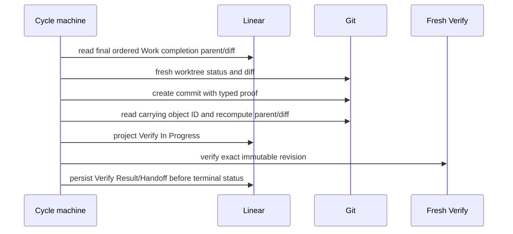
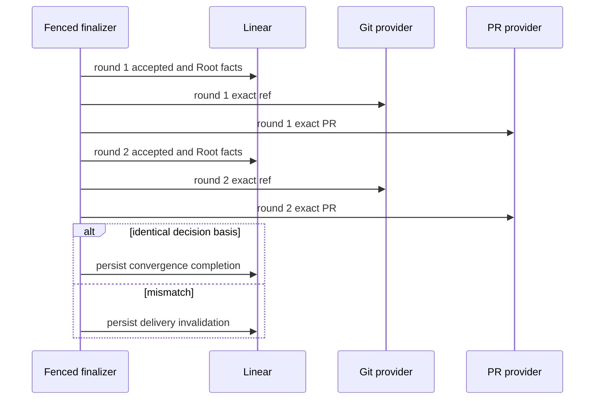

# Git Worktree and Delivery

| Status | Owns | Does not own |
|---|---|---|
| Phase 1 target | worktree、commit proof、Verify revision、remote lease、PR identity、convergence mechanics | workflow transition、failure policy |

## Git tool table

| Rule | Tool | Required input | Typed output | Forbidden effect |
|---|---|---|---|---|
| `GD-TOOL-001` | `get_status,get_diff,get_head,get_commit_proof` | exact Cycle worktree or immutable revision | fresh normalized Git facts | Task mutation、credential exposure |
| `GD-TOOL-002` | `prepare_worktree` | Cycle ID and approval base revision | exact disposable worktree identity | reuse predecessor worktree |
| `GD-TOOL-003` | `create_commit` | final Work parent/diff and closed proof | carrying commit object ID | self-referential revision trailer |
| `GD-TOOL-004` | `get_remote_ref,push_revision` | repository/ref plus expected-old revision | exact ref result and effect ambiguity | unconditional force push |
| `GD-TOOL-005` | `get_or_create_pull_request,get_pull_request` | closed repository/base/head identity | exact provider PR fact | list-then-create uniqueness claim |

## Worktree table

| Rule | Fact | Requirement | Failure behavior |
|---|---|---|---|
| `GD-WT-001` | one approved Cycle | one detached disposable worktree at deterministic owner/path and approval base | ownership/base/path mismatch fails closed |
| `GD-WT-002` | Work mutation | only current Cycle worktree is writable | other worktree/Home/user path access denied |
| `GD-WT-003` | dirty state | recoverable only when Linear Work completion chain and fresh parent/diff match | unexpected dirty state fails Cycle |
| `GD-WT-004` | terminal Cycle | exact worktree may be deleted after terminal read-back | never reset/clean/cherry-pick into successor |

## Commit and Verify

| Rule | Contract | Independent facts compared | Success fact | Failure |
|---|---|---|---|---|
| `GD-COMMIT-001` | commit input | final stable-order Work record parent/diff versus fresh worktree parent/diff | exact equality | no commit |
| `GD-COMMIT-002` | commit proof | Root/Cycle seals, Work completion-set digest, parent and diff | proof carried by commit; revision derived from object ID | proof mismatch fails closed |
| `GD-COMMIT-003` | restart commit recovery | carrying object proof and actual parent/diff versus Linear facts | unique exact HEAD | `WF-RESTART-007` or fail closed |
| `GD-VERIFY-001` | Verify dispatch | immutable exact revision and Verify `Todo` | fresh isolated context | no other revision or reused thread |
| `GD-VERIFY-002` | Verify completion | revision before/after Verify plus typed evidence | exact-revision Linear record | `WF-RESTART-008` if context is lost |

## Convergence table

| Rule | Scope | Round order | Equality requirement | Claim boundary |
|---|---|---|---|---|
| `GD-CONVERGE-001` | acceptance | Linear-only snapshot digest then separate Git revision repeat once | both rounds have identical decision basis validate expected own mutation separately | bounded stable observation, not atomic snapshot or a digest containing Git |
| `GD-CONVERGE-002` | delivery | Linear accepted/Root digest then Git remote ref then delivery PR repeat once | canonical IDs/revisions/values/states match within and across rounds | bounded stable observation, not atomic snapshot or a composed cross-provider first read |
| `GD-CONVERGE-003` | `AcceptanceConvergenceProof | DeliveryConvergenceProof` | each scope carries only its provider rounds, fixed order and stable basis digest | matching typed proof is closed and fresh-read from Linear record | no interchangeable scope or wall-clock simultaneity claim |
| `GD-CONVERGE-004` | post-proof external change | facts after the final round | no retroactive record rewrite | PR/ref review and management remain outside Phase 1 |

| Observation type | Allowed consumer | Excluded data |
|---|---|---|
| `GitSnapshot` | CycleMachine、Root acceptance | remote ref、PR |
| `RemoteRefSnapshot` | DeliveryFinalizer | PR |
| `PullRequestSnapshot` | DeliveryFinalizer | local worktree/diff |

## PR identity table

| Rule | Requirement | Provider proof | Conflict outcome |
|---|---|---|---|
| `GD-PR-001` | delivery identity is `(provider, repository_id, base_branch, head_branch)` | deterministic injective Root branch normalization | identity mismatch fails closed |
| `GD-PR-002` | at most one open PR for `(repository,base,head)` | real provider atomic create-if-absent or enforced uniqueness | capability disabled if unproven |
| `GD-PR-003` | remote update uses expected-old server-side lease | absent ref uses provider zero OID; present ref uses exact observed revision | lease rejection is `conflict_observed`, never retried |
| `GD-PR-004` | Verify、accepted record、pushed ref and PR head use one revision | exact fresh reads | any mismatch uses `WF-FAIL-011` |
| `GD-PR-005` | closed/merged/multiple/wrong-identity PR | no replacement or winner selection | permanent delivery failure |

## Delivery table

| Rule | Step | Preconditions | Durable result | Restart behavior |
|---|---|---|---|---|
| `GD-DELIVERY-001` | authorize | valid accepted Cycle record, `Succeeded` projection, exact revision and `AcceptanceConvergenceProof` | closed delivery tuple | no transcript/cache authority |
| `GD-DELIVERY-002` | push and PR | expected-old lease and `GD-PR-002` provider capability | exact remote ref and unique PR | fresh exact read resolves unknown effect |
| `GD-DELIVERY-003` | project Root | accepted Cycle record and delivery effects exact | Root `In Review` fresh read-back under `WF-TR-002` | continue same fenced finalizer; restart uses `WF-RESTART-013` |
| `GD-DELIVERY-004` | prove delivery | `GD-CONVERGE-002` two-round exact match | Root-attached `DeliveryCompletionRecord` containing `DeliveryConvergenceProof` | `WF-RESTART-009` |
| `GD-DELIVERY-005` | invalidate delivery | any convergence mismatch、slot conflict or external `Done` before completion | Root-attached `DeliveryInvalidationRecord` | `WF-RESTART-014`; project `Failed` unless Root already external `Done` |
| `GD-DELIVERY-006` | delivery-side cleanup proof | no delivery obligation or valid delivery completion/invalidation record | delivery gap is closed for `CO-CLEAN-001` | global cleanup eligibility remains Conductor-owned never infer from Root status or memory receipt |

| Delivery boundary | Allowed | Forbidden |
|---|---|---|
| Root Reconcill | semantic acceptance under `RR-ACCEPT-*` | mechanical delivery effect |
| Delivery finalizer | accepted-record delivery mechanics | Root model turn、`CycleInvalidationRecord` authorization、automatic merge、Root `Done` projection |

## Explicit non-goals

| Rule | Non-goal | Reason |
|---|---|---|
| `GD-NON-001` | cross-provider atomic snapshot | Linear/Git/PR providers expose no shared transaction or fence |
| `GD-NON-002` | unconditional force push or automatic conflict repair | would overwrite external facts |
| `GD-NON-003` | replacement/reopened PR and automatic redelivery | would add unapproved retry policy |
| `GD-NON-004` | automatic merge、PR review/rejection handling | outside Phase 1 product boundary |
| `GD-NON-005` | fallback provider、alternate branch、compatibility/migration path | hard-cut architecture only |
