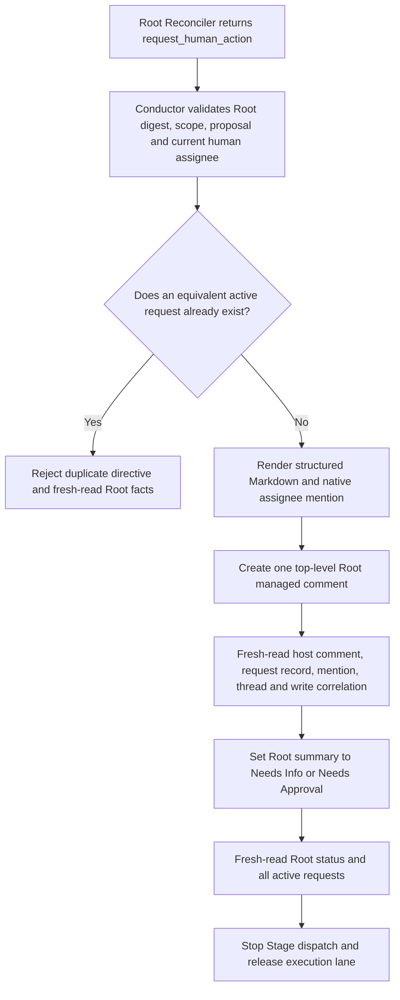
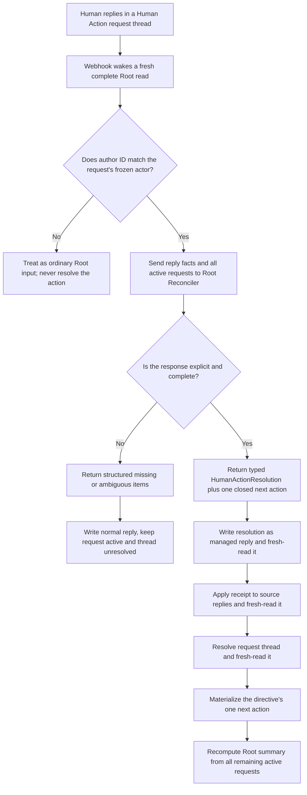

# Root Human Action Comment交互与恢复

状态：目标架构提案。本文是Human Action Comment、用户交互、并发active requests、resolution和恢复语义的唯一
事实源。Human Action不再是Linear Issue。Root/Cycle后续语义与materialization由
[Root Reconciliation](root-reconciliation.md)控制，cross-process closed schema由
[契约与接口边界](contracts.md)控制。

## 1. 决定与目标

Human Action使用Root Issue下的特殊managed comment thread承载。每个request是一条Root顶层comment，也是该次交互
唯一thread root；用户在同一thread回复，Symphony在同一thread写resolution或继续追问。这样用户始终在Root页面完成
审批、拒绝、补充信息、权限决定、Finding waiver和convergence override，不需要进入额外Sub-issue或修改专用status。

去掉的是Human Action Issue，不是Human Action的typed durable facts：

- `HumanActionRequestRecord`仍是每次请求的immutable authority；
- `HumanActionResolutionRecord`仍是一次terminal语义结果的immutable authority；
- visible Markdown、native thread state、reaction和Root waiting status都不能替代上述records；
- 用户只写普通Markdown reply，不输入JSON、command、action ID、digest或机器字段；
- Human Action只能由Root Reconciler返回的accepted `request_human_action` directive产生；Conductor、Plan、Work、Verify、
  E2E和timeline subscriber都不能自行创建。

Human Action覆盖：

- Plan review批准或拒绝；
- DEFINE或执行中的结构化补充信息；
- 授予或拒绝精确权限；
- Finding waiver；
- convergence override；
- 用户改变目标、scope、交付或执行要求后的确认与恢复。

## 2. Root assignee与响应权限

Root必须同时满足两个不同的原生Linear事实：

- `delegate_id`指向Symphony actor，授权Symphony执行Root；
- `assignee_user_id`指向一个natural human，作为Human Action的通知和响应主体。

两者不能互相替代。Podium完整Root读取和Root header必须提供closed assignee snapshot，包括stable user ID、actor kind和
用于展示的bounded display value。没有natural human assignee的Root不能成功admit；Conductor不能把Symphony actor、
unknown actor、comment author、Project member或最近回复者猜成assignee。

创建Human Action时，Conductor从accepted directive所基于的fresh Root version冻结当前
`requested_actor_user_id`，并通过Linear支持的mention rendering在visible Markdown中`@mention`该用户。mention只负责
通知和可读性；授权始终由record中的stable user ID和fresh reply author identity证明，不能从显示名或`@text`解析。

只有matching `requested_actor_user_id`创建的human reply可以形成human resolution。其他human在thread中的回复仍是普通
Root input，可以收到说明，但不能批准、拒绝、回答或取消该request。Root assignee变化是fresh Root fact和execution
barrier；Root Reconciler必须用typed `superseded` resolution关闭仍指向旧assignee的active requests，再按需要为新
assignee产生fresh requests。Conductor不得静默改写request actor或让新旧assignee共享一个审批窗口。

## 3. Comment与并发模型

一个Root可以同时拥有多个active Human Action Comment threads。每个thread必须有不同的`action_id`，并独立绑定：

```text
HumanActionRequestComment
  host: Root Issue top-level comment
  body: user Markdown + exactly one HumanActionRequestRecord json block
  thread_root_comment_id: its own Linear comment ID after read-back
  requested actor: frozen Root natural-human assignee
  replies: ordinary human comments
  terminal Symphony reply: HumanActionResolutionComment
```

## 4. 状态模型

active状态只从fresh Linear facts派生：存在一个valid request record，且不存在matching valid resolution record。native
thread `unresolved`是active request的必需一致性事实，但不是active authority；用户手工resolve thread不能批准或取消请求。
Conductor fresh read发现active request的thread被手工resolve时，把该thread-state revision交给Root Reconciler；matching
directive必须解释并reopen或terminalize该request，不能把close动作猜成同意。

多个active requests可以属于不同action kind或scope，但不得重复同一`action_kind + scope + proposal_digest`。每条
request独立回答、resolution和resolve；一个reply不能同时解决两个threads。Root Reconciler一个turn仍只返回一个closed
action，但`human_action_resolutions[]`可以同时terminalize本轮facts支持的多个requests。

Root waiting status只是全部active requests的header summary：

```text
one or more active clarification requests -> Root Needs Info
otherwise one or more active requests     -> Root Needs Approval
no active requests                        -> Root status follows the accepted next directive
```

`Needs Info`优先于`Needs Approval`只为让单一Root status确定化，不表达Action优先级或resolution。存在任何active request
时，该Root不dispatch新的Stage turn；Root Reconciler仍可处理reply、assignee变化、Root revision和其他pending inputs。

## 5. DEFINE批量提问规则

DEFINE不得采用“一次问一个问题、收到回答后再问下一个已知问题”的对话方式。Root Reconciler在请求clarification前必须
一次检查objective、included scope、excluded scope、constraints、acceptance criteria、verification requirements和delivery
instruction，把当前facts下所有可识别的缺失、冲突和必须由用户选择的内容合并为一个结构化question set。

```text
DefineQuestion
  question_id
  category:
    objective | included_scope | excluded_scope | constraint |
    acceptance | verification | delivery
  question
  why_needed
  answer_format
  choices[]
  required
```

`question_id`在该request内唯一且稳定；`choices[]`只在确有closed options时使用，不能用伪选项限制用户原始意图。
`answer_format`是给人的简短提示，不是parser grammar。所有当前已知问题必须在同一个clarification request中，按category
分组并编号。Root Reconciler不能为了减少单次输出、节省token或维持对话而故意延后已知问题。

用户可以用一个reply回答全部问题，也可以在同一thread追加reply。只有全部required `question_id`都有明确、互不冲突的
回答时，Root Reconciler才能形成`answered` resolution；partial reply只得到结构化缺项说明，原request保持active，不能
为剩余旧问题创建新Human Action。旧request resolved后，只有新用户事实、repository evidence或回答本身暴露了此前
不可知的新缺口，才允许创建新的clarification request；新request必须引用新缺口evidence，不能重复已回答问题。

## 6. Visible Markdown contract

Conductor从closed directive和fresh assignee snapshot确定性渲染comment。Root Reconciler提供结构化内容，不输出任意
mention syntax、HTML、machine IDs或managed JSON。clarification request使用以下用户层：

````markdown
@<Root assignee>

# 需要你补充信息

<一句话说明为什么当前Root暂时不能继续>

## 相关范围
- Root: <Linear link>
- Cycle / Plan / Work / Verify: <只列matching links>

## 请一次回答以下问题

### Q1 · <category>
**问题**：<question>

**为什么需要**：<why_needed>

**建议回答方式**：<answer_format>

**可选项**：<只有closed choices存在时显示>

### Q2 · <category>
...

## 如何回复
请直接在这个comment thread中回复，并保留`Q1`、`Q2`编号。你不需要修改Root status或输入任何机器字段。

## 回复之后
Symphony会一次检查全部回答；仍缺少内容时会在本thread列出未回答的问题，不会为同一批问题重复创建comment。

```json
{"kind":"human_action_request","version":1,"action_id":"..."}
```
````

approval、permission、finding waiver和convergence override使用同一整体结构，但把“请一次回答以下问题”替换为精确
proposal、evidence/risk、closed options和reply要求。每种option必须说明接受后的边界；有条件批准应回复reject/deny并
写明条件，由Root Reconciler产生fresh proposal，不能把附加条件偷偷并入approved outcome。

Markdown必须短、可扫描、无空section，并在唯一`json` block前结束。不得包含secret、raw reasoning、Provider transcript、
Git command、内部path或要求用户读取另一个workflow文档。内容超过bound时，Root Reconciler必须合并重复问题和缩小
上下文，但不能丢弃required问题；仍超限则directive fail closed。

## 7. Durable records

### 7.1 HumanActionRequestRecord

```text
HumanActionRequestRecord
  kind: human_action_request
  version
  action_id
  root_issue_id
  scope_kind: root | cycle
  cycle_issue_id?
  action_kind:
    plan_review | clarification | permission |
    finding_waiver | convergence_override
  related_issue_ids[]
  source_root_directive_id?
  source_root_convergence_record_id?
  based_on_root_digest
  proposal_digest
  requested_actor_user_id
  requested_actor_root_version
  title
  description
  requested_decision?
  options[]
  questions[]
  evidence_refs[]
  created_at
```

record位于request comment的唯一strict `json` block。host `comment_id`、remote version、thread root identity和stable
write correlation来自fresh outer Linear comment snapshot，不预填进创建前的record，也不复制为第二份identity。
`clarification`必须有非空`questions[]`且不使用decision options；其他action kind必须有明确
`requested_decision + options[]`，只有确需附带解释的问题才允许questions。所有variants都要求human reply；删除旧的
`comment_required`开关。

### 7.2 HumanActionResolutionRecord

```text
HumanActionResolutionRecord
  kind: human_action_resolution
  version
  resolution_id
  action_id
  root_issue_id
  request_comment_id
  request_comment_remote_version
  action_kind
  outcome:
    approved | rejected | answered | canceled |
    granted | denied | waived |
    override_applied | override_rejected | superseded
  proposal_digest
  source:
    HumanReplyResolutionSource
      responder_user_id
      reply_comment_ids[]
      reply_body_digests[]
      normalized_answers[]
        question_id
        bounded_answer
        source_comment_ids[]
    | SupersededResolutionSource
      reason: assignee_changed | root_revised | target_terminal | proposal_replaced
      evidence_refs[]
  source_root_directive_id
  resolved_at
```

human source要求所有reply都属于matching request thread、author kind为human且stable user ID等于request冻结的actor。
`normalized_answers[]`只用于clarification且必须覆盖全部required question IDs；它是Root Reconciler基于引用reply形成的
bounded结构化结果，不替代原始human comments。Conductor验证identity、coverage、proposal digest、source versions和
无既有resolution，但不解释自然语言。

`superseded`只能由Root Reconciler基于fresh assignee/Root/target/proposal facts产生，不能伪装成人类决定。一个action
最多一个resolution。resolution record位于同一request thread中的Symphony managed reply；其outer comment identity在
create/read-back后获得。

## 8. Request materialization



Cycle-scoped requests still live on the Root comment surface; `cycle_issue_id` and `related_issue_ids[]` preserve exact context.
Conductor does not create Cycle comments, relations, child Issues, labels or archive facts for Human Action. Any required create,
status or comment read-back failure stops that Root and resumes from the same deterministic action/write IDs after fresh Linear read.

## 9. Reply、resolution与继续执行



一个turn可以消费同一request的多个reply，也可以resolution多个独立requests；每个source input仍必须出现在
`consumed_input_ids[]`，每个resolution必须独立引用自己的thread和source replies。resolution成功路径不再额外创建一条
`RootReconcilerReplyRecord`回复同一source input：同thread的HumanActionResolutionComment就是该输入的用户可见typed
reply。partial、ambiguous、unauthorized或普通讨论仍使用现有Root Reconciler reply contract。

固定materialization顺序是resolution reply create/read-back、source reply receipt read-back、request thread resolve
read-back、business action materialization、Root summary recompute/read-back。任一步失败都从Linear current facts识别同一
directive尚缺的步骤继续；不能回滚已read-back的resolution、生成替代resolution或再次调用模型猜测结果。

## 10. Action kind与结果规则

- `plan_review`：`approved`无条件接受exact proposal digest；`rejected`必须有明确reason。带条件同意按rejected处理。
- `clarification`：只有全部required questions有明确回答时才`answered`；partial answer保持active。
- `permission`：`granted`只覆盖request中的resource、operation、scope和有效边界；`denied`不产生capability。
- `finding_waiver`：`waived`必须明确matching Finding和风险；拒绝使用`denied`。
- `convergence_override`：`override_applied`只覆盖request中的exact gate proposal；拒绝使用`override_rejected`。
- `canceled`：requested actor明确表示本次请求不再处理，不等于reject、deny或answer。
- `superseded`：仅用于fresh facts证明旧request已失效，不是human choice。

Root Reconciler决定resolution之后的replan、DAG mutation、rerun、successor、wait或terminal handling。Conductor不能
硬编码approved后执行Work、rejected后replan或answered后继续Plan，但仍机械验证Plan Contract、permission、budget、
convergence、Git和directive preconditions。

## 11. Edit、delete、resolve、reopen与恢复

- human reply新body digest是新的pending input；已经accepted的resolution不会因reply edit/delete自动回滚；
- request comment由Symphony创建且immutable；缺失、被编辑、重复record或schema-invalid时形成mechanical violation；
- 用户手工resolve active request thread不形成resolution；Root Reconciler可以解释并reopen；
- 用户reopen已resolved request不撤销immutable resolution；若表达新意图，Root Reconciler回复说明并按需产生fresh action；
- reaction只表示matching reply是否被采纳，不是approval、rejection、answer或cancel按钮；
- duplicate/stale resolution、旧proposal digest、错误thread、非matching actor和不完整question coverage全部fail closed；
- complete Root read必须包含全部Human Action request/resolution comments和thread replies，无论resolved或unresolved；
- restart只从Root comments、outer comment versions、managed records、Root status和accepted directives恢复，不保存本地
  action table、comment cursor、poll checkpoint或Provider transcript。

## 12. Hard cut删除边界

实现按一个原子hard cut替换，不做migration、dual-read、dual-write、adapter、feature flag、fallback或旧数据修复：

- 删除`human_action` Issue kind、`HumanActionIssueSnapshot`和所有Action Issue create/read/materializer；
- 删除`Human Action`、`Plan Review`、`Clarification`、`Permission`、`Finding Waiver`、`Convergence Override` labels；
- 删除Action专用`Approved`、`Rejected`、`Answered` lifecycle与Project status要求；
- 删除Action parent/relation/archive/restore/status parser、guards、fixtures和E2E操作；
- closed schemas和generated types直接替换`action_issue_id`、`terminal_status`、`terminal_remote_version`等Issue字段；
- production readers只识别Root-hosted request/resolution managed comments；没有旧Issue fallback或HTML/Markdown marker；
- 含旧Human Action Issue/record的既有Root不迁移、不自动转换，按unsupported target fact fail closed；部署前由operator在
  专用Project执行明确reset或使用fresh Project，产品代码不内置迁移路径。

## 13. 不变量

1. Human Action不是Issue、DAG node、timeline event、workflow status或Desktop object。
2. 每个Human Action request是Root顶层special managed comment和唯一thread root。
3. 一个Root可以有多个active requests；每个独立identity、scope、actor、reply和resolution。
4. Human Action只能由Root Reconciler的accepted `request_human_action` directive产生。
5. DEFINE必须一次提出当前可知的全部结构化问题；partial answer继续同一thread。
6. natural human Root assignee是冻结响应人；mention不拥有授权语义。
7. active/resolved由request/resolution records派生；thread state、reaction和Root status都不是Action lifecycle。
8. Root `Needs Info`/`Needs Approval`只汇总active requests，不能替代逐Action事实。
9. 用户只回复普通Markdown；Root Reconciler解释语义，Conductor验证closed identity和preconditions。
10. 所有request、resolution、reply、receipt、thread和Root status写入必须fresh read-back后才能推进。
11. 不存在Human Action Issue兼容reader、迁移器、dual contract或runtime fallback。
