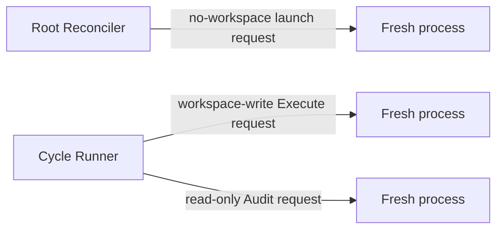

# Performer

| Status | Owns | Does not own |
|---|---|---|
| target proposal | mechanical Agent CLI launch, process lifecycle, and bounded final-response capture | prompts, role semantics, Linear, routing, normalization, or trust |

Performer is deliberately a thin command-line wrapper. It receives a complete
launch request, starts exactly one fresh Agent process, always captures process
facts, and captures one bounded final Markdown response only when requested. It
does not know what a Root, Cycle, Execute, Audit, or successful task means.

## Launch contract

```text
PerformerLaunchRequest {
  agent: codex,
  model?,
  reasoning_effort?,
  prompt,
  working_directory,
  sandbox: no_workspace | read_only | workspace_write,
  final_response_path?,
  diagnostic_jsonl_path?,
  diagnostic_stderr_path?,
  timeout
}

PerformerProcessResult {
  launch_status: exited | timed_out | start_failed | interrupted,
  exit_code?,
  duration_ms,
  final_response_ref?,
  diagnostic_jsonl_ref?,
  diagnostic_stderr_ref?,
  thread_id?,
  token_usage?: {
    input_tokens,
    output_tokens,
    total_tokens,
    cached_input_tokens?,
    cache_write_input_tokens?,
    reasoning_output_tokens?
  },
  sanitized_reason?
}
```

| Rule | Required behavior | Forbidden behavior |
|---|---|---|
| `PF-LAUNCH-001` | start one new process/session for every request | resume or share a prior conversation |
| `PF-LAUNCH-002` | map the selected Agent to its CLI and pass supplied model, prompt, working directory, and sandbox mechanically | compose or enrich role prompts |
| `PF-LAUNCH-003` | always capture process facts; capture one bounded final Markdown response only at an optional supplied path | require or expose a complete trajectory |
| `PF-LAUNCH-004` | apply timeout, cancellation, and bounded stream handling | indefinite hidden retry |
| `PF-LAUNCH-005` | sanitize errors and exclude credentials from returned values and logs | expose environment values or authorization data |
| `PF-LAUNCH-006` | when supplied, retain bounded raw JSONL, stderr, and error context at private local paths and mechanically index `thread_id` | make diagnostic content a role input or semantic result |

The caller owns prompt construction, semantic parsing, and validation. Root
Reconciler supplies a final-response path for its own decision parser. Cycle
Runner supplies `cycle-NNN-executor-result.md` and
`cycle-NNN-audit-result.md` paths and asks both roles to finish with Markdown.
The Execute Markdown is captured only for exact terminal description projection and is
untrusted; it is not parsed or supplied to Audit. The Audit Markdown is parsed
once by Cycle Runner as the sole semantic result, then serialized and re-read
as the private `cycle-NNN-audit-result.json` progression file. A missing,
unreadable, or invalid response is a process error; Performer never starts a
second summarization or format-repair process. A zero exit code is only a
process fact; it is never a Cycle success decision. Raw Agent streams are a
separate diagnostic capture, not a final response or semantic output.

When Codex emits a terminal `turn.completed` JSONL event with valid numeric
usage, Performer returns the last event's cumulative input and output counts as
non-semantic process facts. `total_tokens` is only the mechanically verified
safe sum of those two counts; it is omitted, together with the whole usage
object, when either required count is missing or the sum is unsafe. Cached input,
cache-write input, and reasoning output counters are returned only when the
provider supplies valid values and are not added again to the total.

API keys and base URLs are resolved at startup and passed only to the owning
role process. They are not part of `PerformerLaunchRequest`,
`HarnessRunRequest`, or any Linear projection. An omitted model or reasoning
override is left to the user's local Codex configuration and authentication.

## Private diagnostic evidence

When the caller supplies diagnostic paths under the external run directory,
Performer retains the bounded raw Agent JSONL and stderr bytes, plus causal
error context for launch, stream, timeout, and exit failures. It writes these
files with private local permissions (0600) and returns only local references,
the first mechanically recognized `thread.started` `thread_id`, and the bounded
usage facts described above. Unknown or malformed JSONL is retained unchanged;
only recognized usage fields are interpreted, and never as workflow input.

Diagnostic references and `thread_id` are local-only implementation values.
They are never supplied to the Audit prompt, Root Reconcile, or Linear
descriptions/comments,
and are not used for routing, trust, restart, or publication. The caller owns
retention and deletion of the external run directory; Performer does not upload
or silently discard this evidence after a bounded visible failure. The public
reason field contains only the current message's first 50 characters; it adds no
prefix and does not traverse `cause`.

## Session and permission topology



| Rule | Caller role | Session | Workspace sandbox | Excluded context |
|---|---|---|---|---|
| `PF-SESSION-001` | Root Reconcile | fresh process for each decision using the Execute role configuration | no workspace mount or tools | workspace facts and Execute/Audit transcripts |
| `PF-SESSION-002` | Execute | one fresh process per Cycle | workspace-write | Reconcile transcript, prior Cycle transcripts, and Audit history |
| `PF-SESSION-003` | Audit | a distinct fresh process after Execute terminates | read-only | Execute transcript, hidden state, and prior Audit history |
| `PF-PERM-001` | every process | only the configured workspace and role sandbox | supplied by the caller, not inferred by Performer | Linear capability |
| `PF-PERM-002` | every process | no secrets by default | explicit allowlist only when the frozen task boundary requires it | `.env*`, keychains, tokens, credential stores |

Performer does not enforce workflow order. Conductor and Cycle Runner ensure that
Audit starts only after Execute is terminal and that a failed Execute still gets
an Audit attempt.

## Boundary ownership

| Concern | Owner |
|---|---|
| Reconcile prompt and decision schema | Root Reconciler |
| Execute and Audit prompts | Cycle Runner |
| Cycle result interpretation | Cycle Runner |
| trusted Root State promotion | Conductor's fixed `accepted`-Audit update |
| Linear Issue, exact role-description/Root-description/Cycle-comment projections, and typed Audit JSON file projection | private rendering helpers behind Linear Gateway calls |
| raw process start, stop, bounded final response, exit code, duration, and provider token facts | Performer |

`--agent` selects one thin CLI adapter for the complete Root run and defaults to
`codex`. V1's closed `AgentKind` contains only `codex`; a future value may add
another thin adapter without changing Root Reconciler or Cycle Runner. Execute
and Audit still have independent startup credentials, base URLs, model values,
and reasoning-effort values. There is no dynamic per-Cycle routing, plugin
discovery, registry, compatibility alias, or cross-role transcript.

Performer never constructs, truncates, repairs, or interprets a prompt. Root
Reconciler owns the Manager prompt; Cycle Runner owns the frozen Execute and
Audit prompts and their bounded context selection.

Complete trajectories are outside the semantic architecture. Raw bounded Agent
streams may be retained only as the private local diagnostic evidence described
above; no caller may treat them as a required role result, and they are never
uploaded to Linear or used for routing, trust, restart, or publication.

The Executor's human-readable report uses `## Summary`, `## File Changes` with
`### Created`, `### Updated`, and `### Deleted`, and `## Verification`. Git
porcelain markers such as `??`, `M`, or `D` are intermediate facts only and
must be translated to those semantic sections; they must never appear
verbatim in the report. The report remains untrusted display output.
