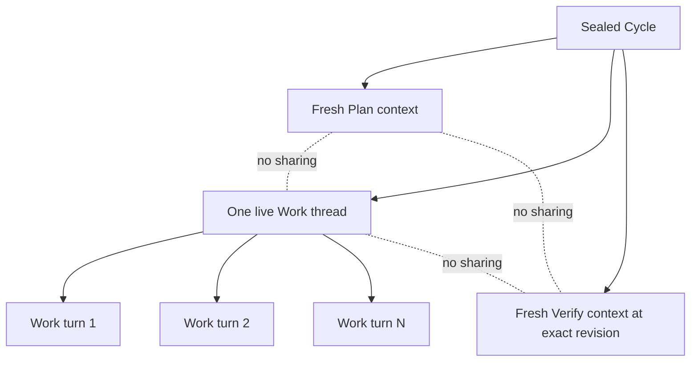

# Performer

| Status | Owns | Does not own |
|---|---|---|
| Phase 1 target | Plan/Work/Verify process、context、thread、permission、typed candidate | Stage lifecycle、persistence policy |

## Context topology

## Context authority table

| Rule | Role | Explicit input | Context lifetime | Excluded input |
|---|---|---|---|---|
| `PF-CTX-001` | Plan | sealed Cycle and Root knowledge sealed directives/groups static role contract | one fresh Plan process/thread | code write capability、sibling Stage、prior Result/Handoff |
| `PF-CTX-002` | Work | sealed Cycle specification and current Work Instruction | one Cycle-bound process/thread reused only for ordered Work turns | Plan/Verify thread、sibling Issue/Result、injected previous raw value |
| `PF-CTX-003` | Verify | sealed Cycle specification、current Verify Instruction、exact revision | one fresh process/thread | Plan/Work context、Work continuation、write capability |
| `PF-CTX-004` | every role | current role request only | never forked | Root transcript、other Cycle context、Task Manager payload |

## Thread table

| Rule | Thread fact | Allowed behavior | Forbidden behavior |
|---|---|---|---|
| `PF-THREAD-001` | all Work Items in one Cycle | sequential turns in one live Work thread following persisted order | parallel Work、Work subagent、thread fork |
| `PF-THREAD-002` | prior Work assistant turn remains in the same live thread | same live provider thread transport may carry it next Work may naturally recall it | Symphony re-injection into next user input recovery from repository、Linear、logs or saved rollout |
| `PF-THREAD-003` | Work thread is lost | host reports absence; workflow applies `WF-RESTART-003` or `WF-RESTART-004` | reconstruct or start replacement thread as continuity |
| `PF-THREAD-004` | Plan or Verify | always fresh and role-specific | reuse Work/Root/other-role thread |

## Result table

| Rule | Role | Candidate | Conductor normalization | Durable destination |
|---|---|---|---|---|
| `PF-RESULT-001` | Plan | closed Work-group order/validation candidate over sealed IDs | validate exact Work-group cover compose sealed Verify directives build identities/manifest | `WF-PERSIST-002` |
| `PF-RESULT-002` | Work | closed outcome/checks plus optional ephemeral continuation | fresh-read worktree parent/diff and build normalized handoff | `WF-PERSIST-003` |
| `PF-RESULT-003` | Verify | `passed,failed,inconclusive,canceled` plus checks/evidence at exact revision | validate revision and closed evidence | `WF-PERSIST-004` |
| `PF-RESULT-004` | any role | raw assistant/tool stream | never a workflow fact | nowhere |

| Work turn field | Allowed lifetime | Validation | Forbidden path |
|---|---|---|---|
| `completion_candidate` | current call, then normalized under `WF-PERSIST-003` | closed `WorkResult` only | raw assistant continuation |
| `ephemeral_continuation_markdown` | completed non-final Work turn in the same live thread | absent from candidate host drops it before Symphony-owned serialization | record、event、log、audit、next user input |

## Home and persistence table

| Rule | Location | Allowed data | Required setting | Forbidden data |
|---|---|---|---|---|
| `PF-HOME-001` | application `CODEX_HOME` | installation/configuration needed to start app-server | read-only to Performer | task transcript、workflow evidence |
| `PF-HOME-002` | isolated Performer Home | minimal runtime files only | every thread uses `ephemeral: true` | Codex session/rollout/SQLite turn text |
| `PF-HOME-003` | process memory | current request、live handles and allowed Work prior turns | destroyed with process/thread | durable accepted result or next action |
| `PF-HOME-004` | logs/audit | sanitized identity/correlation/digests only | no raw/reversible content | prompts、assistant text、tool payloads、E7 raw value |

## Permission table

| Rule | Role | Read | Write | Explicit denial |
|---|---|---|---|---|
| `PF-PERM-001` | Plan | sealed Task documents only | none outside scratch if required | Task Manager、user code mutation、Git delivery |
| `PF-PERM-002` | Work | current Cycle disposable worktree and closed request | that worktree only | Task Manager、other worktrees、Root Home |
| `PF-PERM-003` | Verify | exact revision and scratch | scratch only | user-code repair、Task Manager、delivery |
| `PF-PERM-004` | every role | non-sensitive allowlist | role-scoped only | `.env*`, keys, credential stores, remote auth config |
