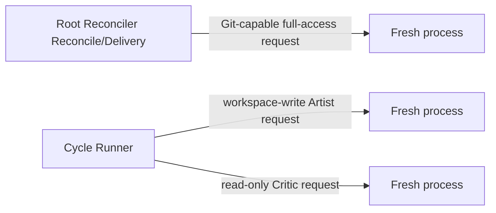

# Performer

| Status | Owns | Does not own |
|---|---|---|
| target proposal | mechanical Agent CLI launch, process lifecycle, and bounded final-response capture | prompts, role semantics, Linear, routing, normalization, or trust |

Performer is deliberately a thin command-line wrapper. It receives a complete
launch request, starts exactly one fresh Agent process, always captures process
facts, and captures one bounded final Markdown response only when requested. It
does not know what a Root, Cycle, Artist, Critic, or successful task means.

## Launch contract

```text
PerformerLaunchRequest {
  agent: codex,
  model?,
  reasoning_effort?,
  prompt,
  working_directory,
  sandbox: no_workspace | read_only | workspace_write | danger_full_access,
  final_response_path?,
  diagnostic_jsonl_path?,
  diagnostic_stderr_path?,
  timeout
}

PerformerProcessResult {
  launch_status: exited | timed_out | start_failed | interrupted,
  exit_code?,
  duration_ms,
  final_response_ref?,
  diagnostic_jsonl_ref?,
  diagnostic_stderr_ref?,
  thread_id?,
  token_usage?: {
    input_tokens,
    output_tokens,
    total_tokens,
    cached_input_tokens?,
    cache_write_input_tokens?,
    reasoning_output_tokens?
  },
  sanitized_reason?
}
```

| Rule | Required behavior | Forbidden behavior |
|---|---|---|
| `PF-LAUNCH-001` | start one new process/session for every request | resume or share a prior conversation |
| `PF-LAUNCH-002` | map the selected Agent to its CLI and pass supplied model, prompt, working directory, and sandbox mechanically | compose or enrich role prompts |
| `PF-LAUNCH-003` | always capture process facts; capture one bounded final Markdown response only at an optional supplied path | require or expose a complete trajectory |
| `PF-LAUNCH-004` | apply timeout, cancellation, and bounded stream handling | indefinite hidden retry |
| `PF-LAUNCH-005` | sanitize errors and exclude credentials from returned values and logs | expose environment values or authorization data |
| `PF-LAUNCH-006` | when supplied, retain bounded raw JSONL, stderr, and error context at private local paths and mechanically index `thread_id` | make diagnostic content a role input or semantic result |

The caller owns prompt construction, semantic parsing, and validation. Root
Reconciler supplies a final-response path for its own decision parser. Cycle
Runner supplies `cycle-NNN-artist-result.md` and
`cycle-NNN-critic-result.md` paths and asks both roles to finish with Markdown.
The Artist Markdown is captured only for exact terminal description projection and is
untrusted; it is not parsed or supplied to Critic. The Critic machine envelope
is parsed once by Cycle Runner as the sole semantic result, then the full report
is serialized once as the private `cycle-NNN-critique-result.json` progression
file and the same bytes are uploaded. A missing,
unreadable, or invalid response is a process error; Performer never starts a
second summarization or format-repair process. A zero exit code is only a
process fact; it is never a Cycle success decision. Raw Agent streams are a
separate diagnostic capture, not a final response or semantic output.

When Codex emits a terminal `turn.completed` JSONL event with valid numeric
usage, Performer returns the last event's cumulative input and output counts as
non-semantic process facts. `total_tokens` is only the mechanically verified
safe sum of those two counts; it is omitted, together with the whole usage
object, when either required count is missing or the sum is unsafe. Cached input,
cache-write input, and reasoning output counters are returned only when the
provider supplies valid values and are not added again to the total.

API keys and base URLs are resolved at startup and passed only to the owning
role process. They are not part of `PerformerLaunchRequest`,
`HarnessRunRequest`, or any Linear projection. An omitted model or reasoning
override is left to the user's local Codex configuration and authentication.
The caller supplies the role's own agent, model, and reasoning values; Reconcile
does not inherit Artist settings. API keys and base URLs are resolved by the
Conductor backend environment and never enter this request.

## Private diagnostic evidence

When the caller supplies diagnostic paths under the external run directory,
Performer retains the bounded raw Agent JSONL and stderr bytes, plus causal
error context for launch, stream, timeout, and exit failures. It writes these
files with private local permissions (0600) and returns only local references,
the first mechanically recognized `thread.started` `thread_id`, and the bounded
usage facts described above. Unknown or malformed JSONL is retained unchanged;
only recognized usage fields are interpreted, and never as workflow input.

Diagnostic references and `thread_id` are local-only implementation values.
They are never supplied to the Critic prompt, Root Reconcile, or Linear
descriptions/comments,
and are not used for routing, trust, restart, or publication. The caller owns
retention and deletion of the external run directory; Performer does not upload
or silently discard this evidence after a bounded visible failure. The public
reason field contains only the current message's first 50 characters; it adds no
prefix and does not traverse `cause`.

## Session and permission topology



| Rule | Caller role | Session | Workspace sandbox | Excluded context |
|---|---|---|---|---|
| `PF-SESSION-001` | Root Reconcile/Delivery | fresh process per semantic decision with independent role configuration | danger-full-access for final Git/`gh`; Prepare skips Performer | Artist transcript and Cycle DAG |
| `PF-SESSION-002` | Artist | one fresh process per Cycle | workspace-write | Reconcile transcript, prior Cycle transcripts, and Critic history |
| `PF-SESSION-003` | Critic | a distinct fresh process after Artist terminates | read-only | Artist transcript, hidden state, and prior Critic history |
| `PF-PERM-001` | every process | only the configured workspace and role sandbox | supplied by the caller, not inferred by Performer | Linear capability |
| `PF-PERM-002` | every process | no secrets by default | explicit allowlist only when the frozen task boundary requires it | `.env*`, keychains, tokens, credential stores |
| `PF-PERM-003` | Root Reconcile/Delivery only | Delivery | danger-full-access permits Git, push, and `gh` | Prepare uses bounded direct Git/filesystem operations; Artist/Critic never receive it |

Performer does not enforce workflow order. Conductor and Cycle Runner ensure that
Critic starts only after Artist is terminal and that a failed Artist still gets
an Critic attempt.

## Boundary ownership

| Concern | Owner |
|---|---|
| Reconcile prompt and decision schema | dedicated Root Reconcile Prompt module and Root Reconciler |
| Artist prompt | dedicated Artist Prompt module called by Cycle Runner |
| Critic prompt | dedicated Critic Prompt module called by Cycle Runner |
| Cycle result interpretation | Cycle Runner |
| trusted Root State promotion | Conductor's fixed `accepted`-Critic update |
| Linear Issue, exact role-description/Root-description/Cycle-comment projections, and typed Critique JSON file projection | private rendering helpers behind Linear Gateway calls |
| raw process start, stop, bounded final response, exit code, duration, and provider token facts | Performer |

Each role uses the fixed thin Codex CLI adapter; omitted `*_agent` values default
to `codex` and no catalog or discovery layer exists. Reconcile, Artist, and
Critic retain independent startup credentials,
base URLs, model values, and reasoning-effort values. There is no dynamic
per-Cycle routing, plugin discovery, registry, compatibility alias, or
cross-role transcript.

Performer never constructs, truncates, repairs, or interprets a prompt. Root
Reconcile, Artist, and Critic each have a dedicated role Prompt module. Root
Reconciler and Cycle Runner supply those modules' bounded inputs and remain the
only callers that launch the resulting prompts.

Complete trajectories are outside the semantic architecture. Raw bounded Agent
streams may be retained only as the private local diagnostic evidence described
above; no caller may treat them as a required role result, and they are never
uploaded to Linear or used for routing, trust, restart, or publication.

The Artist's human-readable report describes actual created, updated, and
deleted files plus verification without a machine-parsed heading schema. Git
porcelain markers such as `??`, `M`, or `D` are intermediate facts only and
must be translated to human language rather than copied verbatim. The report
remains untrusted display output.
