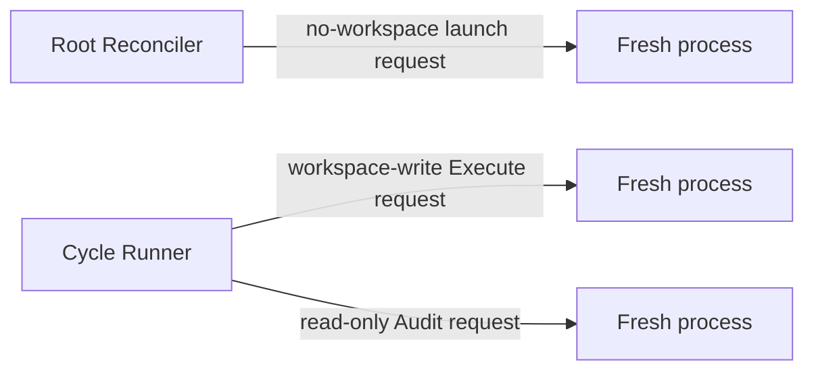

# Performer

| Status | Owns | Does not own |
|---|---|---|
| target proposal | mechanical Agent CLI launch, process lifecycle, and bounded final-response capture | prompts, role semantics, Linear, routing, normalization, or trust |

Performer is deliberately a thin command-line wrapper. It receives a complete
launch request, starts exactly one fresh Agent process, always captures process
facts, and captures one bounded final response only when requested. It does not
know what a Root, Cycle, Execute, Audit, or successful task means.

## Launch contract

```text
PerformerLaunchRequest {
  agent: codex,
  model,
  reasoning_effort,
  prompt,
  working_directory,
  sandbox: no_workspace | read_only | workspace_write,
  final_response_path?,
  timeout
}

PerformerProcessResult {
  launch_status: exited | timed_out | start_failed | interrupted,
  exit_code?,
  duration_ms,
  final_response_ref?,
  sanitized_reason?
}
```

| Rule | Required behavior | Forbidden behavior |
|---|---|---|
| `PF-LAUNCH-001` | start one new process/session for every request | resume or share a prior conversation |
| `PF-LAUNCH-002` | map the selected Agent to its CLI and pass supplied model, prompt, working directory, and sandbox mechanically | compose or enrich role prompts |
| `PF-LAUNCH-003` | always capture process facts; capture one bounded final response only at an optional supplied path | require or expose a complete trajectory |
| `PF-LAUNCH-004` | apply timeout, cancellation, and bounded stream handling | indefinite hidden retry |
| `PF-LAUNCH-005` | sanitize errors and exclude credentials from returned values and logs | expose environment values or authorization data |

The caller owns semantic parsing and validation. Root Reconciler and Audit
launches supply a final-response path for their required parsers. Execute does
not supply one, so its response content is not captured, parsed, or projected.
A zero exit code is only a process fact; it is never a Cycle success decision.

## Session and permission topology



| Rule | Caller role | Session | Workspace sandbox | Excluded context |
|---|---|---|---|---|
| `PF-SESSION-001` | Root Reconcile | fresh process for each decision | no workspace mount or tools | workspace facts and Execute/Audit transcripts |
| `PF-SESSION-002` | Execute | one fresh process per Cycle | workspace-write | Reconcile transcript, prior Cycle transcripts, and Audit history |
| `PF-SESSION-003` | Audit | a distinct fresh process after Execute terminates | read-only | Execute transcript, hidden state, and prior Audit history |
| `PF-PERM-001` | every process | only the configured workspace and role sandbox | supplied by the caller, not inferred by Performer | Linear capability |
| `PF-PERM-002` | every process | no secrets by default | explicit allowlist only when the frozen task boundary requires it | `.env*`, keychains, tokens, credential stores |

Performer does not enforce workflow order. Conductor and Cycle Runner ensure that
Audit starts only after Execute is terminal and that a failed Execute still gets
an Audit attempt.

## Boundary ownership

| Concern | Owner |
|---|---|
| Reconcile prompt and decision schema | Root Reconciler |
| Execute and Audit prompts | Cycle Runner |
| Cycle result interpretation | Cycle Runner |
| trusted Root State promotion | Conductor's fixed `accepted`-Audit update |
| Linear Issue and comment projection | private rendering helpers behind Linear Gateway calls |
| raw process start, stop, bounded final response, exit code, duration | Performer |

`--agent` selects one thin CLI adapter for the complete Root run. V1's closed
`AgentKind` contains only `codex`; a future `claude` value may add another thin
adapter without changing Root Reconciler or Cycle Runner. There is no dynamic
plugin discovery, registry, or per-role Agent selection.

Performer never constructs, truncates, repairs, or interprets a prompt. Root
Reconciler owns the Manager prompt; Cycle Runner owns the frozen Execute and
Audit prompts and their bounded context selection.

Complete trajectories are outside the required architecture. A concrete Agent
adapter may retain one as optional local diagnostics, but no caller may depend
on its presence, no public value references it, and it is never uploaded to
Linear or used for routing, trust, restart, or publication.
