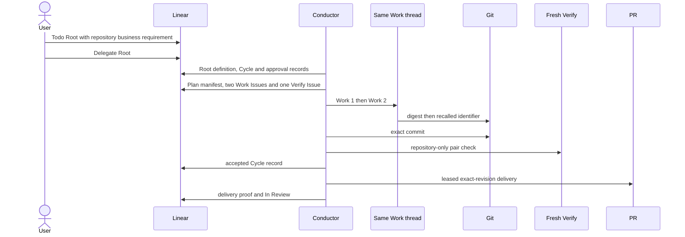

# Phase 1 Roadmap

| Status | Owns | Does not own |
|---|---|---|
| Phase 1 target | approved implementation order、black-box acceptance gates | product scope、workflow meaning |

## 阅读规则

| Normative | Reference only | Forbidden |
|---|---|---|
| tables with a `Rule` column | `Architecture rules` owner links、Mermaid projections | task-created product capability |

## Hard-cut sequence

```mermaid
%% source-rules: RM-SEQ-001 RM-SEQ-002 RM-SEQ-003 RM-SEQ-004 RM-SEQ-005 RM-SEQ-006 RM-SEQ-007 RM-SEQ-008 RM-SEQ-009
flowchart LR
  Model[Rule model] --> Contracts[Closed contracts]
  Contracts --> Linear[Linear boundary]
  Linear --> Root[Root semantics]
  Root --> Roles[Isolated roles]
  Roles --> Cycle[Mechanical Cycle]
  Cycle --> Delivery[Exact delivery]
  Delivery --> Runtime[Single-Root runtime]
  Runtime --> E2E[Public-boundary E2E]
```

| Rule | Slice | Authorized outcome | Architecture rules | Exit evidence |
|---|---|---|---|---|
| `RM-SEQ-001` | architecture rule model | one table-authoritative workflow model、diagram projections and semantic guards | `WF-AUTH-001` through `WF-PERSIST-007` | rule/link/semantic architecture audit passes |
| `RM-SEQ-002` | contracts and capabilities | closed public types and caller-owned capability boundaries | `CT-CLOSED-001` through `CT-READ-006` | contract tests and typecheck pass |
| `RM-SEQ-003` | Linear boundary | complete fresh observations、exact deterministic mutations/read-back and no in-memory workflow mirror | `TM-OBS-001` through `TM-PROVIDER-007` | focused real-provider capability evidence |
| `RM-SEQ-004` | Root semantic boundaries | Define、Draft review/approval、Acceptance and successor only | `RR-LOOP-001` through `RR-OUT-004` | Root permission and boundary tests |
| `RM-SEQ-005` | Performer isolation | fresh Plan/Verify、one live ordered Work thread and Markdown-only persisted results | `PF-CTX-001` through `PF-PERM-004` | real app-server context evidence |
| `RM-SEQ-006` | mechanical Cycle | manifest-first graph materialization、record-first Stage advancement、restart/failure closure | `CO-EXEC-001` through `CO-RESTART-004` | focused Cycle/restart tests |
| `RM-SEQ-007` | exact revision delivery | per-Cycle worktree and commit proof fresh Verify、leased push、unique PR bounded convergence proof | `GD-WT-001` through `GD-DELIVERY-006` | real Git/PR boundary evidence |
| `RM-SEQ-008` | serial runtime | one process bound to one Root write/wake decoupling closure before exit | `WF-AUTH-004`, `WF-AUTH-006`, `CO-LOOP-001` through `CO-CLEAN-003` | bound-Root routing and cleanup tests |
| `RM-SEQ-009` | black-box E2E | public Linear/Git/PR observations prove the approved business flow | `RM-E2E-001` through `RM-E2E-009` | built-process external-only scenarios pass |

## Black-box acceptance

| Rule | Scenario obligation | Observable pass condition | Architecture rules |
|---|---|---|---|
| `RM-E2E-001` | credential-isolated runner | fixture actor mutates fixtures runner lacks production mutation credentials opaque launcher starts built Conductor | `TM-PROVIDER-004`, `TM-PROVIDER-006` |
| `RM-E2E-002` | real business input | `Todo` Root requests a committed release ID and lowercase SHA-256 consumer recomputes and rejects mismatch | `WF-TR-001`, `RR-DEFINE-001` through `RR-DEFINE-005` |
| `RM-E2E-003` | exact approved graph | Linear shows `Root -> Cycle -> Plan + Work x2 + Verify` Work order follows dependencies each terminal Stage owns a record | `WF-TOPO-001` through `WF-TOPO-007`, `WF-PERSIST-001` through `WF-PERSIST-005` |
| `RM-E2E-004` | two-turn Work continuity | Work 1 creates `e7-[0-9a-f]{32}` and persists only its digest Work 2 recalls the prior turn and writes one trailing newline | `WF-PERSIST-003`, `WF-PERSIST-007`, `PF-THREAD-001` through `PF-THREAD-003` |
| `RM-E2E-005` | context separation | Plan and Verify are fresh Work gets no sibling Result or injected value raw value is absent before the Work 2 output file | `PF-CTX-001` through `PF-CTX-004`, `PF-HOME-001` through `PF-HOME-004` |
| `RM-E2E-006` | repository-only verification | fresh Verify reads the exact committed pair identifier format matches value hashes to the committed digest | `GD-VERIFY-001`, `GD-VERIFY-002`, `WF-PERSIST-004` |
| `RM-E2E-007` | semantic acceptance and delivery | fresh facts prove Verify = accepted = ref = PR revision PR is unique two convergence rounds match | `RR-ACCEPT-001` through `RR-ACCEPT-004`, `GD-PR-001` through `GD-DELIVERY-006` |
| `RM-E2E-008` | immutable failure/successor | scenarios cover Plan、Work、Verify and sealed-fact failure only a policy-allowed deterministic successor executes | `WF-FAIL-002` through `WF-FAIL-015`, `RI-SUCC-001` |
| `RM-E2E-009` | single-Root cleanup | launch binds one Root `Done` follows closure matching runtime/Home is removed process exits | `WF-ROUTE-011` through `WF-ROUTE-013`, `WF-RESTART-011`, `CO-CLEAN-001` |

| E7.2 aspect | In scope | Out of scope |
|---|---|---|
| business claim | repository-pair consistency and accidental-corruption detection | adversarial rewrite of both committed files、signature、external trust anchor |
| two-turn Work | context-isolation evidence | Root business requirement |

## Scope exclusions

| Rule | Excluded capability | Reason / owner |
|---|---|---|
| `RM-NON-001` | second-Root adoption multi-Root orchestration fairness scheduling inside one Conductor | `WF-AUTH-006`, `CO-LOOP-001` |
| `RM-NON-002` | cross-provider atomic snapshot or shared transaction | `GD-NON-001` |
| `RM-NON-003` | signatures、external trust anchors or adversarial repository integrity | not required by `RM-E2E-002` |
| `RM-NON-004` | compatibility、migration、fallback provider or dual path | `GD-NON-005` |
| `RM-NON-005` | automatic merge、review handling、replacement PR or redelivery policy | `GD-NON-003`, `GD-NON-004` |
| `RM-NON-006` | E2E imports/calls into private Conductor modules or performs product mutations for Conductor | public-boundary evidence only |

## Completion gates

| Rule | Gate | Required evidence |
|---|---|---|
| `RM-GATE-001` | architecture | rule/link/authority audits、stale-term scan and fresh zero-skill adversarial review are clean |
| `RM-GATE-002` | implementation | focused tests、Conductor tests、lint、typecheck and build pass |
| `RM-GATE-003` | external behavior | all `RM-E2E-*` obligations pass against built Conductor and real provider boundaries |
| `RM-GATE-004` | repository | `make test-all`、secret scan and scoped diff review pass |
| `RM-GATE-005` | release | residual risks are reported and human approval occurs before merge/deploy |
