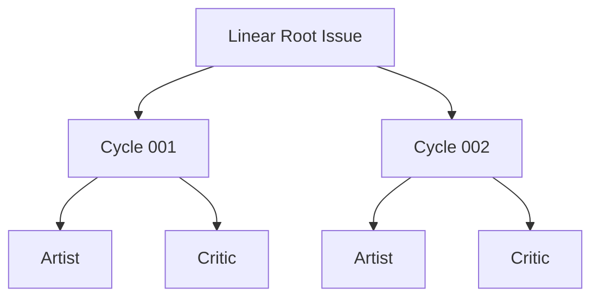

# Root Issue Model

| Status | Owns | Does not own |
|---|---|---|
| target proposal | Root requirement, Human Action episodes, Architecture Decisions, managed Root snapshot, child hierarchy, and role reports | routing, model decisions, or GraphQL mechanics |

## Issue hierarchy



Provider IDs identify resources. Cycle numbers are display order only. The
hierarchy is for human visibility and mechanical cancellation; it is not the
state supplied to Root Reconcile.

Root uses `Todo`, `In Progress`, `In Review`, `Needs Human`, `Done`, and
`Canceled`. Descendants use the same set except `Needs Human`, which is reserved
for a Root Reconcile question and is never projected onto Cycle, Artist, or
Critic. Conductor changes the Issue status at
each lifecycle boundary defined by the [Workflow Model](workflow-model.md), so
the Linear tree is a direct, human-readable view of waiting, running, review,
terminal, and abandoned work. Comments and Root State add detail but never
stand in for a status transition.

## Root documents

- **Root title and requirement section.** Its required content is the
  user-authored original long-term requirement. It is immutable and is never
  replaced or mixed with generated state.
- **Root description Architecture Decisions.** This Harness-owned section is
  the append-only, operator-visible record of accepted Human Action replies.
  Each `ArchitectureDecision` entry renders `id`, `title`, `decision`,
  `rationale`, `consequences[]`, `source_action_comment_id`,
  `source_reply_ids[]`, and local `decided_at`. Rejected replies and unanswered
  questions never enter this section.
- **Root description managed snapshot.** Its required content is the
  workspace, run directory, branch, task state, compact `latest_critique`,
  Harness feedback, phase, comment cursor, terminal delivery, latest Reconcile
  report, and local `Updated at`. Harness may replace only this managed suffix;
  it is the durable checkpoint and never Reconcile input.

The Root title and requirement section are the sole original requirement. The
description may additionally contain at most one Harness-owned Architecture
Decisions section followed by exactly one Harness-managed snapshot block:

```text
# Architecture Decisions

## ADR-001
- `id`: `ADR-001`
- `title`: <decision title>
- `decision`: <accepted choice or answer>
- `rationale`: <why this choice was accepted>
- `consequences`:
  - <observable consequence>
- `source_action_comment_id`: <Human Action comment ID>
- `source_reply_ids`: [<accepted thread reply ID>]
- `decided_at`: <YYYY-MM-DD HH:mm:ss GMT+/-HH:MM>
```

````text
# Symphony Harness: Managed Root
## Result
<latest validated Reconcile report>
## Delivery
<terminal delivery when present>
## Metadata
Updated at: <YYYY-MM-DD HH:mm:ss GMT+/-HH:MM>
### Root State
```json
<canonical RootState JSON>
```
# Symphony Harness: End Managed Root
````

Conductor creates the Architecture Decisions section when the first accepted
episode exists and appends each later accepted decision exactly once. Root State
holds the structured decision record and remains its authority; the visible
section is only a mechanical rendering. Conductor replaces only that owned
section and the managed snapshot interior on later projections, refreshing the
human-readable local `Updated at` line from the customer runtime clock each time.
It never rewrites the requirement region. Before Root Reconcile, Conductor strips
the complete managed block but supplies Architecture Decisions as read-only
decision context; it is not a new requirement or Inbox input. V1 does not
reconstruct Root State by parsing the child tree.

`Updated at` is presentation only. Readers preserve and display it but never
parse it to validate, order, or authorize durable state; Linear `createdAt` and
the Root State fields own machine semantics.

The managed suffix stores no credential, transcript, revision, digest, or
process handle. The per-process `max_cycles` guard is not stored there; it is an
operator launch limit rather than durable Root progress.

Each Root Reconcile decision replaces the latest `## Result` report in the
managed suffix. A continue report contains `Why Continue`, `Evidence`, and
`Next Cycle`; a completion report contains `Overview`, semantic
`Created`/`Updated`/`Deleted` paths, whole-worktree line changes,
`Verification`, and `Run Metrics` with wall-clock duration and short exact token usage; a human gate contains `Reason`,
`Question`, and `Next Step`. For `create_cycle`, Conductor also copies the exact
report once to the new Cycle under `# Symphony Harness: Reconcile`, preserving
Cycle history as the creation comment without creating Root or role result
comments. Raw Git porcelain,
file contents, transcripts, and estimated token values are forbidden.

## Human Action episodes

A `needs_human` decision opens one decision episode. Conductor creates exactly
one top-level comment on the Root for that episode. Its first line is the exact
marker `# Symphony Harness: Human Action`; the comment has no parent and contains
the reason, one or more concrete questions, and two to four mutually exclusive
options per question:

````text
# Symphony Harness: Human Action

## Reason
<why the next bounded step cannot be selected>

## Questions
### 1. <question>
- **A. <label>**: <consequence>
- **B. <label>**: <consequence>
````

The top-level comment is unique to its decision episode. Rejecting a reply does
not open another episode: Conductor reacts to the rejected replies and adds one
follow-up question as a reply in the same thread. A follow-up starts with
`# Symphony Harness: Human Action Follow-up`; it is a Harness reply, not another
top-level comment. After an accepted reply batch, the episode closes and a later
independent decision may create a new top-level Human Action comment.

Every user answer is a direct reply in the Human Action thread. Replies after
the latest unanswered Harness question are one batch and are classified as a
whole. A reply to an older question, a nested reply to another reply, or a
top-level Root comment is not an answer. The flat Root-reply behavior is a hard
switch: it is not a compatibility input, is never silently promoted into the
thread, and does not make a `Needs Human` Root a candidate.

| Rule | Scope | Required behavior | Forbidden behavior |
|---|---|---|---|
| `RI-HUM-001` | Human Action episode | create exactly one top-level `# Symphony Harness: Human Action` comment per independent decision episode | duplicate top-level questions for one open episode |
| `RI-HUM-002` | Human Action replies | keep every follow-up and user answer in the original thread; classify the complete direct-reply batch | flat Root replies, nested reply chains, or partial batch acceptance |
| `RI-HUM-003` | accepted reply batch | add one `white_check_mark` reaction to every reply, append one Architecture Decisions entry, and close the episode | treating a reaction as a decision without a fresh Reconcile |
| `RI-HUM-004` | rejected reply batch | add one `x` reaction to every reply, then create exactly one Harness follow-up reply in the same thread | creating a second top-level action or recording a rejected answer as a decision |
| `RI-HUM-005` | Root description | maintain one Harness-owned `# Architecture Decisions` section with one entry per accepted episode | mixing decisions into the immutable requirement or managed snapshot |
| `RI-HUM-006` | Podium discovery | enqueue a Root with unprocessed action replies through the ordinary queue | rendering or interpreting replies, special rank, labels, or Resume |

Reactions are application-authored receipts only. `white_check_mark` means that
the complete reply batch was accepted; `x` means that it was rejected and a
follow-up is required. User-authored reactions do not process a reply, advance
the episode cursor, or change scheduling. A failed reaction or description
projection is visible and stops the transition; it is never hidden by a retry.

Podium reads the open episode's direct replies after its saved reply cursor. If
there is at least one unprocessed reply, it exposes the Root as an ordinary
candidate using the existing priority, creation-time, and ID order. Podium does
not create replies or reactions, update `# Architecture Decisions`, or change
the Root status. Conductor alone consumes the batch, projects reactions and the
accepted decision, and starts the next Reconcile.

## Cycle family documents

| Document | Required sections | Write policy |
|---|---|---|
| Cycle description | `# Task` with Objective, Acceptance, and Boundaries; `# Symphony Metadata` with Consumed Root Comment IDs | create once; never update |
| Artist description | frozen Task; Role/access Metadata; optional Result | create once; append Result once |
| Critic description | frozen Task; Role/access Metadata; optional Result | create once; append Result once |

Cycle, Artist, and Critic are created in that order. Critic exists in waiting
state from family creation and starts only after Artist terminates. These exact
top-level regions make ownership visible and mechanically parseable: the Root
content before the managed marker is user-authored; `# Task` is frozen business
context; `# Symphony Metadata` is Harness-owned operational context; and
`# Result` is the terminal human report. Cycle description content remains
immutable. Only Conductor may append the terminal role report to each role description;
V1 does not detect or repair unrelated manual edits.

The frozen Cycle title is `[Cycle NNN] <objective>` with a concise imperative
objective and a maximum total title length of 80 characters. Overlong fallback
projection truncates only at a complete word and adds an ellipsis. The role titles are exactly `[Artist] Cycle NNN` and
`[Critic] Cycle NNN`; they carry the Cycle number rather than repeating its
objective.

## Result Markdown and uploaded file

Each role's prompt requires one final Markdown response at its local result path.
At terminal handling, the response is appended byte-for-byte once to that role's
Linear Issue description with one mechanical human-readable local `Updated at:
<YYYY-MM-DD HH:mm:ss GMT+/-HH:MM>` line;
it is intentionally human-facing and does not repeat the frozen Cycle
objective, acceptance, or boundaries. Linear may normalize equivalent Markdown
syntax such as unordered-list markers on readback. That provider normalization
does not create another report or change its content contract:

| Role | Local file | Required human report | Semantic use |
|---|---|---|---|
| Artist | `cycle-NNN-artist-result.md` | human-readable summary of actual file changes and verification without repeating the Cycle task | display-only; never Critic/Root input |
| Critic | `cycle-NNN-critic-result.md` | one compact JSON machine envelope followed by a human-readable audit of scope, implementation, evidence, checks, and findings | parse only the machine envelope once |

The Critic machine envelope contains only `verdict`, required
`task_state_markdown`, and optional
`pending_finding`. Conductor combines it with the exact human report into one
typed Critique artifact, serializes it once as
`cycle-NNN-critique-result.json`, writes and uploads those same bytes, and uses
the already validated in-memory envelope for progression. Only this JSON file
is uploaded for the Cycle with `application/json` content type. The Cycle Result
comment has only the mapped terminal result, one linked Critic Issue identifier,
and one visible resource line. It does not repeat the Critic evidence:

```markdown
- Critique: [cycle-NNN-critique-result.json](https://linear.example/asset)
```

If upload fails, the line is `- Critique: upload failed (<current error's
first 50 characters>)`; the failure is visible but does not alter the Critic
verdict or progression. The Cycle never contains role Markdown or a second
summary. It receives exactly two Harness comments: the creating Reconcile
rationale and the terminal Cycle result with this link/error. Intermediate
progress is visible through Issue statuses, not comments. Comment event time is
Linear `createdAt`, not a duplicated body field. A missing, unreadable,
invalid, or non-UTF-8 role result becomes a visible `process_error`; Conductor
never makes a second summarization or format-repair Agent call.

There is exactly one Artist and one Critic Agent call. Artist output is never
supplied to Critic or used to calculate Cycle/Root semantics. JSONL and stderr
remain private local diagnostics in the external run directory; they are never
uploaded as comments or files. Role descriptions, the two Cycle comments, the
single JSON file, and explicit statuses are the operator-visible progression
artifacts.

## Restart abandonment

At process startup, Conductor lists all nonterminal descendants beneath Root and
mechanically changes each one to the canonical `Canceled` state. It does not parse
their descriptions or comments, calculate a terminal result, update Trusted
State from them, or pass them to an Agent.

```text
list unfinished descendants
-> cancel each unfinished Artist/Critic/Cycle
-> set Root State phase to idle and add possible-unreviewed-changes feedback
-> run fresh Root Reconcile from Root description + Root State
```

Completed historical children remain visible but are not loaded into the
Reconcile context. Their trusted summaries already exist in Root State.

## Input boundary

| Comment location and author | Meaning |
|---|---|
| Root, user-authored top-level comment outside an open Human Action | new input for a future Reconcile |
| top-level `# Symphony Harness: Human Action` comment | one episode question; reserved Harness output; never Inbox input |
| Harness reply in a Human Action thread | rejection follow-up question only; never Inbox input |
| user-authored direct reply in the active Human Action thread | one reply batch for the episode; Conductor classifies it as a whole |
| top-level user comment while Root is waiting on Human Action | unsupported flat reply; ignored and never promoted into the thread |
| user reaction on any Human Action comment or reply | display-only; never a processing receipt |
| Root managed description suffix | durable runtime checkpoint and latest report; stripped before Reconcile |
| Root `# Architecture Decisions` section | mechanical rendering of accepted structured decisions; read-only Reconcile context |
| Cycle creation/result comment | exactly two append-only operator records; not Reconcile input |
| Artist or Critic description terminal report | display-only; not Reconcile input |
| Artist or Critic comments, any author | display-only |

Only direct replies after the episode's saved reply cursor form a Human Action
batch. An accepted batch receives one `white_check_mark` reaction per reply and
advances the reply cursor only after the decision and Architecture Decisions
projection are durable. A rejected batch receives one `x` reaction per reply,
then one Harness follow-up reply is created in the same thread; the cursor is
advanced only after that follow-up is durable. Editing an old comment does not
replay it; the human adds a new direct thread reply. A reply arriving during an
active Cycle cannot alter that Cycle and remains input for the next Reconcile.
