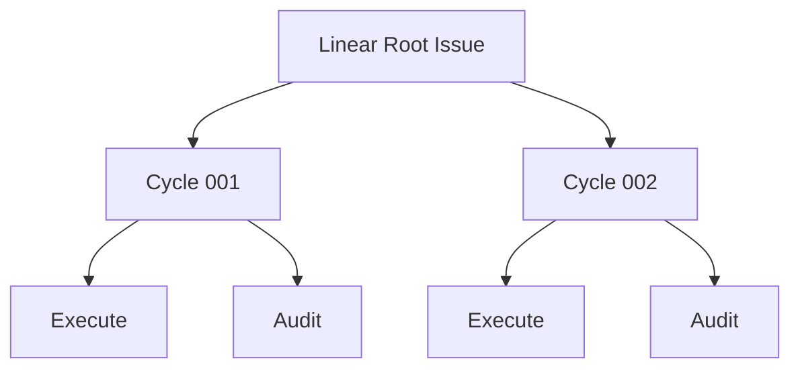

# Root Issue Model

| Status | Owns | Does not own |
|---|---|---|
| target proposal | Root requirement, Root State comment, child hierarchy, frozen role documents, and result comments | routing, model decisions, or GraphQL mechanics |

## Issue hierarchy



Provider IDs identify resources. Cycle numbers are display order only. The
hierarchy is for human visibility and mechanical cancellation; it is not the
state supplied to Root Reconcile.

## Root documents

| Document | Required content | Write policy |
|---|---|---|
| Root title and description | user-authored original long-term requirement | never replaced or augmented by generated requirements |
| Root State comment | workspace/run directory/branch, task state, pending finding, Harness feedback, phase, comment cursor, and PR URL | one Harness-owned mutable checkpoint |

Root title and description are the sole original requirement. Root State is the
sole durable runtime checkpoint. V1 does not reconstruct Root State by parsing
the complete child tree.

```markdown
## Current
- Workspace: `/run-owned/root-workspace`
- Run directory: `/run-owned/root-evidence`
- Branch: `symphony/ENG-123-<run-id>`
- Phase: Audit
- Active Cycle: ENG-127

## Task State
- Focused parser behavior is independently verified; cleanup is not yet verified.

## Pending Finding
- ENG-127: cleanup remains in `src/example.ts`

## Harness Feedback
- Startup abandoned unfinished children; the retained workspace may contain
  unaudited partial modifications.

## Root Input Cursor
- Last consumed comment: `<comment-id>`

## Pull Request
- Not created
```

The visible comment stays concise. A bounded Harness marker identifies it and
stores no credential, transcript, revision, digest, or process handle.
The per-process `max_cycles` guard is not stored here; it is an operator launch
limit rather than durable Root progress.

## Cycle family documents

| Document | Required sections | Write policy |
|---|---|---|
| Cycle description | Objective, Acceptance, Boundaries, Consumed Root Comment IDs | create once; never update |
| Execute description | Role, parent Cycle, frozen task, acceptance, boundaries, workspace-write policy | create with Cycle; never update |
| Audit description | Role, parent Cycle, acceptance, independent read-only policy | create with Cycle; never update |

Cycle, Execute, and Audit are created in that order. Audit exists in waiting
state from family creation and starts only after Execute terminates. V1 does not
detect or repair manual edits to these descriptions.

## Result comments

| Attachment | Comment | Required fields | Write policy |
|---|---|---|---|
| Execute | Execute Process Result | launch status, duration, exit code, and optional sanitized process reason | append once before terminal status |
| Audit | Audit Report | verdict, checks, independent evidence, findings, proposed task state, and residual risk | append once before terminal status |
| Cycle | Cycle Result | mechanically mapped `Succeeded`, `Rejected`, or `Failed`; Audit Issue reference, Audit verdict, and bounded reason | append once before terminal status |

Execute model output is not a result: it is untrusted, duplicates facts that
Audit must independently establish, and could bias the only semantic reviewer.
It is therefore never parsed, copied into a comment, supplied to Audit, or used
to calculate the Cycle result. The Execute comment exposes process health only.

The Audit Report is the sole semantic result. The Cycle Result is retained so a
human can understand a Cycle without traversing its children, but it is only a
mechanical projection of the Audit verdict and contains no copied evidence or
second judgment. Root Reconcile reads neither comment; it receives trusted
fields after Conductor promotes them to Root State.

Comments contain normalized bounded facts, never full prompts, assistant
streams, tool streams, raw role responses, or complete trajectories.

## Restart abandonment

At process startup, Conductor lists all nonterminal descendants beneath Root and
mechanically changes each one to the team's canceled state. It does not parse
their descriptions or comments, calculate a terminal result, update Trusted
State from them, or pass them to an Agent.

```text
list unfinished descendants
-> cancel each unfinished Execute/Audit/Cycle
-> set Root State phase to idle and add possible-unaudited-changes feedback
-> run fresh Root Reconcile from Root description + Root State
```

Completed historical children remain visible but are not loaded into the
Reconcile context. Their trusted summaries already exist in Root State.

## Input boundary

| Comment location and author | Meaning |
|---|---|
| Root, user-authored after saved cursor | new input for a future Reconcile |
| Root, Harness State marker | durable runtime checkpoint |
| Root, other Harness marker | operational output only |
| Cycle, Execute, or Audit, any author | display-only |

All comments after the prior cursor are consumed together only after the
complete Cycle family and local record exist. Root State then advances to the
newest included comment. A comment arriving during an active Cycle cannot alter
it.
