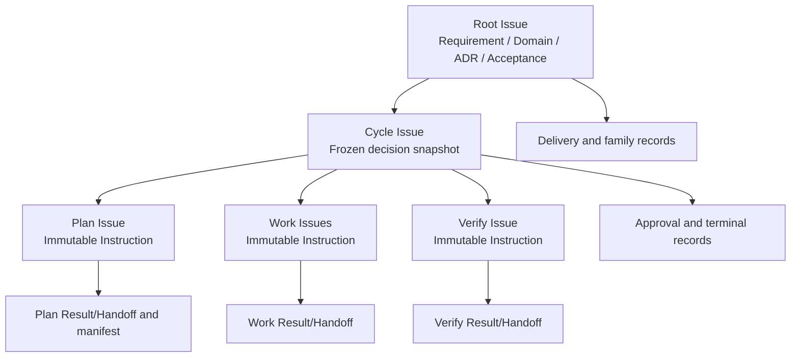
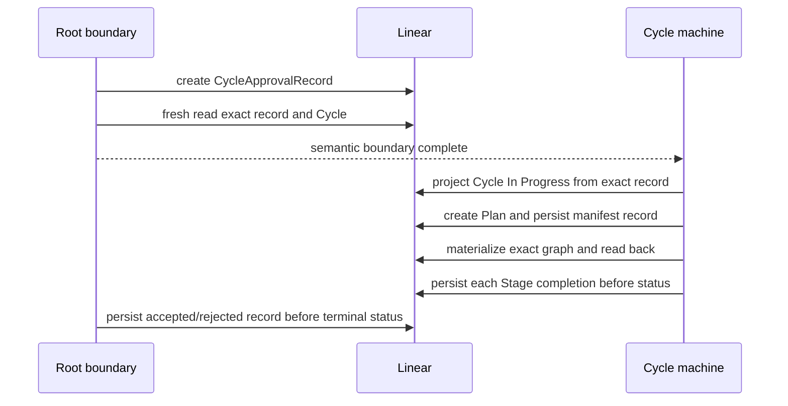
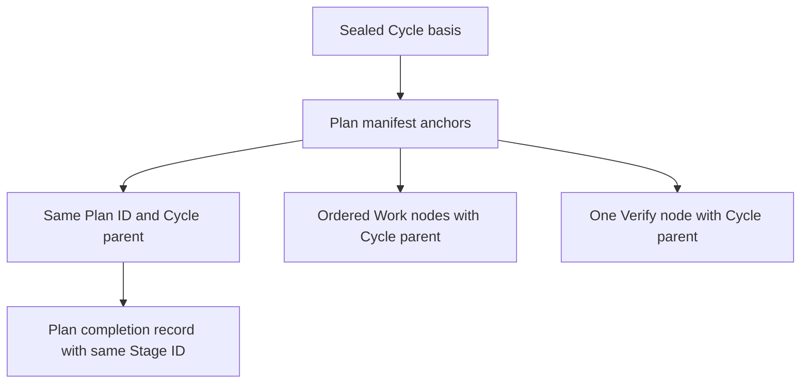

# Root Issue Model

| Status | Owns | Does not own |
|---|---|---|
| Phase 1 target | Linear documents、deterministic identities、seal anchors、Plan manifest | topology cardinality、transition、routing、failure、restart |

## Document graph

## Document authority table

| Rule | Document | Required closed content | Mutable window | Forbidden content |
|---|---|---|---|---|
| `RI-DOC-001` | Root description | Requirement、Domain Knowledge、Root ADR、Acceptance | Define and explicit external user semantic edits | transcript、provider payload、runtime state |
| `RI-DOC-002` | Cycle description | Root requirement/ADR snapshot functional/architecture/code design acceptance map and sealed groups | Draft before approval record | newer Root content after approval、hidden JSON |
| `RI-DOC-003` | Stage description | one closed immutable Instruction | never after Issue create | Result/Handoff、runtime metadata、sibling content |
| `RI-DOC-004` | attached record | one closed typed approval/completion/invalidation projection | absent to present only by contract | raw performer output、receipt、credential、correlation |
| `RI-DOC-005` | all managed Markdown | bounded text parsed through the standard Markdown AST and named sections | only as listed above | ad-hoc string parsing as authority |

| Root knowledge boundary | Required | Forbidden |
|---|---|---|
| Root ADR | named section in Root Markdown | second provider field |
| Cycle snapshot | copy exact applicable Root knowledge before review | active Cycle re-read of newer Root content |

## Identity table

| Rule | Identity | Deterministic basis | Persisted anchor | Unknown create outcome |
|---|---|---|---|---|
| `RI-ID-001` | `cycle_issue_id` | Root/predecessor/terminal-record IDs derivation version `first_cycle` sentinel for the first Cycle | Cycle description and approval record | exact-read same ID and direct Root children never allocate another |
| `RI-ID-002` | Cycle-owned record IDs and `plan_issue_id` | Cycle ID, record kind, derivation version | Cycle description then approval record | exact-read same ID |
| `RI-ID-003` | Work/Verify/relation/record IDs | approved group/directive IDs, Plan ID, graph derivation version | Plan completion manifest | exact-read manifest identity and creation evidence |
| `RI-ID-004` | direct ownership | provider-native parent ID | current Issue plus identity-closure reads | relation/title/text/memory cannot reconstruct parent |
| `RI-ID-005` | Root family invalidation record | Root ID, record kind, derivation version | exact Root-attached record slot | exact-read same ID; never allocate another |

## Seal table

| Rule | Seal | Created by | Authoritative fact | Consequence |
|---|---|---|---|---|
| `RI-SEAL-001` | Cycle specification seal | Root boundary after semantic review | exact `CycleApprovalRecord` fresh read-back | Cycle description and approved Work partition freeze |
| `RI-SEAL-002` | Stage Instruction digest | Conductor mechanical assembly | Issue description fresh read-back | completion must bind the same digest |
| `RI-SEAL-003` | graph seal | Conductor after closed Plan validation | Plan completion record with exact manifest | current graph is checked against manifest, never resealed |
| `RI-SEAL-004` | acceptance basis | Root boundary over complete execution facts | Cycle terminal record plus convergence proof | status alone cannot authorize delivery |

## Manifest table

| Rule | Requirement | Exact check | Failure rule |
|---|---|---|---|
| `RI-MANIFEST-001` | Root seals at least one execution directive and at least one non-empty Work group | groups exactly cover directives Verify directives are non-empty and constructible | `WF-FAIL-015` |
| `RI-MANIFEST-002` | Plan only validates and returns a stable legal total order of sealed group IDs | no merge、split、new instruction、new dependency or regrouping | `WF-FAIL-015` |
| `RI-MANIFEST-003` | Plan record stores one Plan、ordered Work nodes and one Verify | Cycle/spec/approval IDs equal Plan Issue/completion/invalidation IDs equal | `WF-FAIL-008` |
| `RI-MANIFEST-004` | materialization starts only after Plan completion record | Plan record provider time is earlier than every materialized Work、Verify and relation provider time | `WF-FAIL-007` |
| `RI-MANIFEST-005` | every Issue/relation has exact service-actor creation evidence | identity、parent、kind、content、endpoints and creator all match | `WF-FAIL-007` |
| `RI-MANIFEST-006` | first complete graph equals the persisted manifest | every node parent equals manifest `cycle_id` no extra、missing、external-created or mismatched resource | `WF-FAIL-007` |
| `RI-MANIFEST-007` | Work execution order is the persisted total order | restart never re-toposorts or uses memory readiness order | `WF-RESTART-005` |
| `RI-MANIFEST-008` | sealed dependency DAG projection | one exact `blocks` relation per Work dependency one Verify barrier per Work no extra relation | `WF-FAIL-007` |

### Manifest anchor equality

| Binding | Values that must be equal |
|---|---|
| approval owner | approval record ID、Cycle Issue ID、record Cycle ID |
| lineage | derivation version、predecessor Cycle ID、predecessor terminal record ID |
| Plan slots | Plan Issue ID、Plan completion ID、Plan invalidation ID |
| terminal slots | Cycle completion/invalidation IDs、delivery completion/invalidation IDs |
| sealed basis | specification seal、workspace base revision |
| manifest basis | Cycle ID、approval record ID、specification seal |
| Plan node | Plan Issue ID、Cycle parent、completion ID、invalidation ID |
| relation endpoints | Work-group node IDs、unique Verify Issue ID |

## Record table

| Rule | Record owner | Required payload | Projection relationship | Mutation handling |
|---|---|---|---|---|
| `RI-REC-001` | Plan Issue | outcome/instruction basis completed: non-empty order、Verify、manifest/seal/traceability failed/canceled: reason only | record before Plan terminal status | invalid observation then `WF-FAIL-008` |
| `RI-REC-002` | Work Issue | normalized outcome/handoff, checks, workspace parent/diff | record before Work terminal status | mutated observation uses `WF-FAIL-015` |
| `RI-REC-003` | Verify Issue | conclusion, checks/evidence and exact revision | record before Verify terminal status | mutated observation uses `WF-FAIL-015` |
| `RI-REC-004` | Cycle Issue | approval or phase-owned terminal/invalidation payload with explicit successor policy | record before matching Cycle projection | status alone is invalid predecessor |
| `RI-REC-005` | Root Issue | family or delivery completion/invalidation payload | drives quarantine/park/cleanup facts | memory receipt cannot substitute |
| `RI-REC-006` | exact comment slot | actor、provider times、basis revision/status/document digest and current body digest | `updated_at == created_at`, unarchived | update/archive/malformed remain sanitized invalid observations |

| Comment fact | Contract interpretation |
|---|---|
| provider-mutable Linear comment | write-once only by Symphony contract |
| missing exact slot | `WF-FAIL-001` through `WF-FAIL-003` |
| malformed、updated or archived exact slot | record kind and phase map through `TM-OBS-005` |
| provider-proven permanent Issue destruction | `WF-FAIL-013` |

## Successor rule

| Rule | Preconditions | New identity | Reused state | Forbidden cases |
|---|---|---|---|---|
| `RI-SUCC-001` | Root freshly delegated intact terminal record permits successor known graph/history proof complete | derive a new Cycle using `RI-ID-001` | copy current Root requirement/ADR into new Draft | unadmitted Root reopen predecessor reuse Stage/thread/worktree partial/lost authority delivery effect |

| Predecessor record | `successor_policy` | Successor | Delivery |
|---|---|---|---|
| accepted completion | `not_applicable` | forbidden | allowed only by the accepted record |
| normal rejected/failed/canceled completion | `allowed` | `WF-ROUTE-008` may create a new Draft | forbidden |
| intact `WF-FAIL-005` invalid terminal | explicit `allowed` or `permanently_quarantined` | only the explicit policy applies | forbidden |
| every other invalidation | `permanently_quarantined` | forbidden | forbidden |

A successor never repairs or legitimizes its predecessor.

## Fact boundary

| Fact class | Authority | Explicit exclusion |
|---|---|---|
| Task documents、native graph/status provider times/creation evidence grouped history/record observations | Linear | memory、Root Home、event receipt |
| code、diff、exact revision | Git under `WF-AUTH-002` | Linear commit claim、memory SHA |
| same-Cycle Work continuation | live thread under `WF-PERSIST-007` | every durable store and every workflow decision |
