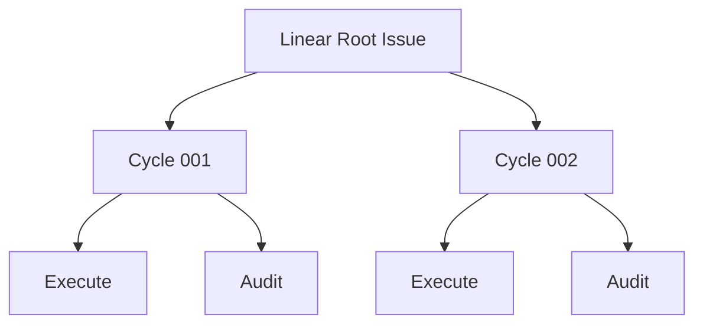

# Root Issue Model

| Status | Owns | Does not own |
|---|---|---|
| target proposal | Root requirement, managed Root snapshot, child hierarchy, and role reports | routing, model decisions, or GraphQL mechanics |

## Issue hierarchy



Provider IDs identify resources. Cycle numbers are display order only. The
hierarchy is for human visibility and mechanical cancellation; it is not the
state supplied to Root Reconcile.

Every Issue in this hierarchy uses the shared five-state Linear status plane:
`Todo` (`unstarted`), `In Progress` (`started`), `In Review` (`started`), `Done`
(`completed`), or `Canceled` (`canceled`). Conductor changes the Issue status at
each lifecycle boundary defined by the [Workflow Model](workflow-model.md), so
the Linear tree is a direct, human-readable view of waiting, running, review,
terminal, and abandoned work. Comments and Root State add detail but never
stand in for a status transition.

## Root documents

- **Root title and requirement section.** Its required content is the
  user-authored original long-term requirement. It is immutable and is never
  replaced or mixed with generated state.
- **Root description managed snapshot.** Its required content is the
  workspace, run directory, branch, task state, complete `latest_audit`, pending
  finding, Harness feedback, phase, comment cursor, terminal delivery, latest
  Reconcile report, and local `Updated at`. Harness may replace only this
  managed suffix; it is the durable checkpoint and never Reconcile input.

The Root title and requirement section are the sole original requirement. The
description may additionally contain exactly one Harness-managed snapshot block:

````text
# Symphony Harness: Managed Root
Updated at: <YYYY-MM-DDTHH:mm:ss.sss+/-HH:MM>
## Root State
```json
<canonical RootState JSON>
```
## Reconcile
<latest validated Reconcile report>
# Symphony Harness: End Managed Root
````

Conductor appends the block when absent and replaces only its interior on later
projections, refreshing the local RFC3339 `Updated at` line from the customer
runtime clock each time. It never rewrites the requirement region. Before Root Reconcile,
Conductor strips the complete block, so generated state cannot become a new
requirement. The Root State inside this suffix is the sole durable runtime
checkpoint; V1 does not reconstruct it by parsing the child tree.

The managed suffix stores no credential, transcript, revision, digest, or
process handle. The per-process `max_cycles` guard is not stored there; it is an
operator launch limit rather than durable Root progress.

Each Root Reconcile decision replaces the latest `## Reconcile` report in the
managed suffix. A continue report contains `Why Continue`, `Evidence`, and
`Next Cycle`; a completion report contains `Overview`, semantic
`Created`/`Updated`/`Deleted` paths, whole-worktree line changes,
`Verification`, and short exact `Token Usage`; a human gate contains `Reason`,
`Question`, and `Next Step`. For `create_cycle`, Conductor also copies the exact
report once to the new Cycle under `# Symphony Harness: Reconcile`, preserving
Cycle history without creating Root or role result comments. Raw Git porcelain,
file contents, transcripts, and estimated token values are forbidden.

## Cycle family documents

| Document | Required sections | Write policy |
|---|---|---|
| Cycle description | Objective, Acceptance, Boundaries, Consumed Root Comment IDs | create once; never update |
| Execute description | Role, parent Cycle, frozen task, acceptance, boundaries, workspace-write policy, terminal Executor report | create with Cycle; append the exact terminal report once; never rewrite the frozen context |
| Audit description | Role, parent Cycle, acceptance, independent read-only policy, terminal Audit report | create with Cycle; append the exact terminal report once; never rewrite the frozen context |

Cycle, Execute, and Audit are created in that order. Audit exists in waiting
state from family creation and starts only after Execute terminates. Cycle
description content remains immutable. Only Conductor may append the one terminal
role report to each role description; V1 does not detect or repair unrelated
manual edits.

The frozen Cycle title is `[Cycle NNN] <objective>` with a maximum total title
length of 80 characters. The role titles are exactly `[Executor] Cycle NNN` and
`[Audit] Cycle NNN`; they carry the Cycle number rather than repeating its
objective.

## Result Markdown and uploaded file

Each role's prompt requires one final Markdown response at its local result path.
At terminal handling, the response is appended byte-for-byte once to that role's
Linear Issue description with one mechanical local RFC3339 `Updated at:
<YYYY-MM-DDTHH:mm:ss.sss+/-HH:MM>` line;
it is intentionally human-facing and does not repeat the frozen Cycle
objective, acceptance, or boundaries. Linear may normalize equivalent Markdown
syntax such as unordered-list markers on readback. That provider normalization
does not create another report or change its content contract:

| Role | Local file | Required human report | Semantic use |
|---|---|---|---|
| Execute | `cycle-NNN-executor-result.md` | `## Summary`, `## File Changes` with `### Created`/`### Updated`/`### Deleted` paths and +/- line counts, and `## Verification` | display-only; never Audit/Root input |
| Audit | `cycle-NNN-audit-result.md` | `verdict` plus `## Scope Audited`, `## Implementation Review`, `## Checks`, `## Evidence`, `## Findings`, and `## Task State` | parsed once into typed `AuditRunResult` |

The parsed Audit result is mechanically serialized as
`cycle-NNN-audit-result.json`, written privately, and read back and validated
before it is used for Cycle/Root progression. Only this JSON file is uploaded
for the Cycle with `application/json` content type. The Cycle Result comment has
only terminal fields and one visible resource line:

```markdown
- Audit result: [cycle-NNN-audit-result.json](https://linear.example/asset)
```

If upload fails, the line is `- Audit result: upload failed (<current error's
first 50 characters>)`; the failure is visible but does not alter the Audit
verdict or progression. The Cycle never contains role Markdown or a second
summary. Its append-only history comments record status transitions, Root
decisions, the terminal result, and this link/error; their event timestamp is
Linear `createdAt`, not a duplicated body field. A missing, unreadable,
invalid, or non-UTF-8 role result becomes a visible `process_error`; Conductor
never makes a second summarization or format-repair Agent call.

There is exactly one Execute and one Audit Agent call. Execute output is never
supplied to Audit or used to calculate Cycle/Root semantics. JSONL and stderr
remain private local diagnostics in the external run directory; they are never
uploaded as comments or files. Role descriptions, Cycle history/result comments,
the single JSON file, and explicit statuses are the operator-visible progression
artifacts.

## Restart abandonment

At process startup, Conductor lists all nonterminal descendants beneath Root and
mechanically changes each one to the canonical `Canceled` state. It does not parse
their descriptions or comments, calculate a terminal result, update Trusted
State from them, or pass them to an Agent.

```text
list unfinished descendants
-> cancel each unfinished Execute/Audit/Cycle
-> set Root State phase to idle and add possible-unaudited-changes feedback
-> run fresh Root Reconcile from Root description + Root State
```

Completed historical children remain visible but are not loaded into the
Reconcile context. Their trusted summaries already exist in Root State.

## Input boundary

| Comment location and author | Meaning |
|---|---|
| Root, user-authored after saved cursor | new input for a future Reconcile |
| Root comment with a Harness marker | reserved operational output; ignored by Inbox |
| Root managed description suffix | durable runtime checkpoint and latest report; stripped before Reconcile |
| Cycle history/result comment | append-only operator history; not Reconcile input |
| Execute or Audit description terminal report | display-only; not Reconcile input |
| Execute or Audit comments, any author | display-only |

All comments after the prior cursor are consumed together only after the
complete Cycle family and local record exist. Root State then advances to the
newest included comment. A comment arriving during an active Cycle cannot alter
it.
