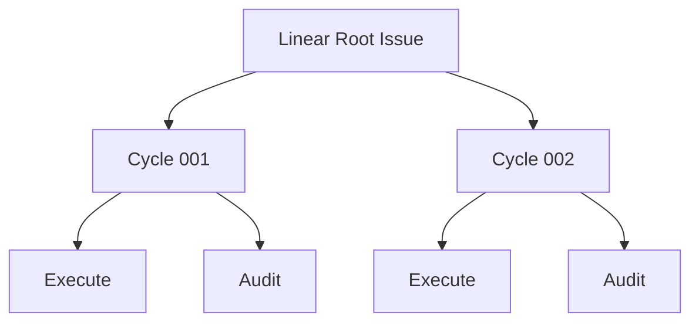

# Root Issue Model

| Status | Owns | Does not own |
|---|---|---|
| target proposal | Root requirement, Root State comment, child hierarchy, frozen role documents, and result comments | routing, model decisions, or GraphQL mechanics |

## Issue hierarchy



Provider IDs identify resources. Cycle numbers are display order only. The
hierarchy is for human visibility and mechanical cancellation; it is not the
state supplied to Root Reconcile.

Every Issue in this hierarchy uses the shared five-state Linear status plane:
`Todo` (`unstarted`), `In Progress` (`started`), `In Review` (`started`), `Done`
(`completed`), or `Canceled` (`canceled`). Conductor changes the Issue status at
each lifecycle boundary defined by the [Workflow Model](workflow-model.md), so
the Linear tree is a direct, human-readable view of waiting, running, review,
terminal, and abandoned work. Comments and Root State add detail but never
stand in for a status transition.

## Root documents

| Document | Required content | Write policy |
|---|---|---|
| Root title and description | user-authored original long-term requirement | never replaced or augmented by generated requirements |
| Root State comment | workspace/run directory/branch, task state, complete `latest_audit`, pending finding, Harness feedback, phase, comment cursor, and terminal PR URL or delivery branch | one Harness-owned mutable checkpoint |

Root title and description are the sole original requirement. Root State is the
sole durable runtime checkpoint. V1 does not reconstruct Root State by parsing
the complete child tree.

```markdown
## Current
- Workspace: `/run-owned/root-workspace`
- Run directory: `/run-owned/root-evidence`
- Branch: `symphony/ENG-123-<run-id>`
- Phase: Audit
- Active Cycle: ENG-127

## Task State
- Focused parser behavior is independently verified; cleanup is not yet verified.

## Latest Audit
- The complete validated `AuditRunResult` from the newest terminal Audit.

## Pending Finding
- ENG-127: cleanup remains in `src/example.ts`

## Harness Feedback
- Startup abandoned unfinished children; the retained workspace may contain
  unaudited partial modifications.

## Root Input Cursor
- Last consumed comment: `<comment-id>`

## Pull Request
- Not created
```

The visible comment stays concise. A bounded Harness marker identifies it and
stores no credential, transcript, revision, digest, or process handle.
The per-process `max_cycles` guard is not stored here; it is an operator launch
limit rather than durable Root progress.

Each Root Reconcile decision appends one `# Symphony Harness: Reconcile`
Markdown comment. A continue report contains `Why Continue`, `Evidence`, and
`Next Cycle`; a completion report contains `Overview`, semantic
`Created`/`Updated`/`Deleted` paths, whole-worktree line changes,
`Verification`, and short exact `Token Usage`; a human gate contains `Reason`,
`Question`, and `Next Step`. Conductor copies the validated last response once
and mechanically supplies completion worktree/token facts. Raw Git porcelain,
file contents, transcripts, and estimated token values are forbidden. The
Harness marker keeps these comments out of the Root Inbox.

## Cycle family documents

| Document | Required sections | Write policy |
|---|---|---|
| Cycle description | Objective, Acceptance, Boundaries, Consumed Root Comment IDs | create once; never update |
| Execute description | Role, parent Cycle, frozen task, acceptance, boundaries, workspace-write policy | create with Cycle; never update |
| Audit description | Role, parent Cycle, acceptance, independent read-only policy | create with Cycle; never update |

Cycle, Execute, and Audit are created in that order. Audit exists in waiting
state from family creation and starts only after Execute terminates. V1 does not
detect or repair manual edits to these descriptions.

The frozen Cycle title is `[Cycle NNN] <objective>` with a maximum total title
length of 80 characters. The role titles are exactly `[Executor] Cycle NNN` and
`[Audit] Cycle NNN`; they carry the Cycle number rather than repeating its
objective.

## Result Markdown and uploaded file

Each role's prompt requires one final Markdown response at its local result path.
The response is copied byte-for-byte to that role's Linear Issue comment only;
it is intentionally human-facing and does not repeat the frozen Cycle
objective, acceptance, or boundaries:

| Role | Local file | Required human report | Semantic use |
|---|---|---|---|
| Execute | `cycle-NNN-executor-result.md` | `## Summary`, `## File Changes` with `### Created`/`### Updated`/`### Deleted` paths and +/- line counts, and `## Verification` | display-only; never Audit/Root input |
| Audit | `cycle-NNN-audit-result.md` | `verdict` plus `## Scope Audited`, `## Implementation Review`, `## Checks`, `## Evidence`, `## Findings`, and `## Task State` | parsed once into typed `AuditRunResult` |

The parsed Audit result is mechanically serialized as
`cycle-NNN-audit-result.json`, written privately, and read back and validated
before it is used for Cycle/Root progression. Only this JSON file is uploaded
for the Cycle with `application/json` content type. The Cycle Result comment has
only terminal fields and one visible resource line:

```markdown
- Audit result: [cycle-NNN-audit-result.json](https://linear.example/asset)
```

If upload fails, the line is `- Audit result: upload failed (<current error's
first 50 characters>)`; the failure is visible but does not alter the Audit
verdict or progression. The Cycle never contains role Markdown or a second
summary. A missing, unreadable, invalid, or non-UTF-8 role result becomes a
visible `process_error`; Conductor never makes a second summarization or
format-repair Agent call.

There is exactly one Execute and one Audit Agent call. Execute output is never
supplied to Audit or used to calculate Cycle/Root semantics. JSONL and stderr
remain private local diagnostics in the external run directory; they are never
uploaded as comments or files. Linear comments and the single JSON file
are the operator-visible progression artifacts, while statuses carry the
workflow lifecycle.

## Restart abandonment

At process startup, Conductor lists all nonterminal descendants beneath Root and
mechanically changes each one to the canonical `Canceled` state. It does not parse
their descriptions or comments, calculate a terminal result, update Trusted
State from them, or pass them to an Agent.

```text
list unfinished descendants
-> cancel each unfinished Execute/Audit/Cycle
-> set Root State phase to idle and add possible-unaudited-changes feedback
-> run fresh Root Reconcile from Root description + Root State
```

Completed historical children remain visible but are not loaded into the
Reconcile context. Their trusted summaries already exist in Root State.

## Input boundary

| Comment location and author | Meaning |
|---|---|
| Root, user-authored after saved cursor | new input for a future Reconcile |
| Root, Harness State marker | durable runtime checkpoint |
| Root, other Harness marker | operational output only |
| Cycle, Execute, or Audit, any author | display-only |

All comments after the prior cursor are consumed together only after the
complete Cycle family and local record exist. Root State then advances to the
newest included comment. A comment arriving during an active Cycle cannot alter
it.
