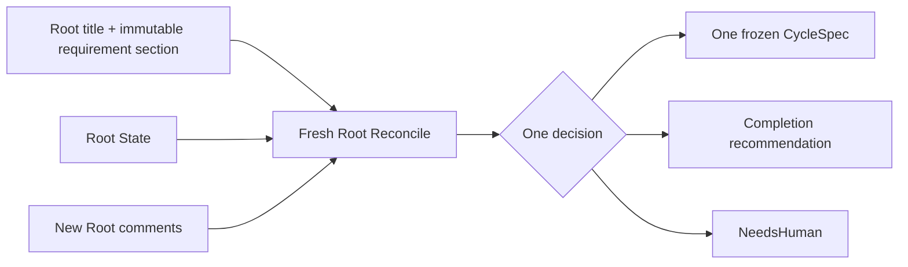

# Root Reconciliation

| Status | Owns | Does not own |
|---|---|---|
| target proposal | next-Cycle reasoning and completion recommendation from Root-owned inputs and promoted Audit fields | child-tree interpretation, workspace mutation, Linear calls, PR publication, or Podium scheduling |

Root Reconcile is the Manager's only semantic decision boundary. It runs in a
fresh Agent session with no workspace access before the first Cycle, after every
terminal Cycle, and after startup abandonment of unfinished child Issues.
If Root is already `Done`, return no-op without starting a Reconcile session or
changing any Root-owned resource. The preceding team workflow-contract check is
outside Root Reconcile and may create a missing canonical state.

After terminal, `NeedsHuman`, or startup gates, Conductor normalizes a
nonterminal Root to `Todo` before the first fresh Reconcile. Once a Cycle family
is durable, Root becomes `In Progress`; when its complete Audit result is saved
as `RootState.latest_audit`, Root becomes `In Review` and the next Reconcile
runs in that visible state. Creating another Cycle returns Root to `In Progress`;
only terminal delivery sets Root `Done`.

Its closed decision is projected onto the visible Root Issue status by
Conductor: a created active Cycle yields `In Progress`, `complete` and
`needs_human` yield `In Review`, and only a recorded PR or pushed branch
delivery yields `Done`. Reconcile chooses the semantic kind only; it never calls Linear or
selects a provider status ID.

## Rebuild boundary

Root Reconcile receives only:

```text
Root title and the immutable requirement section of the description
+ Root State current task state
+ Root State `latest_audit` (the complete newest `AuditRunResult`, when present)
+ one current pending finding
+ optional current Harness warning
+ new Root comments after the saved cursor
+ a mechanical whole-worktree file/line summary supplied by Conductor
```

Conductor strips the complete Harness-managed Root description snapshot before
building this input; that snapshot is a Linear-visible projection only and is
refreshed with a local RFC3339 `Updated at: <YYYY-MM-DDTHH:mm:ss.sss+/-HH:MM>`
line on every durable projection. It then
parses the exact Audit result Markdown once, serializes its typed
value to `cycle-NNN-audit-result.json`, reads that file back and validates it,
then writes the re-read fields to `RootState.latest_audit`, promotes trusted
fields, and writes the Cycle Result as a separate mechanical projection before
the next Reconcile. Exact Executor Markdown is appended only to the Execute
description; exact Audit Markdown is appended only to the Audit description. The
JSON file is the sole Cycle file upload, and its resource link/error is
mechanical detail only. Root Reconcile never receives the complete Root Issue
tree, the managed Root snapshot, Cycle history/result comments, Cycle DAG or
description, Execute or Audit descriptions or comments, Audit evidence beyond
`latest_audit`, raw trajectories, or canceled child content. The worktree
summary is display context only: it contains created/updated/deleted paths and
line deltas, not file contents, and cannot replace the latest Audit as semantic
evidence. Conductor may list
unfinished descendants to cancel them mechanically, but those values do not
cross the model boundary.



## Root State input

| Field | Meaning | Excluded |
|---|---|---|
| workspace, run directory, and Root branch | Conductor validates supplied paths after process restart; values are not prompt input | allocation, snapshot, or revision identity |
| Task State | compact rolling task state derived only from Succeeded Cycles | Executor claims, Audit history, or unaudited workspace inference |
| Latest Audit | complete newest typed `AuditRunResult`, including `process_error`; sole recent detail visible to Reconcile | Cycle DAG/comments, reconstructed history, or raw transcripts |
| Pending Finding | one current Rejected/Failed summary that the next Cycle must address | a finding ledger or inferred child state |
| Harness Feedback | one current runtime warning, including possible unaudited residual changes after startup abandonment | trusted progress or a replacement requirement |
| Root comment cursor | boundary after which comments are new input | full consumed-comment history |
| Token Usage | exact accumulated process counters when every invocation reported them; otherwise unknown | estimates, cost inference, or semantic progress |
| Current | idle, active Cycle reference, `NeedsHuman`, PR URL, or delivered branch | hidden route or process handle |

Root State lives in the Harness-managed suffix of the Root description and is
the durable runtime checkpoint. The same suffix contains the latest validated
Reconcile report and local-offset update time. Generated state cannot alter or
replace the Root title or immutable requirement section.

Root Reconcile has no workspace mount or workspace tools. It reasons from the
independently audited state above. When that state warns that an abandoned
process may have left unaudited changes, it can choose an inspect, repair, or
continue Cycle; it cannot inspect those changes during Reconcile itself.

## Reconcile prompt

The prompt is built by Root Reconciler, not Performer, in this fixed order:

```text
fixed Manager instructions
+ Root title and immutable requirement section
+ task_state_markdown
+ parsed `latest_audit` fields rendered as bounded Markdown, when present
+ optional pending_finding
+ optional harness_feedback
+ all new Root comments after comment_cursor
+ mechanical whole-worktree summary
```

The fixed instructions require exactly one small-step decision and forbid
claims based on workspace state that is absent from the prompt. The response
uses a small validated control header plus bounded Markdown, not a broad tool
schema or natural-language status inference:

```text
decision: cycle | complete | needs_human

## Objective / Summary / Reason
...

## Report
### decision-specific human-readable sections
```

A Cycle body also contains Acceptance and Boundaries. The caller assigns the
next Cycle number and all after-cursor comment IDs; the model cannot partially
consume the batch or select an executor route.

Root Reconcile uses its own independent role launch configuration:
`reconcile_agent`, `reconcile_model`, and `reconcile_reasoning_effort`. Execute
and Audit use their corresponding `execute_*` and `audit_*` values; no role
inherits another role's model, reasoning, or agent selection. API keys and base
URLs are resolved by the backend from role-specific environment values and are
never part of the prompt or public contract. When no override is resolved, the
fresh process keeps the user's local `~/.codex` configuration and
authentication unchanged. The three roles do not share prompts, output, or
transcripts.

| Rule | Required behavior | Forbidden behavior |
|---|---|---|
| `RR-PODIUM-001` | launch each fresh Reconcile process from the bound `reconcile_*` values | borrow Execute/Audit configuration, inspect Desktop queue state, or receive a process ID |

## Decision contract

```text
RootReconcileDecision =
  | {
      kind: create_cycle,
      cycle: {
        objective,
        acceptance,
        boundaries
      },
      report: Why Continue + Evidence + Next Cycle
    }
  | { kind: complete, summary, report: Overview + File Changes + Line Changes + Verification + Token Usage }
  | { kind: needs_human, reason, question?, report: Reason + Question + Next Step }

RootReconcileOutcome = { decision, process? }
```

The caller validates the decision, assigns `cycle_number`, attaches every
after-cursor comment ID, and freezes the `CycleSpec`. Root Reconciler does not
call Linear, render Linear Markdown, create a PR, or change Root State directly.
Conductor writes the validated report as the latest report in the managed Root
description suffix. For `create_cycle`, it also copies that exact report once to
the new Cycle as append-only history. For completion it replaces the file, line,
and token sections with its trusted worktree summary and accumulated process
counters. Missing usage stays `Unknown`; it is never estimated. These
projections do not start a second Agent call, and Cycle history comments or the
managed description suffix never re-enter Inbox.

## Small-step rule

| Rule | Required | Rejected |
|---|---|---|
| `RR-STEP-001` | one observable objective that one Execute session can attempt | broad multi-feature milestone |
| `RR-STEP-002` | explicit boundaries and concrete read-only acceptance checks | executor routing or acceptance based on Executor confidence |
| `RR-STEP-003` | every Root comment after the saved cursor enters the next Cycle together | partial consumption or historical replay |
| `RR-STEP-004` | inspect, repair, or cleanup when the pending finding or Harness feedback requires it | reopen or continue a canceled Cycle |

Input arriving after family creation remains outside that Cycle and waits for a
later Reconcile.

## Trusted Root State

| State | Derivation |
|---|---|
| Pending Finding | replace with the newest Rejected/Failed summary, or with the Auditor-supported optional value after a Succeeded Cycle |
| Task State | replace with the new Auditor-supported state only after a Succeeded Cycle |
| phase and Harness Feedback | keep at most one current operational warning; only a clean full-diff Audit may clear a workspace warning |
| comment cursor | advance only after all after-cursor comments are committed to a complete Cycle family |

There is no separate Trusted State service or entry ledger. The promotion
condition is an Audit verdict of `accepted` parsed from the exact Audit Markdown
and re-read from the persisted JSON after any terminal Execute process outcome.
Execute Markdown and exit status never establish or veto semantic success.
Conductor writes the re-read fields to `RootState.latest_audit`, promotes
trusted fields from them, and makes Root State the input to future or restarted
Reconcile sessions. Cycle Result remains a mechanical persistence and operator
projection only; Reconcile never reads the Cycle DAG. A missing/invalid
Markdown or JSON file is a visible process error, and no second summarization
Agent call repairs it.

## Comment transaction

```text
fetch after cursor -> Reconcile all new comments -> create Cycle/Execute/Audit
                   -> record family locally -> advance cursor to newest included comment
```

| Boundary | Requirement |
|---|---|
| startup | read the saved cursor from Root State; do not replay older comments |
| active Cycle | retain newer comments as pending and keep them out of Execute/Audit |
| Reconcile cannot incorporate all new comments | return `NeedsHuman`; do not advance cursor |
| family creation failure | do not advance cursor and start no Agent process |
| successful family record | advance to newest comment because the full after-cursor batch was included |
| completion recommendation | fetch once again; new input cancels the recommendation and triggers Reconcile |

User instructions in Linear mode are Root comments. There is no Dashboard or
second local injection path. Descendant comments are display-only.

## Completion

| Condition | Effect |
|---|---|
| requirement and new input are satisfied by verified Root State, with no unresolved finding or Harness warning | recommend completion; Conductor projects Root `In Review`; publication separately requires a non-empty diff |
| open finding or new input requires work | create smallest next Cycle |
| decision needs user input or this process reaches its Cycle bound | set Root State `NeedsHuman`, project Root `In Review`, and stop |
| final Inbox check finds new input | discard completion recommendation and Reconcile again |
| terminal delivery returns a PR URL or pushed branch | record it in Root State, then set Root `Done` |

Root Reconcile never marks Root `Done` itself.

## Permissions

| Capability | Allowed | Forbidden |
|---|---|---|
| workspace | no mount and no tools | read, write, inspect, commit, reset, clean, or delete |
| Linear | none directly; caller supplies Root, Root State, and new comments | GraphQL, child-tree read, Issue mutation, or comment rendering |
| context | Root requirement, trusted `latest_audit`, finding, Harness feedback, and new comments | managed snapshot, child tree/history, role content beyond `latest_audit`, workspace facts, transcripts, or metadata |
| secrets | none | `.env*`, keychains, tokens, Git or provider credentials |
