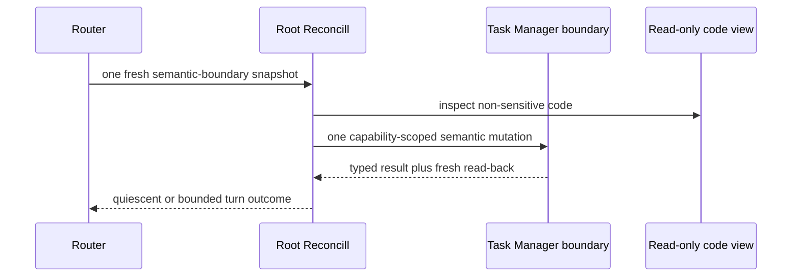
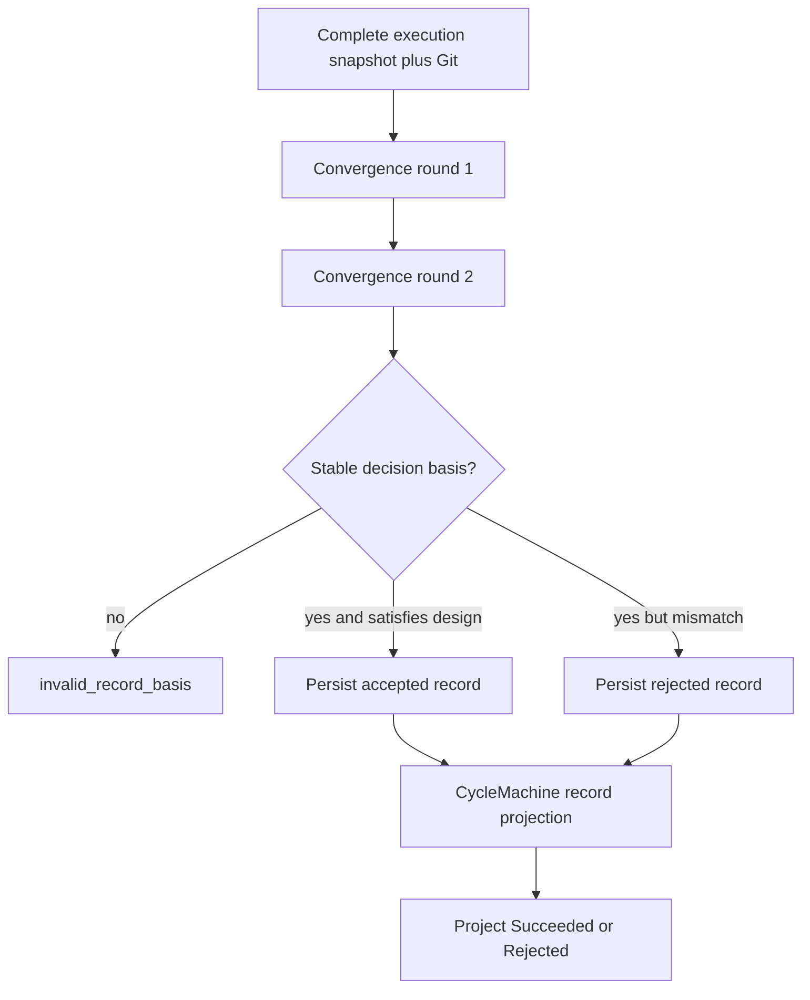

# Root Reconciliation

| Status | Owns | Does not own |
|---|---|---|
| Phase 1 target | semantic reasoning at `RootBoundary` rows | `CycleMachine` rows、accepted workflow state、durable thread/Home facts |

## Semantic boundary

## Boundary table

| Rule | Boundary | Required input | Allowed semantic output | Forbidden output |
|---|---|---|---|---|
| `RR-LOOP-001` | Define | fresh admitted Root and read-only code facts | complete Requirement、Domain Knowledge、Root ADR、Acceptance | code write、Stage design hidden outside Linear |
| `RR-LOOP-002` | Draft review | exact Cycle Draft and Root snapshot copied into it | sealed directives、fixed Work groups、approval or Draft terminal record | Plan dispatch、mutable post-approval design |
| `RR-LOOP-003` | Acceptance | sealed Cycle, every Stage record/revision, exact Git facts and convergence basis | accepted/rejected/canceled Cycle record | implementation repair、status-only accept |
| `RR-LOOP-004` | Successor | terminal predecessor and complete known graph/history proof | deterministic new Cycle Draft if policy allows | reopen predecessor、reuse thread/worktree |
| `RR-LOOP-005` | external Root semantic edit during active Cycle | fresh Root edit plus frozen active Cycle | observe as a future requirement keep current acceptance bound to the sealed snapshot quiesce | change active Cycle reject current acceptance for the newer edit inject edit into Stage context |

## Define table

| Rule | Step | Durable effect | Fresh check | Rule dependency |
|---|---|---|---|---|
| `RR-DEFINE-001` | admit delegated `Todo` Root before Define | Root `In Progress` projection | exact Root read-back | `WF-TR-001`; restart gap is `WF-RESTART-012` |
| `RR-DEFINE-002` | inspect code | none; capability is read-only and excludes secret paths | code boundary result | `RR-PERM-001` |
| `RR-DEFINE-003` | write Root definition | closed Root Markdown sections | exact document/history read-back | `RI-DOC-001` |
| `RR-DEFINE-004` | prepare first or successor Cycle | derive exact Cycle ID before create | exact-read same ID and direct parent | `RI-ID-001`, `WF-FAIL-014` |
| `RR-DEFINE-005` | write Cycle Draft | complete decision snapshot and predecessor basis | exact Cycle document read-back | `RI-DOC-002` |

## Draft review table

| Rule | Check | Required result | Rejection condition | Durable boundary |
|---|---|---|---|---|
| `RR-DRAFT-001` | requirement/ADR/design/acceptance completeness | one independently reviewable Cycle snapshot | missing or implicit decision | keep Draft or close under `WF-TR-006` |
| `RR-DRAFT-002` | implementation/verification directives | every directive has identity、text、dependencies and acceptance map verification set is non-empty | unbounded、unmapped or unconstructible Verify | keep Draft or close |
| `RR-DRAFT-003` | Work partition | exact-cover groups and dependency DAG | overlap、omission、cycle or Plan-owned grouping | keep Draft or close |
| `RR-DRAFT-004` | approval | exact record satisfies every `RI-MANIFEST-003` anchor equality | basis conflict or read-back mismatch | `WF-TR-005` only after record read-back |
| `RR-DRAFT-005` | approval record exists while Cycle is `Draft` | no semantic re-review | approval record absent or invalid | `CycleMachine` projects through `WF-ROUTE-003` |

| Draft review boundary | Allowed | Forbidden |
|---|---|---|
| before `RI-SEAL-001` | semantic review、revision、approval | independent-adversarial-review claim |
| after `RI-SEAL-001` | quiesce until a Root boundary | Plan/Work/Verify call、Cycle/Stage mutation、ready-Work selection |

## Acceptance table

| Rule | Decision | Evidence required | Durable write | Status projection |
|---|---|---|---|---|
| `RR-ACCEPT-001` | satisfies sealed design | specification/graph seals and acceptance basis all Stage revisions/record digests exact revision and convergence proof | accepted Cycle Result/Handoff with `successor_policy: not_applicable` | `WF-ROUTE-003` then `WF-TR-009` |
| `RR-ACCEPT-002` | does not satisfy sealed design or the approved requirement in the sealed Cycle snapshot | same complete evidence plus bounded reason | rejected Cycle Result/Handoff with `successor_policy: allowed` | `WF-ROUTE-003` then `WF-TR-010`; a newer external Root edit is future-only under `RR-LOOP-005` |
| `RR-ACCEPT-003` | cancellation | same complete evidence and cancel reason | canceled Cycle Result/Handoff with `successor_policy: allowed` | `WF-ROUTE-003` then `WF-TR-010` |
| `RR-ACCEPT-004` | evidence incomplete or changes between rounds | observed conflict | no semantic terminal record | fresh router selects mechanical invalidation; never accept |

| Acceptance input | Sufficient | Insufficient / excluded |
|---|---|---|
| delivered design and code | complete evidence in `RR-ACCEPT-*` plus `GD-CONVERGE-*` | Verify status/identity alone、cross-provider atomic-instant claim |

## Successor table

| Rule | Gate | Action | No action when |
|---|---|---|---|
| `RR-SUCC-001` | Root freshly delegated predecessor record and identity closure intact `successor_policy: allowed` | create one `RI-SUCC-001` Cycle | admission absent、delivery effect、partial graph、lost authoritative record、family quarantine |
| `RR-SUCC-002` | predecessor ended through external terminal invalidation | allow only if Stage-first closure and intact proof explicitly permit | `WF-FAIL-005` remains incomplete |
| `RR-SUCC-003` | newer Root requirement/ADR observed under `RR-LOOP-005` must apply | wait until current Cycle terminal copy into one new Draft never apply to current acceptance | active Cycle still non-terminal |

## Permission table

| Rule | Resource | Access | Enforcement |
|---|---|---|---|
| `RR-PERM-001` | non-sensitive user code and exact revision | read/search/compare only | filesystem and tool allowlist |
| `RR-PERM-002` | Root Home | read/write runtime fence only | exact Root-owned path |
| `RR-PERM-003` | Linear | generic Task calls constrained by `TM-CAP-001` | private capability schema |
| `RR-PERM-004` | Git/Delivery | read-only inspection and closed accepted delivery authorization | no worktree write、commit or arbitrary shell |
| `RR-PERM-005` | secrets | no access to `.env*`, keys, credential stores or remote credential config | deny before process/tool call |
| `RR-PERM-006` | Performer roles | no Plan/Work/Verify invocation | no role tool exposed |

## Turn outcome table

| Rule | Outcome | Boundary behavior | Workflow meaning |
|---|---|---|---|
| `RR-OUT-001` | `quiescent` | return to router after fresh read | no hidden next action |
| `RR-OUT-002` | `draft_closed` or `acceptance_closed` | route fixes legal closure status before return | CycleMachine later projects the exact record |
| `RR-OUT-003` | no effect before Define/delivery call | next tick may reschedule same fresh fact | not a durable failure or consumed event |
| `RR-OUT-004` | effect started but result unknown | exact provider read resolves effect | never retry from transcript or memory |
