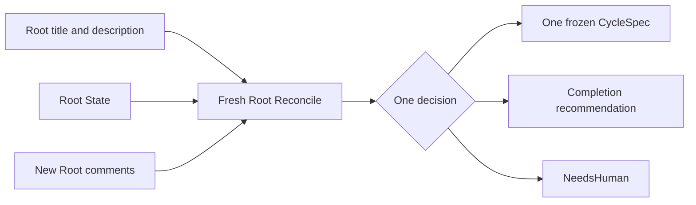

# Root Reconciliation

| Status | Owns | Does not own |
|---|---|---|
| target proposal | next-Cycle reasoning and completion recommendation from Root-owned inputs | child-tree interpretation, workspace mutation, Linear calls, or PR publication |

Root Reconcile is the Manager's only semantic decision boundary. It runs in a
fresh Agent session with no workspace access before the first Cycle, after every
terminal Cycle, and after startup abandonment of unfinished child Issues.
If Root is already `Done`, return no-op without starting a Reconcile session or changing any resource.

## Rebuild boundary

Root Reconcile receives only:

```text
Root title and description
+ Root State current task state
+ one current pending finding
+ optional current Harness warning
+ new Root comments after the saved cursor
```

It never receives the complete Root Issue tree, old Cycle descriptions, old
role comments, raw trajectories, or canceled child content. Conductor may list
unfinished descendants to cancel them mechanically, but those values do not
cross the model boundary.



## Root State input

| Field | Meaning | Excluded |
|---|---|---|
| workspace, run directory, and Root branch | Conductor validates supplied paths after process restart; values are not prompt input | allocation, snapshot, or revision identity |
| Task State | compact rolling task state derived only from Succeeded Cycles | Executor claims, Audit history, or unaudited workspace inference |
| Pending Finding | one current Rejected/Failed summary that the next Cycle must address | a finding ledger or inferred child state |
| Harness Feedback | one current runtime warning, including possible unaudited residual changes after startup abandonment | trusted progress or a replacement requirement |
| Root comment cursor | boundary after which comments are new input | full consumed-comment history |
| Current | idle, active Cycle reference, `NeedsHuman`, or PR URL | hidden route or process handle |

Root State is a Harness-owned comment on Root and the durable runtime checkpoint.
It is not a requirement source: generated state cannot alter or replace the
Root title and description.

Root Reconcile has no workspace mount or workspace tools. It reasons from the
independently audited state above. When that state warns that an abandoned
process may have left unaudited changes, it can choose an inspect, repair, or
continue Cycle; it cannot inspect those changes during Reconcile itself.

## Reconcile prompt

The prompt is built by Root Reconciler, not Performer, in this fixed order:

```text
fixed Manager instructions
+ Root title and description
+ task_state_markdown
+ optional pending_finding
+ optional harness_feedback
+ all new Root comments after comment_cursor
```

The fixed instructions require exactly one small-step decision and forbid
claims based on workspace state that is absent from the prompt. The response
uses a small validated control header plus bounded Markdown, not a broad tool
schema or natural-language status inference:

```text
decision: cycle | complete | needs_human

## Objective / Summary / Reason
...
```

A Cycle body also contains Acceptance and Boundaries. The caller assigns the
next Cycle number and all after-cursor comment IDs; the model cannot partially
consume the batch or select an executor route.

## Decision contract

```text
RootReconcileDecision =
  | {
      kind: create_cycle,
      cycle: {
        objective,
        acceptance,
        boundaries
      }
    }
  | { kind: complete, summary }
  | { kind: needs_human, reason, question? }
```

The caller validates the decision, assigns `cycle_number`, attaches every
after-cursor comment ID, and freezes the `CycleSpec`. Root Reconciler does not
call Linear, render Linear Markdown, create a PR, or change Root State directly.

## Small-step rule

| Rule | Required | Rejected |
|---|---|---|
| `RR-STEP-001` | one observable objective that one Execute session can attempt | broad multi-feature milestone |
| `RR-STEP-002` | explicit boundaries and concrete read-only acceptance checks | executor routing or acceptance based on Executor confidence |
| `RR-STEP-003` | every Root comment after the saved cursor enters the next Cycle together | partial consumption or historical replay |
| `RR-STEP-004` | inspect, repair, or cleanup when the pending finding or Harness feedback requires it | reopen or continue a canceled Cycle |

Input arriving after family creation remains outside that Cycle and waits for a
later Reconcile.

## Trusted Root State

| State | Derivation |
|---|---|
| Pending Finding | replace with the newest Rejected/Failed summary, or with the Auditor-supported optional value after a Succeeded Cycle |
| Task State | replace with the new Auditor-supported state only after a Succeeded Cycle |
| phase and Harness Feedback | keep at most one current operational warning; only a clean full-diff Audit may clear a workspace warning |
| comment cursor | advance only after all after-cursor comments are committed to a complete Cycle family |

There is no separate Trusted State service or entry ledger. The promotion
condition is an Audit verdict of `accepted` after any terminal Execute process
outcome. Execute model output and exit status never establish or veto semantic
success. Root State is updated after that result and becomes the input to future
or restarted Reconcile sessions.

## Comment transaction

```text
fetch after cursor -> Reconcile all new comments -> create Cycle/Execute/Audit
                   -> record family locally -> advance cursor to newest included comment
```

| Boundary | Requirement |
|---|---|
| startup | read the saved cursor from Root State; do not replay older comments |
| active Cycle | retain newer comments as pending and keep them out of Execute/Audit |
| Reconcile cannot incorporate all new comments | return `NeedsHuman`; do not advance cursor |
| family creation failure | do not advance cursor and start no Agent process |
| successful family record | advance to newest comment because the full after-cursor batch was included |
| completion recommendation | fetch once again; new input cancels the recommendation and triggers Reconcile |

User instructions in Linear mode are Root comments. There is no Dashboard or
second local injection path. Descendant comments are display-only.

## Completion

| Condition | Effect |
|---|---|
| requirement and new input are satisfied by verified Root State, with no unresolved finding or Harness warning | recommend completion; publication separately requires a non-empty diff |
| open finding or new input requires work | create smallest next Cycle |
| decision needs user input or this process reaches its Cycle bound | set Root State `NeedsHuman` and stop |
| final Inbox check finds new input | discard completion recommendation and Reconcile again |
| terminal PR function returns a URL | record URL in Root State, then set Root `Done` |

Root Reconcile never marks Root `Done` itself.

## Permissions

| Capability | Allowed | Forbidden |
|---|---|---|
| workspace | no mount and no tools | read, write, inspect, commit, reset, clean, or delete |
| Linear | none directly; caller supplies Root, Root State, and new comments | GraphQL, child-tree read, Issue mutation, or comment rendering |
| context | original requirement, trusted task state, current pending finding, Harness feedback, and new comments | full Root tree, Audit history, workspace facts, prior role transcripts, arbitrary metadata |
| secrets | none | `.env*`, keychains, tokens, Git or provider credentials |
