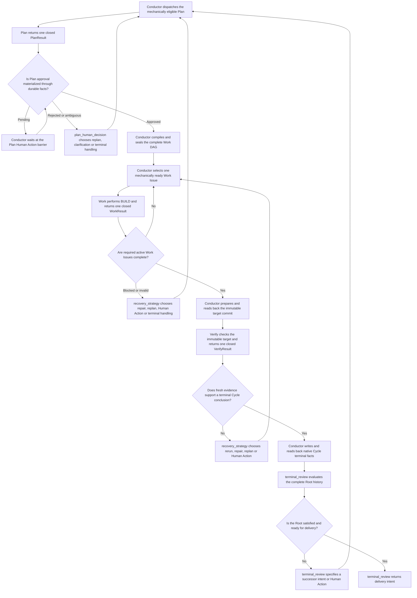

# Performer Plan、Work与Verify Contracts

状态：目标架构提案。本文是Conductor调用Performer执行Plan、Work和Verify的request/response contract、角色
thread、capability和Result语义的唯一事实源。Root semantic gates和用户comment处理由
[Root Reconciliation](root-reconciliation.md)定义。本文不定义RootSemanticIntent、deterministic transition或Human Action状态。

## 1. 决定

每个Cycle拥有三个互相隔离的执行角色thread：

```text
Plan Thread
  -> PlanTurnRequest / PlanTurnResponse

Work Thread
  -> multiple WorkTurnRequest / WorkTurnResponse across multiple Work Issues
  -> may own one bounded Work Agent Tree

Verify Thread
  -> VerifyTurnRequest / VerifyTurnResponse
```

它们与Root Reconciler thread也互相隔离。Conductor是唯一caller；Performer独占Provider SDK、thread、turn、
tool loop和Provider错误归一化。Performer不调用Linear、Conductor或Git topology。

Plan、Work和Verify Result只报告执行事实，不决定下一个Stage、不创建Human Action、不修改Cycle DAG。Result被Conductor
materialize为native Linear/Git current facts并进入下一份Root delta后，Root Reconciler才决定下一步；fresh Reconciler
session从完整bootstrap获得这些native consequences，而不是重建旧Result object。

### 1.1 Role prompt职责

三个英文Markdown prompt必须把以下职责写成明确、可执行的role instructions，但不得新增本文件后续contract中不存在
的字段或Result variant。Provider structured output、Performer codec和Conductor validation共同机械拒绝缺字段、未知字段、
错误variant、stale correlation或越权结果；prompt本身不是validation boundary。

每个prompt必须至少包含`Role and Authority`、`Trigger Conditions`、编号`Workflow`、`Anti-Rationalization`、
`Red Flags`、可验证`Exit Criteria`和`Output Contract`。涉及分支、重试或停止条件时必须使用Mermaid明确表达；
Plan、Work和Verify三个prompt都包含各自的`flowchart TD`，图只能组织现有request facts、capabilities和Result variants。
“上下文看起来足够”、“通常可以跳过”、“稍后再补证据”或类似措辞不能放宽contract、required checks或退出条件。

Cycle执行与`terminal_review`的唯一衔接如下。它不是第四个Stage；只有Cycle terminal status、Findings和matching Git evidence
已经fresh read-back后才进入该gate：



#### Plan

Plan在返回`plan_completed`前必须先完成需求拆解和计划评审：

- 从Root contract提取objective、included/excluded scope、assumptions、constraints、acceptance criteria和verification
  requirements，不得用猜测填补缺失业务要求；
- 把工作拆成粒度适中、可独立派发和验收的Work单元。每个`work_node`用现有`title`、`description`、
  `expected_outcome`和`required_checks[]`明确目标、边界、预期成果与验收方法；只有输入或repository facts支持时才写
  具体文件路径和参考模式，不能虚构路径；
- 用每个`work_node.dependency_proposal_keys[]`表达真实依赖和执行顺序，不创建另一个sequence/status字段；
- `dependency_edges[]`在Plan proposal中必须是空数组，因为materialization前还不存在可引用的Work Issue ID。并行单元
  不得制造不必要依赖，有依赖的单元必须说明上游成果如何成为下游输入；
- 证明全部Root acceptance criteria都由Work checks或Verify requirements覆盖，且Verify node可以在immutable target
  revision上独立判定；
- 评审可行性、风险、权限、遗漏、scope冲突、假设和历史失败。信息不足时返回`plan_needs_information`，无法形成安全
  计划时返回`plan_blocked`，不能为了推进流程而返回残缺的`plan_completed`。

Plan只提出Contract和DAG。它不创建Linear Issue、请求Human Action、批准自己的Plan、派发Work或选择workflow下一步。
Plan也不在Root worktree创建`SPEC.md`、`PLAN.md`、repository task checklist或其他计划文件；transient Plan Result由
Conductor渲染为Plan Issue description与native status，并fresh read-back后才成为后续角色可见的durable fact。

Plan description使用Symphony定义的canonical、用户可读Markdown结构，losslessly保留Plan Contract、每个Work的
`proposal_key`、全部dependency proposal keys和Verify proposal。它不是JSON、hidden marker或machine envelope；字段值必须经过
closed renderer/parser round-trip验证后才能进入`In Review`。自由文本展示若不能无歧义还原proposal identity，就不能作为approved
DAG authority。

#### Work

Work只完成本轮`selected_work`，遵守approved Plan Contract、dependency evidence、workspace capability和明确scope。
它应在预算内读取事实、修改授予的worktree、运行required checks、诊断普通失败并修复重试；不得顺带执行另一个Work
Issue、扩大scope、修改DAG、commit/push或声称整个Cycle完成。完成时返回实际变化、checks、artifacts、discovered facts
和evidence；假设失效、scope冲突、权限或信息缺失时使用matching现有special/blocked variant，让Root Reconciler决定
后续动作。

只有Work prompt包含[Work Subagents](work-subagents.md)定义的协作行为。Work root可以把可独立并行的bounded task交给
matching `stage_execution_id`内的descendants，但整个tree仍执行同一个selected Work Issue、共享本轮limits与workspace，
并且只有root可以生成semantic `WorkResult`。Root Reconciler、Plan和Verify不注册这些tools，也不得出现创建subagent的
instruction。

Work不得把DEFINE、Plan、REVIEW、SHIP或执行进度写成repository workflow文档。只有selected Work Issue本身明确要求
修改项目documentation时，相关文件才属于产品scope；transient Work Result由Conductor收敛为Work Issue的native
status、description以及matching Git/check facts，不在Linear保存Result object。

全部required active Work完成后，Conductor通过`GitWorkspaceInterface`机械准备并read-back用于Verify的immutable
target commit。commit message、数量和Git command不由任何prompt输出决定；HEAD、worktree coverage或read-back不满足时
不得调用Verify。Verify通过后SHIP只能交付该exact commit，不能在delivery时创建新commit或改变内容。

#### Verify

当Interrupted Verify选择current-Cycle repair时，Conductor先持久化repair Work，再机械创建fresh Verify、archive旧Verify并把Cycle
退回Executing。repair Work完成后才重新进入Verifying；fresh Verify必须独立准备并读回自己的immutable target，不能继承旧Verify的
attachment、target revision、session或terminal identity。

Verify与Plan、Work和Root Reconciler conversation隔离，并只读检查`immutable_target_revision`。它必须逐项验证approved
Plan Contract的acceptance criteria和verification requirements，检查matching Work evidence、required checks、Git facts
及unresolved findings，且每个结论都有可引用evidence。Verify不能修复代码、补做Work、改变Finding或选择下一步；证据
不足时返回`verify_inconclusive`或`verify_blocked`，发现缺陷时返回`verify_changes_required`或
`verify_plan_contract_violation`，不得把未运行或无法证明的检查记为passed。

Verify的审阅结论由Conductor从transient Verify Result渲染为Verify Issue的native status、description以及matching
Finding/Git/check facts，不能写入repository report、comment file或task checklist，也不在Linear保存Result object。

三个Stage prompt的退出条件必须绑定matching request、target、capability、evidence和closed semantic Result。任何required
input缺失、事实冲突、越权需求、未运行required check或无法验证的结论都是red flag；role必须选择matching blocked、
needs-information、inconclusive、changes-required或contract-violation variant，而不是输出不完整的success variant。
Cancel、deadline、hard budget、Provider或schema failure由Performer返回`StageTurnFailure`，不属于model output。

## 2. 公共wire envelope

三个request共享closed envelope：

```text
StageTurnRequestEnvelope
  protocol_version
  request_id
  stage_execution_id
  role: plan | work | verify
  role_session_id
  role_turn_id
  root_issue_id
  cycle_issue_id
  target_issue_id
  observed_tree_digest
  source_manifest[]
  coverage
  instruction_bundle
  role_context_update:
    StageRoleContextInitial | StageRoleContextDelta
  repository_context
  execution_policy
  limits
  context_digest
```

```text
StageTurnResponseEnvelope
  protocol_version
  request_id
  stage_execution_id
  role
  role_session_id
  role_turn_id
  root_issue_id
  cycle_issue_id
  target_issue_id
  observed_tree_digest
  context_digest
  completed_at
  model_observation: RuntimeModelObservation
  terminal:
    StageSemanticResult | StageTurnFailure

StageSemanticResult
  kind: result
  outcome: PlanResult | WorkResult | VerifyResult

PlanTurnResponse   = StageTurnResponseEnvelope(role=plan)
WorkTurnResponse   = StageTurnResponseEnvelope(role=work)
VerifyTurnResponse = StageTurnResponseEnvelope(role=verify)
```

`role`是discriminator；context、semantic result或failure必须matching。未知字段、未知variant、role/session不匹配、
source coverage不完整、digest错误或超出bound均fail closed。所有schema使用`additionalProperties: false`，由
JSON Schema生成各语言的generated codecs；生成语言集合由[契约与接口边界](contracts.md)统一定义。
`instruction_bundle`携带本轮命令、target identity和output contract identity，是validated Stage request data；它不选择、
替换或修改Performer随应用打包的role Markdown prompt，也不得重新嵌入stable role workflow、完整role context或
structured-output schema文本。base prompt resource与本轮request必须同时matching `role`，否则fail closed。
`model_observation`由Performer根据实际Provider调用填充，不属于模型structured output。它只供当前process日志、metrics和
operator诊断，不能持久化到Linear或影响restart。其语义只由[Performer Profile](performer-profiles.md)定义。

## 3. Session与turn

- 一个Cycle最多一个Plan role session、一个Work role session和一个Verify role session；
- role sessions不得共享Provider thread，也不得跨Cycle复用；
- Plan和Verify role可以有多个turn，例如Plan rejection后的fresh Plan turn或同Cycle修复后的再次Verify；
- Work role在同一Cycle跨多个Work Issues和turn持续存在，以保留实现上下文；
- Work root thread可以跨当前Cycle保留；每个Work turn创建fresh descendant epoch，descendant不能跨`stage_execution_id`复用；
- 每个turn有独立`stage_execution_id`、context digest、deadline、reservation和terminal response；
- role thread是runtime continuity，不是durable authority；thread丢失时从Linear/Git facts创建fresh role session；
- stale session/turn output不得materialize。

同一thread不会放宽每个turn的target和capability。历史conversation只能帮助执行，不能授权当前request未授予
的scope、workspace access或workflow mutation。

### 3.1 Role context初始化与增量

Plan、Work和Verify都从fresh、空Provider conversation创建，不继承Root Reconciler、另一个Stage role或前一Cycle的
conversation。创建session时，Performer先注入一次matching stable role base instructions，再注入一次role-scoped
initial context；后续turn只追加当前`instruction_bundle`和从该role已确认Provider-visible baseline计算出的context delta。
这等价于不fork任何其他role history，而不是从完整Root conversation复制后再过滤。

```text
StageRoleContextInitial
  kind: initial
  target_context_digest
  sources[]: StageRoleContextCurrentValue

StageRoleContextDelta
  kind: delta
  base_context_digest
  target_context_digest
  changes[]: StageRoleContextChange

StageRoleContextCurrentValue
  source_kind: linear_issue | linear_comment | linear_relation | git | repository_instruction
  source_id
  source_version_or_digest
  actor_kind
  observed_at
  value: PlanContextSourceValue | WorkContextSourceValue | VerifyContextSourceValue

StageRoleContextChange
  source_kind: linear_issue | linear_comment | linear_relation | git | repository_instruction
  source_id
  source_version_or_digest
  actor_kind
  observed_at
  operation:
    StageRoleContextCurrentValue {
      kind: current_value,
      value: PlanContextSourceValue | WorkContextSourceValue | VerifyContextSourceValue
    } |
    StageRoleContextReplacement {
      kind: replacement,
      replaces_source_version_or_digest,
      value: PlanContextSourceValue | WorkContextSourceValue | VerifyContextSourceValue
    } |
    StageRoleContextTombstone {
      kind: tombstone,
      removes_source_version_or_digest,
      reason: deleted | left_role_scope
    }
```

Conductor从fresh Linear/Git/repository facts构造本role允许的完整当前投影，并与该session上一次确认的
`target_context_digest`比较生成initial或delta；Performer校验base/target连续性，并只把matching initial或changes编码为
Provider incremental items。matching Result的`context_digest`确认本次Provider-visible target，二者的baseline都只存在于
runtime session state。

initial与delta是Provider可见事实的两种互斥输入。`initial`只允许出现在fresh role session的首个turn；已有且连续的
session只允许`delta`。新增immutable fact追加current-value fragment；更新追加带被替换source identity/version的
replacement；删除或不再属于matching role projection的fact追加tombstone。已进入conversation的旧fragment永不改写，
后续turn也不得把`PlanTurnContext`、`WorkTurnContext`或`VerifyTurnContext`重新完整序列化。

`source_kind + source_id`是fragment identity；version/digest只标识该identity的current value。`initial.sources[]`必须完整
列出matching role当前投影中的每个source，全部使用`current_value`，并按`source_kind, source_id` canonical排序。delta的一个
冻结批次内每个identity最多一个change：new identity使用`current_value`；existing identity只能使用且必须使用
`replacement`，其`replaces_source_version_or_digest`精确匹配base；删除或离开role projection只能使用`tombstone`，其
`removes_source_version_or_digest`精确匹配base。source kind、actor、observed time与typed value必须来自fresh事实；value union
必须同时匹配request `role`和下文该role最大事实集合。重复identity、错误variant、version不连续、cross-role value或digest
无法由canonical projection重算时，整个turn fail closed并关闭matching role session。

三个`*ContextSourceValue`都是由request `role`判别的closed union，不是arbitrary object：Plan只允许组成
`PlanTurnContext`的Root Contract、Cycle/Plan/Finding/Human Action和planning Git/repository facts；Work只允许组成
`WorkTurnContext`的approved Plan、selected/dependency/prior Work、Cycle DAG、Human Action和worktree/Git facts；Verify只允许
组成`VerifyTurnContext`的approved Plan、active/archived DAG、Work/Finding/Human Action、verification requirement、immutable
revision和repository snapshot facts。每个value variant还必须用业务含义作discriminator并引用matching closed fact schema；
不得以字段全可选的单一object、generic JSON、完整Root/Cycle blob或cross-role superset表达。

Conductor在构造Stage turn时冻结current command、matching role完整fresh projection、coverage、source manifest和
`target_context_digest`。冻结后发生的Linear/Git/repository变化只进入下一turn。projection不变时允许空`changes[]`且
base/target digest相等，只append当前`instruction_bundle`；fresh session仍必须发送非增量的完整initial，不能用空delta启动。

Cycle是Stage事实可见范围的硬上限，不是默认把完整Cycle全部注入。每个role只能接收完成当前命令所需的最小投影：

- Plan：minimal explicit Root Contract、当前Cycle trigger、current Plan target、相关prior Plan attempt Issue facts、
  approved Plan description facts、Finding Issue facts、Human Action thread facts和planning所需Git/repository facts；
- Work：approved Plan Issue description facts、当前selected Work、其dependency evidence、相关prior Work attempt
  Issue/Git/check facts、当前Cycle内必要DAG facts、Human Action thread facts以及worktree/Git facts；
- Verify：approved Plan Issue description facts、required Work Issue native status/description与checks、当前Cycle Finding Issue
  和Human Action thread facts、verification requirements以及immutable target revision和matching repository snapshot。

这里的minimal Root Contract是从Root requirement显式投影的objective、requested scope、constraints、acceptance
criteria和verification requirements；它不是Root Tree、Root Reconciler transcript或其他Cycles历史的别名。除该contract
外，Root级事实只有在matching role contract明确要求且能证明相关性时才可进入Stage initial/delta。

Stage request不得携带完整Root Tree、完整active/archived Root history、Root Reconciler conversation、另一个role的
conversation或其他Cycle context。`observed_tree_digest`、coverage、correlation、limits和Provider structured-output schema
是机械request metadata，不因存在于transport envelope就自动成为model-visible conversation item。Performer只能把
`instruction_bundle`与`role_context_update`中的允许内容追加给model。

`repository_context.workspace_root_capability`只授予matching tool boundary，不进入prompt；其中baseline revision、diff、
repository instructions或其他需要模型理解的值必须作为versioned sources进入matching role initial/delta，不能再从
`repository_context`每turn重复注入一份。transport可以为precondition validation携带这些字段的identity/digest，但不能
借此绕过Provider-visible baseline。

Performer为每个role session在runtime内独立维护Provider-visible context digest。已确认进入Provider history但尚未产生
可接受Result的facts不在同一live thread重复注入；无法证明append或baseline连续性时关闭该role session，并从Linear/Git
durable facts重建一次fresh role-scoped initial context。该baseline不持久化，不是workflow checkpoint或authority。

### 3.2 Stage session close contract

Cycle Stage close沿用一个public batch call，但不是subagent API：

```text
CloseCycleStageSessionsCommand
  protocol_version
  command_id
  root_issue_id
  cycle_issue_id
  expected_process_generation
  reason: cycle_terminal | root_canceled | routing_revoked | shutdown | profile_invalidated | runtime_fence_recovery
  deadline_at
  expected_sessions:
    plan: ExpectedStageRoleSession
    work: ExpectedStageRoleSession
    verify: ExpectedStageRoleSession

ExpectedStageRoleSession =
  | { kind: expected, role_session_id, session_generation }
  | { kind: absent }

CloseCycleStageSessionsResult
  protocol_version
  command_id
  root_issue_id
  cycle_issue_id
  process_generation
  kind: all_closed | close_incomplete
  role_results:
    plan: CloseRoleSessionResult(role=plan)
    work: CloseRoleSessionResult(role=work)
    verify: CloseRoleSessionResult(role=verify)

CloseRoleSessionResult =
  | { kind: closed, role, role_session_id: string | null, close_outcome: closed_now | already_closed | already_absent }
  | { kind: close_pending, role, role_session_id: string | null, close_reason:
        provider_shutdown_pending | workspace_fence_unproven,
      sanitized_reason, retryable: true, action_required: retry_close_only }
  | { kind: close_rejected, role, role_session_id: string | null, close_reason:
        process_generation_mismatch | session_generation_mismatch | concurrent_newer_session,
      sanitized_reason, retryable: false, action_required: refresh_runtime_state }
```

三个role keys必须exactly once且schema `additionalProperties: false`；array、missing/duplicate role或command/result correlation mismatch均
fail closed。`kind=all_closed`当且仅当三个role result都是`closed`。Transport/RPC success、Plan已关闭或Verify从未打开都不能替代该
判断；`already_absent`只在command声明`kind=absent`且current Performer generation证明没有matching session/containment时成立。

Conductor先停止该Cycle的新Stage admission，再发送包含current expected session identities的command。每个role的turn admission与
`open -> closing`使用同一CAS：close先赢则拒绝new execute；execute已admit则close先撤销matching result authority再interrupt/drain。
Work还必须在同一linearization中执行[Work Subagents](work-subagents.md#12-abortsession-close与恢复)的epoch/write/containment gate。
一个role pending不回滚其他已closed roles；retry携带fresh `command_id`和fresh expected state，并安全得到`already_closed`。同一
process generation内duplicate `command_id`不得启动第二次close，same ID不同payload直接拒绝。Process generation变化后不恢复close
ledger，只能从fresh runtime/Linear/Git facts发起新command。

`runtime_fence_recovery`只在matching `StageTurnFailure(action_required=retry_close_only)`或先前
`CloseRoleSessionResult(close_reason=workspace_fence_unproven)`仍阻塞该Root时有效。它冻结整个Cycle的Stage admission并重试同一个batch
close gate，不重放Stage request、不轮询agent tree，也不新建writer。只有`kind=all_closed`、matching outer Binding fence仍有效且
fresh Git/worktree facts读取成功后，Conductor才生成可供Root Reconciler消费的closed mechanical fact；pending/rejected结果继续保持
runtime-blocked。

## 4. 公共source、repository与limits

```text
StageContextSource
  source_kind: linear_issue | linear_comment | linear_relation | git | repository_instruction
  source_id
  version_or_digest
  actor_kind
  observed_at

StageContextCoverage
  is_complete
  omissions[]
    source_id
    reason

RepositoryContext
  workspace_root_capability
  baseline_revision
  target_revision?
  diff_summary
  repository_instructions[]

StageLimits
  max_context_bytes
  max_result_bytes
  max_output_tokens
  max_weighted_tokens
  max_tool_calls
  max_wall_time_ms
  deadline_at

StageTokenAccountingV1
  weighted_tokens = input_tokens + output_tokens
  cached_input_tokens = subset_of_input_tokens
  reasoning_tokens = subset_of_output_tokens
  weights = 1 per input/output token
  rounding = exact_integer_per_class
```

`StageLimits`是三个roles共享的closed公共边界。对于Work，weighted tokens、tool calls、wall time和deadline对root与全部
descendants整体聚合；Performer按[Work Subagents](work-subagents.md#8-tree-wide-budget与hard-reservation)派生internal
`WorkTreePolicy`和root finalization reserve。Conductor request不携带agent count、tree depth、mailbox、residency或Provider
agent-tree config。

`StageTokenAccountingV1`是`max_weighted_tokens`的versioned wire语义：cached input和reasoning只是matching total的breakdown，不能
重复相加；V1没有cache discount或fractional weight。`max_output_tokens`是每次Provider sampling的上界，必须覆盖ordinary output与
reasoning并由Provider真实强制执行；`max_weighted_tokens`是整个Stage turn的总上界。`max_wall_time_ms`从Performer接受turn时开始，
effective deadline固定为
`min(turn_started_at + max_wall_time_ms, deadline_at)`；任一limit为zero、unbounded、overflow或已过期都在dispatch前拒绝。

matching role所需的Root Contract projection、current Plan facts、target Node、dependencies、Human Action thread facts和
Git revision是matching turn的required facts。coverage证明该role projection完整，不要求把整个Root或Cycle搬进请求；被
role-scope明确排除的无关历史不属于omission。required fact缺失或静默截断必须fail closed。

下文`PlanTurnContext`、`WorkTurnContext`和`VerifyTurnContext`定义各role允许的逻辑投影；wire initial把该投影规范化为
`sources[]`，wire delta只携带这些source的typed current/replacement/tombstone。一个组合字段若来源于多个native/Git事实，
必须拆为可独立version的sources；一个source value可以包含由同一native object或同一Git observation原子读取的多个字段，
但不能把不同生命周期的source合并成无法单独replacement的聚合blob。

## 5. Plan contract

### 5.1 PlanTurnRequest

```text
PlanTurnContext
  root_contract
    objective
    requested_scope
    constraints[]
    acceptance_criteria[]
    verification_requirements[]
  cycle
    cycle_issue_id
    trigger
    predecessor_cycle?
  current_plan_issue
  prior_plan_attempt_facts[]
  prior_approved_plan_facts[]
  unresolved_finding_issue_facts[]
  human_action_thread_facts[]
  current_git_facts
  required_output
```

该结构定义Plan role initial projection及后续delta可更新的最大事实集合，不表示每个Plan turn都重新发送完整结构。

Plan is read-only. It may inspect repository and history but cannot edit files, mutateLinear, createIssues or execute
delivery. A Plan turn returns a proposal; only Root Reconciler can request materialization/review.

### 5.2 PlanResult

```text
PlanResult =
  | PlanCompletedResult
  | PlanNeedsInformationResult
  | PlanBlockedResult
```

```text
PlanCompletedResult
  kind: plan_completed
  plan_contract
    objective
    included_scope[]
    excluded_scope[]
    assumptions[]
    constraints[]
    acceptance_criteria[]
    verification_requirements[]
  proposed_work_dag
    work_nodes[]
      proposal_key
      title
      description
      expected_outcome
      required_checks[]
    dependency_edges[]
    verify_node
  risks[]
  required_permissions[]
  evidence_refs[]
```

`PlanNeedsInformationResult`只报告缺失问题、其影响和evidence；它不能创建clarification Action。
`PlanBlockedResult`报告无法形成有效Plan的closed reason和attempts。validated Plan proposal被渲染为Plan Issue的
human-readable description；native Plan ID和remote version限定其approval scope。

`proposed_work_dag.work_nodes[].dependency_proposal_keys[]`是Plan阶段唯一可解析的Work dependency identity；
Plan尚未materialize时不存在Work Issue ID，因此proposal中的`dependency_edges[]`必须为空。Conductor只在matching
approved Plan DAG materialization时把这些keys解析为`blocks` relations。materialization完成后只使用created Work/Verify
native Issue IDs、primary kind labels、parent和relations；不得创建stable key、digest marker或第二种Node identity。

## 6. Work contract

### 6.1 WorkTurnRequest

```text
WorkTurnContext
  approved_plan
    issue_id
    description
    remote_version
    approval_thread_facts
  current_active_work_dag
  selected_work
    issue_id
    title
    description
    expected_outcome
    required_checks[]
    dependency_evidence[]
  completed_work_evidence[]
  prior_work_attempt_facts[]
  human_action_thread_facts[]
  git_baseline
  workspace_capability
```

该结构定义Work role initial projection及后续delta可更新的最大事实集合，不表示每个Work turn都重新发送完整结构。

`WorkTurnRequest`只由公共envelope、该role context和role-generic `StageLimits`组成。Agent-tree concurrency、residency、depth、
mailbox、write grant和finalization reserve是Performer internal policy，不进入Conductor protocol或Provider-visible role context。

一个Cycle只有一个Work thread。Conductor在不同turn中把deterministic transition选择且机械ready的Work Issue依次交给
它。多个Work同时ready时按native Issue `order`、再按native Issue ID稳定排序；`order`必须保留在Conductor到Performer的
complete Issue fact中，不能退化为本地queue或仅按随机ID选择。Work thread可以在当前turn内部执行Claude Code式tool loop：读取代码、修改、运行命令、观察普通错误、
修复和重试，直到完成、需要外部输入或达到turn预算；也可以按[Work Subagents](work-subagents.md)在同一个Work Agent
Tree中递归delegation。

Work只能修改授予的Root worktree，不能commit、push、创建worktree、调用Linear、改变DAG或执行另一个Work Issue。
Tree内parallel mutation必须使用[Work Subagents](work-subagents.md#9-shared-worktree与机械write-grant)定义的mechanical、
per-mutation alias-safe write grant；无法机械隔离时serial exclusive-write。最终完整diff与required checks由Work root在全部grants
归还后、进入不可逆finalization前完成；finalization只做fresh inspection和tools-disabled Result sampling，随后永久retire matching
mutation epoch。发现需要调整DAG时只报告structured observation；存在业务取舍时进入`recovery_strategy`，由Conductor compiler
生成合法successor topology。

### 6.2 WorkResult

```text
WorkResult =
  | WorkCompletedResult
  | WorkBlockedResult
  | WorkPlanAssumptionInvalidResult
  | WorkScopeConflictResult
  | WorkPermissionRequiredResult
  | WorkInformationRequiredResult
```

```text
WorkCompletedResult
  kind: work_completed
  actual_changes
    baseline_revision
    observed_head_revision
    changed_paths[]
    summary
  checks[]
    check_key
    command_or_method
    outcome
    evidence_ref
  artifacts[]
  discovered_facts[]
  git_worktree_state
  evidence_refs[]
```

`baseline_revision`是turn开始时Conductor提供的worktree HEAD；
`observed_head_revision`是Work finalization barrier后观察到的同一worktree HEAD。由于Work无权commit或改变Git topology，
两者必须相等，并且Conductor只在turn返回后fresh inspection得到相同HEAD、完整status和matching changed paths时接受
`work_completed`。该字段不是immutable Verify target，也不能命名或解释为`target_revision`、commit或delivery revision。

Work Result中的`checks`是matching Work turn实际执行的structured semantic evidence；Conductor必须保留它，但不能仅因schema
有效就把`passed`升级为机械证明。全部required Work完成后的commit gate仍由Conductor按
[Git worktree与交付](git-worktree-delivery.md#4-work与immutable-verify-target)重新运行policy要求的mechanical checks，创建并
read-back唯一immutable target commit。两类check事实必须在native渲染中可区分，不能相互替代。

```text
WorkBlockedResult
  kind: work_blocked
  blocker_kind
  sanitized_reason
  attempted_approaches[]
  failed_check_evidence[]
  discovered_facts[]
  suggested_dag_changes[]
```

普通command或test失败不是自动terminal Result；Work agent应在turn预算内继续诊断。只有无法在当前target和
capability内继续时才返回blocked/specialized result。`suggested_dag_changes`只是observation，不是RootSemanticIntent或mutation program。

任何`WorkResult`都必须由Work root生成，并由Performer在matching mutation epoch永久retire、producer/activity watermark稳定且
barrier后worktree read-back成功后才可返回。Subagent final answer、status或check本身不是Stage Result或completion evidence。
若runtime无法完成该proof，Performer返回`StageTurnFailure`，不能生成一个`execution_failed` WorkResult冒充root output。

## 7. Verify contract

### 7.1 VerifyTurnRequest

```text
VerifyTurnContext
  approved_plan
    issue_id
    description
    remote_version
    approval_thread_facts
  complete_active_cycle_dag
  archived_cycle_nodes[]
  completed_work_issue_facts[]
  unresolved_finding_issue_facts[]
  human_action_thread_facts[]
  verification_requirements[]
  immutable_target_revision
  repository_snapshot
```

该结构定义Verify role initial projection及后续delta可更新的最大事实集合，不表示每个Verify turn都重新发送完整结构，
也不表示从Linear重建或持久化过往Work Result object。

Verify使用独立、read-only thread，不继承Plan、Work或Root Reconciler conversation。它不能修改文件、补做Work、
修改DAG、创建Human Action或改变Finding状态。每个Result绑定immutable target revision。

### 7.2 VerifyResult

```text
VerifyResult =
  | VerifyPassedResult
  | VerifyChangesRequiredResult
  | VerifyInconclusiveResult
  | VerifyPlanContractViolationResult
  | VerifyBlockedResult
```

```text
VerifyPassedResult
  kind: verify_passed
  target_revision
  acceptance_results[]
  checks[]
  resolved_finding_ids[]
  evidence_refs[]

VerifyChangesRequiredResult
  kind: verify_changes_required
  target_revision
  acceptance_results[]
  findings[]
    finding_id
    severity
    description
    evidence_refs[]
    related_work_issue_ids[]
  checks[]
```

```text
VerifyInconclusiveResult
  kind: verify_inconclusive
  target_revision
  missing_evidence[]
  attempted_methods[]
  retryable
```

Conductor验证target revision和evidence，将Result materialize为native Linear/Git facts并fresh read-back后交给Root
Reconciler。Conductor不把
`verify_changes_required`机械映射为successor Cycle；Root Reconciler可以在当前Cycle预算内继续Work，也可以提出
repair conclusion。

非Finding terminal Result进入recovery时，`Failed`或`Done`只提供lifecycle closure，不提供业务分类。Conductor必须用role、Cycle phase、
terminal status、canonical `## Outcome`以及current Symphony actor/version共同构造exact Stage recovery subject；任一不匹配都停止。
`verify_changes_required`例外：其Finding Issues和关系是native recovery authority，不能用Verify的通用terminal status替代。
全部Finding postcondition确认后，recovery subject按一个Verify拥有的完整Todo/In Progress Finding set冻结；单Finding逐次决策过细，无法保持
跨Finding策略一致性，单一存在性标志过粗，无法在restart后证明版本与关系未变。集合digest覆盖Cycle current version、Verify、开放Finding及其全部关系；waiver请求
target集合中的每个Finding且不改变任何Stage或Finding lifecycle。
当accepted purpose结束该Cycle时，唯一即时effect是owning Cycle terminal update；Changes Required Verify和全部Finding evidence保持不变。
fresh transition随后把Verify分类为failed、Finding分类为open并进入non-success review，不能把Cycle closure解释为Finding resolution。

普通Verify admission不是Root选择。全部required Work为Done后，Conductor先完成writer revocation、mechanical required checks、
immutable commit及Todo Verify上的exact revision attachment read-back；只有fresh Git证明clean HEAD与该attachment完全一致时才机械dispatch。
Verify Result返回后Conductor再次fresh-read Git并验证同一revision，不能只与turn开始时的内存snapshot比较。

`resolved_finding_ids`只能引用matching Cycle中的native Finding Issue ID。`verify_passed` terminalization前，Conductor逐个验证Finding仍属
该Cycle、未archive且处于可解决状态，将其机械收敛为Done并targeted read-back；missing、cross-Cycle、ambiguous或无法确认的Finding
均fail closed。`verify_changes_required`产生的每个Finding Issue及每条Verify/Work relation同样是独立postcondition，partial acceptance
必须从native facts续做，不得重新调用Verify来重放已经接受的semantic Result。

为使该desired set跨restart可恢复，Conductor在第一个Finding mutation前先把完整`verify_changes_required`结论和每个Finding的category、
severity、statement、evidence及related Work写成Verify Issue description中的human-readable canonical Markdown section，保持Verify
`In Progress`并fresh read-back。该section不是JSON、隐藏marker或parallel Result object；它就是matching Verify的native visible evidence。
只有complete source manifest证明当前Verify version由Symphony写入时，fresh runtime才可解析该section并继续剩余Finding effects；human或
external automation改写的同形文本只能进入普通interruption/recovery路径。全部Finding postconditions确认后才把同一description和label
收敛为Verify Done。

## 8. Mechanical StageTurnFailure

```text
StageTurnFailure
  kind: runtime_failure
  failure_kind:
    canceled
    | deadline_exceeded
    | budget_exhausted
    | provider_failure
    | output_invalid
    | work_epoch_closure_failed
    | workspace_fence_unproven
  error_code:
    turn_canceled | target_invalidated | session_closing
    | turn_deadline_exceeded
    | weighted_token_budget_exhausted | tool_call_budget_exhausted
    | wall_time_budget_exhausted | root_finalization_reserve_exhausted
    | provider_append_not_accepted | provider_append_acceptance_unknown
    | provider_session_lost | provider_transport_failed | provider_budget_bound_unavailable
    | provider_output_schema_invalid | provider_output_oversized | provider_output_correlation_invalid
    | work_epoch_activity_after_candidate | work_epoch_registry_incomplete
    | work_completion_unacked | work_budget_unsettled | work_finalization_evidence_stale
    | workspace_write_revocation_unproven | mutation_containment_unproven
    | session_containment_unproven
  sanitized_reason
  retryable
  action_required: root_reconciliation | retry_close_only
  continuity: ProviderTurnContinuity
```

`StageTurnFailure`由Performer runtime生成，不是Plan/Work/Verify structured model output。Provider transport/crash/schema failure、
external cancel、hard deadline/budget和Work tree closure/fence failure必须与business blocked区分。只有validated semantic Result
可以materialize业务结论；failure在required runtime fencing后只形成closed mechanical fact。唯一合法的failure consequence由
Conductor收敛；存在业务取舍时才进入fresh `recovery_strategy` gate。Failure不能伪造业务Result、resumable facts或failure payload
comment；sanitized detail只进入runtime observation。`ProviderTurnContinuity`语义只由
[Performer](performer.md#52-provider-append确认与失败)定义。

`failure_kind`、`error_code`、continuity、`retryable`和`action_required`是一个closed validated组合，不能自由配对：

| failure_kind | allowed error-code family | action / retry |
|---|---|---|
| `canceled` | `turn_canceled` / `target_invalidated` / `session_closing` | `root_reconciliation`, `retryable=false` |
| `deadline_exceeded` | `turn_deadline_exceeded` | `root_reconciliation`, `retryable=false` |
| `budget_exhausted` | four `*_budget_exhausted` codes | `root_reconciliation`, `retryable=false` |
| `provider_failure` | five `provider_*` transport/continuity/budget-bound codes | `root_reconciliation`, `retryable=false` |
| `output_invalid` | three `provider_output_*` codes | `root_reconciliation`, `retryable=false` |
| `work_epoch_closure_failed` | five `work_*` codes | `root_reconciliation`, `retryable=false` |
| `workspace_fence_unproven` | three workspace/containment codes | `retry_close_only`, `retryable=true` |

这里的`retryable`只允许retry matching generic close，不授权重放Stage request；新的Stage turn始终需要fresh Root Reconciler action。
`workspace_fence_unproven`只报告Root runtime-blocked，不能形成可推进Root的mechanical fact；只有后续close success和fresh Git facts
完成后才能进入`root_reconciliation`。

`provider_budget_bound_unavailable`表示Provider在dispatch前无法给出并强制执行token true upper bound。Completion后的usage缺失不是该
failure：Performer保留完整reservation并把`RuntimeModelObservation`标为unavailable，不改变workflow事实。

Work failure中的public `continuity`只描述persistent Work root Provider thread。Descendant continuity、thread ID和append outcome保持
epoch-internal并在retire/fence时丢弃。Child ambiguity在能够证明thread、context和containment与root隔离时不改变root continuity；任一
隔离证明缺失都机械升级为root `continuity.kind=closed`，并关闭整个Work role session，不能任选child或root状态报告。

## 9. Human input边界

Plan、Work、Verify不能创建Human Action。它们只能通过typed Result报告：

```text
information_required
permission_required
plan_assumption_invalid
scope_conflict
verification_blocked
```

Conductor materialize native result facts后，Root Reconciler决定是否请求Human Action、调整DAG、继续执行或结束Cycle。
resolved Human Action thread在Conductor验证后作为current native facts进入matching下一turn。

## 10. Result与materialization

Performer可以返回bounded runtime progress/heartbeat/tool summary，但它不决定业务完成、不写Linear，也不成为恢复输入。
每个turn必须有一个closed terminal response：matching semantic Result或mechanical `StageTurnFailure`。Conductor不得把transport
exception自行转换成看似model生成的Result；未收到closed response时按同一runtime-failure contract fail closed。

Semantic Result接受顺序固定：

```text
fresh-read Root/Cycle/target/Git preconditions
-> validate wire schema, role/session/turn correlation and context digest
-> validate target revision and capability-specific evidence
-> materialize native Issue/status/label/relation/comment/Finding/Git postconditions
-> fresh semantic read-back
-> emit sanitized runtime model/usage observation
-> rebuild complete native Root object graph
-> derive and advance Root delta, or bootstrap a fresh Reconciler session
```

Plan Result渲染为Plan description和status；Work Result渲染为Work status、Git/check evidence和必要的简短comment；Verify
Result渲染为Verify conclusion label/status、Finding Issues、Git revision和必要的简短comment。具体native事实由
[Root Issue工作流](root-issue.md)定义。

只有用户理解结论所必需的内容才写comment。comment不得包含transport Result、model/usage、session/turn correlation、
machine serialization或内部“已记录”receipt。native postcondition read-back失败时matching Root停止，不能以runtime Result
或日志代替。

## 11. Provider boundary与安全

```text
ProviderBackendInterface
  open_role_session(role, settings)
  execute_role_turn(session, request, workspace_capability?)
  close_role_session(session)
```

Work backend还实现turn-epoch begin/execute/seal/abort和role-session close internal capability；字段与fencing语义只见
[Work Subagents](work-subagents.md)，不得扩展成Conductor操纵subagent的public API。

只有Performer backend使用Provider SDK。公共contract不能包含SDK object、raw Provider thread ID、Token、
credential path、raw reasoning或完整transcript。Performer映射model、effort、sandbox、deadline、interrupt和
structured output；无法表达execution policy时fail closed。

Plan和Verify必须read-only；Work是workspace-write。每个turn执行weighted tokens、wall time、context bytes、result bytes、
tool calls和output token limits。取消、Root routing/process generation变化、Cycle terminal或archive active target时，
Conductor使matching turn/session失效并拒绝late output。Work只有在matching write capability永久撤销且required runtime
containment proof成立后才释放Root writer domain；PID或process-group exit不是充分证明。

## 12. 不变量

1. 每个Cycle的Plan、Work、Verify使用三个不同Provider thread。
2. Work thread跨当前Cycle多个Work Issues和turn复用，但每turn只执行一个selected target。
3. Plan/Work/Verify都不决定下一步、不修改DAG、不创建Human Action。
4. 所有request/terminal response是closed、versioned、generated的强类型contract。
5. Conductor是唯一caller；Performer不反向调用Conductor。
6. Result必须materialize为native Linear/Git facts并read-back后才能交给Root Reconciler。
7. Provider thread不是durable authority；丢失后从Linear/Git facts恢复。
8. Plan/Verify read-only，Work只能修改授予的Root worktree。
9. 实际model和usage只作为runtime observation；缺失观测不能伪造workflow事实。
10. Plan必须在现有Plan Contract和DAG字段中完整表达任务单元、scope、依赖顺序和验收覆盖；残缺或冲突的
    `plan_completed`不能推进Plan review或DAG materialization。
11. Work只执行selected target；Verify只验证immutable target。二者的Result都是Root Reconciler输入，不拥有下一步语义。
12. 只有Work role可以创建subagent；descendants不成为Stage或workflow nodes，也不能跨Work turn复用。
13. 只有Work root生成semantic WorkResult；Performer生成mechanical StageTurnFailure，二者不可互相伪造。
14. Work Result离开Performer前必须永久retire matching mutation epoch并验证barrier后worktree evidence。
