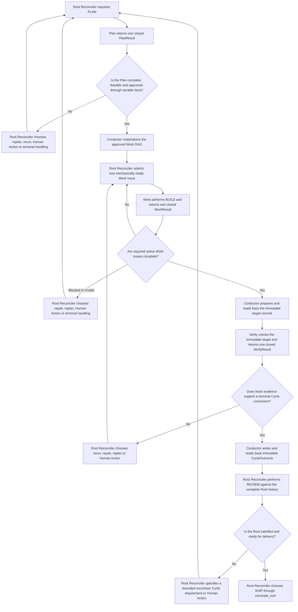

# Performer Plan、Work与Verify Contracts

状态：目标架构提案。本文是Conductor调用Performer执行Plan、Work和Verify的request/result contract、角色
thread、capability和Result语义的唯一事实源。Root/Cycle下一步和用户comment处理由
[Root Reconciliation](root-reconciliation.md)决定。本文不定义Root directive或Human Action状态。

## 1. 决定

每个Cycle拥有三个互相隔离的执行角色thread：

```text
Plan Thread
  -> only PlanTurnRequest / PlanResult

Work Thread
  -> multiple WorkTurnRequest / WorkResult across multiple Work Issues

Verify Thread
  -> only VerifyTurnRequest / VerifyResult
```

它们与Root Reconciler thread也互相隔离。Conductor是唯一caller；Performer独占Provider SDK、thread、turn、
tool loop和Provider错误归一化。Performer不调用Linear、Conductor或Git topology。

Plan、Work和Verify Result只报告执行事实，不决定下一个Stage、不创建Human Action、不修改Cycle DAG。Result
被Conductor持久化并进入下一份Root delta后，Root Reconciler才决定下一步；fresh Reconciler session则从完整
bootstrap获得该Result。

### 1.1 Role prompt职责

三个英文Markdown prompt必须把以下职责写成明确、可执行的role instructions，但不得新增本文件后续contract中不存在
的字段或Result variant。Provider structured output、Performer codec和Conductor validation共同机械拒绝缺字段、未知字段、
错误variant、stale correlation或越权结果；prompt本身不是validation boundary。

每个prompt必须至少包含`Role and Authority`、`Trigger Conditions`、编号`Workflow`、`Anti-Rationalization`、
`Red Flags`、可验证`Exit Criteria`和`Output Contract`。涉及分支、重试或停止条件时必须使用Mermaid明确表达；
Plan、Work和Verify三个prompt都包含各自的`flowchart TD`，图只能组织现有request facts、capabilities和Result variants。
“上下文看起来足够”、“通常可以跳过”、“稍后再补证据”或类似措辞不能放宽contract、required checks或退出条件。

Cycle执行与Root REVIEW的唯一衔接如下。`REVIEW`不是第四个Stage；它只在Cycle已经terminal、immutable
`CycleOutcome`已经durable read-back后，由Root Reconciler在后续turn执行：



#### Plan

Plan在返回`plan_completed`前必须先完成需求拆解和计划评审：

- 从Root contract提取objective、included/excluded scope、assumptions、constraints、acceptance criteria和verification
  requirements，不得用猜测填补缺失业务要求；
- 把工作拆成粒度适中、可独立派发和验收的Work单元。每个`work_node`用现有`title`、`description`、
  `expected_outcome`和`required_checks[]`明确目标、边界、预期成果与验收方法；只有输入或repository facts支持时才写
  具体文件路径和参考模式，不能虚构路径；
- 用每个`work_node.dependency_proposal_keys[]`表达真实依赖和执行顺序，不创建另一个sequence/status字段；
  `dependency_edges[]`在Plan proposal中必须是空数组，因为materialization前还不存在可引用的Work Issue ID。并行单元
  不得制造不必要依赖，有依赖的单元必须说明上游成果如何成为下游输入；
- 证明全部Root acceptance criteria都由Work checks或Verify requirements覆盖，且Verify node可以在immutable target
  revision上独立判定；
- 评审可行性、风险、权限、遗漏、scope冲突、假设和历史失败。信息不足时返回`plan_needs_information`，无法形成安全
  计划时返回`plan_blocked`，不能为了推进流程而返回残缺的`plan_completed`。

Plan只提出Contract和DAG。它不创建Linear Issue、请求Human Action、批准自己的Plan、派发Work或选择workflow下一步。
Plan也不在Root worktree创建`SPEC.md`、`PLAN.md`、repository task checklist或其他计划文件；Plan Result由Conductor持久化到Linear。

#### Work

Work只完成本轮`selected_work`，遵守approved Plan Contract、dependency evidence、workspace capability和明确scope。
它应在预算内读取事实、修改授予的worktree、运行required checks、诊断普通失败并修复重试；不得顺带执行另一个Work
Issue、扩大scope、修改DAG、commit/push或声称整个Cycle完成。完成时返回实际变化、checks、artifacts、discovered facts
和evidence；假设失效、scope冲突、权限或信息缺失时使用matching现有special/blocked variant，让Root Reconciler决定
后续动作。

Work不得把DEFINE、Plan、REVIEW、SHIP或执行进度写成repository workflow文档。只有selected Work Issue本身明确要求
修改项目documentation时，相关文件才属于产品scope；workflow状态和证据仍只通过Work Result进入Linear。

全部required active Work完成后，Conductor通过`GitWorkspaceInterface`机械准备并read-back用于Verify的immutable
target commit。commit message、数量和Git command不由任何prompt输出决定；HEAD、worktree coverage或read-back不满足时
不得调用Verify。Verify通过后SHIP只能交付该exact commit，不能在delivery时创建新commit或改变内容。

#### Verify

Verify与Plan、Work和Root Reconciler conversation隔离，并只读检查`immutable_target_revision`。它必须逐项验证approved
Plan Contract的acceptance criteria和verification requirements，检查matching Work evidence、required checks、Git facts
及unresolved findings，且每个结论都有可引用evidence。Verify不能修复代码、补做Work、改变Finding或选择下一步；证据
不足时返回`verify_inconclusive`或`verify_blocked`，发现缺陷时返回`verify_changes_required`或
`verify_plan_contract_violation`，不得把未运行或无法证明的检查记为passed。

Verify的审阅结论只通过Verify Result进入Linear，不能写入repository report、comment file或task checklist。

三个Stage prompt的退出条件必须绑定matching request、target、capability、evidence和closed Result。任何required
input缺失、事实冲突、越权需求、未运行required check或无法验证的结论都是red flag；role必须选择matching
blocked、needs-information、inconclusive、changes-required、contract-violation或execution failure variant，而不是
输出不完整的success variant。schema-invalid输出由机械边界拒绝，不能通过自然语言解释、重试猜测或fallback推进。

## 2. 公共wire envelope

三个request共享closed envelope：

```text
StageTurnRequestEnvelope
  protocol_version
  request_id
  stage_execution_id
  role: plan | work | verify
  role_session_id
  role_turn_id
  root_issue_id
  cycle_issue_id
  target_issue_id
  observed_tree_digest
  source_manifest[]
  coverage
  instruction_bundle
  workflow_context:
    PlanTurnContext | WorkTurnContext | VerifyTurnContext
  repository_context
  execution_policy
  limits
  context_digest
```

```text
StageTurnResultEnvelope
  protocol_version
  request_id
  stage_execution_id
  role
  role_session_id
  role_turn_id
  root_issue_id
  cycle_issue_id
  target_issue_id
  observed_tree_digest
  context_digest
  completed_at
  model_turn: ModelTurnRecord
  outcome:
    PlanResult | WorkResult | VerifyResult
```

`role`是discriminator；context和result variant必须matching。未知字段、未知variant、role/session不匹配、
source coverage不完整、digest错误或超出bound均fail closed。所有schema使用`additionalProperties: false`，由
JSON Schema生成各语言的generated codecs；生成语言集合由[契约与接口边界](contracts.md)统一定义。
`instruction_bundle`携带本轮目标和output contract identity，是validated Stage request data；它不选择、替换或修改
Performer随应用打包的role Markdown prompt。base prompt resource与本轮request必须同时matching `role`，否则fail closed。
`model_turn`由Performer根据实际Provider调用填充，不属于模型structured output；它在每个terminal outcome都
required，且其中的`model`和`usage`是该turn唯一的用量事实，不能在envelope顶层复制。`TurnUsage`及聚合语义只由
[Performer Profile](performer-profiles.md)定义。

## 3. Session与turn

- 一个Cycle最多一个Plan role session、一个Work role session和一个Verify role session；
- role sessions不得共享Provider thread，也不得跨Cycle复用；
- Plan和Verify role可以有多个turn，例如Plan rejection后的fresh Plan turn或同Cycle修复后的再次Verify；
- Work role在同一Cycle跨多个Work Issues和turn持续存在，以保留实现上下文；
- 每个turn有独立`stage_execution_id`、context digest、deadline、reservation和terminal Result；
- role thread是runtime continuity，不是durable authority；thread丢失时从Linear/Git facts创建fresh role session；
- stale session/turn output不得materialize。

同一thread不会放宽每个turn的target和capability。历史conversation只能帮助执行，不能授权当前request未授予
的scope、workspace access或workflow mutation。

## 4. 公共source、repository与limits

```text
StageContextSource
  source_kind: linear_issue | linear_comment | linear_relation | git | repository_instruction
  source_id
  version_or_digest

StageContextCoverage
  is_complete
  omissions[]
    source_id
    reason

RepositoryContext
  workspace_root_capability
  baseline_revision
  target_revision?
  diff_summary
  repository_instructions[]

StageLimits
  max_context_bytes
  max_result_bytes
  max_output_tokens
  max_tool_calls
  max_wall_time_ms
  deadline_at
```

Root objective、current Plan Contract、target Node、dependencies、Human resolutions和Git revision是matching
turn的required input。非必要历史可以省略，但必须在coverage中列出source identity和原因；不能静默截断。

## 5. Plan contract

### 5.1 PlanTurnRequest

```text
PlanTurnContext
  root_contract
    objective
    requested_scope
    constraints[]
    acceptance_criteria[]
  cycle
    cycle_issue_id
    trigger
    predecessor_cycle?
  current_plan_issue
  prior_plan_results[]
  prior_plan_contracts[]
  unresolved_findings[]
  human_resolutions[]
  current_git_facts
  required_output
```

Plan is read-only. It may inspect repository and history but cannot edit files, mutateLinear, createIssues or execute
delivery. A Plan turn returns a proposal; only Root Reconciler can request materialization/review.

### 5.2 PlanResult

```text
PlanResult =
  | PlanCompletedResult
  | PlanNeedsInformationResult
  | PlanBlockedResult
  | StageBudgetExhaustedResult
  | StageCanceledResult
  | StageExecutionFailedResult
```

```text
PlanCompletedResult
  kind: plan_completed
  plan_contract
    objective
    included_scope[]
    excluded_scope[]
    assumptions[]
    constraints[]
    acceptance_criteria[]
    verification_requirements[]
  proposed_work_dag
    work_nodes[]
      proposal_key
      title
      description
      expected_outcome
      required_checks[]
    dependency_edges[]
    verify_node
  risks[]
  required_permissions[]
  evidence_refs[]
```

`PlanNeedsInformationResult`只报告缺失问题、其影响和evidence；它不能创建clarification Action。
`PlanBlockedResult`报告无法形成有效Plan的closed reason和attempts。Plan Contract digest由Conductor对validated
canonical Result计算并持久化，不信任模型自报digest。

`proposed_work_dag.work_nodes[].dependency_proposal_keys[]`是Plan阶段唯一可解析的Work dependency identity；
Plan尚未materialize时不存在Work Issue ID，因此proposal中的`dependency_edges[]`必须为空。Conductor只在matching
approved Contract DAG materialization时把这些keys解析为
`blocks` relations，并为每个created Work/Verify写唯一的`WorkflowIssueRecord`。已批准Contract的digest binding由matching
`MaterializeApprovedPlanDagDirective`、immutable `PlanContractRecord`和Plan relation证明；不得创建或读取`NodeMarker`、
description digest marker或第二种Node identity record。

## 6. Work contract

### 6.1 WorkTurnRequest

```text
WorkTurnContext
  approved_plan_contract
  current_active_work_dag
  selected_work
    issue_id
    title
    description
    expected_outcome
    required_checks[]
    dependency_evidence[]
  completed_work_evidence[]
  prior_turn_results[]
  human_resolutions[]
  git_baseline
  workspace_capability
```

一个Cycle只有一个Work thread。Conductor在不同turn中把Root Reconciler选择且机械ready的Work Issue依次交给
它。Work thread可以在当前turn内部执行Claude Code式tool loop：读取代码、修改、运行命令、观察普通错误、
修复和重试，直到完成、需要外部输入或达到turn预算。

Work只能修改授予的Root worktree，不能commit、push、创建worktree、调用Linear、改变DAG或执行另一个
Work Issue。发现需要调整DAG时只报告structured observation；Root Reconciler决定是否提出Tree patch。

### 6.2 WorkResult

```text
WorkResult =
  | WorkCompletedResult
  | WorkBlockedResult
  | WorkPlanAssumptionInvalidResult
  | WorkScopeConflictResult
  | WorkPermissionRequiredResult
  | WorkInformationRequiredResult
  | StageBudgetExhaustedResult
  | StageCanceledResult
  | StageExecutionFailedResult
```

```text
WorkCompletedResult
  kind: work_completed
  actual_changes[]
  checks[]
    check_key
    command_or_method
    outcome
    evidence_ref
  artifacts[]
  discovered_facts[]
  git_worktree_state
  evidence_refs[]
```

```text
WorkBlockedResult
  kind: work_blocked
  blocker_kind
  sanitized_reason
  attempted_approaches[]
  failed_check_evidence[]
  discovered_facts[]
  suggested_dag_changes[]
```

普通command或test失败不是自动terminal Result；Work agent应在turn预算内继续诊断。只有无法在当前target和
capability内继续时才返回blocked/specialized result。`suggested_dag_changes`只是observation，不是directive。

## 7. Verify contract

### 7.1 VerifyTurnRequest

```text
VerifyTurnContext
  approved_plan_contract
  complete_active_cycle_dag
  archived_cycle_nodes[]
  completed_work_results[]
  unresolved_findings[]
  human_resolutions[]
  verification_requirements[]
  immutable_target_revision
  repository_snapshot
```

Verify使用独立、read-only thread，不继承Plan、Work或Root Reconciler conversation。它不能修改文件、补做Work、
修改DAG、创建Human Action或改变Finding状态。每个Result绑定immutable target revision。

### 7.2 VerifyResult

```text
VerifyResult =
  | VerifyPassedResult
  | VerifyChangesRequiredResult
  | VerifyInconclusiveResult
  | VerifyPlanContractViolationResult
  | VerifyBlockedResult
  | StageBudgetExhaustedResult
  | StageCanceledResult
  | StageExecutionFailedResult
```

```text
VerifyPassedResult
  kind: verify_passed
  target_revision
  acceptance_results[]
  checks[]
  resolved_finding_ids[]
  evidence_refs[]

VerifyChangesRequiredResult
  kind: verify_changes_required
  target_revision
  acceptance_results[]
  findings[]
    finding_id
    severity
    description
    evidence_refs[]
    related_work_issue_ids[]
  checks[]
```

```text
VerifyInconclusiveResult
  kind: verify_inconclusive
  target_revision
  missing_evidence[]
  attempted_methods[]
  retryable
```

Conductor验证target revision和evidence，持久化Result后交给Root Reconciler。Conductor不把
`verify_changes_required`机械映射为successor Cycle；Root Reconciler可以在当前Cycle预算内继续Work，也可以提出
repair conclusion。

## 8. 公共terminal variants

```text
StageBudgetExhaustedResult
  kind: budget_exhausted
  budget_kind
  attempted_approaches[]
  resumable_facts[]

StageCanceledResult
  kind: canceled
  sanitized_reason

StageExecutionFailedResult
  kind: execution_failed
  error_code
  sanitized_reason
  retryable
```

Provider transport/crash/schema failure与业务blocked必须区分。只有validated Result能进入Linear；无业务Result的
process failure仍必须写包含model、`TurnUsage`和closed failure outcome的`ModelTurnRecord`及execution failure record，
再由下一份Root delta处理，不能伪造业务结论。usage无法取得时使用显式`unavailable` variant。

## 9. Human input边界

Plan、Work、Verify不能创建Human Action。它们只能通过typed Result报告：

```text
information_required
permission_required
plan_assumption_invalid
scope_conflict
verification_blocked
```

Conductor持久化Result后，Root Reconciler决定是否请求Human Action、调整DAG、继续执行或结束Cycle。
resolved Human Action在Conductor验证后作为closed `human_resolutions[]`进入matching下一turn。

## 10. Event、Result与materialization

Performer可以返回bounded progress/heartbeat/tool summary Event，但Event不决定业务完成，也不成为恢复输入。
每个turn必须有一个terminal Result，或由Conductor记录process/transport failure。

Result接受顺序固定：

```text
fresh-read Root/Cycle/target/Git preconditions
-> validate wire schema, role/session/turn correlation and context digest
-> validate target revision and capability-specific evidence
-> persist immutable Result with nested ModelTurnRecord in one managed Stage comment and one `json` block
-> semantic read-back
-> settle token reservation
-> derive and materialize Stage/Cycle/Root usage snapshots from fresh Linear turn records
-> rebuild complete Root Tree
-> derive and advance Root delta, or bootstrap a fresh Reconciler session
```

### 10.1 Stage Result comment

每次已验证的Plan、Work或Verify Result必须在matching Stage Issue追加一条canonical managed comment。该comment是
执行事实唯一的用户可见载体：上半部分由closed renderer输出结构化Markdown，末尾唯一`json` block承载Result与
nested `ModelTurnRecord`。它不是Cycle timeline、Root Reconciler reply或第二份usage comment。

````markdown
## Symphony · <Plan | Work | Verify>

<concise verified outcome>

**Result**
<completed, blocked, failed, canceled or verification conclusion; do not present a proposal as complete>

**Evidence**
- <bounded check, finding, artifact, Linear or Git reference>

**Usage**
- Model: <actual invoked model>
- This turn: <measured usage or explicit unavailable reason>
- This Issue: <derived cumulative usage by model and completeness>

**Next**
<the Root Reconciler will evaluate the durable result; do not promise a directive not yet accepted>

```json
{"kind":"<plan_result | work_result | verify_result>","version":1,"record_id":"...",...}
```
````

没有对应事实的section省略；renderer允许heading、列表、表格、链接、引用和非`json` code block，但不输出raw
reasoning、secret或未经验证的Provider text。实际wire fields和Result variants只由generated schema定义；该模板不增加
第二份Result、status、usage或恢复语义。comment与block必须在同一次required Linear materialization中read-back；失败时
matching Root停止，不能以runtime Result、timeline或日志代替。

## 11. Provider boundary与安全

```text
ProviderBackendInterface
  open_role_session(role, settings)
  execute_role_turn(session, request, workspace_capability?)
  close_role_session(session)
```

只有Performer backend使用Provider SDK。公共contract不能包含SDK object、raw Provider thread ID、Token、
credential path、raw reasoning或完整transcript。Performer映射model、effort、sandbox、deadline、interrupt和
structured output；无法表达execution policy时fail closed。

Plan和Verify必须read-only；Work是workspace-write。每个turn执行wall time、context bytes、result bytes、tool
calls和output token limits。取消、Root ownership变化、Cycle terminal或archive active target时，Conductor使
matching turn/session失效并拒绝late output。

## 12. 不变量

1. 每个Cycle的Plan、Work、Verify使用三个不同Provider thread。
2. Work thread跨当前Cycle多个Work Issues和turn复用，但每turn只执行一个selected target。
3. Plan/Work/Verify都不决定下一步、不修改DAG、不创建Human Action。
4. 所有request/result是closed、versioned、generated的强类型contract。
5. Conductor是唯一caller；Performer不反向调用Conductor。
6. Result必须durable并read-back后才能交给Root Reconciler。
7. Provider thread不是durable authority；丢失后从Linear/Git facts恢复。
8. Plan/Verify read-only，Work只能修改授予的Root worktree。
9. 每个Stage Result都携带实际model和required `TurnUsage`；retry、rerun、cancel和failure不能绕过usage事实。
10. Plan必须在现有Plan Contract和DAG字段中完整表达任务单元、scope、依赖顺序和验收覆盖；残缺或冲突的
    `plan_completed`不能推进Plan review或DAG materialization。
11. Work只执行selected target；Verify只验证immutable target。二者的Result都是Root Reconciler输入，不拥有下一步语义。
