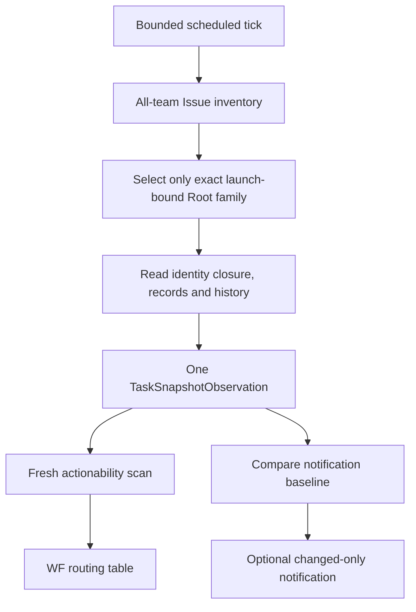
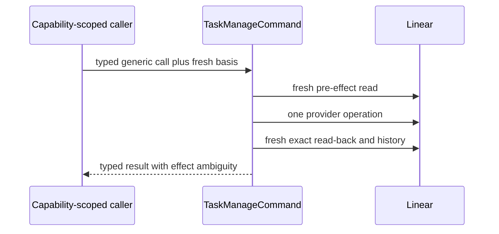

# Task Management

| Status | Owns | Does not own |
|---|---|---|
| Phase 1 target | provider-neutral observation/command boundary、Linear limits | consumer selection、semantic/mechanical workflow decision |

## Observation flow

## Observation authority table

| Rule | Input | Required output | Baseline effect | Failure behavior |
|---|---|---|---|---|
| `TM-OBS-001` | exact launch Root ID, startup immediate poll and bounded scheduled ticks | fully paginated all-team inventory including archived、trashed、de-labeled and reparented Issues | none | inventory overflow or page failure fails the whole poll visibly |
| `TM-OBS-002` | exact launch-bound Root family | one fresh `TaskSnapshotObservation` with complete current/known identity facts | none | never return a partial valid snapshot or another Root family |
| `TM-OBS-003` | successful complete poll | optional changed-only `TaskObservationEvent` plus the fresh bound-Root observation for actionability | advance notification baseline only after success | baseline never controls workflow action |
| `TM-OBS-004` | provider-proven permanent known-Issue loss or incomplete known identity evidence | sanitized reason-discriminated `InvalidTaskSnapshot` with Root/failing identity | baseline may describe observation change | Router selects `WF-ROUTE-016`; observation never preselects disposition |
| `TM-OBS-005` | expected exact record is missing or malformed/updated/archived | sanitized `InvalidTaskIssueRecord` in an otherwise routable snapshot | notification only | select by absence/corruption、record kind and phase |
| `TM-OBS-006` | no notification change | same fresh bound-Root observation still enters actionability scan | no notification | actionable projection/restart/delivery cannot park on unchanged facts |

| Observation path | Included | Excluded |
|---|---|---|
| Phase 1 | scheduled Linear polling | public ingress、webhook、provider replay、incremental workflow cursor、fallback path |

| Invalid record observation | Failure selection |
|---|---|
| missing | `WF-FAIL-001` through `WF-FAIL-003` |
| malformed、updated or archived | record kind and phase select `WF-FAIL-008`, `WF-FAIL-009`, `WF-FAIL-011` or `WF-FAIL-015` |

## Discovery table

| Rule | Resource class | Discovery anchor | Required follow-up | Unsupported claim |
|---|---|---|---|---|
| `TM-DISC-001` | launch-bound Root/Cycle family | exact launch Root ID current/historical kind labels parent and predecessor anchors | read current and complete grouped history | current Root-label query is complete inventory or another Root is schedulable |
| `TM-DISC-002` | Plan | Cycle description or intact approval `plan_issue_id` | exact read regardless current ancestry/archive | current children alone prove absence |
| `TM-DISC-003` | Work/Verify/relation | intact Plan manifest identities | exact read current resource, history and creation evidence | detached/reparented resource is irrelevant |
| `TM-DISC-004` | attached record | deterministic exact record identity | read exact comment and complete owner comment set | latest comment page is complete |
| `TM-DISC-005` | unknown create-then-detach before manifest | no provider enumeration exists | never execute or admit it into sealed graph | proving such an object never existed |

## Snapshot table

| Rule | Fact | Normalized fields | Excluded fields | Authority use |
|---|---|---|---|---|
| `TM-SNAP-001` | Issue | identity/revision/times/creator/status document/parent/labels/delegate/archive/trash | SDK object、raw metadata、credential | current workflow fact |
| `TM-SNAP-002` | relation | exact ID/endpoints/type, canonical revision, provider times, creation evidence | mutation receipt | sealed graph check |
| `TM-SNAP-003` | grouped Issue history | actor/origin, changed fields, endpoints, parent/label/archive changes, provider times | raw provider payload | conflict and lifecycle evidence, never per-mutation ordering |
| `TM-SNAP-004` | record/terminal observation | valid closed record set with invalidation precedence or external terminal plus no matching record evidence | fabricated completed document | transition evidence or pre-effect mechanical route |
| `TM-SNAP-005` | canonical revision | versioned deterministic digest of all normalized fields and provider times | `updatedAt` alias or CAS claim | fresh basis and change detection |
| `TM-SNAP-006` | workflow state map | exact team and one distinct state ID for every required semantic status | name inference、cached/default state | validate every Issue status pair and status mutation |

## Command surface

| Rule | Surface | Allowed shape | Forbidden shape | Read-back |
|---|---|---|---|---|
| `TM-CMD-001` | query | Issue get/list/children/history/comments relation/state/label lists | workflow-specific `StartCycle` or semantic advice | complete pagination and normalization |
| `TM-CMD-002` | mutation | Issue create/update/archive/comment relation create/delete | SDK objects、credentials、arbitrary metadata、caller timestamps | exact target/resource/history read-back |
| `TM-CMD-003` | caller capability | exact Root/Cycle phase, target kinds, fields and record kinds | ambient provider mutation access | boundary rejects mismatch before provider call |
| `TM-CMD-004` | performer access | none | every Task Manager call | not applicable |

## Capability table

| Rule | Caller | Permitted effects | Workflow references | Explicit denial |
|---|---|---|---|---|
| `TM-CAP-001` | `RootBoundary` | Root Define fields, deterministic Cycle Draft, approval/semantic terminal/successor records | `WF-TR-001`, `WF-TR-005`, `WF-TR-006`, `WF-TR-009`, `WF-TR-010` | Stage execution、sealed graph mutation |
| `TM-CAP-002` | `CycleMachine` | exact Cycle-record projection graph/Stage mechanics phase-owned Cycle closure | `WF-ROUTE-003`, `WF-ROUTE-011`, `WF-ROUTE-015`, `WF-ROUTE-017`, `WF-ROUTE-018` `WF-TR-007`, `WF-TR-008`, `WF-TR-011` through `WF-TR-015` | semantic acceptance、successor |
| `TM-CAP-003` | `FamilyGuard` | deterministic Root-attached family invalidation only | `WF-FAIL-010` | select owner/winner、modify Cycle |
| `TM-CAP-004` | `DeliveryFinalizer` | Root delivery records/status and closed Git/PR calls | `WF-TR-002`, `WF-TR-003`, `WF-FAIL-011` | semantic accept、automatic redelivery |
| `TM-CAP-005` | `Cleanup` | delete exact matching Root runtime/Home after cleanup-ready | `WF-ROUTE-013` | delete workflow Issues、other Homes、user code |

## Conflict table

| Rule | Observation | Typed result | Effect guarantee | Next authority |
|---|---|---|---|---|
| `TM-CONFLICT-001` | basis mismatch before provider call | `stale_before_effect` | provider operation not invoked | fresh `WF-ROUTE-*` evaluation |
| `TM-CONFLICT-002` | provider call started, then unexpected delta or unknown result | `conflict_observed` with `effect_may_have_occurred: true` | no rollback claim | exact fresh read and matching failure/invalidation rule |
| `TM-CONFLICT-003` | effect read-back exactly matches closed expected delta | success | only observed provider fact is authoritative | corresponding `WF-TR-*` projection |
| `TM-CONFLICT-004` | Linear has no atomic compare-and-swap | one field per update plus pre/read-back evidence | no CAS claim | client mutex、memory lock、rollback and blind retry are non-authoritative |

## Linear provider gates

| Rule | Provider fact | Phase 1 requirement | If unproven or violated |
|---|---|---|---|
| `TM-PROVIDER-001` | Issue create accepts caller exact UUID and exposes creator/provider time | public schema supplies exact ID but rejects caller `createdAt` | materialization disabled |
| `TM-PROVIDER-002` | relation create can accept exact identity but SDK permits `overrideCreatedAt` | public schema rejects override; real provider audit proves exact relation creator/time | materialization disabled |
| `TM-PROVIDER-003` | comment create accepts deterministic exact ID; comments remain provider-mutable | fresh observation requires actor、unarchived and `updated_at == created_at` | invalid-record path |
| `TM-PROVIDER-004` | mutation actor may be grouped in history | dedicated non-human service actor credential is externally exclusive | deployment capability disabled |
| `TM-PROVIDER-005` | Issue permanent delete exists comment hard delete has no tombstone | policy、permissions and audit prohibit both before cleanup | proven Issue loss -> `WF-FAIL-013` missing comment -> `WF-FAIL-001` through `WF-FAIL-003` |
| `TM-PROVIDER-006` | startup API can read actor identity but not prove all credential copies or human permissions | provisioning、secret isolation、rotation and operator audit provide the external gate | fail closed before production mutation |
| `TM-PROVIDER-007` | Linear workflow states are team-specific IDs and may omit a required semantic state | exact map covers every semantic state each ID is present、active、distinct fresh `list_states` validates before admission/mutation | observation/admission/mutation boundary stays unavailable visible sanitized capability error |

| Provider response | Boundary action | Default |
|---|---|---|
| every Linear response | validate against [Contracts](contracts.md) | missing evidence fails closed |
