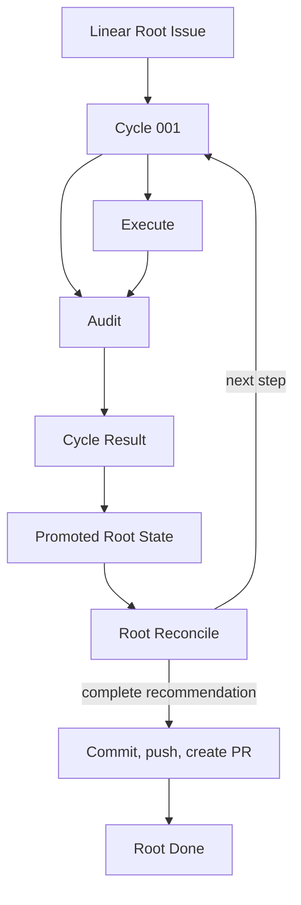

# Workflow Model

| Status | Owns | Does not own |
|---|---|---|
| target proposal | cross-role topology, lifecycle, outcomes, routing, input commit, and terminal delivery | provider mechanics or prompt wording |

This file is the workflow authority. Named-concern documents may explain a row
but must not define another transition for the same fact.

## Authorities

| Rule | Fact | Authority | Consequence |
|---|---|---|---|
| `WF-AUTH-001` | original long-term requirement | Linear Root title and the immutable requirement section of its description | Linear mode rejects simultaneous `--task`; the managed snapshot is excluded from the input |
| `WF-AUTH-002` | new user input | new user-authored Root comments | pending input for a later Reconcile only |
| `WF-AUTH-003` | trusted task state | Succeeded Cycles with an `accepted` Audit verdict | only source of trusted Root State progress |
| `WF-AUTH-004` | active small-step contract | frozen Cycle description and local `CycleSpec` | Execute and Audit scope |
| `WF-AUTH-005` | implementation state | current Root workspace | Execute effects, Audit evidence, and final PR content |
| `WF-AUTH-006` | human-readable workflow view | Linear statuses, child Issues, Root managed snapshot, role terminal descriptions, and Cycle history comments | sole operator view; no Dashboard projection |
| `WF-AUTH-007` | next step | one fresh Root Reconcile session over Root and Root State inputs | create one Cycle, recommend completion, or request human input |
| `WF-AUTH-008` | terminal delivery success | a recorded pull request URL or, when PR creation is unavailable after push, the pushed Root branch | only fact that allows Root `Done` |
| `WF-AUTH-009` | real-state verification | fresh Audit against the Root workspace | Reconcile never substitutes workspace inspection or Executor claims |
| `WF-AUTH-010` | visible workflow status | the five canonical Linear statuses resolved for the Root team | arbitrary user states, status-order inference, or hidden local state |
| `WF-AUTH-011` | latest audit detail | `RootState.latest_audit`, the complete typed `AuditRunResult` from the newest terminal Audit | any Cycle DAG, child comment, or reconstructed audit history |
| `WF-AUTH-012` | human-readable Reconcile rationale | latest validated report in the managed Root suffix; `create_cycle` also copies it once to the new Cycle comment | hidden decisions, raw Git status text, or a second summarizer call |

Execute model output is neither parsed nor projected into semantic state. Execute
and Audit each receive an original role prompt that requires one final
human-readable Markdown response at its prescribed local result path. There is
exactly one Execute process and one fresh Audit process per Cycle; Conductor
never starts a second summarization or format-repair Agent call.

Executor Markdown is appended byte-for-byte once to the Execute Issue description
at terminal handling. The append also records one mechanical RFC3339 local-time
line `Updated at: <YYYY-MM-DDTHH:mm:ss.sss+/-HH:MM>`; retries never append a
second report. Its
fixed report is a summary of actual file changes and validation: `## Summary`,
`## File Changes` with `### Created`, `### Updated`, and `### Deleted` paths and
line deltas, followed by `## Verification`. It does not repeat Cycle
description, acceptance, or boundaries and remains untrusted process output.

Audit Markdown is appended byte-for-byte once to the Audit Issue description at
terminal handling. The append also records one mechanical RFC3339 local-time
line `Updated at: <YYYY-MM-DDTHH:mm:ss.sss+/-HH:MM>`; retries never append a
second report. Its
fixed report starts with the verdict and then reports `## Scope Audited`,
`## Implementation Review`, `## Checks`, `## Evidence`, `## Findings`, and
`## Task State`; it describes what was inspected and how it was implemented,
not the Cycle description. The fresh Audit is the sole semantic authority over
the real workspace. Conductor parses this Markdown once into the typed
`AuditRunResult`, serializes that value to the local
`cycle-NNN-audit-result.json`, reads it back and validates it, then uses the
re-read value for Cycle and Root progression. Only this JSON file is uploaded to
the Cycle as `application/json`; the Cycle Result comment records its resource
link or the current upload error's first 50 characters. Root Reconcile sees the
latest audit detail only through Root State and never reads the Cycle DAG or role
content. A Reconcile completion decision is a recommendation, not Root
completion; the final Inbox check and PR function must succeed first.

Every `create_cycle`, `complete`, and `needs_human` decision also contains a
validated human report which Conductor copies to Root under a Harness marker.
Continue reports explain why, evidence, and the next Cycle. Completion reports
cover the complete worktree's created/updated/deleted paths, insertion/deletion
counts, verification, and exact accumulated token usage in short form. The
worktree and token sections are mechanical Conductor projections; unavailable
facts say `Unknown`, never an estimate. Raw porcelain such as `??`, `M`, or `D`
is not human report content.

Diagnostic evidence is an investigation aid, not an authority. Raw Agent JSONL,
stderr, and causal error context may be retained only in the private external
run directory so a bounded visible failure remains diagnosable. It is never sent to
Audit, Root Reconcile, or Linear and cannot change a Cycle result.

## Root description projection

The Root description has two exact regions. The requirement region is the
human-authored title/description and is immutable for the life of the Root. The
Harness owns only the following block, which is appended once and replaced in
place on every durable projection:

```text
# Symphony Harness: Managed Root
Updated at: <YYYY-MM-DDTHH:mm:ss.sss+/-HH:MM>
## Root State
<canonical RootState JSON fence>
## Reconcile
<latest validated Reconcile report>
# Symphony Harness: End Managed Root
```

There must be exactly one start marker and one end marker, with the end marker
after the start marker. On every replacement Conductor writes the mechanical
RFC3339 local-time line `Updated at: <YYYY-MM-DDTHH:mm:ss.sss+/-HH:MM>` using
the customer runtime's local clock and numeric offset. It uses the same exact
timestamp value for that update. Conductor updates only the bytes between the markers;
it never rewrites, normalizes, or appends to the requirement region. Root State
remains the durable checkpoint and semantic authority. Before every Reconcile,
Conductor strips the complete managed block and passes only the requirement
region to the Reconciler. A missing, duplicated, or malformed block is a
visible provider/state error; it is not silently repaired from child Issues.

## Linear status plane

Linear is the visible workflow plane. Root, Cycle, Execute, and Audit all use
the same five canonical statuses; comments and Root State explain detail but do
not replace an Issue status.

| Canonical name | Linear type | Normalized status |
|---|---|---|
| `Todo` | `unstarted` | `todo` |
| `In Progress` | `started` | `in_progress` |
| `In Review` | `started` | `in_review` |
| `Done` | `completed` | `done` |
| `Canceled` | `canceled` | `canceled` |

The Gateway resolves these names and types before an unfinished Root run can
mutate an Issue. Their provider IDs are internal projection data, never caller
inputs or CLI flags. Other team-defined states are ignored completely: the
harness does not infer meaning from type uniqueness, list order, or a similar
name, and never edits or deletes those state definitions.

The following matrix is the only role-status transition model. Conductor
performs each update at the named boundary, so Linear shows what is happening
without waiting for a comment or a local checkpoint.

| Issue | Creation | Start or advance | Terminal transition |
|---|---|---|---|
| Root | `Todo` before first fresh Reconcile; startup gates normalize it to `Todo` | durable Cycle family -> `In Progress`; complete Audit writes `latest_audit` -> `In Review`; later decisions remain `In Review` | delivery -> `Done` |
| Cycle | `Todo` when created | recorded family sets `In Progress`; starting Audit sets `In Review` | a terminal Cycle result sets `Done` |
| Execute | `Todo` when created | process launch sets `In Progress` | process return, timeout, interruption, or start failure sets `Done` |
| Audit | `Todo` when created | Audit launch sets `In Review` | Audit report or process error sets `Done`; the report is exact Markdown |
| unfinished descendant at startup | existing nonterminal status | startup abandonment does not resume it | set `Canceled` before fresh Reconcile |

The terminal `Done` status on Execute, Audit, and Cycle does not imply success;
the role terminal descriptions, Cycle result comment, and typed Audit verdict retain those facts.
Root Reconcile remains the only semantic authority for `create_cycle`, `complete`,
and `needs_human`; status updates merely project that decision. Only the
terminal delivery function may project `Done` onto Root.

## Topology

| Rule | Resource | Parent | Cardinality | Owner |
|---|---|---|---|---|
| `WF-TOPO-001` | Cycle | Root | historical many; nonterminal at most one | Root Reconciler |
| `WF-TOPO-002` | Execute | Cycle | exactly one | Cycle Runner |
| `WF-TOPO-003` | Audit | Cycle | exactly one | Cycle Runner |
| `WF-TOPO-004` | Execute terminal report | Execute | exactly one exact `cycle-NNN-executor-result.md` append to its description | Cycle Runner |
| `WF-TOPO-005` | Audit terminal report | Audit | exactly one exact `cycle-NNN-audit-result.md` append to its description | Cycle Runner |
| `WF-TOPO-006` | Cycle Result comment and uploaded file | Cycle | one mechanical result plus one `cycle-NNN-audit-result.json` file | Cycle Runner |
| `WF-TOPO-007` | Harness-managed checkpoint suffix | Root description | exactly one mutable suffix | Conductor |
| `WF-TOPO-008` | latest Reconcile report | Root managed suffix | exactly one replaceable report | Conductor |
| `WF-TOPO-009` | create-cycle rationale comment | Cycle | exactly one append-only copy of the creating Reconcile report | Cycle Runner |



Cycle, Execute, and Audit are created before execution. Execute must terminate
before Audit starts. Audit runs even when Execute failed. All Cycles share the
one caller-supplied Root workspace bound at process startup.

## Lifecycle

| Rule | Resource | From | Condition | To | Required effect |
|---|---|---|---|---|---|
| `WF-TR-001` | Root workspace | supplied | first Root startup validates workspace and run directory | ready | bind both paths to Root State; later starts require exact matches |
| `WF-TR-002` | Root | `Todo` | startup gates pass before the first fresh Reconcile | `Todo` | normalize the canonical Root status and initialize the Root State checkpoint |
| `WF-TR-003` | Cycle family | absent | Reconcile selects a step | all three Issues `Todo` | create and persist the family, then set Cycle and Root `In Progress` before Execute starts |
| `WF-TR-004` | Execute | `Todo` | Cycle starts | `In Progress` | set status, then start one fresh workspace-write session |
| `WF-TR-005` | Execute | `In Progress` | process returns or errors | `Done` | append exact Executor Markdown to the description when present, expose current error message limited to 50 characters when absent, then transition |
| `WF-TR-006` | Audit | `Todo` | Execute is terminal | `In Review` | set status, then start one distinct fresh read-only session |
| `WF-TR-007` | Audit | `In Review` | process returns or errors | `Done` | append exact Audit Markdown to the description when valid, expose current error message limited to 50 characters when invalid, then transition |
| `WF-TR-008` | Cycle | `In Progress` or `In Review` | complete Audit result resolves | `Done` | persist/re-read typed JSON, upload only that file, record its link/error, then finish Cycle and Root projection |
| `WF-TR-009` | prior unfinished descendants | nonterminal | process starts | `Canceled` | mechanically cancel all before fresh Reconcile |
| `WF-TR-010` | Root | `Todo` or `In Progress` | Reconcile recommends completion or needs human input | `In Review` | perform final Inbox check or record the human gate; do not mark Done yet |
| `WF-TR-011` | delivery function | absent | final Inbox is empty and workspace has changes | running | record phase `publishing`, then commit, push, and attempt one PR through `gh` in order |
| `WF-TR-012` | Root | `In Review` | PR URL or pushed delivery branch is recorded in Root State | `Done` | stop successfully and retain local evidence |
| `WF-TR-013` | Root | `Done` | later launch or poll | `Done` | after the team workflow-contract check, perform no Root-owned mutation; exit successfully |

Terminal Issues are never reopened or rewritten.
Remediation is always a new Cycle. Linear workflow status shows progress; the
Cycle result comment carries `Succeeded`, `Rejected`, or `Failed` semantics.

## Cycle result

Audit exposes one closed verdict rather than independent status, integrity, and
process axes. `violation` and `process_error` are terminal failures. Execute
exit facts never decide semantic success or failure: even after a timeout,
nonzero exit, or start failure, Audit inspects the retained workspace and its
verdict alone determines the Cycle result.

| Rule | Audit | Cycle result |
|---|---|---|
| `WF-RESULT-001` | `accepted` | `Succeeded` |
| `WF-RESULT-002` | `incomplete` | `Rejected` |
| `WF-RESULT-003` | `blocked` | `Failed` |
| `WF-RESULT-004` | `violation` | `Failed` |
| `WF-RESULT-005` | `process_error` | `Failed` |

Only `WF-RESULT-001` updates trusted Root State fields. The typed Audit verdict
from the re-read JSON derived from exact Audit Markdown governs promotion. The
Cycle Result records only mapped terminal fields and one JSON resource outcome;
it never summarizes, reformats, or semantically interprets either role response.
The exact role Markdown remains in the terminal section of its own Issue
description, while only the typed
`cycle-NNN-audit-result.json` is uploaded for the Cycle and used for
progression.
The same re-read result is written to `RootState.latest_audit` before the next
Reconcile; Reconcile sees that field, never the Cycle comment or DAG. A
missing/invalid result file is a process error, not an invitation to make
another Agent call.

The verdict alone determines the Cycle result.
Cycle Result repeats only the mapped result
and the JSON file link or current upload error. It never copies Audit evidence or
role Markdown or Cycle description text into its mechanical fields.

Cycle history comments are append-only operator breadcrumbs. Conductor adds one
for each visible status transition, Root decision, terminal Cycle result, and
JSON upload/link outcome. Their Linear `createdAt` is the only event timestamp;
the body does not add a second timestamp. They explain what happened but are
never Reconcile input, trusted state, or a substitute for the exact Audit JSON.

## Serial routing

Rows are evaluated in order and exactly one action runs at a time.

| Rule | Current fact | Action |
|---|---|---|
| `WF-ROUTE-001` | Root is `Done` | no-op and exit |
| `WF-ROUTE-002` | Execute waiting | run Execute |
| `WF-ROUTE-003` | Execute terminal and Audit waiting | run fresh Audit |
| `WF-ROUTE-004` | Audit terminal and Cycle lacks result | close Cycle from result table |
| `WF-ROUTE-005` | Cycle terminal | write the complete `latest_audit`, update Root State and Root view to `In Review`, then Reconcile |
| `WF-ROUTE-006` | no Cycle and no completion recommendation | Reconcile |
| `WF-ROUTE-007` | completion recommendation and new Root input exists | discard completion recommendation and Reconcile again |
| `WF-ROUTE-008` | completion recommendation, empty Inbox, no active Cycle | run terminal delivery function |
| `WF-ROUTE-009` | active Cycle and new Root comments arrive | show pending; do not change the active Cycle |
| `WF-ROUTE-010` | no actionable fact or human input required | record the reason and exit |

## Failure policy

| Rule | Observation | Required behavior | Forbidden behavior |
|---|---|---|---|
| `WF-FAIL-001` | Execute process fails or exits unexpectedly | append process facts and still dispatch Audit | parse Execute prose, skip Audit, or infer semantic failure |
| `WF-FAIL-002` | Audit is incomplete or blocked | persist findings and apply the result table | let Execute self-report override Audit |
| `WF-FAIL-003` | Auditor process errors | persist bounded error and fail Cycle | infer a clean result or mutate workspace |
| `WF-FAIL-004` | Linear action fails | expose error and stop | use another task mode, guess state, or duplicate resources |
| `WF-FAIL-005` | supplied workspace or run directory is invalid | start no Agent | allocate, replace, clean, or silently adopt another path |
| `WF-FAIL-006` | commit or push fails | leave Root `In Review` and open, expose failed step, retain workspace and evidence | retry automatically, roll back, repair, or mark Root Done |
| `WF-FAIL-007` | workspace has no PR change | enter `NeedsHuman`, project Root `In Review`, and leave Root open | create an empty commit or claim success |
| `WF-FAIL-008` | unfinished descendants at startup | cancel all, warn of possible unaudited workspace changes, then Reconcile | resume, audit, parse, or synthesize their results |
| `WF-FAIL-009` | maximum Cycle count reached | set Root State `NeedsHuman`, project Root `In Review`, and stop with the reason visible | create another Cycle or deliver |
| `WF-FAIL-010` | saved workspace or run directory is missing, invalid, or mismatched | set Root State `NeedsHuman`, project Root `In Review`, and stop | create a replacement path or infer files from child Issues |
| `WF-FAIL-011` | startup sees incomplete `publishing` | set `NeedsHuman` and Root `In Review`; stop before Reconcile | retry, inspect provider state, or adopt a branch/PR |
| `WF-FAIL-012` | any visible process or upload error | show only the current `error.message`, first 50 characters | walk causes, add prefixes or codes, publish raw context, or change the Audit verdict for an upload failure |
| `WF-FAIL-013` | a runtime error escapes normal Cycle or decision handling | persist the bounded current message on Root, project Root `In Review`, then fail the process | leave Root `In Progress` or hide the visible failure |

Failure to create a PR after a successful push is not a delivery failure. The
function records the pushed `delivery_branch` and completes Root. It does not
call a token-specific HTTP API or retry another PR mechanism.

The only automatic repair loop is domain-level: Audit exposes real workspace
findings and the next Reconcile may create a repair Cycle. Infrastructure and
PR failures do not enter a recovery state machine.

## Root comment transaction

| Rule | Step | Durable meaning |
|---|---|---|
| `WF-INBOX-001` | fetch comments newer than startup cursor | add eligible user comments to pending input |
| `WF-INBOX-002` | Reconcile receives all comments after cursor | place every ID in candidate `CycleSpec`, or return `NeedsHuman`; never partially consume |
| `WF-INBOX-003` | create Cycle, Execute, Audit and record their provider IDs locally | establish complete frozen family |
| `WF-INBOX-004` | persist created `CycleSpec` with `consumed_comment_ids` | mark exactly those IDs consumed for this run |
| `WF-INBOX-005` | Reconcile recommends completion | fetch once more before PR publication; any new input returns to Reconcile |

If family creation or local recording fails before `WF-INBOX-004`, comments
remain pending and no Agent starts from the partial family.
When an active Cycle exists and new Root comments arrive, do not dispatch them into the Cycle.

## Persistence planes

| Rule | Location | Content | Excluded |
|---|---|---|---|
| `WF-PERSIST-001` | Linear Root description | immutable human requirement section plus one exact Harness-managed snapshot block | treating the managed suffix as requirement input or user-authored content |
| `WF-PERSIST-002` | Harness-managed Root description suffix | minimal checkpoint fields defined in `RootState`, latest Reconcile report, and local-offset `Updated at` | raw trajectories, revisions, child history, or process handles |
| `WF-PERSIST-003` | Linear Root user comments | new input after saved cursor | descendant instructions or active-Cycle mutation |
| `WF-PERSIST-004` | Linear Cycle description | frozen objective, acceptance, boundaries, and consumed comment references | later input, executor selection, or mutable progress |
| `WF-PERSIST-005` | descriptions, Cycle comments, uploaded file | one terminal report per role; append-only history/mechanical comments; typed Audit JSON | no Execute semantics or streams; history/result is not Reconcile input |
| `WF-PERSIST-006` | supplied external run directory | Cycle records, provider IDs, bounded parse inputs, Audit material, PR command log, and private diagnostics | credentials or Root-commit files |
| `WF-PERSIST-007` | private diagnostic paths in the external run directory | raw Agent JSONL/stderr, error context, and `thread_id` index | Audit/Root/Linear inputs or public raw streams |

Linear is the human-readable control plane; the supplied run directory is the
minimal transaction and evidence plane. Private diagnostics exist to preserve
causal evidence when public reasons must stay bounded, not to create a second
workflow history. Files remain under caller-controlled local retention and are
not uploaded or implicitly deleted by Conductor. Golden E2E failures archive
this evidence before cleaning their owned temporary resources and report only a
`diagnostic_ref`. The design has no task revision, seal, content digest, Git hash
authority, equality proof, mutation history, delivery record, or recovery
database. Git necessarily creates an internal commit object for the PR, but its
hash is neither captured in a public contract nor used for workflow decisions.
