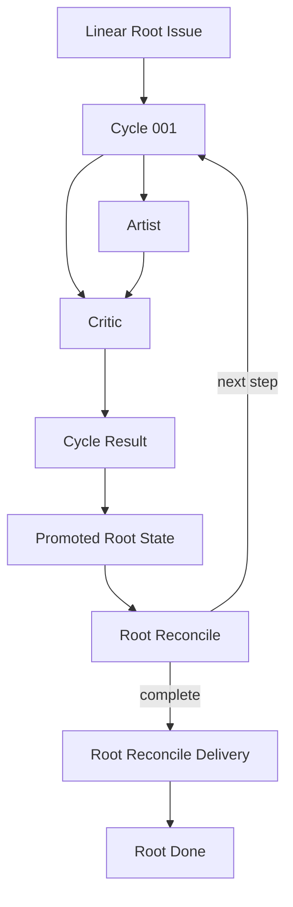

# Workflow Model

| Status | Owns | Does not own |
|---|---|---|
| target proposal | cross-role topology, lifecycle, outcomes, routing, input commit, and terminal delivery | provider mechanics or prompt wording |

This file is the workflow authority. Named-concern documents may explain a row
but must not define another transition for the same fact.

## Authorities

| Rule | Fact | Authority | Consequence |
|---|---|---|---|
| `WF-AUTH-001` | original long-term requirement | Linear Root title and the immutable requirement section of its description | Linear mode rejects simultaneous `--task`; the managed snapshot is excluded from the input |
| `WF-AUTH-002` | new user input | new user-authored Root comments | pending input for a later Reconcile only |
| `WF-AUTH-003` | trusted task state | Succeeded Cycles with an `accepted` Critic verdict | only source of trusted Root State progress |
| `WF-AUTH-004` | active small-step contract | frozen Cycle description and local `CycleSpec` | Artist and Critic scope |
| `WF-AUTH-005` | implementation state | current Root workspace | Artist effects, Critic evidence, and final PR content |
| `WF-AUTH-006` | human-readable workflow view | Linear statuses, child Issues, Root managed snapshot, role terminal descriptions, and two Cycle comments | sole operator view; no Dashboard projection |
| `WF-AUTH-007` | next step | one fresh Root Reconcile session over Root and Root State inputs | create one Cycle, recommend completion, or request human input |
| `WF-AUTH-008` | terminal delivery success | one valid Root Reconcile Delivery: pull request, branch, or local files | only fact that allows Root `Done` |
| `WF-AUTH-009` | real-state verification | fresh Critic against the Root workspace | Reconcile never substitutes workspace inspection or Artist claims |
| `WF-AUTH-010` | visible workflow status | six canonical Root statuses and the five-state descendant subset resolved for the Root team | arbitrary user states, status-order inference, or hidden local state |
| `WF-AUTH-011` | latest critique checkpoint | newest verdict, task state, pending finding, and artifact URL in `RootState.latest_critique` | complete report, Cycle DAG, child comments, or reconstructed history |
| `WF-AUTH-012` | human-readable Reconcile rationale | latest validated report in the managed Root suffix; `create_cycle` also copies it once to the new Cycle comment | hidden decisions, raw Git status text, or a second summarizer call |

Artist model output is neither parsed nor projected into semantic state. Artist
and Critic each receive an original role prompt that requires one final
human-readable Markdown response at its prescribed local result path. There is
exactly one Artist process and one fresh Critic process per Cycle; Conductor
never starts a second summarization or format-repair Agent call.

Artist Markdown is appended byte-for-byte once to the Artist Issue description
at terminal handling. The append also records one mechanical human-readable
local-time line `Updated at: <YYYY-MM-DD HH:mm:ss GMT+/-HH:MM>`; retries never
append a second report. Its human report summarizes actual file changes and
validation without a machine-parsed heading schema. It does not repeat Cycle
description, acceptance, or boundaries and remains untrusted process output.

Critic Markdown is appended byte-for-byte once to the Critic Issue description
at terminal handling. It begins with a compact JSON machine envelope containing
only verdict, task state, and optional pending finding, then provides a
human-readable audit of what was inspected, implementation logic, evidence,
checks, and findings. The append also records one presentation-only local-time
line `Updated at: <YYYY-MM-DD HH:mm:ss GMT+/-HH:MM>`; retries never append a
second report. Conductor parses only the envelope once, combines it with the
exact report into a typed artifact, and serializes the same bytes once to
`cycle-NNN-critique-result.json` for local retention and upload. Conductor does
not reread that file. Root Reconcile sees only the compact
checkpoint promoted into Root State and never reads the Cycle DAG or role
content. A Reconcile completion decision includes a structured Delivery and is
not Root completion until the final Inbox check and durable projection succeed.

Every `create_cycle`, `complete`, and `needs_human` decision also contains a
validated human report which Conductor projects into the managed Root suffix.
Continue reports explain why, evidence, and the next Cycle. Completion reports
cover the complete worktree's created/updated/deleted paths, insertion/deletion
counts, verification, wall-clock run duration, and exact accumulated token usage in short form. The
worktree and token sections are mechanical Conductor projections; unavailable
facts say `Unknown`, never an estimate. Raw porcelain such as `??`, `M`, or `D`
is not human report content.

Diagnostic evidence is an investigation aid, not an authority. Raw Agent JSONL,
stderr, and causal error context may be retained only in the private external
run directory so a bounded visible failure remains diagnosable. It is never sent to
Critic, Root Reconcile, or Linear and cannot change a Cycle result.

## Root description projection

The Root description has two exact regions. The requirement region is the
human-authored title/description and is immutable for the life of the Root. The
Harness owns only the following block, which is appended once and replaced in
place on every durable projection:

```text
# Symphony Harness: Managed Root
## Result
<latest validated Reconcile report>
## Delivery
<terminal delivery when present>
## Metadata
Updated at: <YYYY-MM-DD HH:mm:ss GMT+/-HH:MM>
### Root State
<canonical RootState JSON fence>
# Symphony Harness: End Managed Root
```

There must be exactly one start marker and one end marker, with the end marker
after the start marker. On every replacement Conductor writes the mechanical
human-readable local-time line `Updated at: <YYYY-MM-DD HH:mm:ss GMT+/-HH:MM>` using
the customer runtime's local clock and numeric offset. It uses the same exact
timestamp value for that update. This line is presentation only and is never
parsed as durable state. Conductor updates only the bytes between the markers;
it never rewrites, normalizes, or appends to the requirement region. Root State
remains the durable checkpoint and semantic authority. Before every Reconcile,
Conductor strips the complete managed block and passes only the requirement
region to the Reconciler. A missing, duplicated, or malformed block is a
visible provider/state error; it is not silently repaired from child Issues.

## Linear status plane

Linear is the visible workflow plane. Root uses six canonical statuses. Cycle,
Artist, and Critic use the five-state subset without `Needs Human`; comments and
Root State explain detail but do not replace an Issue status.

| Canonical name | Linear type | Normalized status |
|---|---|---|
| `Todo` | `unstarted` | `todo` |
| `In Progress` | `started` | `in_progress` |
| `In Review` | `started` | `in_review` |
| `Needs Human` | `started` | `needs_human` |
| `Done` | `completed` | `done` |
| `Canceled` | `canceled` | `canceled` |

The Gateway resolves these names and types before an unfinished Root run can
mutate an Issue. Their provider IDs are internal projection data, never caller
inputs or CLI flags. Other team-defined states are ignored completely: the
harness does not infer meaning from type uniqueness, list order, or a similar
name, and never edits or deletes those state definitions.
After Prepare, a new Root remains `Todo` before the first fresh Reconcile.
Startup never rewrites a resumed Root to `Todo` merely because a new process
began.

The following matrix is the only role-status transition model. Conductor
performs each update at the named boundary, so Linear shows what is happening
without waiting for a comment or a local checkpoint.

| Issue | Creation | Start or advance | Terminal transition |
|---|---|---|---|
| Root | `Todo` after Prepare | durable family -> `In Progress`; Critic checkpoint -> `In Review`; Reconcile question -> `Needs Human` | valid Delivery projection -> `Done` |
| Cycle | `Todo` when created | recorded family sets `In Progress`; starting Critic sets `In Review` | a terminal Cycle result sets `Done` |
| Artist | `Todo` when created | process launch sets `In Progress` | process return, timeout, interruption, or start failure sets `Done` |
| Critic | `Todo` when created | Critic launch sets `In Review` | Critic report or process error sets `Done`; the report is exact Markdown |
| unfinished descendant at startup | existing nonterminal status | startup abandonment does not resume it | set `Canceled` before fresh Reconcile |

The terminal `Done` status on Artist, Critic, and Cycle does not imply success;
the role terminal descriptions, Cycle result comment, and typed Critic verdict retain those facts.
Root Reconcile remains the only semantic authority for `create_cycle`, `complete`,
and `needs_human`; status updates merely project that decision. Only the
validated Root Reconcile Delivery may project `Done` onto Root.

## Topology

| Rule | Resource | Parent | Cardinality | Owner |
|---|---|---|---|---|
| `WF-TOPO-001` | Cycle | Root | historical many; nonterminal at most one | Root Reconciler |
| `WF-TOPO-002` | Artist | Cycle | exactly one | Cycle Runner |
| `WF-TOPO-003` | Critic | Cycle | exactly one | Cycle Runner |
| `WF-TOPO-004` | Artist terminal report | Artist | exactly one exact `cycle-NNN-artist-result.md` append to its description | Cycle Runner |
| `WF-TOPO-005` | Critic terminal report | Critic | exactly one exact `cycle-NNN-critic-result.md` append to its description | Cycle Runner |
| `WF-TOPO-006` | Cycle terminal comment and uploaded file | Cycle | one mechanical result plus one `cycle-NNN-critique-result.json` file | Cycle Runner |
| `WF-TOPO-007` | Harness-managed checkpoint suffix | Root description | exactly one mutable suffix | Conductor |
| `WF-TOPO-008` | latest Reconcile report | Root managed suffix | exactly one replaceable report | Conductor |
| `WF-TOPO-009` | Cycle comments | Cycle | exactly one creating Reconcile rationale and one terminal result | Cycle Runner |



Cycle, Artist, and Critic are created before execution. Artist must terminate
before Critic starts. Critic runs even when Artist failed. All Cycles share the
one Root workspace bound by Prepare. A supplied preferred path is exact; without
one, Prepare adopts the invocation current checkout.

## Lifecycle

| Rule | Resource | From | Condition | To | Required effect |
|---|---|---|---|---|---|
| `WF-TR-001` | Root workspace | unprepared | deterministic Prepare adopts current checkout or prepares the preferred path | ready | bind workspace/run directory/branch; reuse them; start no Agent |
| `WF-TR-002` | Root | `Todo` | startup gates pass before the first fresh Reconcile | `Todo` | normalize the canonical Root status and initialize the Root State checkpoint |
| `WF-TR-003` | Cycle family | absent | Reconcile selects a step | all three Issues `Todo` | create and persist the family, then set Cycle and Root `In Progress` before Artist starts |
| `WF-TR-004` | Artist | `Todo` | Cycle starts | `In Progress` | set status, then start one fresh workspace-write session |
| `WF-TR-005` | Artist | `In Progress` | process returns or errors | `Done` | append exact Artist Markdown to the description when present, expose current error message limited to 50 characters when absent, then transition |
| `WF-TR-006` | Critic | `Todo` | Artist is terminal | `In Review` | set status, then start one distinct fresh read-only session |
| `WF-TR-007` | Critic | `In Review` | process returns or errors | `Done` | append exact Critic Markdown to the description when valid, expose current error message limited to 50 characters when invalid, then transition |
| `WF-TR-008` | Cycle | `In Progress` or `In Review` | complete Critique resolves | `Done` | serialize typed JSON once, write/upload the same bytes, record its link/error, then finish Cycle and Root projection |
| `WF-TR-009` | prior unfinished descendants | nonterminal | process starts | `Canceled` | mechanically cancel all before fresh Reconcile |
| `WF-TR-010` | Root | `Todo`, `In Progress`, or `In Review` | Reconcile returns one or more concrete human questions | `Needs Human` | create one Root question comment, advance past that Harness comment, and stop without occupying a slot |
| `WF-TR-011` | Root Reconcile Delivery | absent | final Inbox is empty and trusted state supports completion | running | Root Reconcile creates the best available PR, branch, or files delivery |
| `WF-TR-012` | Root | `In Review` | a valid Delivery is recorded in Root State and description | `Done` | stop successfully and retain local evidence |
| `WF-TR-013` | Root | `Done` | later launch or poll | `Done` | after the team workflow-contract check, perform no Root-owned mutation; exit successfully |
| `WF-TR-014` | Root | `Needs Human` | at least one non-Harness Root comment follows the latest Harness question comment | `Needs Human` | Podium may launch a normal candidate; status changes only after the fresh Reconcile decision |

Terminal Issues are never reopened or rewritten.
Remediation is always a new Cycle. Linear workflow status shows progress; the
Cycle result comment carries `Succeeded`, `Rejected`, or `Failed` semantics.

## Cycle result

Critic exposes one closed verdict rather than independent status, integrity, and
process axes. `violation` and `process_error` are terminal failures. Artist
exit facts never decide semantic success or failure: even after a timeout,
nonzero exit, or start failure, Critic inspects the retained workspace and its
verdict alone determines the Cycle result.

| Rule | Critic | Cycle result |
|---|---|---|
| `WF-RESULT-001` | `accepted` | `Succeeded` |
| `WF-RESULT-002` | `incomplete` | `Rejected` |
| `WF-RESULT-003` | `blocked` | `Failed` |
| `WF-RESULT-004` | `violation` | `Failed` |
| `WF-RESULT-005` | `process_error` | `Failed` |

Only `WF-RESULT-001` updates trusted Root State fields. The validated Critic
machine envelope governs promotion. The Cycle Result records only mapped
terminal fields and one JSON resource outcome;
it never summarizes, reformats, or semantically interprets either role response.
The exact role Markdown remains in the terminal section of its own Issue
description, while only the typed
`cycle-NNN-critique-result.json` is uploaded for the Cycle and used for
progression.
The compact envelope and artifact URL are written to
`RootState.latest_critique` before the next Reconcile; Reconcile sees that
checkpoint, never the complete report, Cycle comment, or DAG. A
missing/invalid result file is a process error, not an invitation to make
another Agent call.

The verdict alone determines the Cycle result.
Cycle Result repeats only the mapped result, a linked Critic Issue identifier,
and the JSON file link or current upload error. It never copies Critic verdict, reason, evidence, or
role Markdown or Cycle description text into its mechanical fields.

Each Cycle receives exactly two append-only operator comments: the creating
Reconcile rationale and the terminal result with the JSON upload/link outcome.
Linear statuses show intermediate progress. Comment `createdAt` is the only
event timestamp; bodies do not add one. Comments are never Reconcile input,
trusted state, or a substitute for the exact Critique JSON.

## Serial routing

Rows are evaluated in order and exactly one action runs at a time.

| Rule | Current fact | Action |
|---|---|---|
| `WF-ROUTE-001` | Root is `Done` | no-op and exit |
| `WF-ROUTE-002` | Artist waiting | run Artist |
| `WF-ROUTE-003` | Artist terminal and Critic waiting | run fresh Critic |
| `WF-ROUTE-004` | Critic terminal and Cycle lacks result | close Cycle from result table |
| `WF-ROUTE-005` | Cycle terminal | write the compact `latest_critique`, update Root State and Root view to `In Review`, then Reconcile |
| `WF-ROUTE-006` | no Cycle and no completion recommendation | Reconcile |
| `WF-ROUTE-007` | completion recommendation and new Root input exists | discard completion recommendation and Reconcile again |
| `WF-ROUTE-008` | completion decision, empty Inbox, no active Cycle | validate and persist Root Reconcile Delivery |
| `WF-ROUTE-009` | active Cycle and new Root comments arrive | show pending; do not change the active Cycle |
| `WF-ROUTE-010` | Root is `Needs Human` and has no new Root input | exit without another question comment or retry |

## Failure policy

| Rule | Observation | Required behavior | Forbidden behavior |
|---|---|---|---|
| `WF-FAIL-001` | Artist process fails or exits unexpectedly | append process facts and still dispatch Critic | parse Artist prose, skip Critic, or infer semantic failure |
| `WF-FAIL-002` | Critic is incomplete or blocked | persist findings and apply the result table | let Artist self-report override Critic |
| `WF-FAIL-003` | Critic process errors | persist bounded error and fail Cycle | infer a clean result or mutate workspace |
| `WF-FAIL-004` | Linear action fails | expose error and stop | use another task mode, guess state, or duplicate resources |
| `WF-FAIL-005` | Prepare cannot use/create the supplied preferred workspace | expose the Root Reconcile failure and require human input | silently adopt another path |
| `WF-FAIL-006` | Root Reconcile cannot produce any valid Delivery | leave Root `In Review` and retain workspace/evidence | Conductor retries Git, invents a location, or marks Root Done |
| `WF-FAIL-007` | remote publication is unavailable | Root Reconcile may return an explicit files Delivery | require an empty commit or hide the local result |
| `WF-FAIL-008` | unfinished descendants at startup | cancel all, warn of possible unreviewed workspace changes, then Reconcile | resume, review, parse, or synthesize their results |
| `WF-FAIL-009` | maximum Cycle count reached | expose a runtime failure and stop with Root `In Review` | invent a human question, create another Cycle, or deliver |
| `WF-FAIL-010` | saved workspace or run directory is missing, invalid, or mismatched | expose a runtime failure and stop with Root `In Review` | invent a human question, create a replacement path, or infer files from child Issues |
| `WF-FAIL-012` | any visible process or upload error | show only the current `error.message`, first 50 characters | walk causes, add prefixes or codes, publish raw context, or change the Critic verdict for an upload failure |
| `WF-FAIL-013` | a runtime error escapes normal Cycle or decision handling | persist the bounded current message on Root, project Root `In Review`, then fail the process | leave Root `In Progress` or hide the visible failure |

Failure to create a PR is not necessarily a delivery failure. Root Reconcile
may return a branch or files Delivery; Conductor does not call an HTTP fallback.

The only automatic repair loop is domain-level: Critic exposes real workspace
findings and the next Reconcile may create a repair Cycle. Infrastructure and
PR failures do not enter a recovery state machine.

## Root comment transaction

| Rule | Step | Durable meaning |
|---|---|---|
| `WF-INBOX-001` | fetch comments newer than startup cursor | add eligible user comments to pending input |
| `WF-INBOX-002` | Reconcile receives all comments after cursor | treat them as one batch; never partially accept or reject the batch |
| `WF-INBOX-003` | create Cycle, Artist, Critic and record their provider IDs locally | establish complete frozen family |
| `WF-INBOX-004` | persist created `CycleSpec` with `consumed_comment_ids` | mark exactly those IDs consumed for this run |
| `WF-INBOX-005` | Reconcile recommends completion | fetch once more before PR publication; any new input returns to Reconcile |
| `WF-INBOX-006` | Reconcile accepts a reply batch | add one Symphony `white_check_mark` reaction to every comment, then commit the cursor with the chosen action |
| `WF-INBOX-007` | Reconcile rejects a reply batch | add one Symphony `x` reaction to every comment, commit the cursor, and create one new Root question comment containing the rejection reason and concrete options |

If family creation or local recording fails before `WF-INBOX-004`, comments
remain pending and no Agent starts from the partial family.
When an active Cycle exists and new Root comments arrive, do not dispatch them into the Cycle.

## Persistence planes

| Rule | Location | Content | Excluded |
|---|---|---|---|
| `WF-PERSIST-001` | Linear Root description | immutable human requirement section plus one exact Harness-managed snapshot block | treating the managed suffix as requirement input or user-authored content |
| `WF-PERSIST-002` | Harness-managed Root description suffix | minimal checkpoint fields defined in `RootState`, latest Reconcile report, and local-offset `Updated at` | raw trajectories, revisions, child history, or process handles |
| `WF-PERSIST-003` | Linear Root user comments | new input after saved cursor | descendant instructions or active-Cycle mutation |
| `WF-PERSIST-004` | Linear Cycle description | frozen objective, acceptance, boundaries, and consumed comment references | later input, artist selection, or mutable progress |
| `WF-PERSIST-005` | descriptions, Cycle comments, uploaded file | one terminal report per role; exactly two Cycle comments; typed Critique JSON | no Artist semantics or streams; comments/artifact are not Reconcile input |
| `WF-PERSIST-006` | supplied external run directory | Cycle records, provider IDs, bounded parse inputs, Critic material, PR command log, and private diagnostics | credentials or Root-commit files |
| `WF-PERSIST-007` | private diagnostic paths in the external run directory | raw Agent JSONL/stderr, error context, and `thread_id` index | Critic/Root/Linear inputs or public raw streams |

Linear is the human-readable control plane; the supplied run directory is the
minimal transaction and evidence plane. Private diagnostics exist to preserve
causal evidence when public reasons must stay bounded, not to create a second
workflow history. Files remain under caller-controlled local retention and are
not uploaded or implicitly deleted by Conductor. Golden E2E failures archive
this evidence before cleaning their owned local/branch resources, preserve the
Linear Root tree for inspection, and report only a `diagnostic_ref`. The fixture
Issue tree is archived only after visible completion is verified. The design has
no task revision, seal, content digest, Git hash
authority, equality proof, mutation history, delivery record, or recovery
database. Git necessarily creates an internal commit object for the PR, but its
hash is neither captured in a public contract nor used for workflow decisions.

## Podium Desktop V2 scheduling

Podium Desktop is a local scheduler around the Conductor workflow. It can run
multiple local Conductor processes, but each process still owns exactly one
Root, one workspace, and one external run directory. Podium never enters the
Root/Cycle state machine or changes a Root's trusted state.

| Rule | Fact | Authority | Consequence |
|---|---|---|---|
| `WF-PODIUM-001` | Binding identifies routing, repo, concurrency, retention, and role configs | persisted Desktop binding | Conductor receives one bound Root and derived paths |
| `WF-PODIUM-002` | one local Conductor assignment is one Root plus deterministically derived preferred workspace and run directory | Podium Desktop derivation | Root State, not Desktop, becomes the durable binding after Prepare |
| `WF-PODIUM-003` | waiting Roots are ordered by Linear priority, creation time, and ID | local Desktop scheduler | running Roots are never automatically preempted |
| `WF-PODIUM-004` | operator stop is explicit and confirms the complete process tree exited | local Desktop process supervisor | scheduler never stops work merely because a higher-priority Root arrived |
| `WF-PODIUM-005` | only Bindings and credentials persist | Desktop storage | assignment, paths, PID, and queue rebuild without a second Root checkpoint |
| `WF-PODIUM-006` | scheduling is confined to one Desktop host | Podium Desktop process boundary | no cross-machine lease, distributed claim, or daemon IPC is part of this target |
| `WF-PODIUM-007` | a new Root reply follows the latest `Needs Human` question | Linear candidate discovery | use the ordinary queue; add no rank, label, priority mutation, or Resume command |
| `WF-PODIUM-008` | Desktop owns the Linear authorization session for the built-in application and injects its token into each launch | Desktop credential store | tokens rest in one 0600 credentials file; Conductors hold no refresh tokens |
| `WF-PODIUM-009` | cleanup is explicit; optional retention removes older completed workspaces | Desktop resources | never auto-delete active or undelivered workspaces |

The routing label is a visible operator label used by the Desktop binding; it is
not a hidden Linear status or a second workflow authority. The Desktop has no
Web surface in this target. A Conductor remains the only owner of Root
Reconcile, Artist/Critic order, Root State promotion, and terminal delivery.
Podium displays the Root status only; it does not render the question, replies,
reactions, or another Linear detail surface.
