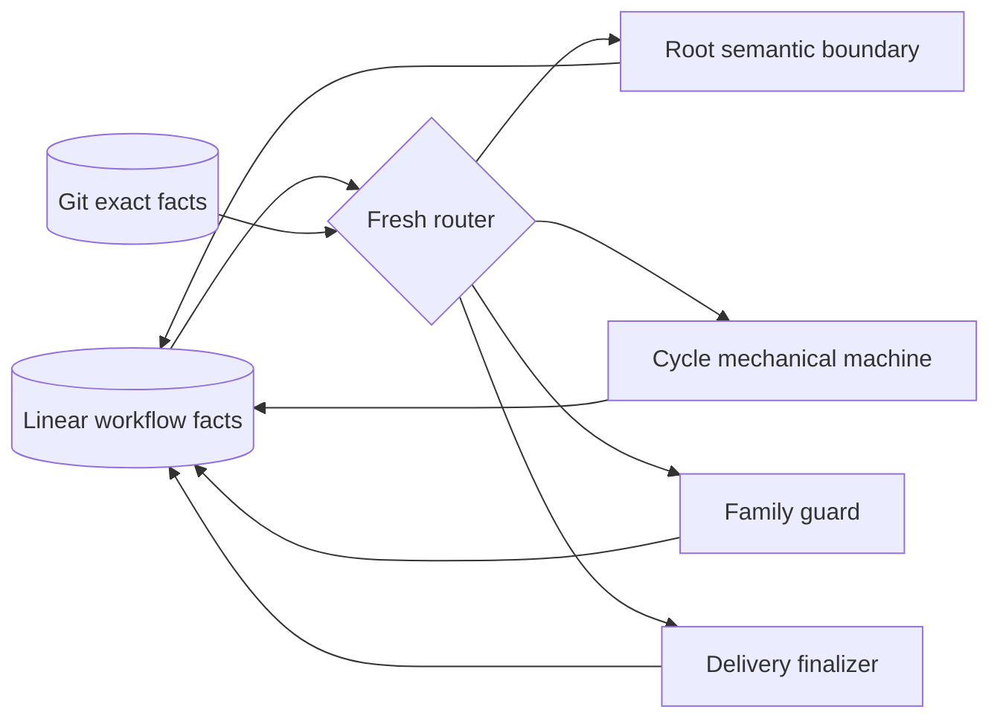
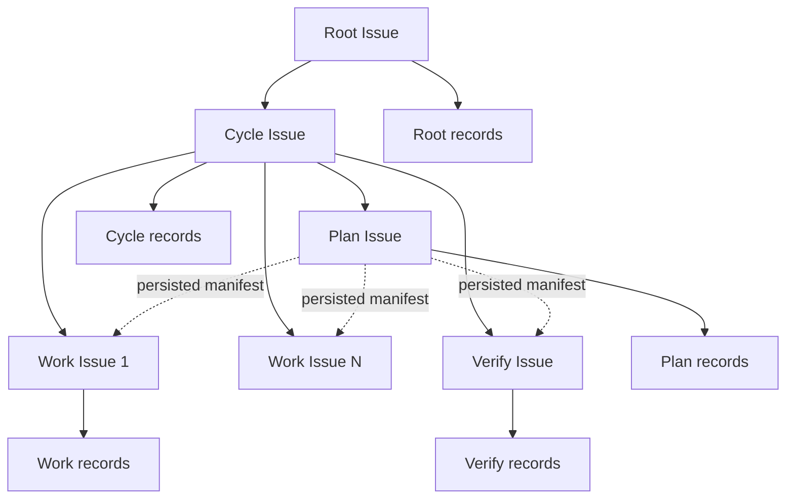
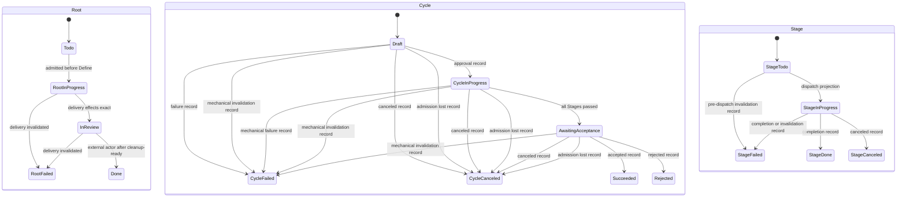
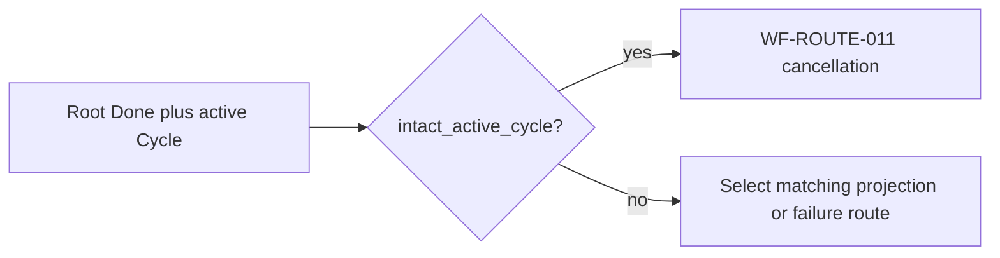
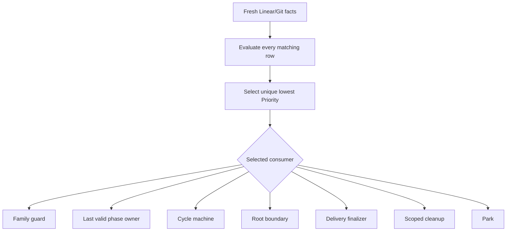
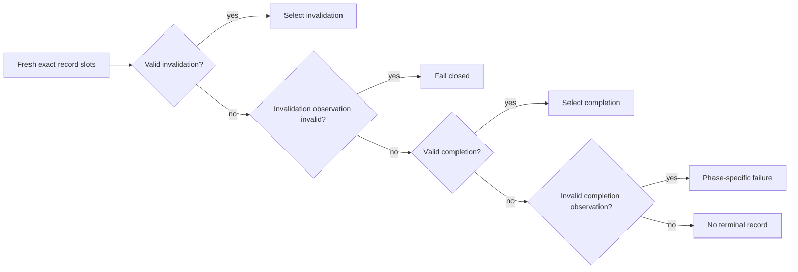

# Workflow Model

| Status | Owns | Other documents may own |
|---|---|---|
| Phase 1 target | topology、transition、routing、failure、restart、handoff persistence | boundary mechanics、types、provider rationale referenced by rule ID |

## 阅读规则

| Normative | Projection | Cross-document rule |
|---|---|---|
| Markdown tables with a `Rule` column | Mermaid with `source-rules` only | globally unique IDs; provider rationale remains in its owner |

## Authority table

| Rule | Authority | Required evidence | Forbidden substitute |
|---|---|---|---|
| `WF-AUTH-001` | `Linear`是唯一Task workflow authority | fresh current Issue/record/relation/provider evidence和完整grouped history | memory、Root Home、event、transcript、receipt |
| `WF-AUTH-002` | `Git`是code、diff和exact revision authority | fresh object/ref/worktree facts | Linear text中的commit claim、memory SHA |
| `WF-AUTH-003` | workflow action每次从fresh authority facts重算 | current action的fresh Linear/Git/provider reads | accepted in-memory baseline、cached next action |
| `WF-AUTH-004` | Linear write、poll observation和Root route eligibility相互独立 | routing table中的fresh fact classification | write callback直接启动Root |
| `WF-AUTH-005` | Root只做semantic boundary decision，Cycle只做mechanical transition | transition owner和routing consumer | Root干预sealed DAG、Cycle解释需求 |
| `WF-AUTH-006` | 一个Conductor进程生命周期绑定一个exact Root identity，cleanup后退出 | launch Root ID and one fenced runtime generation | second Root adoption、multi-Root orchestration、并发、公平调度 |
| `WF-AUTH-007` | exact terminal record set决定authoritative record，status是matching projection | both exact slots、basis and fresh read-back valid invalidation precedes completion | terminal status alone、history ordering、completion fallback after invalidation |
| `WF-AUTH-008` | router从全部matching routing rows中选择唯一最低numeric `Priority` | 同一scheduled tick的fresh Linear/Git facts和完整routing table | first-match order、changed-event order、memory cursor |

## Topology table

| Rule | Resource | Direct parent | Cardinality | Identity source | Creation gate |
|---|---|---|---|---|---|
| `WF-TOPO-001` | `Cycle` | `Root` | historical many, non-terminal at most one | deterministic Root/predecessor derivation | Root semantic boundary |
| `WF-TOPO-002` | `Plan` | `Cycle` | exactly one approved attempt | Cycle approval anchor | valid approval record and `In Progress` projection |
| `WF-TOPO-003` | `Work` | `Cycle` | exactly one per sealed `ApprovedWorkGroup` | persisted Plan manifest | Plan completion record read-back |
| `WF-TOPO-004` | `Verify` | `Cycle` | exactly one | persisted Plan manifest | Plan completion record read-back |
| `WF-TOPO-005` | dependency relation | manifest Stage endpoints | exact manifest set | persisted relation identity | Plan completion record read-back |
| `WF-TOPO-006` | approval/completion/invalidation record | corresponding Root/Cycle/Stage Issue | one exact slot per record kind | deterministic record derivation | owning transition |
| `WF-TOPO-007` | `PlanGraphManifest` | Plan completion record | exactly one immutable manifest | sealed groups plus preallocated identities | before Work/Verify/relation materialization |

## Transition table

| Rule | Machine | From | Event | Record owner | Projection owner | Required durable fact before projection | To | Direct Root wake |
|---|---|---|---|---|---|---|---|---|
| `WF-TR-001` | `Root` | `Todo` | `root_admitted` | `RootBoundary` | `RootBoundary` | fresh delegated `Todo` admission basis | `In Progress` | `no` |
| `WF-TR-002` | `Root` | `In Progress` | `delivery_effects_projectable` | `DeliveryFinalizer` | `DeliveryFinalizer` | accepted `CycleCompletionRecord` plus exact remote/PR effect read-back | `In Review` | `no` |
| `WF-TR-003` | `Root` | `In Progress,In Review` | `delivery_invalidated` | `DeliveryFinalizer` | `DeliveryFinalizer` | `DeliveryInvalidationRecord` read-back | `Failed` | `no` |
| `WF-TR-004` | `Root` | `In Review` | `external_done` | `ExternalActor` | `ExternalActor` | workflow already `cleanup_ready` | `Done` | `no` |
| `WF-TR-005` | `Cycle` | `Draft` | `approved` | `RootBoundary` | `CycleMachine` | `CycleApprovalRecord` read-back | `In Progress` | `no` |
| `WF-TR-006` | `Cycle` | `Draft` | `draft_failed_or_canceled` | `RootBoundary` | `CycleMachine` | phase-owned `CycleCompletionRecord` with `successor_policy: allowed` read-back | `Failed,Canceled` | `no` |
| `WF-TR-007` | `Cycle` | `In Progress` | `all_stages_passed` | `CycleMachine` | `CycleMachine` | every Stage terminal record read-back | `Awaiting Acceptance` | `no` |
| `WF-TR-008` | `Cycle` | `In Progress` | `mechanical_failed_or_canceled` | `CycleMachine` | `CycleMachine` | phase-owned `CycleCompletionRecord` with `successor_policy: allowed` read-back | `Failed,Canceled` | `no` |
| `WF-TR-009` | `Cycle` | `Awaiting Acceptance` | `accepted` | `RootBoundary` | `CycleMachine` | accepted `CycleCompletionRecord` with `not_applicable` policy `AcceptanceConvergenceProof` read-back | `Succeeded` | `no` |
| `WF-TR-010` | `Cycle` | `Awaiting Acceptance` | `rejected_or_canceled` | `RootBoundary` | `CycleMachine` | phase-owned `CycleCompletionRecord` with `successor_policy: allowed` read-back | `Rejected,Canceled` | `no` |
| `WF-TR-011` | `Stage` | `Todo` | `dispatch` | `CycleMachine` | `CycleMachine` | fresh status projection read-back | `In Progress` | `no` |
| `WF-TR-012` | `Stage` | `Todo,In Progress` | `projectable_invalidation` | `CycleMachine` | `CycleMachine` | source-matching `StageInvalidationRecord` read-back | `Failed` | `no` |
| `WF-TR-013` | `Stage` | `In Progress` | `role_completion_ready` | `CycleMachine` | `CycleMachine` | role-matching `StageCompletionRecord` read-back | `Done,Failed,Canceled` | `no` |
| `WF-TR-014` | `Cycle` | `Draft,In Progress,Awaiting Acceptance` | `mechanical_invalidation` | `CycleMachine` | `CycleMachine` | source-phase `CycleInvalidationRecord` with `terminal_status: Failed` read-back | `Failed` | `no` |
| `WF-TR-015` | `Cycle` | `Draft,In Progress,Awaiting Acceptance` | `admission_lost` | `CycleMachine` | `CycleMachine` | source-phase canceled `CycleCompletionRecord` read-back | `Canceled` | `no` |

## Routing table

| Rule | Priority | Fresh facts | Consumer | Allowed action | Root model turn |
|---|---|---|---|---|---|
| `WF-ROUTE-001` | `110` | `admitted_root_without_nonterminal_cycle` | `RootBoundary` | Define or deterministic Cycle Draft create/review | `yes` |
| `WF-ROUTE-002` | `100` | `editable_cycle_draft` | `RootBoundary` | review, approve, or Draft terminalization | `yes` |
| `WF-ROUTE-003` | `60` | `cycle_record_projection_pending` | `CycleMachine` | project the exact approval/completion/invalidation record target | `no` |
| `WF-ROUTE-004` | `80` | `cycle_in_progress_mechanical_actionable` | `CycleMachine` | one mechanical action external Stage terminal -> `WF-FAIL-004` lost Work thread -> `WF-FAIL-018` | `no` |
| `WF-ROUTE-005` | `130` | `cycle_in_progress_external_root_semantic_change` | `RootBoundary` | observe future requirement only; sealed DAG unchanged | `yes` |
| `WF-ROUTE-006` | `45` | `cycle_draft_or_in_progress_sealed_fact_violation` | `CycleMachine` | Stage-first invalidation if affected then apply `WF-TR-014` | `no` |
| `WF-ROUTE-007` | `90` | `cycle_awaiting_acceptance` | `RootBoundary` | accept, reject, or cancel | `yes` |
| `WF-ROUTE-008` | `120` | `admitted_cycle_terminal_successor_boundary` | `RootBoundary` | validate predecessor and optionally create deterministic successor | `yes` |
| `WF-ROUTE-009` | `10` | `multiple_nonterminal_cycles` | `FamilyGuard` | persist Root family invalidation | `no` |
| `WF-ROUTE-010` | `70` | `accepted_delivery_ready_or_gap` | `DeliveryFinalizer` | delivery convergence, completion, or invalidation | `no` |
| `WF-ROUTE-011` | `20` | `root_done_with_intact_active_cycle` | `CycleMachine` | Stage-first source-phase cancellation | `no` |
| `WF-ROUTE-012` | `30` | `root_done_with_delivery_gap` | `DeliveryFinalizer` | persist delivery invalidation | `no` |
| `WF-ROUTE-013` | `40` | `root_done_cleanup_ready` | `Cleanup` | delete only matching Root runtime/Home | `no` |
| `WF-ROUTE-014` | `140` | `no_actionable_fact` | `Park` | no effect | `no` |
| `WF-ROUTE-015` | `55` | `active_root_admission_lost_non_done_and_no_cycle_record_projection_pending` | `CycleMachine` | apply `WF-FAIL-016`, then `WF-TR-015` | `no` |
| `WF-ROUTE-016` | `1` | `router_owned_permanent_quarantine_fact` | `Park` | selected-invalidation conflict from `WF-FAIL-004/005/006` or surface `WF-FAIL-009/010/013/017` no effect | `no` |
| `WF-ROUTE-017` | `50` | `awaiting_acceptance_sealed_fact_violation` | `CycleMachine` | apply `WF-FAIL-015`, then `WF-TR-014` | `no` |
| `WF-ROUTE-018` | `15` | `external_cycle_terminal_without_matching_record` | `CycleMachine` | close dispatched Stages persist `invalid_terminal` preserve observed status | `no` |

### Routing predicates

| Predicate | Requires every clause | Excludes any unresolved fact |
|---|---|---|
| `intact_active_cycle` | one exact non-terminal Cycle no Cycle record projection gap | external terminal record/status mismatch sealed mutation lost context invalid record partial materialization other specific failure |

## Terminal record selection

| Completion slot | Invalidation slot | Selection |
|---|---|---|
| absent、valid or invalid | valid | invalidation; retain completion slot as superseded evidence |
| valid | absent | completion |
| invalid observation | absent | no selection; record kind and phase choose `WF-FAIL-008` or `WF-FAIL-015` |
| absent | absent | no terminal record |
| any | invalid observation | `WF-FAIL-009` or phase-specific quarantine; no fallback |

## Failure table

| Rule | Observed facts | Owner | Required write | Projection | Resolution |
|---|---|---|---|---|---|
| `WF-FAIL-001` | `record_slot_missing_not_required` | `CurrentPhaseOwner` | none | none | expected absence |
| `WF-FAIL-002` | `stage_in_progress_live_context_lost` | `CycleMachine` | original-slot failed Stage completion Plan/Verify reason_markdown: lost_execution_context | Stage `Failed` then Cycle `Failed` | typed phase/live-context facts route the failure; Markdown is durable explanation only |
| `WF-FAIL-003` | `lost_context_slot_unresolvable_after_exact_create_read` | `CycleMachine` | `unresolvable_record_slot` Stage invalidation, then `unresolvable_record_slot` Cycle invalidation | Stage `Failed` then Cycle `Failed` if each projection remains possible | permanent quarantine |
| `WF-FAIL-004` | `external_stage_terminal_without_record_for_observed_outcome` | `CycleMachine` | fresh validated basis -> free slot -> `invalid_terminal` Stage invalidation selected invalidation conflict -> no replacement | preserve external terminal fail Cycle where possible | selected invalidation conflict -> `WF-ROUTE-016` |
| `WF-FAIL-005` | `external_cycle_terminal_without_record_for_observed_outcome` | `CycleMachine` through `WF-ROUTE-018` | close dispatched Stage free slot -> `invalid_terminal` Cycle invalidation occupied selected invalidation -> no replacement | preserve external terminal | new intact record may allow successor selected invalidation conflict -> `WF-ROUTE-016` otherwise permanent quarantine |
| `WF-FAIL-006` | `selected_terminal_record_at_wrong_nonterminal_source` | `CycleMachine` | selected completion -> Stage-first `invalid_status_transition` invalidations selected invalidation -> never replace it | only exact source projects conflicting status is preserved | selected invalidation conflict -> `WF-ROUTE-016` |
| `WF-FAIL-007` | `partial_graph_materialization` | `CycleMachine` | `partial_graph_materialization` Cycle invalidation | Cycle `Failed` | permanent quarantine |
| `WF-FAIL-008` | `approval_or_manifest_original_body_lost` | `CurrentPhaseOwner` | `authoritative_record_lost` Cycle invalidation | phase-derived terminal if possible | permanent quarantine |
| `WF-FAIL-009` | `invalidation_slot_invalid` | `Router` | none; do not invent replacement | preserve current status | permanent quarantine from invalid observation |
| `WF-FAIL-010` | `multiple_nonterminal_cycles` | `FamilyGuard` | `RootFamilyInvalidationRecord` | none | permanent quarantine; no winner |
| `WF-FAIL-011` | `delivery_convergence_mismatch_or_slot_conflict` | `DeliveryFinalizer` | `DeliveryInvalidationRecord` | Root `Failed`, or preserve external `Done` | permanent delivery quarantine |
| `WF-FAIL-012` | `root_done_before_cycle_or_delivery_closure` | `CycleMachine` or `DeliveryFinalizer` | intact Cycle -> source-phase canceled completion specific invalid fact -> its matching failure record | preserve Root `Done` | close before cleanup |
| `WF-FAIL-013` | `provider_proves_known_issue_permanently_missing` | `Router` | `InvalidTaskSnapshot` observation | preserve current status | `unsupported_external_destruction` quarantine |
| `WF-FAIL-014` | `cycle_create_outcome_unknown` | `RootBoundary` | none before exact read | none | exact-read deterministic `cycle_issue_id`; never allocate another |
| `WF-FAIL-015` | `sealed_instruction_relation_or_record_mutated` | `CycleMachine` | nonterminal affected Stage gets `sealed_fact_mutated` Cycle always gets `sealed_fact_mutated` with offending-resource evidence | nonterminal affected Stage becomes `Failed` terminal Stage is preserved Cycle becomes `Failed` | never repair sealed facts |
| `WF-FAIL-016` | `active_root_admission_lost_non_done` | `CycleMachine` | close any dispatched Stage, then phase-owned canceled Cycle completion | Cycle `Canceled`; preserve Root current status | park until delegated; no unadmitted successor |
| `WF-FAIL-017` | `known_identity_or_creation_evidence_incomplete` | `Router` | sanitized `InvalidTaskSnapshot` observation | preserve current status | `incomplete_known_identity_evidence` permanent quarantine |
| `WF-FAIL-018` | `next_work_todo_after_completed_work_and_live_thread_lost` | `CycleMachine` | phase-owned failed Cycle completion `reason_code: lost_work_thread_context` | keep next Work `Todo` Cycle becomes `Failed` | `successor_policy: allowed` |

## Restart table

| Rule | Persisted facts | Live fact | Restart action | Forbidden recovery |
|---|---|---|---|---|
| `WF-RESTART-001` | approval record present, Cycle `Draft` | none required | projection-only `In Progress` | editable Draft review |
| `WF-RESTART-002` | selected terminal record present, non-terminal status | none required | exact source -> project target wrong source -> `WF-FAIL-006` selected invalidation conflict -> `WF-ROUTE-016` | rerun role、project over wrong source、prefer completion、replace invalidation |
| `WF-RESTART-003` | Stage `In Progress`, completion absent | live context lost | apply `WF-FAIL-002` Plan/Verify use Markdown-only `lost_execution_context` then `WF-FAIL-003` if needed | repeat dispatch |
| `WF-RESTART-004` | next Work `Todo`, prior Work complete | typed live Work-thread loss | apply `WF-FAIL-018`, then `WF-TR-008` | dispatch next Work reconstruct from any durable source |
| `WF-RESTART-005` | Plan manifest complete, graph absent | none required | materialize exact manifest identities | rerun Plan or derive new graph |
| `WF-RESTART-006` | Plan manifest complete, graph partial | none required | apply `WF-FAIL-007` | fill missing resources |
| `WF-RESTART-007` | all Work complete and exact commit proof matches | Verify `Todo` | dispatch fresh Verify once | change revision |
| `WF-RESTART-008` | Verify `In Progress`, completion absent | Verify context lost | apply `WF-FAIL-002` with Markdown-only `lost_execution_context` reason | repeat Verify |
| `WF-RESTART-009` | valid delivery completion | none required | park delivered Root | infer from memory receipt |
| `WF-RESTART-010` | accepted Cycle, Root `In Progress`, delivery terminal record absent | none required | delivery finalizer resolves exact effects and applies `WF-TR-002` or `WF-FAIL-011` | blind or unconditional redelivery |
| `WF-RESTART-011` | Root `Done` with `intact_active_cycle` or delivery gap | none required | apply `WF-ROUTE-011` or `WF-ROUTE-012` | cleanup before `WF-RESTART-002` generic closure masking a specific failure fact |
| `WF-RESTART-012` | Symphony-projected Root `In Progress`, Root definition absent | none required | rerun Define from fresh Root/code facts | infer Requirement/ADR from memory |
| `WF-RESTART-013` | Root `In Review`, delivery completion/invalidation absent | none required | convergence/read-back-only delivery finalizer | repeat push or PR create |
| `WF-RESTART-014` | valid delivery invalidation, Root `In Progress` or `In Review` | none required | projection-only Root `Failed`; preserve external `Done` | retry delivery or start Root model turn |

## Persistence table

| Rule | Stage or boundary | Linear attachment | Required content | Explicitly excluded |
|---|---|---|---|---|
| `WF-PERSIST-001` | Cycle approval | Cycle Issue | seal, predecessor basis, Plan/record anchors, base revision | transcript, next action |
| `WF-PERSIST-002` | Plan completion | Plan Issue | normalized outcome/instruction basis completed: non-empty Work order、unique Verify、manifest/seal/traceability failed/canceled: reason only | local keys、new design、failure manifest |
| `WF-PERSIST-003` | Work completion | corresponding Work Issue | normalized result/handoff, checks, workspace parent/diff | raw final assistant output, ephemeral continuation |
| `WF-PERSIST-004` | Verify completion | Verify Issue | conclusion, checks, evidence, exact revision | Work/Plan context, code mutation |
| `WF-PERSIST-005` | Cycle terminal | Cycle Issue | phase-owned result/handoff or invalidation | status-only terminal |
| `WF-PERSIST-006` | delivery terminal | Root Issue | convergence completion or invalidation | single read receipt, claimed atomic snapshot |
| `WF-PERSIST-007` | Work continuation | nowhere durable | only same live Work thread prior assistant turn | Linear, Git, logs, audit storage |
