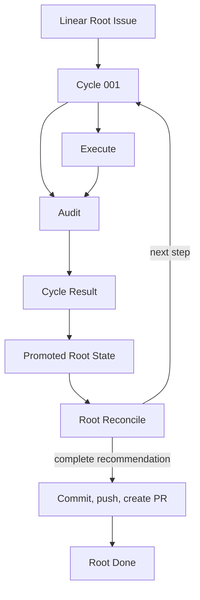

# Workflow Model

| Status | Owns | Does not own |
|---|---|---|
| target proposal | cross-role topology, lifecycle, outcomes, routing, input commit, and terminal PR publication | provider mechanics or prompt wording |

This file is the workflow authority. Named-concern documents may explain a row
but must not define another transition for the same fact.

## Authorities

| Rule | Fact | Authority | Consequence |
|---|---|---|---|
| `WF-AUTH-001` | original long-term requirement | Linear Root title and description | Linear mode rejects simultaneous `--task` |
| `WF-AUTH-002` | new user input | new user-authored Root comments | pending input for a later Reconcile only |
| `WF-AUTH-003` | trusted task state | Succeeded Cycles with an `accepted` Audit verdict | only source of trusted Root State progress |
| `WF-AUTH-004` | active small-step contract | frozen Cycle description and local `CycleSpec` | Execute and Audit scope |
| `WF-AUTH-005` | implementation state | current Root workspace | Execute effects, Audit evidence, and final PR content |
| `WF-AUTH-006` | human-readable workflow view | Linear statuses, child Issues, and Root Harness comment | sole operator view; no Dashboard projection |
| `WF-AUTH-007` | next step | one fresh Root Reconcile session | create one Cycle, recommend completion, or request human input |
| `WF-AUTH-008` | terminal PR success | one created pull request URL | only fact that allows Root `Done` |
| `WF-AUTH-009` | real-state verification | fresh Audit against the Root workspace | Reconcile never substitutes workspace inspection or Executor claims |

Execute model output is neither parsed nor projected. The Execute Issue records
only mechanical process facts; the fresh Audit is the sole semantic authority
over the real workspace. A Cycle Result is a mechanical summary projection of
the Audit verdict, not a second judgment. Root Reconcile reads the promoted Root
State, never the Cycle or its descendants. A Reconcile completion decision is a
recommendation, not Root completion; the final Inbox check and PR function must
succeed first.

## Topology

| Rule | Resource | Parent | Cardinality | Owner |
|---|---|---|---|---|
| `WF-TOPO-001` | Cycle | Root | historical many; nonterminal at most one | Root Reconciler |
| `WF-TOPO-002` | Execute | Cycle | exactly one | Cycle Runner |
| `WF-TOPO-003` | Audit | Cycle | exactly one | Cycle Runner |
| `WF-TOPO-004` | Execute Process Result comment | Execute | exactly one terminal process-fact record | Cycle Runner |
| `WF-TOPO-005` | Audit Report comment | Audit | exactly one terminal report | Cycle Runner |
| `WF-TOPO-006` | Cycle Result comment | Cycle | exactly one | Cycle Runner |
| `WF-TOPO-007` | Harness status comment | Root | exactly one mutable projection | Root View |

Cycle, Execute, and Audit are created before execution. Execute must terminate
before Audit starts. Audit runs even when Execute failed. All Cycles share the
one caller-supplied Root workspace bound at process startup.

## Lifecycle

| Rule | Resource | From | Condition | To | Required effect |
|---|---|---|---|---|---|
| `WF-TR-001` | Root workspace | supplied | first Root startup validates workspace and run directory | ready | bind both paths to Root State; later starts require exact matches |
| `WF-TR-002` | Root | `Todo` | workspace is ready | `In Progress` | initialize Root Harness status comment |
| `WF-TR-003` | Cycle family | absent | Reconcile selects a step | Cycle active; roles waiting | create frozen Cycle, Execute, and Audit Issues |
| `WF-TR-004` | Execute | waiting | Cycle starts | active | start one fresh workspace-write session |
| `WF-TR-005` | Execute | active | process returns or errors | terminal | append bounded process facts before status transition |
| `WF-TR-006` | Audit | waiting | Execute is terminal | active | start one distinct fresh read-only session |
| `WF-TR-007` | Audit | active | process returns or errors | terminal | append Audit Report or process-error result |
| `WF-TR-008` | Cycle | active | result table resolves | terminal | append precise Cycle Result before status transition |
| `WF-TR-009` | prior unfinished descendants | nonterminal | process starts | canceled | mechanically cancel all before fresh Reconcile |
| `WF-TR-010` | Root | `In Progress` | Reconcile recommends completion | `In Progress` | perform final Inbox check; do not mark Done yet |
| `WF-TR-011` | PR function | absent | final Inbox is empty and workspace has changes | running | record phase `publishing`, then commit, push, and create one PR in order |
| `WF-TR-012` | Root | `In Progress` | PR URL is recorded in Root State | `Done` | stop successfully and retain local evidence |
| `WF-TR-013` | Root | `Done` | later launch or poll | `Done` | no mutation; exit successfully |

Terminal Issues are never reopened or rewritten.
Remediation is always a new Cycle. Linear workflow status shows progress; result
comments carry `Succeeded`, `Rejected`, or `Failed` semantics.

## Cycle result

Audit exposes one closed verdict rather than independent status, integrity, and
process axes. `violation` and `process_error` are terminal failures. Execute
exit facts never decide semantic success or failure: even after a timeout,
nonzero exit, or start failure, Audit inspects the retained workspace and its
verdict alone determines the Cycle result.

| Rule | Audit | Cycle result |
|---|---|---|
| `WF-RESULT-001` | `accepted` | `Succeeded` |
| `WF-RESULT-002` | `incomplete` | `Rejected` |
| `WF-RESULT-003` | `blocked` | `Failed` |
| `WF-RESULT-004` | `violation` | `Failed` |
| `WF-RESULT-005` | `process_error` | `Failed` |

Only `WF-RESULT-001` updates trusted Root State fields. The typed Audit verdict
governs promotion. The Cycle Result repeats only the mapped result, Audit
reference, and bounded reason so operators can read the Cycle without traversing
its descendants; it never copies Audit evidence or creates another authority.

## Serial routing

Rows are evaluated in order and exactly one action runs at a time.

| Rule | Current fact | Action |
|---|---|---|
| `WF-ROUTE-001` | Root is `Done` | no-op and exit |
| `WF-ROUTE-002` | Execute waiting | run Execute |
| `WF-ROUTE-003` | Execute terminal and Audit waiting | run fresh Audit |
| `WF-ROUTE-004` | Audit terminal and Cycle lacks result | close Cycle from result table |
| `WF-ROUTE-005` | Cycle terminal | mechanically update Root State and Root view, then Reconcile |
| `WF-ROUTE-006` | no Cycle and no completion recommendation | Reconcile |
| `WF-ROUTE-007` | completion recommendation and new Root input exists | discard completion recommendation and Reconcile again |
| `WF-ROUTE-008` | completion recommendation, empty Inbox, no active Cycle | run terminal PR function |
| `WF-ROUTE-009` | active Cycle and new Root comments arrive | show pending; do not change the active Cycle |
| `WF-ROUTE-010` | no actionable fact or human input required | record the reason and exit |

## Failure policy

| Rule | Observation | Required behavior | Forbidden behavior |
|---|---|---|---|
| `WF-FAIL-001` | Execute process fails or exits unexpectedly | append process facts and still dispatch Audit | parse Execute prose, skip Audit, or infer semantic failure |
| `WF-FAIL-002` | Audit is incomplete or blocked | persist findings and apply the result table | let Execute self-report override Audit |
| `WF-FAIL-003` | Auditor process errors | persist bounded error and fail Cycle | infer a clean result or mutate workspace |
| `WF-FAIL-004` | Linear action fails | expose error and stop | use another task mode, guess state, or duplicate resources |
| `WF-FAIL-005` | supplied workspace or run directory is invalid | start no Agent | allocate, replace, clean, or silently adopt another path |
| `WF-FAIL-006` | commit, push, or PR creation fails | leave Root open, expose failed step, retain workspace and evidence | retry automatically, roll back, repair, or mark Root Done |
| `WF-FAIL-007` | workspace has no PR change | enter `NeedsHuman` and leave Root open | create an empty commit or claim success |
| `WF-FAIL-008` | unfinished descendants at startup | cancel all, warn of possible unaudited workspace changes, then Reconcile | resume, audit, parse, or synthesize their results |
| `WF-FAIL-009` | maximum Cycle count reached | stop with Root open and reason visible | create another Cycle or deliver |
| `WF-FAIL-010` | saved workspace or run directory is missing, invalid, or mismatched | set Root State `NeedsHuman` and stop | create a replacement path or infer files from child Issues |
| `WF-FAIL-011` | startup sees phase `publishing` without a PR URL | set `NeedsHuman` and stop before cancellation or Reconcile | retry publication, inspect provider state, or adopt a branch/PR |

The only automatic repair loop is domain-level: Audit exposes real workspace
findings and the next Reconcile may create a repair Cycle. Infrastructure and
PR failures do not enter a recovery state machine.

## Root comment transaction

| Rule | Step | Durable meaning |
|---|---|---|
| `WF-INBOX-001` | fetch comments newer than startup cursor | add eligible user comments to pending input |
| `WF-INBOX-002` | Reconcile receives all comments after cursor | place every ID in candidate `CycleSpec`, or return `NeedsHuman`; never partially consume |
| `WF-INBOX-003` | create Cycle, Execute, Audit and record their provider IDs locally | establish complete frozen family |
| `WF-INBOX-004` | persist created `CycleSpec` with `consumed_comment_ids` | mark exactly those IDs consumed for this run |
| `WF-INBOX-005` | Reconcile recommends completion | fetch once more before PR publication; any new input returns to Reconcile |

If family creation or local recording fails before `WF-INBOX-004`, comments
remain pending and no Agent starts from the partial family.
When an active Cycle exists and new Root comments arrive, do not dispatch them into the Cycle.

## Persistence planes

| Rule | Location | Content | Excluded |
|---|---|---|---|
| `WF-PERSIST-001` | Linear Root description | original task | generated design or Harness state |
| `WF-PERSIST-002` | Linear Root State comment | minimal checkpoint fields defined in `RootState` | raw trajectories, revisions, or process handles |
| `WF-PERSIST-003` | Linear Root user comments | new input after saved cursor | descendant instructions or active-Cycle mutation |
| `WF-PERSIST-004` | Linear Cycle description | frozen objective, acceptance, boundaries, and consumed comment references | later input, executor selection, or mutable progress |
| `WF-PERSIST-005` | Linear result comments | Execute process facts, Audit report, and mechanical Cycle summary | Execute model output, full prompts, tool streams, or raw trajectories |
| `WF-PERSIST-006` | supplied external run directory | Cycle records, provider IDs, bounded parse inputs, Audit material, and PR command log | required trajectories, credentials, or Root-commit files |

Linear is the human-readable control plane; the supplied run directory is the
minimal transaction and evidence plane. Complete Agent trajectories are not a
required product artifact; an adapter may capture them only as optional local
diagnostics outside public contracts. The design has no task revision, seal, content digest, Git hash
authority, equality proof, mutation history, delivery record, or recovery
database. Git necessarily creates an internal commit object for the PR, but its
hash is neither captured in a public contract nor used for workflow decisions.
